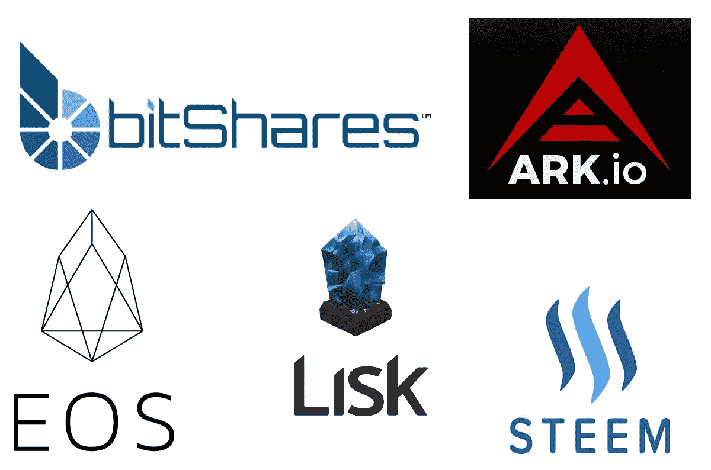

# 什么是授权的利害关系证明？

> 原文：<https://medium.com/hackernoon/what-is-delegated-proof-of-stake-897a2f0558f9>

公共区块链经常面临可伸缩性问题。为了解决这些问题，一些区块链(如 Lisk、EOS、Steem、BitShares 和 Ark)已经采用了委托利益证明(DPoS)共识机制。dpo 寻求加快交易和区块创建，同时不损害区块链核心的分散激励结构。

在传统的[赌注共识机制](https://hackernoon.com/what-is-proof-of-stake-8e0433018256)中，用户可以将他们的硬币投入赌注，从而获得验证交易、伪造区块和获得相关奖励的权利。DPoS 是利益相关者共识证明的变体，旨在更有效地达成共识。

**投票**

在 DPoS 系统中，用户“投票”选择“见证人”(他们信任的验证交易的其他用户)，顶级见证人(收集了最多投票)获得验证交易的权利。用户甚至可以将他们的投票权委托给其他用户，他们相信这些用户可以代表他们为证人投票。

选票根据每个选民的股份大小进行权衡。用户不需要很大的赌注就可以进入最高级别的证人。相反，来自具有较大利害关系的用户的投票可以导致具有相对较小利害关系的用户被提升到证人的顶层。

**目击者**

顶层证人的人数被限制在某一数目。这些见证人负责验证交易和创建区块，并作为回报获得相关费用。

虽然顶层中的见证可以阻止特定的事务被包括在即将到来的块中，但是它们不能改变任何事务的细节。因此，他们相当于工作证明系统中的矿工。

投票是一个连续的过程，顶层中的每个见证人总是有被获得更多选票并因此被认为更可信的用户替换的风险。随着区块链的成长，成为或保持顶级见证人的竞争越来越激烈。用户还可以投票罢免失去信任的顶级证人。

对于顶级证人来说，收入和名誉损失的威胁是反对恶意行为的主要动机。

**代表**

DPoS 系统中的用户也为一组“代表”(负责维护网络的受信任方)投票。代表监督整个区块链协议的治理和性能，但在交易验证和块生产中不发挥作用。

例如，代表可以提议更改块的大小，或者验证块的见证人应获得的报酬。一旦代表们提出这样的改变，区块链的用户就投票决定是否采纳。

Blockchain projects currently using Delegated Proof of Stake.

**DPoS 系统的优势:**

它们比传统的工作证明和利益证明系统要快得多。

他们的激励和结构增强了区块链的安全性和完整性，每个用户都有诚实履行其职责的激励。

成为用户、见证人或代表不需要专门的设备。一台普通电脑就够了。

与耗电量大的工作证明哈希算法相比，它们更节能。

**总结**

DPoS 是共识机制发展的下一步。它建立在原始的利益一致机制的基础上，大大提高了速度和可扩展性。

—

[沙安雷](http://www.shaanray.com/)

请关注 [Lansaar Research](https://medium.com/lansaar) 关于媒体的报道，了解最新的新兴技术和新的商业模式。