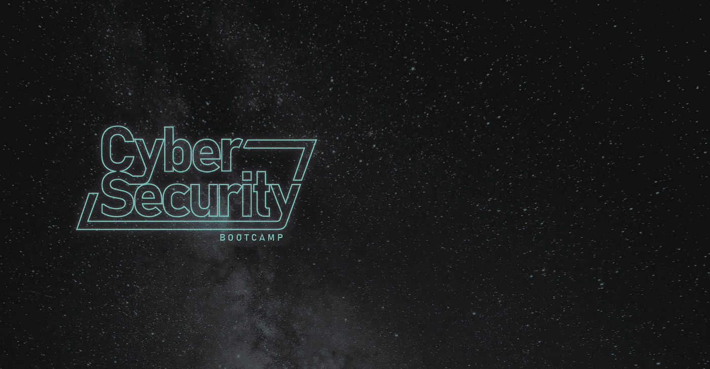

# 我们的网络安全训练营有什么不同？

> 原文：<https://medium.com/hackernoon/what-is-different-about-our-cyber-security-bootcamp-9bd861804a08>

## 了解为什么 Coder Academy 的新网络安全课程脱颖而出，为您的新职业做好准备

任何阅读新闻的人都会意识到网络空间是 21 世纪的新战场。网络攻击越来越多地出现在全球各地的头条新闻中，从影响选举到工业破坏，恶意黑客串通一气。

[信息系统审计与控制协会(ISACA)](https://www.isaca.org/pages/default.aspx) 称，到 2019 年，全球将出现 200 万人的网络人才短缺，据估计，网络安全事故每年可能会给澳大利亚造成高达 290 亿美元的损失。来自[埃森哲](https://www.accenture.com/au-en/security-index)的分析显示，与 2017 年相比，2018 年发生了两倍多的严重私人黑客攻击企图。

炮灰在这种类型的战斗中是不够的。为了抵御日益复杂的网络攻击，你需要具备道德、智力、沟通技能和专业、实用训练的“士兵”。教育系统抓住了对更多人才的需求，大学和 TAFE 一直在努力提供一系列新的培训选择。虽然这些课程都是获得网络安全技能的宝贵途径，但重要的是要货比三家，了解这些课程之间的差异。

**了解更多:**[https://coderacademy . edu . au/coding-courses/cyber-security-course](https://coderacademy.edu.au/coding-courses/cyber-security-course)

我们在 [Coder Academy](https://medium.com/u/2f5a8250e367?source=post_page-----9bd861804a08--------------------------------) 于 11 月向市场推出的是一个完全独特的训练营式课程。我们课程的不同之处在于:

1.  这是澳大利亚唯一一个广泛的、面对面的网络安全训练营，重点是渗透测试
2.  该课程将在 7 个月内每周 5 天，每天下午 1 点至晚上 8 点面对面授课
3.  本课程将以敏捷、动手、以行业为中心的方式进行
4.  该课程将由行业专家和教育专家共同讲授
5.  软件开发的嵌入式文凭将为您提供在复杂环境中工作所需的实践技能，这既需要网络安全方面的卓越技术，也需要对 Python、Javascript 和 c 语言编码的实际掌握。
6.  课程材料来自前以色列国防部队成员，他们擅长提升没有网络安全经验的人的技能
7.  该课程将包括数百小时的虚拟机实践培训
8.  项目结束时，可选择进行为期 4 周的无薪行业实习
9.  对编码和安全的关注为那些在网络市场起步的人提供了一个不可思议的基础。这是一套需求量很大的技能，也是任何想彻底了解网络安全的人的最佳基础
10.  该课程将包括获得定期行业导师。
11.  该课程最多有 25 名学生和 3 名培训师参加。这提供了一个令人难以置信的支持环境，这是大讲堂和远程讲师的对立面。

本课程的先决条件包括至少完成 12 年的课程，再加上 IT 方面的证书 IV 或 3 年的行业经验。准备好保护您在网络安全领域的未来了吗？**了解更多:**[https://coderacademy . edu . au/coding-courses/cyber-security-course](https://coderacademy.edu.au/coding-courses/cyber-security-course)

**今天就申请保护你的位置**:[https://coderacademy . edu . au/coding-courses/cyber-security-course/Apply](https://coderacademy.edu.au/coding-courses/cyber-security-course/apply)

编码器学院总经理莎莉·布朗纳