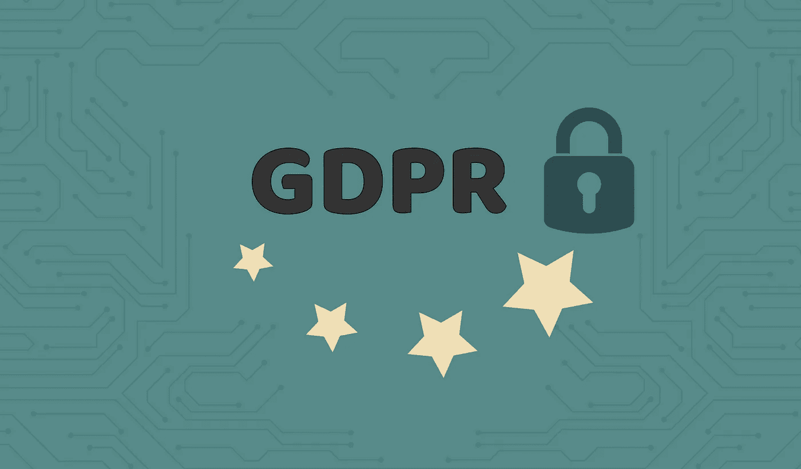
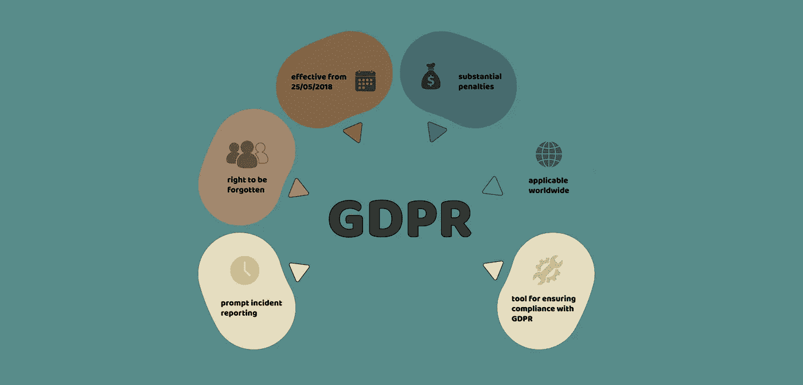
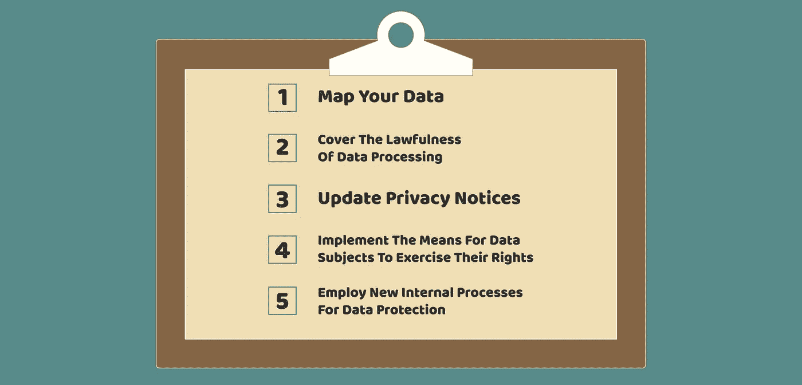

# 什么是 GDPR，它将如何影响业务？企业主必备知识

> 原文：<https://medium.com/hackernoon/what-is-gdpr-and-how-will-it-affect-business-must-know-for-business-owners-b6415c766ec5>

5 月 25 日，随着 GDPR 法规的生效，我们所知的互联网将会终结。这四封信在欧洲企业中引起了轩然大波，超过 25%的美国公司正计划退出欧盟市场。那么什么是 GDPR，它将如何影响你的业务？为了回答这些问题和许多其他问题，我们准备了一份简短的 GDPR 指南，解释每个网络开发公司和企业主需要了解的新规定。

# 什么是 GDPR？

[通用数据保护条例](https://gdpr-info.eu/)或简称 GDPR 于 2016 年 4 月 27 日由欧洲理事会和欧洲议会通过。当局为企业提供了两年的准备期。这是自 1998 年以来欧洲数据保护法最重大的变化。

GDPR 的目标不是惩罚企业，而是保护个人的个人信息并扩大他们的权利。新法规旨在统一欧洲国家的数据保护法，并为国家数据保护机构和监管机构创建一个单一的参考点。面对最近全球各地备受瞩目的数据泄露事件，各国政府只会让数据保护法变得更加严厉。为了继续经营，欧洲公司应该在零点之前确保遵守 GDPR 协议。

# 你的企业应该屈从于不可避免的 GDPR 要求吗？

无论你的企业是在欧盟还是迎合其公民，你都需要实施变革。如果您符合以下条件，您应该遵守 GDPR 要求:

*   想提高你的客户留存率，增加收益；
*   计划将你在美国的公司扩展到大洋彼岸；
*   希望为全球市场创建自己的应用程序；
*   还没有既定的业务，但打算建立一个创业公司；
*   是一个[应用开发者](https://freshcodeit.com/services)为你的客户开发移动应用、网站等；
*   使用定向广告、社交媒体和其他在线营销工具来吸引新客户。

# 欧盟 GDPR 给你的企业带来了什么变化？

鉴于 1998 年的数据保护法规现在已经过时，企业必须满足许多要求。以下是最重要的变化列表:

*   现在，个人数据的定义更加宽泛，除了姓名、联系人、财务和医疗信息，还包括 IP 地址。
*   用户同意变得更加棘手。你的企业应该有合法的理由来获取和存储个人数据。对于您计划的每个数据处理移动，您还应该获得单独的权限。
*   数据主体的权利变得更加广泛。确保擦除用户数据或根据请求将其转移到其他服务的功能。用户也可以要求更正和详细说明他们的信息是如何被使用的。
*   数据处理文档是必要的。您的公司需要详细记录获得用户同意的时间、措辞、安全程序以及所有处理活动的报告。
*   数据泄露必须在 72 小时内报告。您将需要监控数据安全，并向国家数据保护监管机构或用户传达即使是轻微的违规行为。

# 你能冒险忽略 GDPR 吗？

新的要求似乎需要做很多工作，尽管有两年的准备期，但很少有公司实施了这些变化。你应该抓紧时间，争取及时满足 GDPR 要求，还是会有一个宽限期？你应该，因为不会有。你不想面对新的严厉的罚款。根据 GDPR 的说法，公司将不得不支付 1000 万至 2000 万欧元，或其全球年营业额的 2%至 4%，以较高者为准。如果公司未能解决国家数据保护监管机构的谴责或命令，将不得不支付罚款。

用户还可以对不遵守 GDPR 法规的公司提起诉讼，并要求对错误获取或处理他们的数据进行赔偿。除了支付赔偿金后的金钱损失外，公司还可能因声誉受损而遭受巨大的商业损失。对未能遵守新要求的企业的潜在不利影响可能与破产一样严重。

# 如何确保您的企业符合 GDPR 标准？

乍一看，GDPR 的要求似乎不可能在生效前的几周内得到满足。但是如果你仔细观察，你会注意到，你的公司应该采取五个关键步骤来满足大多数与 GDPR 相关的需求:

## 映射您的数据

解决任何问题的第一步是承认你有问题。因此，通过检查您存储的所有用户数据来开始您的数据处理更改。在你公司的文件系统中创建一个 GDPR 文件夹，记录你存储的所有类别的数据。绘制您获取信息的位置、存储时间、处理方式以及共享者的地图。您创建的地图应该能让您清楚地了解进出您系统的数据流，以及您需要解决的关键点，以使您的公司符合新的欧盟法规。

## 涵盖数据处理的合法性

在您处理用户的个人数据之前，您需要确保您拥有这样做的合法权利。如果你将数据处理外包给第三方，你的合同应该包括 GDPR 合规条款。否则，你将需要寻找新的合作伙伴。在以下情况下，您的数据处理是合法的:

1.  您有处理用户数据的合法权益，并且他们合理地期望您处理这些数据。企业的合法利益不能凌驾于个人利益之上，对隐私的影响应该最小。
2.  数据处理包含在合同安排中，比如使用 cookies 来跟踪添加到购物车中的商品。
3.  您已经获得用户对数据存储和处理的同意。不要假设用户同意。它应该永远是一个选择加入的选项，而不是选择退出。用简单的语言解释这些信息将如何使用，并在 5 月 25 日之前获得同意，以确保您的数据处理在 GDPR 生效之前受到其管辖。

## 更新隐私声明

您需要查看所有内部和外部隐私声明，并根据新的欧盟法规进行更新。您的通知应包括这些问题的答案:

*   需要收集哪些数据？
*   会如何处理？
*   每个处理行为的法律依据是什么？
*   数据将存储多长时间？
*   用户如何行使权利？

## 实施数据主体行使其权利的手段

我们已经讨论了后 GDPR 时代的用户权利，你的公司应该准备好功能和模板以备不时之需。为用户请求设计模板，以查看和更正他们的数据。使用[网络开发服务](https://freshcodeit.com/services)添加数据擦除和同意撤销功能。任命一名数据保护官，负责在 30 天内管理对用户查询的及时回复。

## 采用新的内部流程进行数据保护

给人一种 GDPR 服从的印象是不够的；个人数据保护应该成为贵公司日常工作的一部分。为此，您需要更新数据安全性并实施违规通知协议。所有员工都应接受数据保护培训，以防止意外泄露。

# 后 GDPR 时代，在线营销将如何运作？

每当您在营销中使用个人数据时，请注意数据控制者和数据处理者的不同职责。作为数据控制者，您将对数据的收集、存储和使用负责。如果你使用谷歌 AdSense 或脸书工具，它们将作为数据处理器，代表你处理个人数据。大多数脸书的商业服务都是 GDPR 投诉的，尽管有时你要负责维护欧盟法规。例如，如果您上传自定义受众数据文件，您必须通知用户他们的数据正在被处理并得到他们的同意。

如果你使用 Google AdSense 来赚钱，你需要让访问者同意观看个性化广告，这是不太可能的。据传 AdSense 还将添加非定制广告作为站长使用的功能。然而，这可能会大大降低广告的效率。因此，浏览量和点击量的价格也可能下降。

# 用户会操纵商家吗？

一些企业主对 GDPR 持谨慎态度，因为数据主体对数据处理公司拥有很大权力。用户可能会抓住机会，通过限制使用他们的个人数据来操纵企业主。有些人甚至会把他们的数据卖给出价最高的人，就像公司付钱购买通过不正当渠道获得的电子邮件和电话簿一样。

一方面，公司可能会为高质量的数据付费，这些数据将带来可观的投资回报。另一方面，企业有权拒绝试图出售个人数据的客户。大多数用户是否会知道他们在后 GDPR 时代的全部权利还有待观察。

GDPR 不是为了让企业主的生活变得艰难而设计的；该法规希望他们在收集、处理和共享数据时将用户利益放在首位。你的隐私和数据处理政策应该是透明的，在使用个人数据赚取更多的钱之前，你应该获得同意。否则，你将面临诉讼和巨额罚款的风险。尽管如此，GDPR 不会毁掉在线营销。相反，它将增加用户的信心，确保他们的忠诚度，并确保您的企业拥有高质量的客户数据。如果你不能在内部实施必要的改变，就寻求专业的软件开发服务，这将使你的在线业务立即符合 GDPR 标准..

# GDPR 会影响离岸软件开发外包吗？

在 [FreshCode](https://freshcodeit.com/) 时，我们 100%了解 GDPR 的最新要求，并根据新法规为客户建造项目。在与我们公司打交道时，不要担心会与国家数据保护监管机构发生冲突，无论您的公司是总部位于 EU-还是仅面向欧洲客户。我们的开发人员和项目经理将尽最大努力，尽可能不引人注目地将符合 GDPR 标准的功能集成到您的产品中。我们还可以回答您关于 GDPR 的任何问题，并就更新您的产品直到其符合新法规的最佳行动方案提出建议。

GDPR 不是为了让企业主的生活变得艰难而设计的；该法规希望他们在收集、处理和共享数据时将用户利益放在首位。你的隐私和数据处理政策应该是透明的，在使用个人数据赚取更多的钱之前，你应该获得同意。否则，你将面临诉讼和巨额罚款的风险。尽管如此，GDPR 不会毁掉在线营销。相反，它将增加用户的信心，确保他们的忠诚度，并确保您的企业拥有高质量的客户数据。如果你不能在内部实施必要的改变，就寻求专业的软件开发服务，这将使你的在线业务立即符合 GDPR 标准。

如果你有兴趣了解更多关于如何为你的新创公司选择定制软件开发公司，或者管理项目的最佳方式，你会喜欢上 [FreshCode 博客](https://freshcodeit.com/blog)。订阅我们的时事通讯，了解最新的 IT 趋势。

你喜欢这篇文章吗？请为我们鼓掌！在媒体上与其他人分享文章。

请随时联系我们的[*fresh code . website*](https://freshcodeit.com/)

原文 [*此处*](https://freshcodeit.com/freshcode-post/what-is-gdpr-and-how-will-it-affect-business-must-know-for-business-owners)