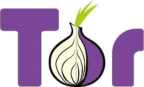
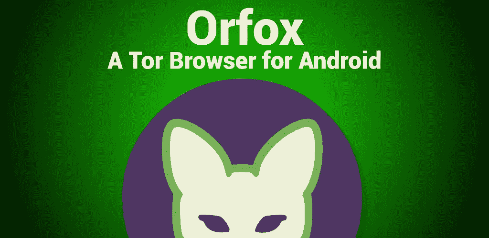
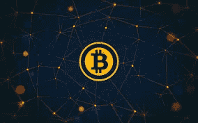

# 政府从你那里偷了什么？

> 原文：<https://medium.com/hackernoon/what-is-government-stealing-from-you-a772b8c7df0b>

# “匿名只是一种认知。不是某人拥有它，而是占有它”

如果你被敌人完全了解或者在战斗中赤身裸体，你可能连一点机会都没有。如果你把关于你自己的每一条信息都给了敌人，那么他们就有能力相应地思考，甚至在我们攻击他们之前，用更聪明的行动来反击我们的每一步行动。想一想？

> 顺便说一下，我是 **CodesMyth** 的**馆长**，这是一个为**简化代码和打破神话的在线平台。**

但是上面的事情暗示了什么意义呢？

# 我们的匿名到底怎么了？

现在，我们可能知道也可能不知道，但来自世界各地的顶级政府机构正在通过记录我们的通话位置、跟踪我们的移动 GPS、脸书的推特更新、在线支付日志、闭路电视、自动取款机和其他监控摄像头对我们进行全天候的监视。其实，*你的一举一动都在被这些躲在政府面具后面的专业人士用某种* ***严肃的深度学习算法*** 记录和分析。跟踪我们的一些政府机构有中央情报局、国家安全局、五角大楼等等。他们的动机是什么？

> NSA —国家安全局| CIA —中央情报局
> 
> 深度学习算法-使用算法训练的机器，使用过去的数据检测模式。
> 
> 匿名—隐私或安全文档

# 他们为什么这么做？

他们认为，通过记录全球所有人的活动，他们有可能通过分析恐怖分子的行为和过去来区分他们和普通人。他们相信他们可以通过预测他们未来的行动来阻止这些袭击，从而试图挽救数百万人的生命。但是，躲在这个目的后面，他们不能为侵犯每个人的隐私找借口，这本身就是一个非常大的罪行。

# 有人在乎匿名吗？

是的，你可能不认识他们。见鬼，你们有些人可能没听说过。其中最受欢迎的人是曾经为美国国家安全局**工作的**告密者爱德华·斯诺登**。他无法为自己辩解他为政府所做的是正确的。所以，他决定揭露一些足以证明美国政府在监视我们的文件。**他的机密文件可以在深度网**上查到。由于这种行为，他不得不飞往俄罗斯，与妻子一起度过目前的日子。我们可能不知道他们，但大量的告密者正试图匿名，这样我们就可以保持我们的隐私完好无损。**

# 我这辈子没做过任何错事。我为什么要担心？

在当今的数字信息世界中，任何组织最有价值的资产都可能是从全球用户那里收集的信息。

这与你无关。无论多少钱、黄金、钻石、比特币都无法买到政府机构和其他顶级品牌从非授权渠道免费获得的信息。想想吧。 ***谷歌*** *在他们的缓存中存储数据，其中包括每个谷歌产品的搜索查询、我们的邮件、驱动器和我们的其他数据，持续* ***8 年*** *。脸书对****5-6 年*** *也是如此。这些政府机构现在正在追踪你的所有行踪。他们从这些网站获取所有数据，并从其他来源交叉验证这些数据。*

有了这个庞大的大数据和深度机器学习算法，他们已经知道你几秒钟前在哪里，他们可以预测你在接下来的几秒钟、下一分钟或下一个小时会在哪里。

你的生活将会被控制，我们生活中的其他因素也会被这些外在因素控制。我们可能会成为他们大局中的牺牲品。

# 取消匿名会导致哪些问题？

想想吧。**将如此巨量的信息提供给少数个人手中，让他们成为世界无可争议的统治者，安全吗？当事情变糟时，是什么阻止了他们反对我们？如果他们急需钱来生存，是什么阻止他们出售我们的信息给第三方呢？如果你没有什么可隐藏的，你就像一本打开的书，那么下面的事情可能会发生在你身上:**

1- **你的身份永远不会受到保护——如果有人想报复你，他们只需要知道你的时间表、生活方式和亲密关系。**

你甚至可能不知道坐在你旁边的那个人可能会在那里试图搭讪你。你可能足够幸运，能从所有这些中幸存下来。如果他们知道了我们的弱点，那么世界上所有的金钱和资源都不足以保护你。

一个很好的例子就是*南韩*。*居民登记号*分配给*南韩*的每个公民，用作*标识符*，在网站上在线注册在线账户时需要。根据这一点，每个公民可以创建一个单一的帐户，因为每个公民只有 1 元。这将消除复制和伪造。但是事情并没有按计划进行。*2006 年，数十万个 rnn 从各种消费者数据库中泄露，这些 rrn 被用于在一个名为 Lineage 的游戏中创建虚假账户，作为洗钱操作的一部分。最糟糕的是，这些 rnn 不是被黑客窃取的，而是被拥有数据库访问权限的公司员工出售的。*每一项信息，甚至是信用卡的信息都被泄露了，这是完全不可接受的。

2- **在我们的数字世界里，人身骚扰并不是一个新名词**——*互联网最令人惊叹的地方之一是，它可以让那些被积极压制的人发出声音，让他们畅所欲言，而不用担心阴影下的反响。但是去除匿名之后，个人观点将被对反响的恐惧所取代，从而消除了那个时代富有成效和建设性的决策。*骚扰的一些例子包括 **Doxing** 、 **swatting** 和**复仇色情。**

*2011 年，Mohammed Al-MAS kati——巴林一名直言不讳的政治活动家——以* [*的身份被捕并被隔离 8 天*](http://thenextweb.com/me/2011/08/14/online-anonymity-a-gateway-to-freedom-or-abuse/) *，在签署了一份永远不再在任何形式的媒体上提及巴林的协议后才被释放。这只是因为他选择使用真名而不是假名。*

3- **敏感问题会减少。他们指的是那些需要某个特定主题的更多信息，但又不想被发现寻找这些信息的人。大部分人其实都是在没有意识到的情况下落入这个群体的。**

一个这样的例子是，一个人正在与自己的性行为作斗争，没有公开这场斗争，但有许多未说出的问题和担忧。这个人可以在匿名的网上社区问他们所有的问题，从而降低风险。

这样的例子不胜枚举:*有心理健康问题的人，在感情中出轨的人，需要离婚建议的人，陷入法律纠纷又不想牵连自己的人，等等。*

# 100%真实的网上匿名可能吗？

在我个人看来，**没有**。**一个大否**。**不，100%——真实匿名根本不存在**。无论你使用多么先进的技术，完全的在线匿名是不可能的。

这取决于愿意投入时间和资源的政府机构和黑客的数量，他们处理的问题的重要性和敏感性决定了他们能在多大程度上跟踪我们。

当有人在跟踪我们时，我们所能做的就是使用正确的工具和技术让他们的工作变得困难，并且不出现在跟踪的终点。就试着把它创造成一个死胡同。追踪一个不想被追踪的人通常需要几个月到几年的时间。

*我们可以使用工具、技术和概念(当实施时)来提高我们的安全性，从而减少正在进行的监控和数据收集的数量，从而增加我们的* ***匿名性*** *和* ***隐私性*** *。*

这些建议因人而异，可能不是每个人都能执行的。使用这些药物的风险不容忽视。因此，在使用它们之前，我们应该深入了解它们。让我们从单子开始，好吗？

# 你能保护你的密码吗？

一般在某些情况下，我们可以看到大量的邮箱 id 和密码被泄露并免费分发。**我们可以通过使用原始密码**散列网站的 URL 来创建密码，从而解决这个问题。没明白。我来详细告诉你。

我们需要一个用于**浏览器**的**扩展**，其中我们将实现一个简单的过程。在输入我们的用户 id 和密码以及其他凭证来创建我们的帐户之后，一旦我们单击 submit，那么该扩展将开始执行它的功能。*它会从创建帐户/登录页面提取网站名称和密码，然后通过哈希函数进行处理。*

*这一切将无缝地发生***。*这样，生成的**密码将是长的、随机的，没有人能够轻易复制或生成它。这样，不同网站的密码会有所不同。这项工作已经由一些斯坦福大学的教授完成。**这也将使黑客难以通过暴力或任何其他方法破解我们的密码**,因为这也将花费大量专门的时间和资源。这样，组织就不会知道我们密码的任何细节。***

> *无缝—平稳连续，没有任何间隙。*
> 
> *哈希函数—可用于将任意大小的数据映射到固定大小的函数。*

# *你能通过粘贴保护你的数据吗？*

*许多人通过各种在线贴吧分享数据，却不知道他们的数据正在被记录。特别是程序员和开发人员在 Pastebin 中与同行分享他们的工作。因此，我们应该使用 ZeroBin。ZeroBin 是一个极简的、开源的在线 Pastebin，服务器对粘贴的数据一无所知。数据在浏览器中使用 **256 位 AES**加密/解密** *。****

**

*Image source: Google Images*

# *你能保护自己免受你访问的所有网站的攻击吗？*

*谷歌浏览器保存了我们所有的历史。为了避免所有这些，我们应该使用 **Tor 浏览器**，它应该取代谷歌 Chrome 或任何其他浏览器。Tor 通常使用代理，我们的 IP 会从不同的地方跳转 3 到 8 次。例如，你的 IP 地址可能从香港跳到德国、印度、日本。一般来说，黑客可以在 2-3 个级别内跟踪我们，因此 Tor 浏览器到目前为止是最安全的。*

**

*Image source: Google Images*

# *什么是 Tor 网络和网站？*

**一个* ***Tor 网络*** *是一个* ***完全隐藏*** *并提供******匿名*** *能力的网络。它还提供了对网页* ***黑暗部分*** *的访问，即 Clearnet 搜索引擎无法打开的* ***未索引*** ***页面*** *。deep web 上的这些未被索引的* ***洋葱网站*** *被称为* ***Tor 网站*** *，可用于合法/非法目的。Tor 网站之所以如此安全，是因为每个隐藏服务网站都有一个**公钥**和一个对应的**私钥**。**洋葱地址**是由**散列公钥并取其一半**生成的。没有人能够模仿隐藏的服务，因为你需要只有你自己知道的私有密钥。****

> ****所以，你得到了安全的概念。****
> 
> ****ProTip:** *如果有人要求你证明你在暗网上拥有一个域，你可以把这个域的私钥对应的公钥给他们。他们将使用公钥加密该消息，然后您通过用域的私钥解密来告诉他们他们的消息是什么。如果他们想验证它，他们可以自己散列它并看到结果。***

**洋葱地址-这种地址不是 dns 地址。他们使用代理软件。它们可以在 tor 网络的帮助下通过 web 浏览器打开**

# **Tor 中匿名的额外安全性？**

**我假设如果你现在正在使用 **Tor 浏览器捆绑包**，为了"**安全**，那么你应该**禁用 JavaScript** 和任何其他**插件**，你可以通过点击浏览器中 Tor 洋葱旁边的 **"S"** 来做到这一点，即 **"S"** 是 **NoScript** ，一个附加组件**

**当你点击它，然后点击“**全球禁止脚本(建议)**”、*，这将确保没有你访问的网站可以* ***运行脚本*** *，这可能会被用来揭露你的 IP 或其他可怕的事情。***

**建议您停止脚本，因为据信一些黑暗网络网站有能力检测您的笔记本电脑大小、您的位置和信息，甚至在您借助脚本进入这些网站时在您的系统上创建一个后门。**

# **你能保护你的电子邮件吗？—随机电子邮件。**

**有时我们需要提供我们的**电子邮件地址或注册**以便在 Clearnet 上获得特定的项目。它可以是书籍、歌曲、视频或电影。*仅仅因为我们需要那件物品，我们最终会输入我们的电子邮件或通过社交网站进行认证来注册，我们最终会提供太多的信息，因为我们太懒了，不想走其他的路。***

**结果，我们最终在邮件中收到了**封垃圾邮件**，不得不费尽周折取消订阅。一个简单的黑客攻击是针对**随机生成的电子邮件 id** 和**一旦本地浏览器中的 cookie 被删除，这些电子邮件 id 就会被永久删除。一种这样的邮件服务是 YOPMAIL(T21)，它为我们提供随机生成的邮件，只要我们需要。****

**从[这里](http://www.yopmail.com/en/email-generator.php)了解更多关于 **YOPMAIL** 的信息。**

****

**Image source: Google Images**

> **Clearnet 也被称为 surface web，它是我们日常工作中使用的互联网。**

# **但是，您能保护将要存储在在线服务器中的数据吗？**

**我们都可以准备好保存存储在我们自己系统中的数据。但是我们能拿储存在云中或服务器上的数据做什么呢？我们的聊天呢？我们现有的社交媒体平台怎么样？ ***最终，政府、黑客或流氓员工会找到办法，然后在任何地方曝光你写的所有东西。*****

**一个简单的解决方案是一个名为**的**开源项目**，它提供了**加密**作为唯一的解决方案**。**私下里**通过窃取人们阅读你的内容的能力，使人们能够信任**任何存储提供商。在你将数据发送到服务器存储之前，私有扩展**会对我们的数据** *进行加密。*加密你的数据意味着服务器只能看到你内容的加扰版本，一个* ***链接*** *。这样，您可以在任何地方存储数据，而不会失去您的隐私。它所做的是，最终为我们的帖子提供无缝注入，将存储在数据库中的文本转换为指向该文本的链接。如果您想了解更多关于 privly 的信息，请点击以下链接:******

> *[http://www . codes myth . com/index . PHP/2017/07/03/privy-share-private-ly/](http://www.codesmyth.com/index.php/2017/07/03/privly-share-private-ly/)*

*从[这里](https://priv.ly/)了解更多关于 Privly 的信息。*

**

*Image source: Google Images*

> ***存储提供商** —我们的数据安全地存储在服务器或云中的地方*

# *但是，我发的邮件呢？*

*如果有人使用你以错误的方式发给他们的邮件怎么办？如果他们以一种你无法想象的方式使用你的文件呢？*一个简单的解决方案是生成一个 PGP 密钥。* ***PGP 代表相当好的隐私*** *。在****PGP****中，每个人都有两个* ***密钥*** *】:一个是你给其他人的“公钥* ***密钥*** *，一个是只有你自己知道的* ***私钥*** *。您使用公共* ***密钥*** *为他人加密消息和文件或者将用户添加到****PGP****虚拟磁盘卷。因此，用 PGP 代码数字地签署你的电子邮件和其他文件，包括你的文件。生成您的 PGP 密钥的一种方法是通过 [IGolder](https://www.igolder.com/)**

*通过[了解更多关于 PGP 密钥生成的信息，请点击](https://support.symantec.com/en_US/article.HOWTO41935.html)*

*PGP 签名的示例如下所示。*

**

*Image source: Google Images*

# *在 android 中我们能做什么？*

*在 Android 中，除了用于发布到社交媒体的**专有 Android 应用**之外，我们可以使用**或**和**或**。 **Orbot** 帮助在**代理和路由网络中频繁**，使其难以追踪。Orbot 可以适用于所有的 Android 应用程序。 **Orfox** *是网页浏览器，可以浏览暗网，打开其他网站。它主要作用于 TOR 的原理，是 TOR 基金会* ***的主要项目之一。****

*点击了解更多关于 Orbot [的信息](https://guardianproject.info/apps/orbot/)*

**

*Image source: Google Images*

*点击了解更多关于 Orfox [的信息。](https://guardianproject.info/apps/orfox/)*

**

*Image source: Google Images*

*点击了解更多关于安卓应用[的信息](https://github.com/privly/privly-android)*

**

*Image source: Google Images*

# *普通人能用什么？*

*一般来说，总是使用虚拟专用网，因为它会创建虚假的网络或代理，跟踪你的黑客最终会到达那个虚假网络的位置。一个这样的例子是**热点**盾**。***

> *VPN —虚拟专用网络*

**

*Image source: Google Images*

*另一种方法是尽可能使用比特币。比特币支付是目前最成功的网上转账方式。在银行帮助下转移的资金会被追踪，因此侵犯了隐私。*

**

*Image source: Google Images*

*这个概念，如果实施，将在我们的匿名中发挥巨大的作用。我到现在也找不出有这样功能的 OS。*

# *有效的操作系统——一个概念:*

*一个为讨厌监视美国国家安全局和政府的人设计的操作系统。偏执狂和现实主义者的操作系统。以下技术将使其优于其他操作系统:*

*如果它的任何数据遭到破坏，它应该执行**完全远程移动擦除(使用加密密码)**。*

*它应该为用户和所有其他软件提供一个**完整的多层加密**。*

*它应该使用 **Tor 作为浏览器**。如果不通过 Tor 网络路由其网络数据包，则不应使用其他浏览器*

*一个**完全证明病毒检测和反数据窃取方法**(我在这里使用了一些 blackphones 的想法)。blackphone 是一种智能手机，通过 VPN 提供互联网接入来确保隐私。*

*它应该总是**阻止与 PRISM 相关的软件/网站**，并且这些协议的定义应该随时更新*

***应安装身份创建软件**(为假名创建个人资料和在线身份，并添加您选择的照片和简历)以使用第三方提供的一些一次性服务。你可以在 prism 网站上使用这些。*

*USB 在使用前需要用**管理员密码**进行验证，以防止其他人**在我们的系统中创建后门**。*

*它应该**自动加密**所有文件和文件夹，只要它们到达系统。*

***防止软件/病毒**检测/删除文件和文件夹*

*****使用**主密码**自动对上传至互联网和其他设备的**文件进行密码保护。***

***如果任何 PC 连接到**蓝牙**，那么我们的操作系统应该在内部检测该区域的蓝牙设备，如果怀疑它们与 **NSA/PRISM 相关**，那么用户将会收到警告，蓝牙黑客软件将会打开，让用户关闭设备连接。然而，如果 1 分钟内没有采取任何行动，它将自动被黑客攻击。(不知道这也可以通过 Wi-Fi 实现)***

***使用**自动 VPN/代理使用，代理会在合适的时间间隔内轮换**。***

*****安装了免费匿名邮箱。Tor 邮件可以在这种情况下使用。*****

*****预装的匿名视频聊天**——没听说过这种软件正在实施。***

*****匿名种子程序**——来自 Clearnet torrent 的**种子**和 **Leachers** 不允许 TOR 正常运行，并可能最终给出我们的确切位置。***

*****擦除 PC 热键**和 **1 验证密码**，然后擦除 40 遍。***

*****对密码**进行 5 次尝试的反暴力破解，然后**自动擦除或解锁拥有密钥的手机**。***

*****反远程管理**了解我们不在时系统周围发生了什么***

*****第二个密码**，如果输入将清除一切(反美联储)***

*****警告是否安装了 NSA 相关硬件或试图更改管理权限**。***

***这个概念的灵感来自于对黑暗网络的技术讨论。***

# ***TAILS OS***

***我们也可以使用 [TAILS](https://tails.boum.org/) **OS** ，这是一个**实时操作系统**，设计用于通过 Tor 引导你所有的互联网流量，你可以在虚拟机中使用它，但最好还是刻录到 DVD 或 USB 上。Tails 不会在你使用的计算机上留下任何痕迹，并提供所有其他的安全措施。***

***如果我们都试图获得一些隐私，而不是什么都没有，这将是一件好事。***

***这些方法帮助我们获取和保护我们的个人信息。然而，我们不可能都做到这些，但我们可以尽我们所能，让我们的生活更加安全，让我们的世界更加安全，并向所有人证明***

***安全不仅仅是现实世界中的幻想。***

***除此之外，不要做傻事，不要说或做任何可能暴露真实身份的事情，不要使用昵称、密码或任何你在网上用过的可以用来识别你身份的东西。***

***但是如果你不小心，到处留下你是谁的暗示，这一切都没有意义。请记住，这三家信评机构非常擅长剖析。***