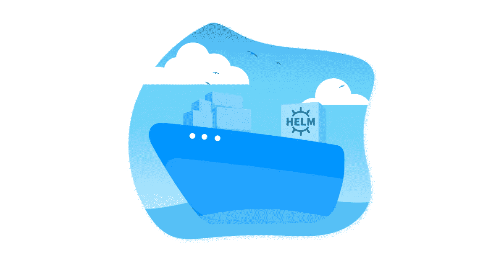
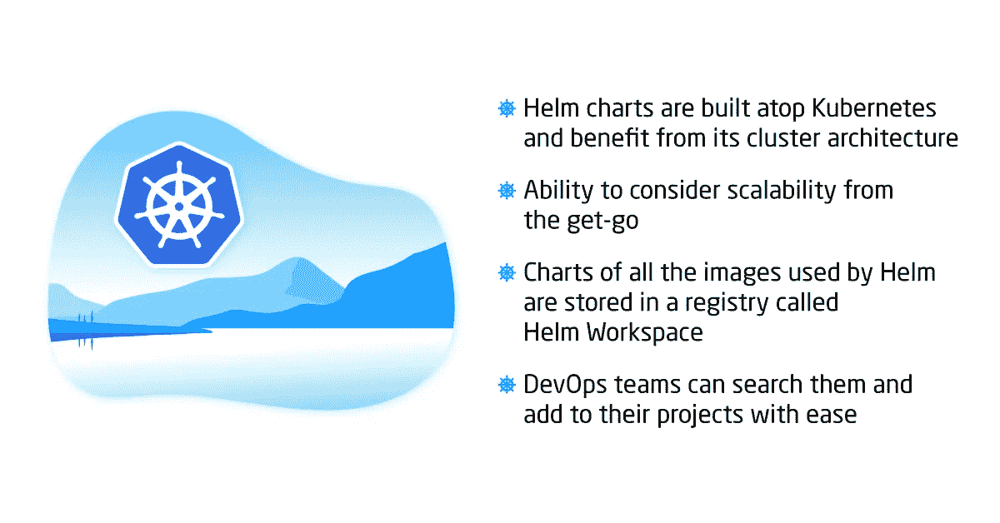

# Helm 是什么，你为什么要热爱它？

> 原文：<https://medium.com/hackernoon/what-is-helm-and-why-you-should-love-it-74bf3d0aafc>

Helm 是第一个在 Kubernetes 上运行的应用程序包管理器。它允许通过方便的舵图描述应用程序结构，并使用简单的命令管理它。

为什么[掌舵](https://github.com/kubernetes/helm)很重要？因为这是服务器端应用程序定义、存储和管理方式的巨大转变。Helm 的采用可能是大规模采用微服务的关键，因为使用这个包管理器可以大大简化他们的管理。

微服务为什么这么重要？它们有很多用途:

*   当有多个微服务而不是单个应用时，每个微服务都可以单独管理、更新和扩展
*   一个微服务的问题不会影响应用程序其他组件的功能
*   新的应用程序可以很容易地由现有的松散耦合的微服务组成

当然，Helm 不是唯一的包管理器，也不是完美的。然而，该项目现在正被积极开发，并发展成一个热情的社区，该社区欣赏使用舵图进行软件开发的好处。

# 头盔的优点和缺点

与在单个服务器上运行的家酿或 Aptitude 桌面软件包管理器，或 Azure 资源管理器模板(ARMs) /亚马逊机器映像(AMIs)不同， **Helm charts 构建在 Kubernetes 之上，并受益于其集群架构**。这种方法的主要好处是**从一开始就考虑可伸缩性的能力**。Helm 使用的所有图像的**图表都存储在一个名为 Helm Workspace** 的注册表中，因此 **DevOps 团队可以搜索它们并轻松添加到他们的项目中**。

例如，你需要启动一个用 WordPress、Joomla、Django 或任何其他 CMS 构建的网站。你希望网站从第一天开始就能每天接待数百万的访问者，你必须确保如此庞大的连接数量不会导致网站冻结或服务不可用。

是的，使用虚拟化功能可以确保扩展。请记住，用于启动应用程序的 AMI、ARM(或 Docker 容器)将依赖于存储应用程序的虚拟机，并且只能按照虚拟机的扩展方式进行扩展，即通过向池中添加更多资源。

有了赫尔姆，我们就有了完全不同的画面。应用程序可以由明确定义的微服务组成，我们可以只扩展我们需要扩展的微服务，向集群添加更多的 Kubernetes 节点和单元。您操作一组图像并独立缩放它们，而不是处理一个整体图像并增加所有资源。

当您想要启动一个运行 50 个微服务的应用程序的新实例时，问题就出现了。启动并组合它们将是一项费力且容易出错的任务。然而，使用 Helm，您只需知道负责图像的图表名称。启动一个新实例就是执行相应的舵图的问题。

到目前为止，helm 的唯一重大问题是，当两个 Helm 图表具有相同的标签时，它们会相互干扰，并损害底层资源。这意味着最好为项目合成一个新的图像，而不是添加一个单独的舵图，这也会影响回滚。然而，社区已经找到了解决这个问题的方法，我们确信在这个工具的未来版本中它将被永久删除。

# 关于赫尔姆未来的最后思考

我们确信 Kubernetes 是云中容器编排的未来，Helm 是最有效地使用 Kubernetes 的方法。当然，DevOps 团队也可以使用标准的 kubectl 命令完成同样的工作，但是使用 Helm 可以快速定义、干净地管理和轻松地部署应用程序。因此，Kubernetes + Helm duo 可以(并且必须)成为未来几年任何 [DevOps 专家](https://itsvit.com/our-services/devops-service-provider/)的基本工具集，即导航云并安全交付容器的舵手。

你对题目有什么看法？你对 Helm 的体验如何？它是否帮助您简化了微服务管理？请在下面的评论中分享你的反馈！

*最初，我把这个故事发布在我公司的博客上——*[https://it svit . com/blog/what-is helm-and-why-you-should-love-it/](https://itsvit.com/blog/what-is-helm-and-why-you-should-love-it/)