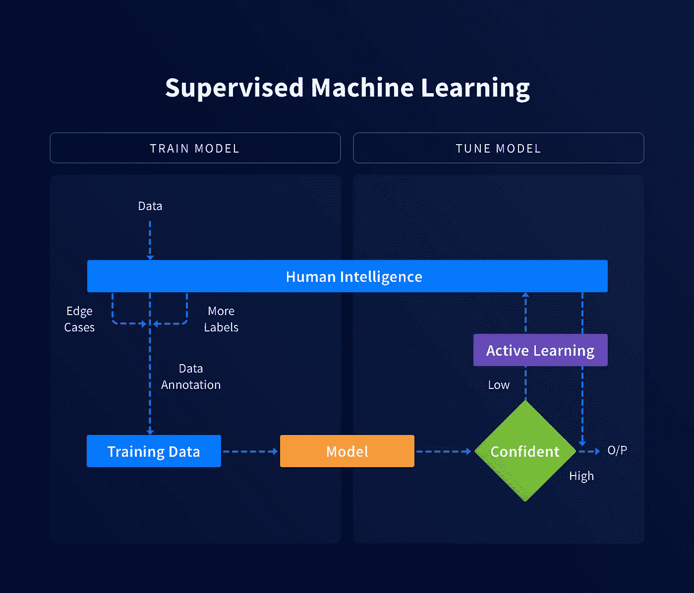

# 什么是机器学习中的人在回路？

> 原文：<https://medium.com/hackernoon/what-is-human-in-the-loop-for-machine-learning-2c2152b6dfbb>

> 计算机快得令人难以置信，精确得令人难以置信，而且愚蠢；人类慢得不可思议，不准确又聪明；他们的力量超乎想象，因此才有了“人在回路中”这个概念。

尽管机器驱动系统的发展和精度已经取得了巨大的进步，但它们仍然达不到预期的精度。这是机器学习中**人在回路的概念背后的哲学。**

# 人在回路中(HITL)

这个概念利用人类和机器智能来创建机器学习模型。在这种方法中，人类直接参与特定 ML 算法的训练、调整和测试数据。

其目的是使用训练有素的人群或普通人群来校正机器预测中的不准确性，从而提高准确性，这导致更高质量的结果。

研究表明，帕累托 80:20 规则的一个变体与迄今为止最准确的机器学习系统是一致的，其中 80%由人工智能驱动，19%由人类输入，1%是随机的。

# HITL = SML +阿尔

想知道你刚刚读到的奇怪公式是什么？该公式本质上传递的是，HITL 是监督机器学习(SML)和主动学习(人工智能)的结合。

**监督的 ML** ，由 ML 专家通过调整参数来训练算法所使用的精选(标记)数据集，以便对传入的数据做出准确的预测。

在**主动学习中，**数据被获取、训练、调整、测试，更多的数据被反馈到算法中，使其更智能、更自信、更准确。这种方法——尤其是将数据反馈到分类器中——被称为主动学习。

人工智能和人类智能的结合产生了极高水平的准确性和智能(超级智能)。这种组合的强大超乎想象。

# HITL 什么时候开始发挥作用？

1.  ***当错误的代价太大时*。一个最大似然算法绝对没有误差。任何失误都会导致可怕的局面。**
2.  ***出现阶层失衡时*。**在许多情况下，您要寻找的东西非常罕见，机器无法以很高的置信度回答这个问题。人类可以帮助解决问题，并在此过程中重新训练 ML 模型。
3.  ***当* *目前数据很少。*** 例如，对于处于早期阶段的新企业来说，由于数据稀缺，通过机器对社交媒体帖子进行分类可能不是一个可行的选择。人类在早期阶段会做出更好的判断，但是，随着时间的推移，机器可以学习并接管任务。

# HITL 在机器学习应用中的潜力

*   自动检测违规车道的交通摄像头。
*   健身应用程序自动记录你吃的食物图片中的卡路里数。你不必再输入食物的数量和种类。
*   标注运动传感器触发根本原因的安全摄像机(例如，是否是动物、人、落叶、驶过的汽车等。)并做出相应的反应。这也有助于降低错误警报的频率。
*   高精度地将语音转换成文本的文本消息应用程序。有了 HITL，转录带有特定行话或俚语的声音会更容易。

# 这正是我们建造 Playment 的原因！

利用人在回路中的机器学习构建的[一站式数据标签解决方案](https://playment.io/?utm_source=hackernoon&utm_content=hitl_blog)。我们支持各种各样的[注释类型](https://blog.playment.io/comparing-image-annotation-types/)，比如边界框、长方体、多边形、多边形线、地标和[语义分割](https://blog.playment.io/semantic-segmentation-models-autonomous-vehicles/)。我们为您的所有培训数据需求提供全面管理的无障碍解决方案。从一开始，我们就成功地为 30 多万用户卸载了超过 3600 万个注释任务。