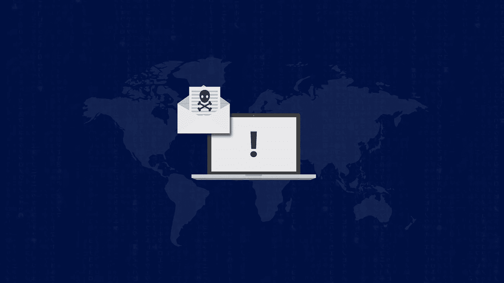
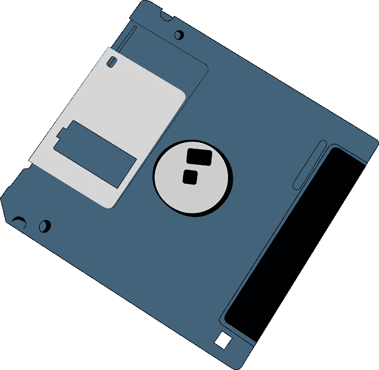
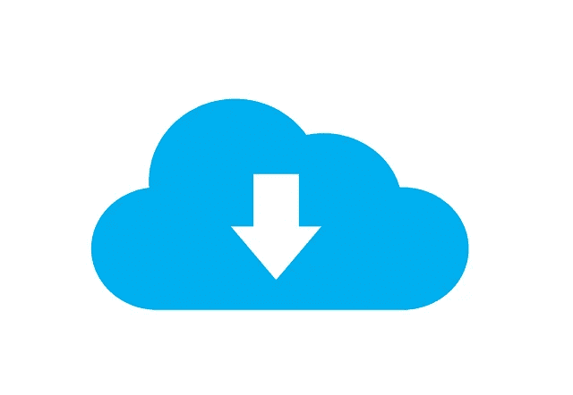

# 什么是恶意软件？

> 原文：<https://medium.com/hackernoon/what-is-malware-373554719419>

## 让我们揭开恶意软件的神秘面纱，了解我们如何避免它

# 恶意软件

## 恶意软件

[韦氏词典](https://www.merriam-webster.com/dictionary/malware)将其定义为

> 旨在干扰计算机正常运行的软件

今天，恶意软件不仅仅是打断“正常”的东西。它被用来利用我们系统的资源、犯罪和攻击他人。

## 它能做什么

一开始有叉形炸弹。叉形炸弹是由恶作剧的程序员编写的程序，试图让他们朋友的系统崩溃。这些病毒分布在[软盘](https://en.wikipedia.org/wiki/Floppy_disk)上，当它们被加载时，会产生太多的自身版本，导致电脑崩溃。

Once upon a time, this was an attack vector

快进到今天:恶意软件被用来以比特币换取家庭照片，并将系统注册到“机器人”网络中，这些机器人可以被拉拢来执行犯罪行为。恶意软件已经进化。

# 恶意软件的类型

为了理解现代恶意软件，我将其分为三个概念类别:攻击你的恶意软件，利用你赚钱的恶意软件，以及利用你攻击他人的恶意软件。

## 它在攻击你

恶意软件可以通过几种方式攻击我们。一种常见的恶意软件是“勒索软件”它加密你的文件，并要求支付解密密钥。

如果恶意软件没有敲诈你，它可能会等待并监听敏感信息。犯罪分子会捕获这些信息，如社会安全号、登录凭证和信用卡号。然后，他们把你的信息打包成“垃圾”，在黑市上出售。身份窃贼买下这些数据，用它们来冒充你，从你那里偷钱，或者滥用你的账户(例如，[免费搭车共享旅行](https://www.gimletmedia.com/reply-all/91-the-russian-passenger))。

## 它试图将你的系统货币化

您的系统是一种计算资源。它使用能量，你为这种能量付费。恶意软件利用你的系统资源来赚钱是很常见的。他们可以通过“挖掘”加密货币并让你支付电费来做到这一点。他们还可以让你加入“僵尸网络”，并将这些僵尸网络出租给其他犯罪组织。

僵尸网络是一组被感染的计算机，是犯罪机器中不知情的齿轮。犯罪分子将利用僵尸网络攻击新系统或实施大规模攻击，如[分布式拒绝服务](https://en.wikipedia.org/wiki/Denial-of-service_attack) (DDoS)攻击。这使得归属更加困难，如果不是不可能的话。

## 它在利用你攻击别人

2015 年，一名美国国家安全局承包商[将绝密数据](https://www.wired.com/story/nsa-contractors-hacking-tools/)带回家，放在他的家用电脑上。很可能是运行在他系统上的软件将这一敏感信息泄露给了俄罗斯情报机构。虽然这听起来像是出自罗伯特·陆德伦的小说，但是攻击者可以使用恶意软件来攻击不太性感的目标，比如你的雇主或者你个人网络中的人。

# 该做的和不该做的

为了阻止这些攻击，我们首先需要了解它是如何侵入我们的系统的。

## Do 的

我不是第一个写[躲避恶意软件](https://duckduckgo.com/?q=How+to+avoid+malware&t=hb&ia=web)的人，也不会是最后一个。大多数文章都会给你十大禁忌。我不想在这份清单上增加什么。我更喜欢提供关于恶意软件避免的一般思考方式，列出一些示例步骤，读者可以采取他们生活中必要的确切行动。您应该做的关键事情是:使用最新的软件并启用内置的安全功能。

为了有一个好的开始，确保你的技术是最新的。如果你不这样做，你就面临着恶意软件利用你的互联网浏览器、文档阅读器或操作系统中的已知缺陷的风险。您可以采取的一个步骤是启用系统和软件的自动更新。

如今，一种新的攻击媒介正在利用我们使用但不更新的联网设备。想想你的家用路由器或任何数量的“物联网”(IoT)物品。我们经常购买、连接和忘记这些设备。但是攻击者可以使用易受攻击的物联网设备在您的网络上建立立足点。当购买新的联网设备时，为宣传持续自动更新的品牌支付一点额外的费用。如果你有不自动更新的物联网设备，设置提醒，每隔几个月手动更新一次。

接下来，打开产品的可用安全功能。如果您的操作系统支持，请启用防火墙和防恶意软件保护。调查您使用的常用软件(如浏览器)中可用的安全功能。除了采取这些积极的步骤，避免某些会增加风险的行为。

## 禁忌

不要落入两个一般准则:不要相信“免费”，不要相信主动联系。

首先，免费通常是有代价的。当你使用像谷歌和脸书这样的“免费”工具时，你是在用你的隐私买单。当你下载免费音乐或播放盗版内容时，你可能要为你的系统安全付出代价。所以，坚持可靠的来源，使用官方应用商店下载软件。如果你“免费”下载软件，而这通常是要付费的，那么有人可能会用恶意软件来补贴这个软件。

Is she working, or is she hacking me?

除了免费软件和媒体，还要警惕免费上网。我们都喜欢咖啡店和机场的免费互联网，但是你正在将你的系统暴露给数十个甚至数百个不可信的系统。咖啡店里的每个人都可能是好人，但有一个人的系统上可能有恶意软件，它正在寻找下一个受害者。使用 VPN 来防止他人篡改您的互联网连接或将恶意内容注入您的流量。

到目前为止，我们大多数人都听说过[网络钓鱼](https://en.wikipedia.org/wiki/Phishing)。我们被教导要避免预付款诈骗(又名[尼日利亚王子诈骗](https://en.wikipedia.org/wiki/Advance-fee_scam))、打字错误的电子邮件和可疑的互联网链接。我们没有学到的是，恶意软件推手正变得越来越老练。他们发送电子邮件，创建看似合法的诈骗网站。所以我们必须提高警惕。如果您收到未经请求的带有附件或嵌入链接的电子邮件，即使是来自您认为认识的联系人，也要小心。避免下载这些文件或点击可疑链接。使用电子邮件的文档查看器打开文件，并在跟随它们之前检查链接。如果电子邮件包含缩短的链接，将其放入[链接缩短器](https://unshorten.it/)。

记住这些注意事项，你可以降低感染的可能性。

# 保持安全

只要人们心中有贪婪，心中有恶意，我们就会有恶意软件(即永远)。了解威胁是预防威胁的第一步。恶意软件不是突然导致我们的计算机变慢或我们的身份被窃取的神奇软件。如今，恶意软件的设计有着特定的目的:攻击你，利用你的系统赚钱，攻击他人，或者以上几种情况的组合。然而，我们可以让恶意软件更难渗透到我们的系统中。我们可以避免增加感染可能性的行为。

*这是一篇来自* [*以赛亚·萨尔朱*](https://medium.com/u/c9fabda04fb1?source=post_page-----373554719419--------------------------------)*[*Revis solution*](https://www.revissolutions.com/)*的帖子。如果你喜欢这篇文章，一定要鼓掌，看看他在* [*Revis Solutions 博客*](https://medium.com/revissolutions) *上的其他文章，并在 Twitter 上关注*[*@ isaiahsarju*](https://twitter.com/isaiahsarju)*[*@ Revis solution*](https://twitter.com/revissolution)**

***查看* [私人上网](https://www.privateinternetaccess.com/pages/buy-vpn/revis)[nord VPN](https://go.nordvpn.net/aff_c?offer_id=15&aff_id=11290&url_id=902)[概要](https://getoutline.org/en/home)(免费，DIY)。*这些是 Revis Solutions 的附属链接。我们只推荐我们自己测试过的产品。***