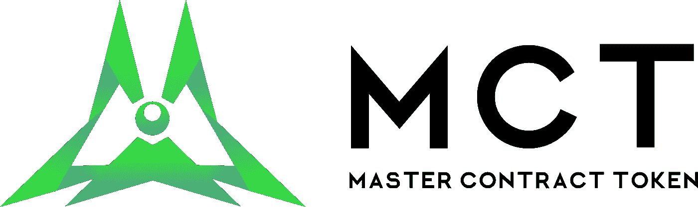
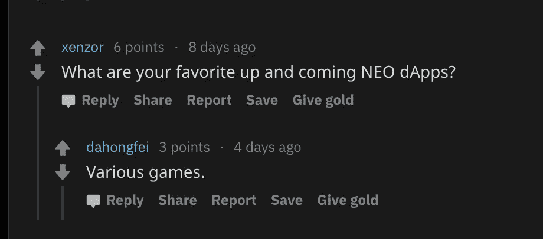

# MCT 到底是怎么回事？

> 原文：<https://medium.com/hackernoon/what-is-mct-all-about-anyway-f327e33bb997>

Source: [https://github.com/Splyse/MCT](https://github.com/Splyse/MCT)

# 介绍

随着我们最近看到的这种加密熊市，最著名的区块链(BTC/ETH/NEO)开始在现实世界中被采用变得越来越重要。如果不采用，整个加密行业将慢慢失去相关性。这是 Vitalik buter in(ETH 的创始人)所说的话:

因此，试图改善区块链在现实世界中的应用的项目应该得到更多的重视。近地天体区块链上的一个此类项目是**主合同令牌(MCT)** 。

# **MCT 解释道**

正如[网站](https://github.com/Splyse/MCT)所说，MCT 代币是新智能经济的*实用代币。*

新区块链号上的大多数实用令牌都是为特定的 dApp 建造的。然而，MCT 希望成为一个**实用令牌，用于多个 dapp**，类似于 NEO/GAS。这就是为什么他们称自己为*新智能经济*的公用事业令牌，因为他们不依赖于任何 dApp。

但是，他们打算怎么做呢？基本上，MCT 背后的团队有一个假设，即通过消除开发人员目前可能面临的某些值得注意的障碍，可以增加近地天体上的 dApp 开发。以太坊区块链上不存在这些障碍，解决这些障碍会让更多的开发者考虑在 NEO vs .以太坊上开发。如果 MCT 的任务成功，近地天体将成为以太坊的强大竞争对手，许多开发者将把 MCT 作为他们的实用工具。随着越来越多的开发人员涌向 NEO，项目帮助现实世界采用的可能性增加。新全球资本(NGC)也相信这个目标，所以他们最近在 MCT 投资。

NEO Global Capital invests in MCT

# NEO 开发人员面临的问题

让我们看看 NEO 给开发者带来的现有障碍，以及 MCT 是如何解决这些障碍的。

1.  **部署智能合同的高成本**

以下显示了部署 NEO 智能合同的 3 种方式:

1.  无存储— 90 气体
2.  基本储存— 490 气体
3.  完全储存— 990 气体

通常，dApp 的智能合约需要某种形式的存储。它可以是发送给契约或任何其他类型的键-值对的记录。因此，*基本存储*合同部署很常见。但是，490 GAS 的部署成本偏高。因此，小规模的 dApp 开发者可能不得不转向以太坊以降低成本。

然而，有了 MCT，基本存储的成本可以降低到 90 美元，只需 10，000 MCT。这大大降低了成本，并极大地增加了 dApp 开发者的预算。从长远来看，生态系统通过将这些开发者留在 NEO 上而获益。

> 有了 MCT，在近地天体上部署智能合同的成本大大降低，这导致了更多的近地天体开发人员。MCT 和尼奥的双赢。

**2。NEP-5 令牌限制**

NEO 智能经济有一个主要限制，即在接收系统资产(NEO、GAS)或其他 NEP-5 令牌时，不会触发接收智能合同。**换句话说，没有事件让合约在**发生作用。此外，在没有与链外代码或钱包协调的情况下，智能合约不能独立地花费代币。如果你想为 ICO 筹集资金，这是可以的，但是当你开始为 dApp 开发具体的用例时，它会导致不必要的复杂性和失败点。

这是《MCT》的首席开发者 Joe Stewart(在 Discord 上被称为@hal0x2328，或“hal”)对此的看法:

> *“接收资产或其他令牌根本不会触发接收智能契约，您必须构建一个 InvocationTransaction 来调用契约中的操作。如果你想用它自己的专用钱包建立一个 dApp，或者如果它是一种通用类型的操作(就像 mintTokens 被添加到 Neon ),将它添加到现有的钱包中，这很好，但仍然需要编写额外的代码。*
> 
> 但是，如果您希望来自另一个所有者的另一个智能契约调用您的契约的功能，该怎么办呢？他们将不得不不必要地检查你的 dApp 的链外代码，或者在他们的代码中实现相同的代码。
> 
> *对于 MCT，合同 1 只是将一些 MCT 转移到合同 2，并在转移调用结束时添加任何参数。完成，在单个交易中，如果不满足某些条件，合同 2 可以拒绝转让。现在，使用 dApps 正在使用的现有方法，mintTokens 调用可能会失败或返回 false，但是资产仍然会被转移。现在，必须编写 dApp 的非链部分来处理失败调用的退款。MCT 消除了这种头痛。通过智能合约发送资产/令牌也是一项繁琐的工作。对于资产，必须创建一个新的 UTXO 事务。智能合约不能执行这一功能，因此链外代码必须在一个精心制作的事务中从合约中“提取”资金，以将资金发送到其他地方。但是是什么触发了那个外链代码呢？如果触发它的听众因为这些转账或退款而倒下呢？*
> 
> *dApp 是否有冗余来防止错过的交易，以及防止重复花费？构建可靠的解决方案需要时间和精力。对于令牌，这并不太难，但是您的 dApp 必须以一种允许智能合约授权自己作为被转移令牌的所有者的方式来构建交易。仅仅调用 NEP-5 契约中的 transfer()是不够的(MCT 除外)，它仍然需要一个定制的 wallet/dApp 来创建这个事务并调用你的契约。”*

正如您所理解的，NEO 的这一固有限制限制了它的使用案例。然而，有了 MCT，dApp 的开发者可以把它作为一种通用的支付形式，而不是每个 dApp 都有另一个你必须去交易所购买的令牌。这是巨大的！

了解了 MCT 为近地天体解决了什么障碍之后，让我们来看看会有什么新的机会出现。

# **用例:**

## 支付

看了看 MCT 解决的限制，开发人员在 NEO 上的智能合同中使用它似乎是一个很好的主意。然而，并不是所有的项目都需要 MCT。我认为需要支付或被支付的 dapp，特别是两者，例如彩票、骰子和赌场风格的 dapp，游戏(支付和支付)最需要 MCT，而不是 ICO 众筹(仅支付，钱包已经与硬币集成)。一般来说，收到资金的 dapp 不会像需要发送资金的 dapp 那样烦恼。

> 因此，只需要代币来筹集资金的 dApps 不会太需要 MCT。然而，MCT 将成为所有游戏、彩票等的多 dApp 公用令牌。—即需要付出并得到回报的项目。

## 比赛

NEO 提倡使用生态系统来开发游戏，因为游戏会让人上瘾。【http://neo.game/works-en.html】T4。NEO 最近在 2018 年 8 月 2 日举办了一场 [AMA](https://www.reddit.com/r/NEO/comments/93vz5g/official_ama_with_da_hongfei_and_erik_zhang_is/) ，NEO 的创始人达·洪飞强调了这一点。

Da Hongfei’s response on an AMA question

在这种情况下，我觉得 MCT 可能会成为这些游戏的一个辉煌的公用事业令牌。用户将不必去各种交易所领取各种游戏的不同代币；很方便。

这自然提出了一个问题——在目前的市场情况下，每个项目都希望拥有自己的令牌。项目如何决定在自己的令牌和使用 MCT 之间做出选择？

哈尔对此给出了一些有趣的见解:

> 这确实是一个他们为什么需要代币的问题——如果是为了大规模筹款，那么他们可能会选择使用自己的代币。但是并不是所有的 dApps 都需要数百万美元来开发，所以在那些情况下，确实没有使用他们自己的令牌的功能性理由，而是使用 MCT 的所有理由。
> 
> *1。它已经可用，因此无需编写任何 NEP-5 合同代码*
> 
> *2。它已经在交易所上市，所以新用户可以很容易地获得它*
> 
> *3。由于 98%的空投，它已经在许多用户的手中*
> 
> *4。对于已经使用 MCT 和另一个 dApp* 的用户来说很方便

# 团队

让我们看看项目背后的团队。MCT 由 [Splyse](https://splyse.tech/) 开发，该团队在近地天体区块链上推出了备受期待的类似 Cryptokitties 的游戏，名为[hash supplies](https://hashpuppi.es/)。你还记得 Cryptokitties 以其高交易量打破了以太坊区块链吗！预计 HashPuppies 可能会对 NEO 做同样的事情。然而，离上线还有几个月的时间。

该团队之前通过开发 *NEO 智能物联网*赢得了首届锡安城 dApp 竞赛，并通过开发*不可替换令牌(NFT)* 智能合同模板在 NEO/微软 dApp 竞赛中获得第三名。因此，我们可以说这支队伍实力雄厚。此外，MCT 的开发已经完成，令牌是活的使用。太棒了，对吧？

从那以后，我对这个项目非常感兴趣。我与 Hal 进行了进一步的讨论，逐字记录如下。这是一个项目的瑰宝，随着人们对它的了解越来越多，它将开始获得更多的关注！

# 进一步讨论

*   问:NEO 3.0 似乎将解决 MCT 计划解决的具体问题，如果是这样的话，MCT 不是多余的吗？

> ***哈尔*** *:有趣的是编号*
> 
> *1。向后兼容性:*
> 
> *NEO 团队希望开发人员能够使用合同对 NEO 区块链进行更改，而不是对核心代码进行更改。这使得向后兼容更加容易。例如，NEP 7 解决了 MCT 带来的一些变化。然而，推出它将是一项极其繁琐的任务，因为它会影响所有过去的交易以及未来的交易。一个错误，如果没有考虑每个先前部署的合同的每个交互，您可能会使先前的 ICO 令牌销售无效。*
> 
> *2。NEO 3.0 可能解决 MCT 带来的所有变化。然而，这大约需要 1-2 年的时间。*
> 
> *3。MCT 现在就解决了必要的近地天体问题，而不是一年之后。注意到这一点非常重要。所以，现在将会有许多开发者使用 MCT 作为一个实用令牌。最终，当 NEO 3.0 发布时，由于这些网络效应，MCT 将是有价值的。它将是各种单个 dApp 应用工具令牌中的多 dApp 应用工具令牌。*

问:如果 MCT 对近地天体生态系统如此有益，是什么阻止了一些人分化它，创造他们自己版本的 MCT，然后重复空投等同样的过程？？这难道不会削弱 MCT 未来的潜力吗？

这是 MCT 不和谐频道中有人问的问题之一。MCT 的首席开发者哈尔有一个令人信服的答案，这使得 MCT 在我眼中更有价值。

> ***哈尔:*** *他们必须解决我们解决的所有问题，才能走到这一步——现在没有多少开发人员对 Neo VM 有深入的了解，能够理解如何安全地编写这份合同。该合同不是开源的，所以他们必须对整个项目进行逆向工程。他们必须愿意支付 990 GAS 来部署他们的克隆令牌，并希望如果他们在试图复制它的代码中犯了错误，他们不只是扔掉 26，000 美元。*

# 结论

这就是关于 MCT 的全部内容！MCT 背后的团队 Splyse 似乎已经获得了一个极其重要的问题陈述，并交付了一个工作产品。它可以在各种交易中有效地替代天然气。现在，成功与否只能通过开发人员社区使用令牌的效率来衡量。祝球队一切顺利。

希望你喜欢这篇文章！我现在能想到谁应该读这本书吗？“分享”按钮是你的了。

# ***关于作者***

Ankit 是一个加密投资基金的联合创始人——Bitazu Capital([www.bitazu.com](http://www.bitazu.com))。让我们在推特上成为朋友吧。

# 放弃

本文中提出的观点是我自己的观点。本文仅供参考。这不是一个投资建议。