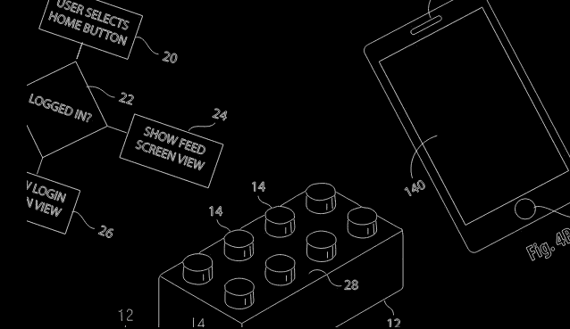

# 什么是专利思维？

> 原文：<https://medium.com/hackernoon/what-is-patent-thinking-511be4141b40>

专利思维是一种结合专利设计和设计思维的新设计方法。使用这种新的构思方法，团队、创业公司、学术界和企业可以通过开发精益专利申请的原型来开发新的想法、产品和流程。应用的方法可以采取个人工作或集体活动的形式。

专利思维包括来自技术、产品管理、产品设计、商业和知识产权的原理。

专利被认为是最经典和最广为人知的形式之一，它清楚地描述和保护一个或一群发明者的创新产品/服务或发明。专利有明确的规则和结构。它们具有很高的价值，因为发明者投入了大量的精力、思想和资源来使他们的专利获得批准。此外，它们还要经过多个专业人员的审查，例如:专利工程师、专家、专利律师以及提交专利申请的国家的不同专利局。因此，通常你会听说一家公司花大价钱购买专利组合。

全球和地方专利制度的总体思想是允许发明者获得其发明的专有权，以此作为回报，让他们的知识为公众所用。在法律规定的时间内，知识是公共资产，其他人可以利用它来建立伟大的创新。一项伟大的专利是一个技术熟练的人，因此是一个工程师、科学家和艺术家，可以用它来制造产品。

多年来，我在这个行业制造产品，并在不同的垂直领域引领创新和创意，这让我意识到，设计和起草专利的经典结构不仅是为了保护你的想法或产品，就像人们可能认为的那样，更重要的是它背后的思维过程。该结构包括不同的部分，例如背景、发明的详细描述、专利数字和法律权利要求，引导发明人通过一个反复的过程，使他们的发明变得清晰，并确定他们解决和创新的差距和问题，以创造更好的产品。在起草专利申请的过程中，你了解你的问题陈述、目标以及你希望你的最终产品是什么样的。

在以后的文章中，我将深入探讨专利思维的过程、专利的结构以及如何利用它来构建更具创造性的想法、如何使用该方法对你的解决方案进行优先排序，并简要介绍如何领导和参与专利思维研讨会。

有什么问题可以在评论里问我，期待帮助更多的发明家用专利思维创新。

了解更多专利思维:【http://illaigescheit.com/patentthinking.html 

请随时在 Linkedin 上与我联系:[https://www.linkedin.com/in/illaigescheit](https://www.linkedin.com/in/illaigescheit)

## **有问题吗？评论？**

> *版权所有 2018 专利思维作者伊利亚·格斯切特*