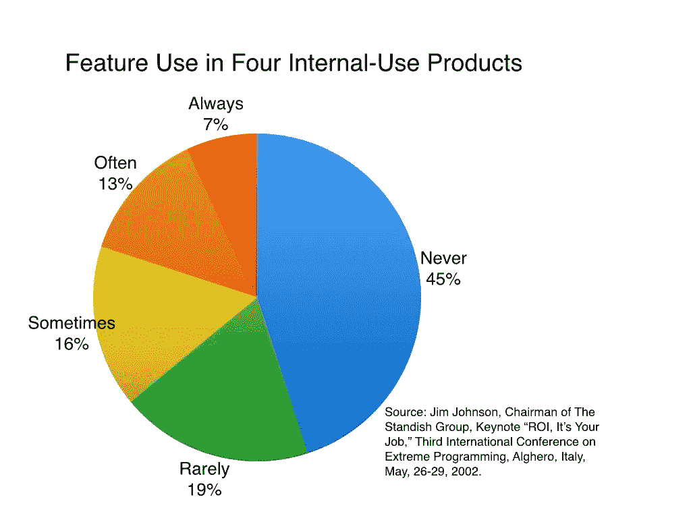
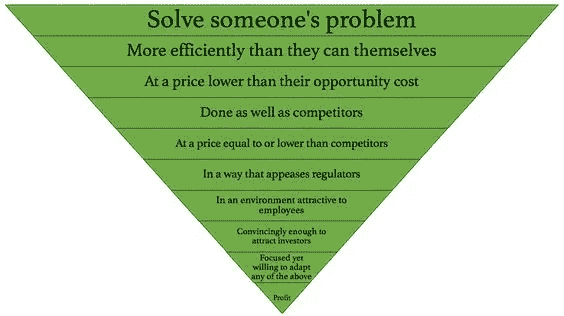

# 什么是产品管理——但最重要的是，什么不是

> 原文：<https://medium.com/hackernoon/what-is-product-management-but-most-importantly-what-isnt-6dc13f529acf>

在做了十年产品经理之后，我只能说这条职业道路是我职业生涯中做出的最好的决定之一。我想我并不孤单。这听起来很像现在很多人正在或想要成为一个。

虽然我的计算机科学学位会让我倾向于开发工作或咨询，但事实是我从未真正享受过作为软件工程师的工作。面对现实吧，我从来都不是个好孩子。此外，我觉得我一直在寻找能让我对某个主题有全面了解的工作，而不是成为某个领域的专家。

这些年来，我有机会在广泛的行业领域担任产品管理职务。消费品、新闻媒体、电子商务和目前的旅游领域。这让我有机会和一些我见过的最聪明的人一起工作。由于这一点，我学会了成为一个积极、务实和主动的人，有能力理解客户的问题，并在试图解决这些问题时经常失败，代价也很低。

以我自己的经验，我看到产品管理的职责因组织而异。这些差异与每个公司的规模、行业和文化有关。也就是说，产品管理更多的是“管理一个宇宙，而不是成为一个明星”。总有事情要做。因此，PM 功能有时也会完全被误导。能够理解什么是产品管理，什么不是产品管理，将在有效利用您的时间和技能来构建成功的数字产品方面发挥关键作用。

# 什么是产品管理

*   了解客户问题，并提出创造性的解决方案来解决它们
*   执行产品范围界定并确定时间与商业价值的权衡
*   促进跨职能工作
*   持有整体产品愿景并提供指导
*   激励、参与和指导团队成员

# 什么是产品管理不是

*   做一只 [**河马(*收入最高者的意见* )**](http://www.enricdurany.com/agile-startup-entrepreneur/how-to-deal-with-hippos-highest-paid-person-opinion-ab-testing-to-the-rescue/)
*   成为唯一的创意产生者
*   成为文案、设计师或开发人员
*   对质量和保证负责
*   负责发布日期(见 [***无发布日期***](https://www.prodpad.com/2013/01/roadmapping-without-dates/) )的路线图)

# 产品管理是管理一个问题，而不是它的解决方案

Source: Mountain Goat Software [[link](https://www.mountaingoatsoftware.com/blog/are-64-of-features-really-rarely-or-never-used)]

正如 [**尼尔斯·戴维斯**](http://nilsdavis.com/2015/11/03/1920/) 所指出的，产品管理在很大程度上就是执行以下三项任务:

1.  发现市场问题(并验证它)
2.  想出一个解决问题的办法(比它的替代品更好)
3.  把它带到市场

首先，我们从了解客户问题开始。虽然这听起来很明显[但事实可能并非总是如此](https://blog.intercom.com/great-product-managers-dont-spend-time-on-solutions/)。你有多少朋友会向你提出终极应用创意，来解决他们认为需要技术解决方案的问题？我的第一个问题总是:你真的问过这些潜在客户他们是否同意有这个问题吗？然后，你有没有问过他们是否真的会花钱请人帮他们解决问题？

问这些简单问题的原因是为了验证你的假设。你可能想出了最漂亮、最巧妙、最具革命性的技术，但如果客户不想使用或购买它，如果你的产品在错误的时间出现，那就是你的责任。你迟早会破产的。

# 这个问题没有完美的解决方案

事实上，尽管你可能已经理解并验证了一个问题，并抓住了市场机会，但你不可能想出一个完美的解决方案。首先没有这样完美的解决方案。

但是，嘿，好消息是有很多方法来建立一个框架，使你能够学习和失败，经常和便宜。通过专注于构建*最小可行产品* (MVP)，或者我喜欢称之为 [***最小可行实验* (MVE)**](http://www.enricdurany.com/work/stop-thinking-of-minimum-viable-products/) ，你将把客户置于中心。然后，通过在*构建、测量和学习*循环中迭代，将会产生最佳解决方案。

作为一个产品经理，你不应该仅仅关注于构建新产品或服务，还应该关注于启用一个 A/B 测试框架，让你能够衡量并从错误中学习。你还依赖客户的反馈来做出产品决策，所以你应该考虑自己负责建立这些反馈回路。

如果你从未在你的公司建立测试/客户反馈文化，你所拥有的将是有偏见的观点和假设，而 [**河马**](http://www.enricdurany.com/work/how-to-deal-with-hippos-highest-paid-person-opinion-ab-testing-to-the-rescue/) 的永远会赢。

# 外卖食品

*   作为一个产品经理，你应该能够识别和理解一个问题，提出一个解决方案，并启动一个过程来构建它
*   当你这样做的时候，你学得越快，你建立的解决方案就越好。因此，你卖得越多
*   作为产品经理，你所做的其他事情只是让你远离上述任务。因此，你应该尽快停止这样做

祝你和你成功的产品好运。

> “当我们创造东西时，我们这样做是因为我们倾听顾客，听取他们的意见，并加入我们想看的东西。我们开发新产品。你永远不知道人们是否会像你一样爱他们。”
> ——史蒂夫·乔布斯

# 出发前，请考虑:

*   *推荐*或者*分享*这个如果你觉得有用。它给了我🔋写作时要知道人们会从中发现价值
*   如果你不想错过即将推出的版本
    [**请在此订阅**](http://eepurl.com/dgCjPT)

本文最初发表于
[http://www . enric durany . com/agile-startup-entrepreneur/what-is-product-management/](http://www.enricdurany.com/agile-startup-entrepreneur/what-is-product-management/)