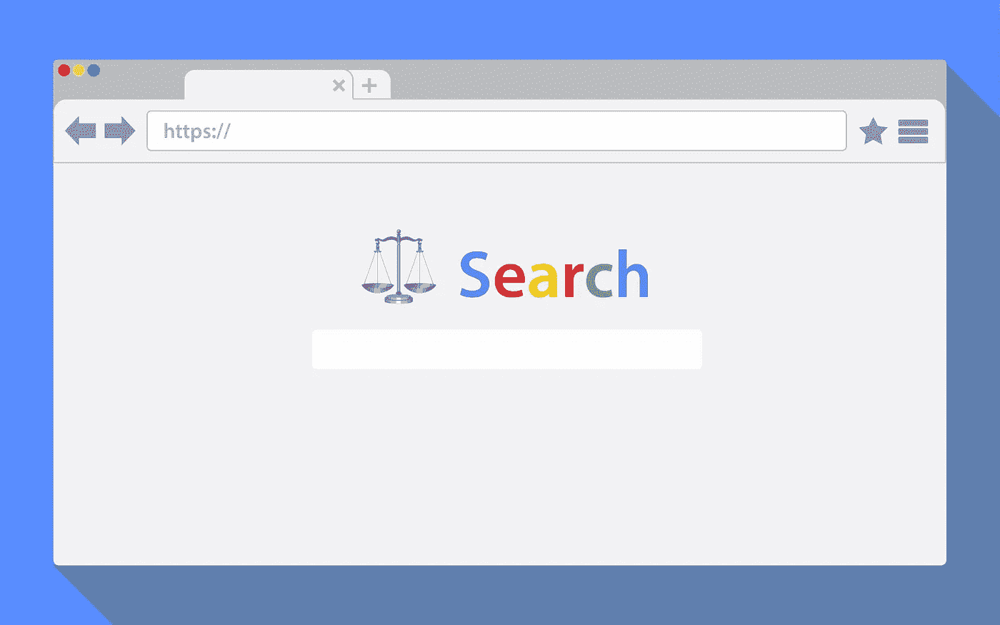

# 什么是搜索中立？

> 原文：<https://medium.com/hackernoon/what-is-search-neutrality-d05cc30c6b3e>

## 你的搜索引擎有偏见吗？

搜索中立是指搜索引擎不会限制或影响一个人在互联网上获取信息的能力。搜索引擎市场非常片面，只有几家公司控制着整个市场。

> ****搜索中立*** *是一个* [*原则*](https://en.wikipedia.org/wiki/Principle) *即* [*搜索引擎*](https://en.wikipedia.org/wiki/Search_engine) *应该没有编辑政策，除了它们的结果是全面的，* [*公正*](https://en.wikipedia.org/wiki/Impartial) *并且完全基于* [*相关性*](https://en.wikipedia.org/wiki/Relevance) *。这意味着当用户查询搜索引擎时，该引擎应该返回在提供商的域(该引擎所知道的那些网站)中找到的最相关的结果，而不操纵结果的顺序(除了根据相关性对它们进行排序)、排除结果，或者以任何其他方式将结果操纵到某个***。”——维基百科***

**根据[斯坦福哲学百科全书](https://plato.stanford.edu/entries/ethics-search/#SearEngiBiasProbOpac):**

1.  **搜索引擎技术不是中性的，而是在它的设计中嵌入了一些有利于某些价值的特性。**
2.  **在响应用户搜索查询时，主流搜索引擎在返回的结果列表中有系统地偏爱某些站点(和某些类型的站点)。**
3.  **搜索算法在为搜索查询生成结果列表时不使用客观标准。**

**搜索引擎可能有完全积极的意图，但是如果它们的算法不能给人们[客观和中立的结果](https://choosetoencrypt.com/tech/making-the-internet-decentralized-neutral-creates-better-user-experienes/)，它们就是失败的。[93%的在线体验始于搜索引擎。如果大多数人的浏览是由搜索引擎决定的，那么搜索引擎就有很大的责任提供完整准确的信息。](https://www.searchenginejournal.com/10-stats-to-justify-seo/36762/)**

# **大型搜索引擎因搜索偏见而受到惩罚**

**早在 2018 年 2 月，印度竞争委员会就因一家主要搜索引擎在搜索市场滥用权力而对其罚款约 2110 万美元。欧盟委员会(European Commission)还对该公司处以创纪录的 24 亿欧元(27 亿美元)罚款，原因是该公司偏袒其购物服务，并贬低竞争对手的产品。**

**[价格比较网站](http://www.wired.co.uk/article/fine-google-competition-eu-shivaun-adam-raff) [Foundem](http://www.foundem.co.uk/) 背后的英国夫妇 Adam 和 Shivaun Raff ，在揭露搜索偏见问题上发挥了重要作用。**

**如果一个搜索引擎操纵它的搜索结果来支持它最有利可图的网站，那么没有其他网站可以改变大搜索引擎这样做的非常不透明的系统。**

**这是 Raffs 的问题，当他们试图联系搜索引擎巨头寻求反馈或上诉程序时，他们没有得到太多的工作。在线购物服务依赖于流量(主要来自搜索引擎)来获得成功。然而，如果一个主要的搜索引擎将其网站降级到结果的第二或第三页，它的流量(和利润)数字将会受到严重影响。**

*****那么为什么这是个问题呢？*****

**最大的问题是在线购物网络必须为他们在搜索引擎上的广告付费。搜索引擎可以把他们的搜索结果放在竞争对手的广告旁边，即使他们不需要为广告付费。通过操纵决定显示哪些购物链接的算法，搜索引擎可以引导人们点击自己的广告，即使他们不必为广告付费。**

**然后考虑一个大的搜索引擎有他们想要推广的特定的政治意识形态。他们所要做的就是改变搜索算法来影响公众舆论以支持他们自己的利益。**

# **搜索引擎并不完美**

**南加州大学安嫩伯格传播学教授萨菲娅·乌莫哈·诺布尔表示，互联网的价值观反映了互联网的创造者，他们大多是西方白人。她解释说，少数民族和妇女在互联网上没有得到公平的代表。**

**这也是人们用来在互联网上查找信息的搜索引擎的一个问题。然而，一个相反的观点是，搜索引擎本身并不是问题所在。如果他们抓取的信息是有偏见的，同样的偏见也会被引入到他们的搜索结果中。**

> ***“当我们开始进入围绕身份、围绕知识的更复杂的概念时，这就是搜索引擎开始让我们失望的地方。这不是什么大问题，除非公众真的依赖搜索引擎给他们提供他们认为真实的东西，或者经过审查的东西，或者可信的东西。***

**搜索引擎和社交媒体公司都在讨论人工智能，以及如何应用它来清理网站上的内容。不幸的是，如果用于分类和过滤内容的人工智能是基于现有的信息和算法，现有的偏见将被加强，而不是固定。人工智能是一个有价值的[工具](https://hackernoon.com/tagged/tool)，但它不会帮助搜索引擎或像脸书这样的网站提供更中性的内容。**

# **搜索中立的优势**

*   **搜索结果将与用户更加相关，而不会偏向有更多广告的网站**
*   **中性搜索结果强调更高质量的内容，而不是付费排名**
*   **允许通过*目标*算法操纵搜索结果，而不是允许在个人基础上进行排名。**
*   **搜索中立性最小化了文化或意识形态的影响。**

# **搜索中立的缺点**

*   **搜索偏差允许“个性化”的搜索结果，人们想要这种偏差，因为它提供更智能、更具预测性的结果。搜索中立性最小化了这种偏见和“个性化”。**
*   **监管搜索引擎及其结果可能会限制搜索引擎根据自己的指标调整排名的能力。**

# **没有追踪功能的搜索引擎最大限度地减少了搜索偏差**

**搜索偏差以两种方式引入。一种是从搜索引擎的算法方面，如果它确定一个网站一般比其他网站被点击的次数多。另一种方式是当搜索引擎监控一个人的互联网行为，并根据他们过去的搜索和结果点击来定制结果。**

**不跟踪你的搜索的私人搜索引擎不能定制你的搜索结果。如果你正在寻求公正的信息，这是一件好事。个性化结果的便利性被由此产生的“[过滤器气泡](https://choosetoencrypt.com/news/filter-bubbles-searchencrypt-com-avoids/)”效果所抵消。**

**有了私人搜索引擎，一个经常阅读福克斯新闻频道的保守人士可以搜索一些东西，他们会得到与阅读纽约时报的自由人士相同的结果。对于跟踪用户搜索的大型搜索引擎来说，这就不太可能了。保守的人可能在他们的搜索结果中得到更多保守的新闻来源，而自由的人可能得到更多左倾的网站。**

# **我们能解决搜索偏差吗？**

**搜索引擎中的偏见是一个大问题，它可能是美国政治两极分化的一个重要因素。同样的问题也出现在算法社交媒体网站[如脸书](https://choosetoencrypt.com/news/facebook-is-not-internets-privacy-villain/)上。解决这个问题的第一步是告诉人们他们的主要信息来源可能并不完美。**

**对互联网上的信息持批评态度是驾驭现代信息世界的一项重要技能。我们需要对我们在网上找到的信息持更加怀疑的态度，并对我们用来寻找信息的产品有更高的标准。**

********

***原载于 2018 年 5 月 17 日*[*choosetoencrypt.com*](https://choosetoencrypt.com/news/what-is-search-neutrality-is-your-search-engine-biased/)*。***