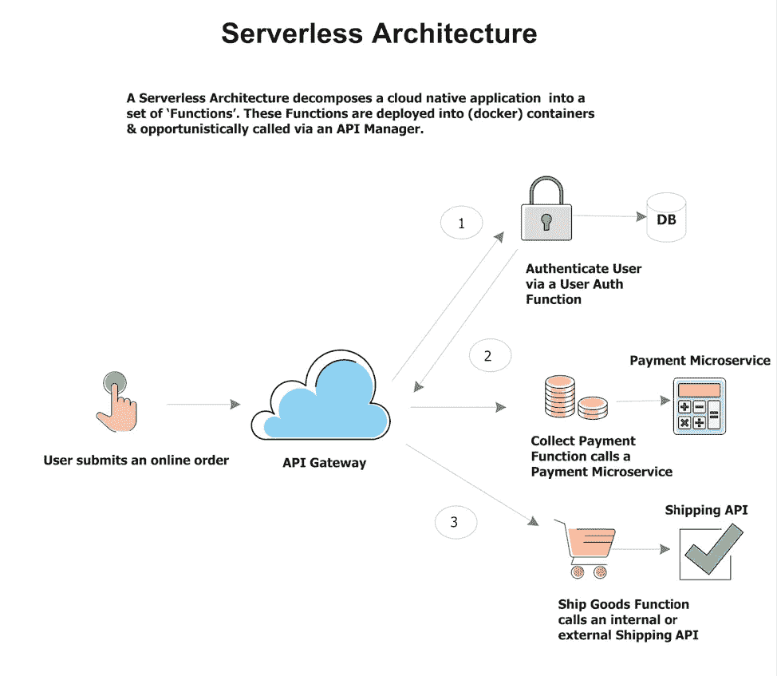

# 什么是无服务器及其对您的意义—第 1 部分

> 原文：<https://medium.com/hackernoon/what-is-serverless-and-what-it-means-for-you-part-1-d541329172c8>

在过去的一年中，无服务器计算已经成为构建和运行现代应用程序和服务的一种引人注目的架构选择。无服务器应用程序允许开发人员专注于他们的代码，而不是基础设施的配置和管理。这加快了开发和发布周期，并允许更好、更有效的扩展。

无服务器计算与新的架构模式和技术(如微服务和容器)紧密相关。绿地、云原生应用通常基于微服务，这使得它们非常适合在容器(Docker)上运行。无服务器功能允许应用程序和基础设施之间的进一步解耦和抽象，这使它们成为开发可以跨不同环境运行的现代微服务的理想模式。

随着无服务器应用程序的使用越来越多(Lambda 是 AWS 提供的最受欢迎的云服务)，我们越来越多地看到希望在内部基础架构上为其工程师提供无服务器体验的企业，因为无服务器将成为下一个混合云环境！

虽然无服务器提供了许多好处，但成功地实现它和容器也带来了相当多的挑战——特别是对 it 运营部门。虽然无服务器加速了开发，但它需要一个 Kubernetes 集群才能运行，而且众所周知，Kubernetes 很难部署和管理。此外，这些新技术增加了当今企业需要支持的 IT 环境、工具和应用程序的复杂性、规模和蔓延。将新的无服务器添加到已经存在的混合环境(云资源、传统虚拟机甚至裸机)中，事情会变得更加复杂。

[在本系列](https://platform9.com/blog/what-is-serverless-and-what-it-means-for-you-part-1/)中，我将介绍一些最佳实践和模式，帮助开发人员和运营团队利用无服务器计算来支持他们的整体 IT 运营，并将他们带入下一个阶段！

我将讨论:

1.  什么是无服务器架构，它对您意味着什么
2.  当前无服务器实施的挑战和“陷阱”,以及它们如何阻碍企业采用
3.  Kubernetes 对无服务器的影响
4.  开源无服务器框架如何帮助
5.  使用无服务器功能的不同类型业务应用程序的参考体系结构

# 无服务器架构简介

首先，一些定义。

# 云原生:

云原生(CN)架构最重要的特征是能够动态扩展以支持大量用户和大型分布式开发和运营团队。当我们考虑到云计算本质上是多租户的时候，这一要求就更加重要了。

在这个领域中，我们需要解决的典型需求有:

1.  动态增加部署占用空间(向上扩展)以及减少占用空间(向下扩展)的能力
2.  能够跨层自动处理可能中断应用程序可用性的故障
3.  通过确保组件本身提供松散耦合来适应大型开发团队的能力
4.  能够处理几乎任何类型的基础架构(计算、存储和网络)实施

# Mono、Micro 和无服务器:现代应用架构的演变

大多数企业(遗留)应用程序本质上都是单一的，应用程序组件、基础设施、开发团队、技术、工具等之间存在紧密耦合和相互依赖。这种紧密耦合对开发的速度和敏捷性、新技术或 DevOps 实践的采用以及扩展和操作这些应用程序的简易性提出了挑战。

微服务是面向服务架构(SOA)范式的自然演变。在这种方法中，应用程序被分解成松散耦合的业务功能，每个功能映射到一个或多个微服务。每个微服务都是为特定的细粒度业务功能而构建的，可以由独立的开发人员或团队来处理。作为一个独立的代码工件，它不仅从工具或通信的角度(通常是使用 RESTful API 的通信，使用 JSON/XML 表示传递数据)而且从构建、部署、升级和维护过程的角度来看都是松散耦合的。每个微服务都可以有自己的本地化数据存储。采用这种方法的一个重要优势是，可以使用独立于应用程序其他部分的技术堆栈来创建每个微服务。

容器是运行微服务的一种高效、最优的方式，使用容器编排解决方案，如处理容器集群的运行时操作所需的开源 Kubernetes。微服务和容器现在是任何数字化转型战略不可或缺的组成部分，因为它们允许更容易的构建、独立的开发和部署以及更好的扩展。

# 无服务器是这一发展的下一步。

无服务器计算是软件开发中的新范例，其中应用程序开发人员专注于对应用程序功能进行编码，而不必投入时间和精力来配置和管理部署和运行这些应用程序所需的资源。

在这种范式中，一旦收到对应用程序的请求，云或基础设施提供商需要为应用程序的实例化做好所有必要的准备工作。开发人员专注于应用程序的代码，底层数据中心提供商负责可靠地管理运行应用程序所需的所有相关资源。

[功能即服务(FaaS)](https://fission.io/) 是最常见的无服务器计算类型，在这种计算中，应用程序被开发为纯软件功能，旨在实现细粒度的用例(如果你愿意，可以称之为极其细粒度的微服务)。)然后，可以将多个功能组合在一起，并可选地与微服务应用结合使用，以执行业务功能。在本系列文章的其余部分，我将交替使用这两个术语——无服务器和 FaaS。

无服务器和 FaaS 允许细粒度计费。由于 FaaS 获得空闲功能来消耗低得多的 CPU/内存，集群资源的使用变得比部署规模与实际使用更成比例。当功能空闲时，不实例化服务器资源，因此降低了成本。但是，请记住，计费优势非常敏感地取决于实际的使用模式。每 10 秒运行一秒的函数在 Lambda 上更便宜，但如果每 10 秒运行 2 秒，在 EC2 上更便宜。您必须准确地模拟您的使用情况，并评估无服务器是否会真正为您省钱。

# 无服务器架构的特征

无服务器架构或功能即服务(FaaS)符合以下主要原则:

1.  它们处于松散耦合架构的极端。虽然使用它们的应用程序是典型的 web 应用程序或富客户端应用程序，但它们也支持物联网、流数据等“无头”应用程序的大量使用。
2.  这些应用程序本身利用基于云的第三方服务，如事件/消息传递、认证服务等。
3.  他们支持各种数据模型——NoSQL 占主导地位。原因是无服务器架构中的功能是轻量级的，需要将所有依赖项打包到一个灵活的数据库中，这使得 NoSQL 非常适合。
4.  他们要求将水平扩展作为基本原则。应用程序应该根据吞吐量自动伸缩。
5.  从开发人员的角度来看，无服务器框架所提供的灵活性使它们成为开发数字应用程序的一种快速且经济的方式
6.  FaaS 应用程序需要从底层基础设施堆栈中完全抽象出来。这是关键，因为开发团队可以专注于应用程序代码，而不需要担心底层操作系统/存储/网络的维护。
7.  从扩展和故障转移的角度来看，云原生无服务器应用程序的供应-部署-扩展周期是自动管理的，以支持任何负载下的全天候运行。

# 因此，FaaS 架构的总体流程相当简单:

*   API 管理器接收到一个事件(例如零售商的在线订单)。
*   管理器创建一个 http 请求，该请求导致一个函数被启动
*   该函数首先在容器中实例化。容器拥有函数运行所需的所有配置，包括它的依赖项
*   该函数处理请求
*   然后，容器会自动销毁
*   用户只为消耗的资源(RAM、CPU、磁盘等)付费。)在函数运行期间。

无服务器计算解决了开发人员面临的最大挑战(即使使用 PaaS 或 Kubernetes 等容器编排平台)，即拥有、扩展和管理基础设施的需求。运行这些无服务器工作负载的容器既不被供应也不被监控或者由开发者管理。他们可以构建直接运行的应用程序，而不必担心服务器。

# 关于无服务器与 PaaS 的说明

无服务器框架在四个方面不同于 PaaS 技术:

1.  如果你认为一个整体是由数百个微服务组成的，那么微服务本身可以分解成数百个功能。与 PaaS 不同，使用无服务器框架时，开发运维团队无需担心更新、应用规模扩大/缩小事件、闲置成本、复杂的构建/部署操作等。核心功能及其逻辑下的一切都由基础设施提供者处理。
2.  无服务器技术对用于开发、测试和部署它们的 DevOps 方法并不固执己见——不像 PaaS 那样对开发人员的工作流程要求严格。
3.  与部署在 PaaS 上的应用程序不同，无服务器功能具有非常低的启动延迟。
4.  然而，与 PaaS 相比，无服务器框架的功能有限。越来越简单也带来了功能差异。

与在 PaaS 上运行相比，无服务器框架在 Kubernetes 上运行得最好。大多数 PaaS 技术因在开发人员工作流程、架构和定价等几个方面过于死板而闻名，这使得它们不适合运行无服务器工作负载。用 Brendan Burns 的话来说，“第一代平台即服务(PaaS)旨在让开发人员采用“无服务器”架构。问题是，正如许多第一波产品的情况一样，太多重叠的概念被混合到一个单一的整体产品中。在大多数第一代 PaaS 的情况下，开发者体验、无服务器和定价模型(基于请求)都混合在一个不可分割的整体中。因此，可能想要采用无服务器的用户，但可能不是开发者体验(例如，特定的编程语言)或想要更具成本效益的大型应用定价模型的用户，也被迫放弃无服务器计算。”

在本系列的下一篇文章中，我们将讨论选择正确的无服务器解决方案的一些挑战和关键考虑因素。