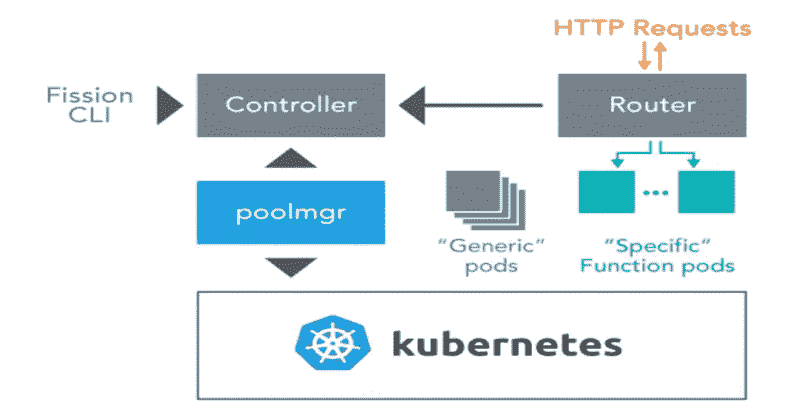

# 什么是无服务器——第 4 部分:裂变 Kubernetes 的开源无服务器框架

> 原文：<https://medium.com/hackernoon/what-is-serverless-part-4-fission-an-open-source-serverless-framework-for-kubernetes-7f025517774a>

这是一个由 5 部分组成的博客系列。参见[第一部分](https://platform9.com/blog/what-is-serverless-and-what-it-means-for-you-part-1/)、[第二部分](https://platform9.com/blog/what-is-serverless-part-2-challenges-and-considerations-for-choosing-the-right-serverless-solution/)和[第三部分](https://platform9.com/blog/what-is-serverless-part-3-kubernetes-and-serverless/)。

裂变是一个用于无服务器功能的 Kubernetes 原生开源框架。有了这个免费的功能即服务(FaaS)解决方案，开发人员可以轻松地编码、部署和操作无服务器应用程序，这些应用程序从一开始就是生产就绪的——而无需了解任何关于 Kubernetes 的知识。它还允许 It 运营人员在自己的后院(在任何基础架构上)实现类似 Lambda 的体验(来自 AWS 的无服务器服务),而没有锁定风险或产生额外的云成本。

由 Platform9 和 Kubernetes 社区中的其他贡献者构建，裂变专注于开发人员生产力和加速价值实现。裂变使开发人员能够编写高效、可移植和高性能的无服务器应用程序，这些应用程序可以在任何 Kubernetes 集群上即时运行——无论是在本地还是在云中。

# 无服务器开发人员工作流程:

1.  开发人员很容易用任何语言编写短命的函数
2.  将它们映射到触发器(消息队列、计时器、HTTP 请求或其他事件触发器)
3.  这些功能可以立即部署到 Kubernetes 集群上——无需构建容器，无需管理 Docker 注册中心。
4.  当一个事件触发该函数时，它会随所需的底层基础设施一起被实例化。
5.  当函数空闲了一段时间(可配置的)后，就会释放资源。

# 裂变架构:

裂变建筑

1.  裂变被设计成一组微服务。控制器跟踪功能、HTTP 路由、事件触发器和环境图像。池管理器(poolmgr)管理空闲环境容器的池，将函数加载到这些容器中，并在它们空闲时终止函数实例。路由器接收 HTTP 请求，并将它们路由到函数实例，如果需要，从池管理器请求一个实例。
2.  控制器服务于裂变 API。所有其他组件都监视控制器的更新。路由器被公开为负载平衡器或节点端口类型的 Kubernetes 服务，这取决于 Kubernetes 集群所在的位置。当路由器收到一个请求时，它会在缓存中查找这个请求是否已经有了它应该路由到的服务。如果没有，它将查找请求映射到的函数，并向 poolmgr 请求一个实例。poolmgr 有一个空闲 pod 池；它选择一个，将函数装入其中(通过向 pod 中的 sidecar 容器发送请求)，并将 pod 的地址返回给路由器。路由器通过代理将请求发送到此 pod。pod 被缓存起来以供后续请求使用，如果它闲置了几分钟，就会被终止。
3.  裂变支持在任何 Kubernetes 集群上轻松部署无服务器功能。函数执行逻辑上离散的短期任务，可用于部署简单的应用程序。
4.  利用无服务器范例开发更复杂的应用程序需要组合交互的无服务器功能。这通常是一个复杂而耗时的过程。裂变工作流可以轻松编排一系列无服务器功能来创建应用程序，从而显著加快无服务器应用程序的创建。
5.  工作流通过定义一系列任务、决策和循环，提供了一种集成和组合无服务器功能的优雅方式。函数可以按顺序或并行组合。一个函数的输出可以发送到另一个函数的输入，“if”语句、循环，甚至是对其他函数进行操作的函数。
6.  通过 Fluentd 和 InfluxDB 支持裂变日志记录。裂变使用一个 Fluentd 配置，使它从任何裂变荚源日志，并把它们放在一个数据库 InfluxDB。得益于 InfluxDB，用户默认情况下不需要安装整个 ELK 栈，而且它是轻量级的，部署起来也很简单。您可以从裂变 CLI 查询日志，“裂变功能日志–名称…”。
7.  通过 Prometheus 支持监控，显示函数调用计数、错误计数、调用持续时间、(直方图)调用开销、响应大小、冷启动、函数存活时间等指标。

# 要了解更多关于裂变的知识，并安装开源框架亲自试用，请访问[https://fission.io/](https://fission.io/)

在本系列的最后一部分，我们将回顾常见类型的无服务器应用程序的参考体系结构，以及如何从一些非常适合无服务器功能的用例开始。