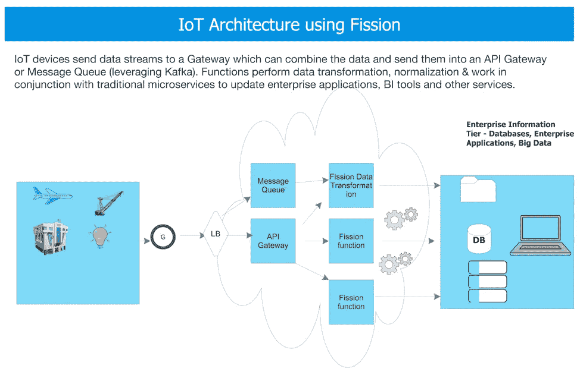
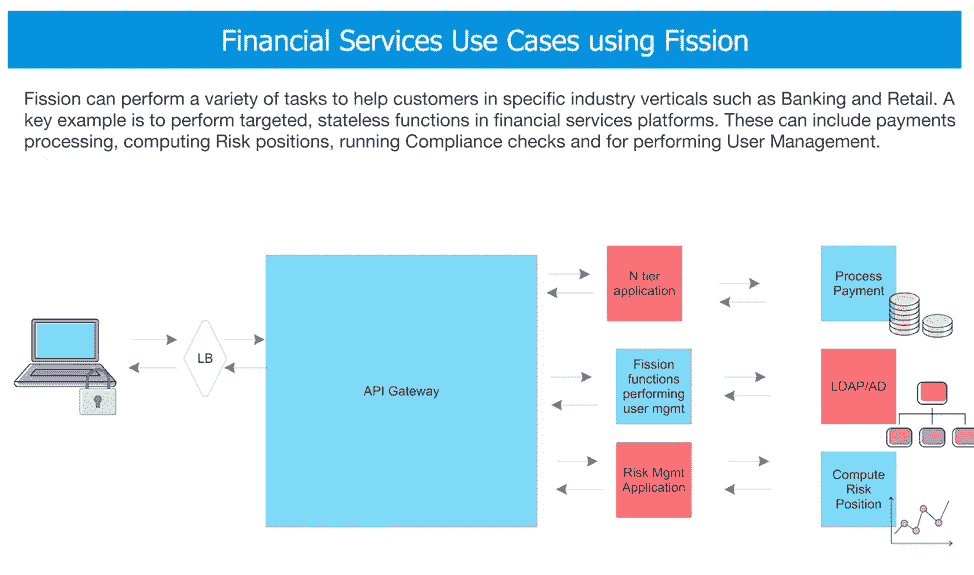
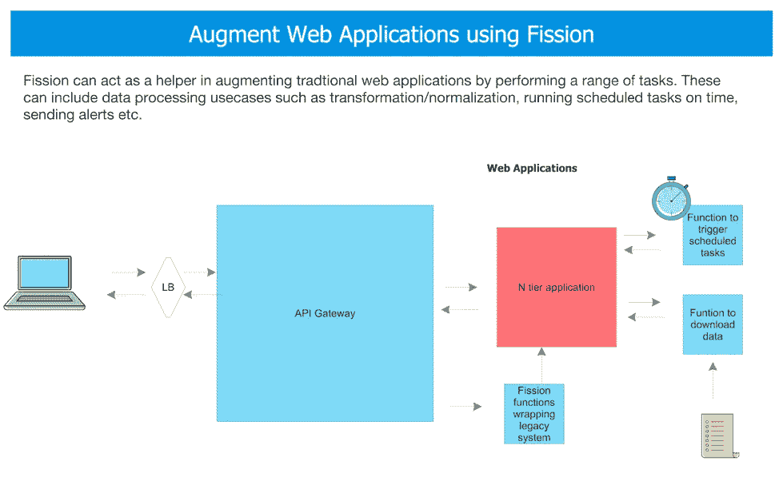
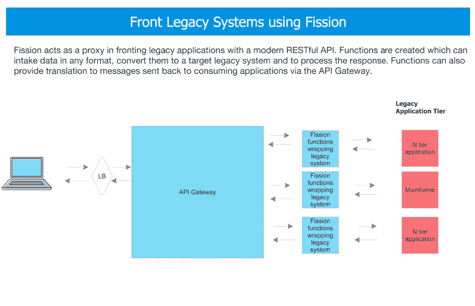
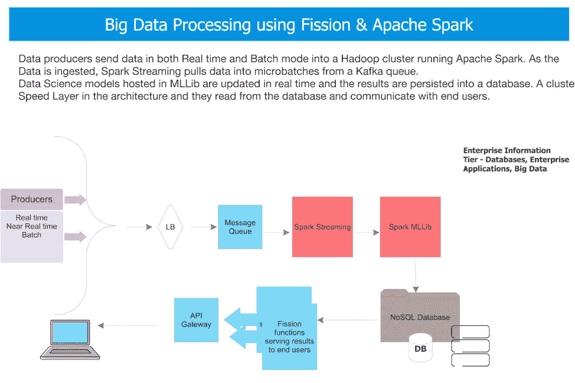

# 什么是无服务器—第 5 部分:常见类型无服务器应用程序的参考架构

> 原文：<https://medium.com/hackernoon/what-is-serverless-part-5-reference-architectures-for-common-types-of-serverless-applications-6b184b65dceb>

这是 5 部分博客系列的最后一部分。参见[第一部分](https://platform9.com/blog/what-is-serverless-and-what-it-means-for-you-part-1/)、[第二部分](https://platform9.com/blog/what-is-serverless-part-2-challenges-and-considerations-for-choosing-the-right-serverless-solution/)、[第三部分](https://platform9.com/blog/what-is-serverless-part-3-kubernetes-and-serverless/)和[第四部分](https://platform9.com/blog/what-is-serverless-part-4-fission-an-open-source-serverless-framework-for-kubernetes/)。

就其核心而言，无服务器功能就是在一个容器内运行纯粹的业务逻辑或“功能”。这些函数可以是对业务应用程序有意义的任何东西。一些常见的例子包括:

*   支付处理
*   警报—向安全运营控制台发送警报
*   流处理—用客户信息丰富消息
*   做信用检查
*   提交保险索赔

无服务器功能的常见使用案例包括关键行业，例如:

1.  电力和公用事业—截取和分析流数据，以执行需求预测、设备可靠性管理等。
2.  石油和天然气行业—使用无服务器进行测井分析，以提供油井的单一视图
3.  广告——根据移动和在线用户的浏览历史、位置和购买者特征，为他们提供即时和相关的优惠。
4.  金融服务，如银行和交易应用程序，其中用户数据的各个方面实时填充到客户门户中。
5.  医疗保健—例如，健康管理数据的打印

让我们研究一些常见行业用例的设计模式，看看无服务器如何帮助您加速关键事件驱动应用程序的创新和软件交付。我们将使用开源[裂变无服务器框架](https://fission.io/)来说明这些架构，因为它是最灵活的，并且不局限于特定的云提供商或相关服务，因此您的应用程序可以在任何地方运行。您也可以将裂变与您选择的任何无服务器/云产品互换！

# 参考架构#1:物联网(IoT)

通常在物联网中，从工业互联网到可穿戴设备，再到智能汽车，一组自主物理设备，如传感器、执行器、智能电器和可穿戴设备，收集各种类型的数据，并使用 IP 协议与数据中心(云/内部)中运行的应用程序进行通信。通常，大量数据使用网关进行聚合，然后发送到一个平台，该平台可以分析所有这些变量以获得各种业务洞察(性能、趋势、触发事件等)。)

物联网应用中的整体流程可以使用裂变进行编排:

*   使用网关将数据聚集起来，然后发送到在 Kubernetes 托管 pods 上运行的 Kafka 服务器集群上运行的各种消息队列中
*   基于整个管道流调用裂变函数:
*   对于放在消息队列中的给定文件，文件的内容被传递给一个裂变函数，该函数首先对其进行规范化，提取感兴趣的变量，然后将输出发送到 NoSQL 数据库或文件系统。
*   第二个函数将运行，以响应放置在 NoSQL 数据库中的规范化文件。它将读取文件的内容，根据需要(基于用例)执行计算，然后调用微服务来执行功能，例如将数据发送到数据湖或数据集市进行进一步分析。
*   可以为事件流中的任何类型的处理动作编写裂变函数。FaaS 可根据数据量的变化按需扩展或缩小。

无服务器应用——物联网用例的参考架构

# 参考架构#2:金融服务(支付处理、风险计算等。)

在金融服务行业，支付处理、合规性检查和风险指标等关键任务可以使用基于裂变的无服务器架构进行实时计算。

*   财务应用程序中的整个流程可以使用裂变进行编排:开发人员将裂变功能作为共享功能部署到多个应用程序中，这些应用程序是各种支付处理网关的前端。这些应用程序处理用户认证、注册和支付相关数据的收集。这些系统还在后端与记录交易数据的各种数据库接口。
*   创建裂变函数来解析具有以下变量的给定输入数据流:用户的信用卡数据、交易地点、任何其他人口统计信息等。

1.  第一个函数可以调用欺诈检测 API，并根据检查结果将数据保存到内存数据网格中。
2.  当检查通过或失败时，调用第二组函数。如果支票已通过，该函数将批准付款并向用户发送确认消息。
3.  如果怀疑支付是欺诈性的，则调用另一个函数，向后端的欺诈检测系统发出警报。

无服务器应用—金融服务使用案例的参考体系结构

# 参考架构#3: Web 应用增强

绝大多数企业应用程序都是三层 web 应用程序。从新客户入职，到与执行一系列业务任务和技术任务(如备份、报告、警报、数据丰富)的各种后台职能部门进行沟通，这些工作无所不包。)

一种新兴的模式是让无服务器的裂变功能来处理这些任务，而不影响单片 n 层应用程序的复杂开发和部署方法。

web 应用程序增强的整个流程可以使用裂变来编排:

*   业务用户继续与(遗留)应用程序交互，但是可以利用裂变功能提供的增强功能
*   如图所示，为一系列计算和数据处理任务创建函数
*   主应用程序在需要的时候触发这些功能
*   专用功能执行所描述的适当逻辑，并且如果需要的话“向应用报告”。

这可以被视为一种将现有遗留应用逐步重构或分解/增强为微服务的方式，或者轻松添加不依赖于“母船”开发和发布流程的附加功能。

无服务器应用 Web 应用使用案例的参考架构

# 参考架构#4:使遗留系统现代化

大型机、N 层应用程序等遗留系统非常普遍，并且深深扎根于银行、保险、零售等行业。通常情况下，简单地淘汰和替换这些系统是不可能的(由于复杂性、业务依赖性、重新设计需要的时间，以及这些遗留系统仍然运行良好并具有成熟的使用模式的事实。)为了确保与现代接口(如 web 服务和移动应用程序)的互操作性，裂变函数可以在这些系统周围提供基于标准的 API 包装器。

例如:

*   请求被发送到 API 网关，该网关执行基本的转换，并根据请求的端点根据需要调用裂变函数
*   函数接收输入数据(例如 JSON)并将其转换成终端系统可以处理的格式，然后调用(遗留)业务系统
*   一旦系统做出响应，函数就可以获取响应并将其转换为源系统能够理解的格式，然后使用适当的响应调用 API 网关。

无服务器应用——传统应用现代化的参考架构

# 参考架构#5:使用 Apache Spark 的机器学习和深度学习

在各行各业，我们看到应用程序越来越多地将机器学习(ML)功能融入业务流程和大数据。从欺诈检测、客户行为和管道分析、虚拟现实、对话界面、聊天机器人、消费趋势、视频/面部识别等等——似乎 ML(和 AI)无处不在。

对于大多数公司来说，ML 和预测分析计划通常局限于组织内的特定项目。为了实现 ML 的真正价值，跨应用程序共享数据、学习、算法和模型是有利的。裂变与 Apache Spark 等技术相结合，使您能够提供流处理和趋势预测的数据，供各种最终用户/应用程序使用。

机器学习应用程序的整体流程可以使用裂变和 Apache Spark 进行编排:

*   来自业务运营的数据被实时接收到一个基于 Kafka 的消息队列集群中。
*   Spark Streaming 用于微批量接收这些数据，通常基于时间窗口。这些数据存储在一个数据湖中进行批量分析，并发送到存储不同预测模型的 Spark MlLib 运行时。
*   这些模型基于 Spark 上运行的通用 ML 算法。这些包括监督和非监督算法，例如聚类、分类算法等。
*   一旦模型的结果被写入 NoSQL 数据库或内存中的数据网格，裂变功能就会被触发。
*   这些功能实现了一系列业务关键功能。例如:更新业务分析仪表板、发送实时客户报价和提醒客户代理。

无服务器应用—机器学习和大数据应用的参考架构

# 结论

无服务器拥有巨大的行业份额，是继 Kubernetes 之后最热门的趋势。然而，与其他转型技术一样，围绕锁定、可扩展性和生态系统集成仍存在重大问题。[开源无服务器解决方案](https://fission.io/)使用高度灵活、先进且基于标准的 FaaS 平台，帮助垂直行业解决其紧迫的业务挑战，该平台可在任何地方运行——内部和任何公共云上。