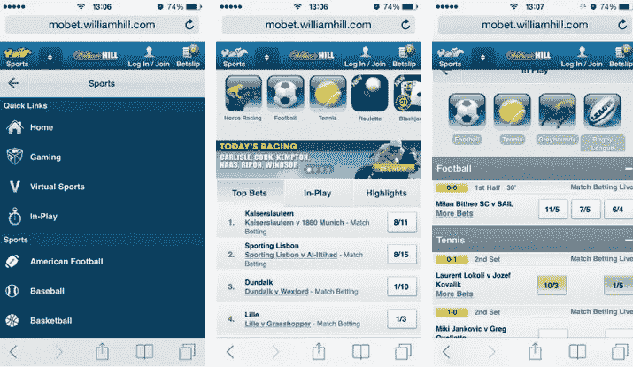
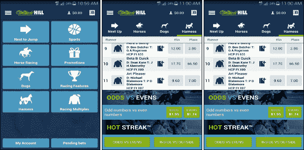

# 开发一个像威廉希尔这样的体育博彩 App 的成本是多少

> 原文：<https://medium.com/hackernoon/what-is-the-cost-to-develop-a-sports-betting-app-like-william-hill-9abbed2f8ce>

在现代应用程序时代，事情正在以超乎寻常的速度变化。技术正试图开发每一个可能的资源，通过这些资源来娱乐和吸引用户。是的，当我们谈论技术可能性时，没有什么是不可触及的。

在今天的时间里，无论是远离家乡，还是外出旅游，都无关紧要。科技应用程序不会让你错过世界各地发生的任何事情。

> 同样，博彩移动应用程序是为那些你可以随时随地下注、赢取奖励和兑现的人准备的。

几年前，很难找到像博彩 app 这样的 App。为了成为游戏的一部分，赌徒们必须访问网站来下注，并且必须通过棘手的步骤。

此外，大多数博彩网站没有太多东西提供给用户。赌徒们不得不找到一家向他们提供基本功能来下注的当地博彩公司的日子已经一去不复返了。

用户不再需要寻找庄家，让他们下注。有许多顶级的应用程序开发公司已经赞助赌博网站所有者推出他们自己的应用程序。这些应用嵌入了用户友好的功能，允许用户在旅途中下注。

# **简介**威廉希尔**……**

> [**威廉希尔**](https://mobet.williamhill.com/) **是澳大利亚的体育博彩平台，邀请来自全球的赌客。**

各种体育赛事、比赛和联赛的博彩都通过这个平台进行，这是一种新的尝试。该公司为用户提供了一个移动应用程序，通过提供惊人的功能和奖励来激发用户的热情。

## **特点……**

赌博文化常青。因此要让游戏和赌客与时间并行，技术就在这里。随着时间的推移，体育和博彩应用的发展赋予了用户更多权利。

> 随着更先进的赌博功能，一个应用程序正在创建一个公共平台，而用户正在移动。此外，该应用程序在许多国家转播了这场比赛。

并为所有智能手机用户创造了一扇开放的大门。具有许多功能的博彩应用程序邀请更多的用户对他们最喜欢的球队、运动、球员和事件下注。

***您可以要求您的应用程序开发团队在您的博彩应用程序版本中融入的关键功能。***

让我们来谈谈移动应用程序开发公司开发者可以在其博彩应用程序中包含的功能。用户在使用该应用程序后，获得了从未有过的体验。

博彩应用的流行功能包括游戏中的赌注、比赛日程、体育新闻和博彩趋势。除了不同运动和场景的安全支付网关赔率，游戏直播等等。

## 代表所提供功能的用户体验…

**交互式简单用户界面**

**流线型导航**

**宁静投注流程**

**流媒体直播**

**在线比赛日程**

**促销推送消息**

**不同语言规定**

**1。交互式简单用户界面**

该应用程序最好的部分是它的设计非常有吸引力，易于使用。此外，设计元素之间没有争论。适当的投注类别、体育赛事和比赛有助于用户确定要遵循的选项和程序。

**2。流线型导航**

作为一名用户，尽管有超过 50 个运动类别可供下注，但你还是希望只需点击几下鼠标就能导航到你想要的应用程序屏幕。威廉·希尔毫不费力地做到了。

> 每项运动旁边都有独特的图标。因此，用户可以快速选择运动来探索所有活动的和即将到来的赌注。

**3。宁静的投注过程**

该应用程序允许用户在游戏过程中下注。授权的实时分数和跳空赔率使投注过程更具互动性和认可性。

这种现场比赛的方式为赌徒创造了越来越多的刺激和乐趣。

**4。直播流**

这个功能是必不可少的，因为它可以让你观看现场比赛。因此，实况游戏流特征显示实时比分。更新的数据始终可供用户使用。

**5。在线比赛日程**

当前/即将到来的联赛和锦标赛的时间表可以随时随地查看。除此之外，你还可以提醒正在进行的比赛，这是你在任何情况下都不想错过的。

6。促销推送消息

对于用户来说，这一功能创建了一个多任务平台，用户可以在这个平台上接收相关优惠的应用提醒。在推送消息的形式中，诱人的赔率和更多的促销内容说服用户在一段时间后返回应用程序。

7。不同语言条款

要注册全球各地的用户，此功能可帮助用户使用他们的母语使用应用程序。因此，用户发现使用该应用程序很容易，最终随着时间的推移提升了用户体验。

# **开发像 William Hill 这样的博彩应用程序的成本**

基于不同的当今移动操作系统，质量得以保持。因此，用户在使用它时不会遇到麻烦。创建一个高端博彩应用程序的开发成本在 35，000 美元到 40，000 美元之间。

应用程序开发公司可以相应地估计他们的比例，包括应用程序开发人员、设计师和程序员。成本可能会有所不同，但这并不意味着应用程序的质量或性能也会有所不同。 [Quytech](http://www.quytech.com/mobile-application-development.php) 为您解答关于威廉希尔等[移动体育博彩](https://www.quytech.com/game-development-company.php)应用的疑问。