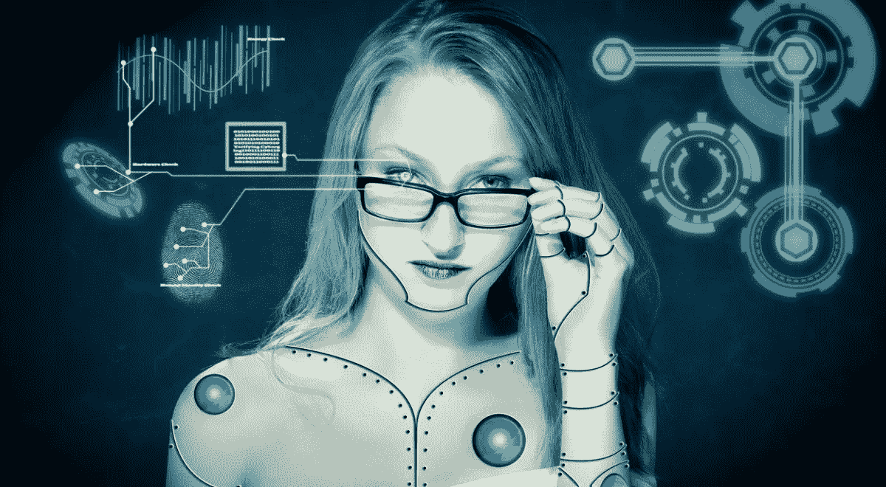

# 机器学习和人类学习有什么区别？

> 原文：<https://medium.com/hackernoon/what-is-the-difference-between-machine-learning-and-human-learning-53119c217194>

人类和机器学习都会产生知识——但两者之间有很大的不同。

学习是获取新的或强化现有知识、行为、技能或价值观的行为。工程师兼心理学家[彼得·鲁丁在《奇点 2030](https://singularity2030.ch/thoughts-on-human-learning-vs-machine-learning/) 中说，人类有学习的能力，然而随着人工智能的进步，机器学习已经成为一种可以增强甚至取代人类学习的资源。

# 人类学习与机器学习

鲁丁认为，人类和机器学习都会产生知识，一种存在于大脑中，另一种存在于机器中。但是这真的是两者之间唯一的*差异吗？更重要的是，我们如何应用哪种知识，如何平衡这些知识资源以获得最佳结果？*

机器学习已经成为人工智能研究的一个快速增长的子集。模拟人脑功能的所谓神经网络软件的应用，加上低成本大规模计算硬件资源的可用性，为解决迄今为止依赖人脑能力的问题提供了机会。庞大的数据池(大数据)包括医疗或金融信息、图片库或关于客户行为的信息，仅举几例，这些数据池通过各种高度复杂的算法进行处理，无需传统编程即可产生数字知识。

# 机器学习:人类智能的强大延伸

人脑不像电脑，电脑也不像人脑。尽管计算机可以执行“神经网络”过程，但它们受到大脑神经元的启发，但不是自组织和自适应的。此外，机器学习——教会计算机以没有明确编程的方式行动——无法取代人类学习。

事实证明，就记忆知识、理解和领会而言，基于机器的知识远远超过人脑的能力。因此，人类倾向于越来越依赖于基于机器的知识，其额外的优势是没有保留问题，因为这种知识总是可以“在线”获得。

一旦我们提高到更具挑战性的能力，如应用知识、抽象和问题分析，人类和机器学习知识的结合代表了各种业务领域的最新发展。

# 消费者行为数据和分析

机器学习在大数据分析中的一个有趣应用是由一家名为 BehaviourExchange 的初创公司开发的。他们使用数十亿次记录的在线互动创建了数百万个用户档案，例如，电子营销人员可以根据特定用户的兴趣实时调整网站内容。他们的系统能够理解网络访问者的人口统计和心理特征，以及他们的短期和长期情绪。毫无疑问，这是机器学习、大数据和人类智能的最先进组合，给了我们一个数字未来的暗示。

> 在他们的网站上找到更多关于[行为交换](http://behaviour.exchange/)的信息！