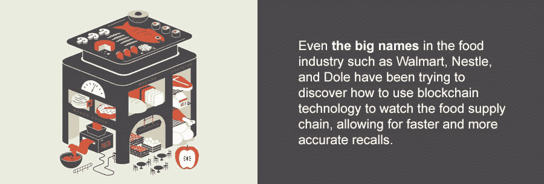
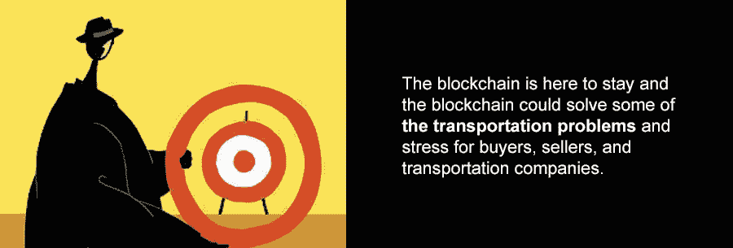

# 区块链在的时候，全球贸易和运输的未来是什么样的？

> 原文：<https://medium.com/hackernoon/what-is-the-future-of-global-trade-and-transportation-while-the-blockchain-is-here-68c49b1b0094>

区块链的影响力已经遍及金融、医疗、媒体、政府和其他几个部门。比特币是在没有任何正式控制或治理的情况下维护分散的公共账本的第一次尝试，从那以后，出现了其他类似的协议，用于解决其他问题，如全球贸易行业的问题。

所有不同类型的交易都有一个共同的主要特征，那就是*运输*。那是因为它是买卖双方的纽带。这是将买方和所购货物联系在一起的渠道，也是卖方交付货物的媒介。运输甚至可以被认为是贸易的支柱。

# 全球范围内的运输行业

运输业在全球范围内负责将人、动物和货物从一个地方运送到另一个地方。它可以通过陆地、空中或海上运输，这个行业拥有[最大的网络之一](https://en.m.wikipedia.org/wiki/Transport)，其中包括各种各样的组织，如旅游航空公司、铁路、邮轮、市政运输公司、货运铁路、货运卡车、航空和快递服务。这些公司可能在特定公司内部或国际范围内发货。

多年来，运输业的最新发展改变了我们的生活方式。在早期，人们用马、驴和其他动物来移动到不同的地方和运输货物。人造船只被用来在海上和大洋之间进行探索和贸易，由于道路运输带来的困难和危险，大多数人定居在离海岸最近的地区。早在 17 世纪，水运就被用来将产品运送到不同的港口。在 19 世纪，[铁路在美国各地修建](https://www.loc.gov/collections/railroad-maps-1828-to-1900/articles-and-essays/history-of-railroads-and-maps/the-beginnings-of-american-railroads-and-mapping/)，这实际上导致了美国更多地区的开发和人口的增加，甚至更多来自美国其他地区的货物相对容易地被运送到这些地区。随着汽车和飞机的出现，运输业在 20 世纪进一步发展。

# 运输业的现状:问题和挑战

最近，运输行业一直面临着几个挑战，其中许多挑战总是与监管环境的持续变化有关。美国运输研究所在 2015 年 10 月发布了一份报告，[列出了](http://dickinsonfleet.com/toptrucking-10-industry-concerns/)卡车运输业面临的十大问题。前三名(按顺序)是服务时间规定、合规、安全、责任(CSA)计划和司机短缺。

[智能交通系统](http://www.unece.org/trans/theme_its.html)正在逐渐改变全球的交通运输行业，这些技术为安全、效率和环境成果的改善提供了一些最佳前景。政府和全球监管机构将面临挑战，以跟上这一技术变革的步伐，并确保交通法规或其他壁垒不会阻碍新技术或商业模式的采用。例如，我们已经看到[遥控飞机(或“无人机”)的使用迅速增加，](https://zslpublications.onlinelibrary.wiley.com/doi/full/10.1002/rse2.75)它们正被用于越来越多的民用目的，包括航空摄影、搜索和救援以及农作物喷洒。

# 明智投资，支持交通运输行业的经济增长

理解交通运输与经济发展之间的关系，以及投资交通基础设施的原因和时机，是政府面临的一个关键挑战。交通运输在支持经济增长方面有着重要的作用。作为一个国家，我们依靠国际航空和海运来连接我们和全球市场。我们需要避免对国际货运设置不必要的监管壁垒，并确保国家政策鼓励我们的港口顺利运营。

虽然交通投资在历史上一直是经济增长的驱动力，但当经济发展时，当一个国家建立必要的交通系统来支持现代经济时，这种好处就很明显了。一旦这些网络到位，重点就转移到降低沿这些路线做生意的成本(解决瓶颈)，以保持相对的经济竞争力。

连接地区和其他市场的交通投资可以产生双向效应。新的联系可以促进一个地区经济活动的发展，也可以将现有的经济活动从该地区转移出去。

# 区块链呈现的未来

关于解决运输问题的方法，必须详细解释的一个重要现象是区块链。区块链为用户提供了一个加密的、分散的、防篡改的账本，运输公司可以使用这个账本。区块链还为跟踪公司提供了空间，他们将在包裹通过的每个检查站验证包裹是否已经到达。区块链使腐败官员无法伪造文件，因为有了区块链，可以追溯步骤，知道哪里出了问题。这也有助于减少跟踪货物所需的必要文书工作。

*   **区块链意味着改进的货运跟踪**
    需求[增加](https://transportgeography.org/?page_id=5277)消费者的期望也是如此。它总是在增加。为此，商业运输公司不得不加紧满足不断增长的需求。这是因为贸易和运输是相辅相成的。这就是他们必须创新的原因。许多运输公司已经对跟踪技术进行了投资。运输公司总是需要经过认证的安全数据，以帮助他们不断改善运营。目前使用的系统容易受到曲解和操纵，这显然会对全球供应链产生不利影响。在区块链技术的帮助下，目前正在经历的问题不会以目前的程度存在。通过利用区块链进行数据认证，整个网络必须提供和验证数据，以使其不再遭受篡改。跟踪信息可靠性的提高也会对所购买的商品产生影响。
*   **有效的车队或车辆性能跟踪**
    跟踪的重要性不仅限于性能交付。它对于车队中的单个车辆性能也是有用的。例如，如果一个人应该购买一辆二手车，区块链将有助于验证车辆以前的性能及其维护方面的信息。
*   **利用物联网进行车对车通信**
    区块链和互联网可以形成一个不可阻挡的组合，这将有助于提高卡车运输业的效力和效率。车辆之间的通信让位于多辆货运车辆组成车队，并加强通信，从而提高燃料效率和安全性。
*   **让负载板更可靠**
    许多运输公司[总是在寻找负载板](https://www.teamrunsmart.com/articles/business-smart/february-2018/load-board-lookout)，因为数据经常被弄乱或重复，这提供了不可靠和不相关的需求表示。托运人现在可以邮寄已经打上时间戳、记录和验证的货物。有了这个特性，负载就不会重复，数据也不会丢失其完整性。这也消除了运输中对中间人的需求。
*   **区块链有助于降低成本，也消除了中间商**
    区块链有助于降低货运行业的成本，因为区块链下的任务是自动执行的，只有在满足特定条件时才会执行。区块链有助于削减不必要的管理成本，并消除所有可能发生的错误。

# 区块链公司

许多公司已经在研究区块链接管的可能性。新生公司、大公司，甚至那些与物流和航运无关的公司都在认真考虑区块链。即使是食品行业的知名企业，如沃尔玛、雀巢和都乐，也一直在试图探索如何利用区块链技术来监控食品供应链，从而实现更快、更准确的召回。

区块链[下有许多平台](http://radiostud.io/eight-blockchain-platforms-comparison/)，这些平台的引入是为了减少或消除当前运输公司面临的劣势。这些平台已经到位，以降低成本，停止盗窃，或将其降至最低限度，减少运输过程中发生的文书工作和违规行为。能够有效做到这一点的平台是 [CargoCoin](https://thecargocoin.com/) 。

CargoCoin 引入的新技术旨在简化和消除官僚作风。该项目从通过权力下放改革全球贸易和运输的角度运作。作为一个在线平台，它将贸易和运输的实体世界与区块链联系起来。它在参与国际贸易和运输的各方之间起着桥梁的作用，帮助他们交换货物信息，满足他们的运输需求，并提供补充服务。它也足以作为记录从报价到交付的交易过程的电子手段，并且它还可以用于促进支付。CargoCoin 是一个独特的想法，可以将 19 世纪的贸易世界投射到未来。

CargoCoin 将基于最新的 ERC223 令牌标准，而不是 ERC20 标准。ERC233 允许对智能合同进行更高级、更精确和更通用的处理(准确地说是项目所需要的)，同时避免潜在的令牌陷阱。

当航运业达到最大规模时，它会有一个延伸。集装箱、散货、散货、液体散货、陆路运输(卡车、铁路)、航空运输和其他类型的“新时代”运输，如管道运输、太空货运、城际和外城共乘，允许无限的功能。这将在全球范围内的商品和货物贸易商与所有运输工具之间形成一种协同作用。目前，CargoCoin 正在开展国际海运贸易。随着区块链在全球海洋运输和贸易中的引入，可以实现革命性的发展，这些变化将为全球贸易和运输注入新的活力。

其他与运输和全球贸易行业相关的区块链技术包括一些主要的行业参与者，他们最近深入研究了一些项目，这些项目将有助于测试区块链在众多航运交易中的使用。广受欢迎的丹麦航运公司马士基最近与 IBM 合作，测试一种基于区块链的跟踪货运的方法。

除了 IBM 和 Maersk 之外，其他公司也利用区块链来监控和保护钻石等贵重资产。这类公司的一个例子是总部位于伦敦的创业公司 [Everledger](https://www.crunchbase.com/organization/blocktrace) 。一个由韩国企业组成的财团[已经利用这项技术](https://www.forbes.com/sites/elaineramirez/2017/08/09/dayli-icon-blockchain-south-korea/)追踪大麻集装箱，从装运登记到货物交付。另一个区块链技术平台是 [Webjet](https://www.webjet.co.nz/) 。Webjet 是一个在线旅游门户网站，开发区块链解决方案，允许有效跟踪和交易酒店空房库存，并公平地将支付路由到参与填补最后一分钟空缺的中间商网站网络。

还有其他大量从事零售服务的区块链平台:

Loyyal —这是一个总部位于区块链的通用忠诚度框架，旨在允许消费者以新的方式组合和交易忠诚度奖励，并允许零售商提供更复杂的忠诚度套餐。

[Blockpoint.io](https://www.linkedin.com/company/blockpoint.io) —该平台允许零售商围绕比特币等区块链货币建立支付系统，以及区块链衍生的礼品卡和忠诚度计划。

# 结论

区块链的好处遍及所有行业。从上面可以看出，它在运输和全球贸易行业有很多革命性的好处，包括有效的车辆性能跟踪、削减成本，并且它还消除了中间商。很明显，全球贸易和运输将因权力下放而改变。区块链将继续存在，而区块链可以为买家、卖家和运输公司解决一些运输问题和压力。

## 关于作者:

基里尔·希洛夫——geek forge . io 和 Howtotoken.com 的创始人。采访全球 10，000 名顶尖专家，他们揭示了通往技术奇点的道路上最大的问题。加入我的**# 10k QA challenge:**[geek forge 公式](https://formula.geekforge.io/)。