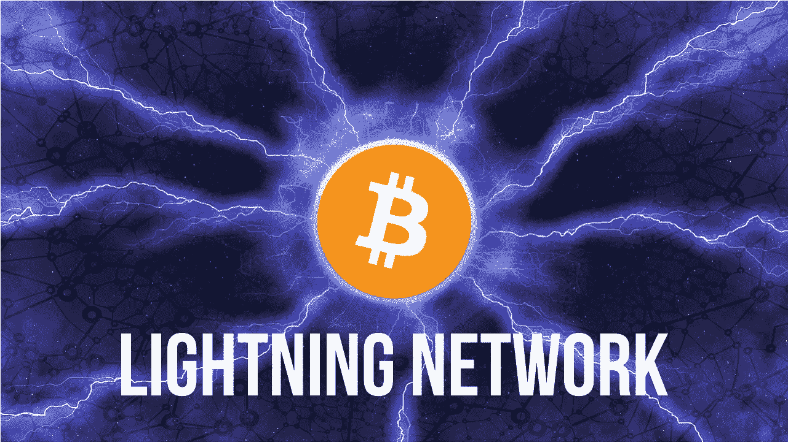

# 闪电网是什么，会对比特币和莱特币产生怎样的影响？

> 原文：<https://medium.com/hackernoon/what-is-the-lightning-network-and-how-will-it-affect-bitcoin-and-litecoin-2d8a667c3a03>

## 闪电网络有一些“令人震惊”的好处

闪电网络承诺为比特币提供即时支付、低交易费用和跨链交易。

一些人认为这将对莱特币等加密货币产生负面影响，因为速度和低成本被视为莱特币的竞争优势。

在本帖中，我们将看看使用闪电网络技术的比特币如何影响莱特币，但在此之前，我们需要了解闪电网络本身以及比特币和莱特币作为货币的功能。

## 闪电网络概述

首先，闪电网络不仅仅是比特币的专利，莱特币是第一批激活这项新技术的加密货币之一。

闪电网络是一项技术升级，可能允许即时交易以及即时微交易，即时交易将使用智能合同。是的，你没看错，智能合约可能会降临比特币。

一旦闪电网络实现，比特币的交易费用将大幅降低，我们可以几乎即时交易(在我写这篇文章的时候，比特币交易平均需要 24 分钟才能完成)。

## 比特币如何作为一种货币发挥作用

对于那些说比特币由于供应量有限只能用作价值储存手段的人来说，他们可能忘记了比特币就像美元(USD /$)、欧元(EUR/€)或英镑(GBP /)一样可以分割。

美元有美分，欧元也有美分，英镑有便士。你不需要一整美元来购买任何东西，你甚至可以使用少至 1 美分或多达 100 万美元，同样的原则也适用于比特币。

一个比特币可以分为“satoshi”，一个比特币中有 100，000，000 个 satoshi(或“sats”)，162 个 Satoshi 目前价值约 1 美分(0.00000100 BTC)。

## 微交易

目前，一笔比特币交易将花费你 0.15 美元至 3.17 美元，由于 162 个 Satoshi 仅相当于 1 美分多一点，微交易目前是不可能的，闪电网络旨在改变这种情况。

**注:**自 2017 年 12 月起，费用高达 7 至 30 美元，但截至 2018 年 2 月，由于网络交易减少，费用有所降低。

## 即时交易

闪电网络不会要求矿工验证交易(由于智能合同)，交易将离线进行，比特币区块链将在交易完成后记录交易。

从这个过程中去除中间人(比特币矿工)将真正使比特币零售做好准备，你可以用 16,213 satoshis(在我写这篇文章的时候大约是 1 美元)买一条糖果。

交易会立即发生，费用比你支付的要少得多(可能是几分之一，这只是基于以前研究的理论)。

## 这将如何影响莱特币

莱特币是首批实现闪电网络技术和原子互换的加密货币之一，原子互换具有类似的技术，但用于即时交换莱特币和其他加密货币。

比特币区块链上的闪电网络技术实际上可以帮助莱特币和其他比特币相关的加密货币(**注:**莱特币是从比特币核心客户端分叉出来的)。

首先，莱特币原子互换技术将使莱特币能够在任何接受比特币的地方使用。

例如，想象一下，如果法定货币拥有原子互换技术，这将意味着在纽约的英国人不必将英镑兑换成美元，他将使用英镑支付，英镑将立即兑换成美元，反之亦然。

这里有一个使用 LTC/BTC 的例子，假设你只有莱特币，遇到一个只接受比特币的小咖啡馆，没问题，你只需使用原子互换将你的莱特币转换成比特币，然后你就可以买咖啡了！

闪电网络将真正释放比特币作为货币的潜力，比特币将不仅仅主要用作价值储存手段，你注意到去年(2017 年)许多大企业如微软和赛百味开始接受比特币作为支付方式了吗？尤其是自从闪电网络谣言开始。人们开始做好准备。

如果成功，闪电网络将增加比特币在全球的采用，这反过来也会增加莱特币的采用。

**我希望这篇文章对你有所帮助，请随意查看下面一些有用的资源:**

有了 [**账本硬件钱包**](https://www.ledgerwallet.com/r/4c54) **，你可以让你的加密货币安全无虞。**

你可以使用 [**CEX**](https://cex.io/r/0/up106280379/0/) 在世界任何地方购买比特币、以太坊、Ripple、比特币现金、比特币黄金、Dash、Zcash 和恒星流明

您可以使用 [**Coinmama**](https://www.coinmama.com/?ref=cryptonite) 从世界任何地方购买比特币、以太币、Cardano、Qtum、莱特币或以太币经典

你也可以在 [**Twitter**](https://twitter.com/CryptoniteTweet) **上关注我。**