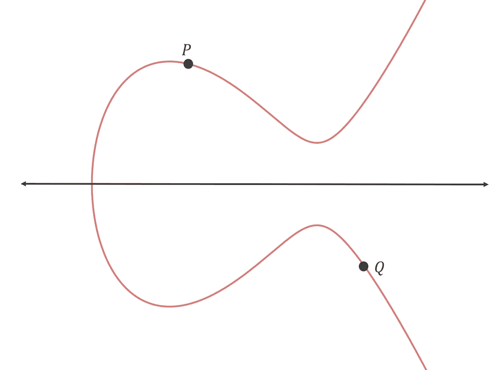
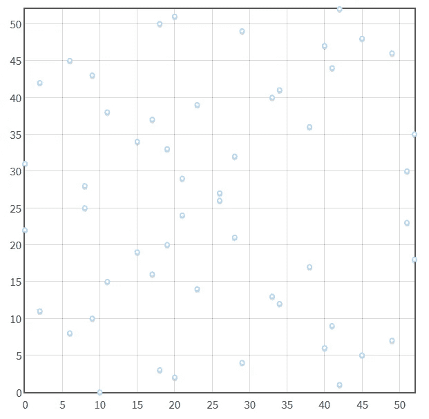

# 椭圆曲线加密背后的数学原理是什么？

> 原文：<https://medium.com/hackernoon/what-is-the-math-behind-elliptic-curve-cryptography-f61b25253da3>


# 介绍

有人给你寄比特币，就是把比特币寄到你的地址。如果你想花掉寄到你地址的比特币，你可以创建一个交易，并指定你的比特币应该去哪里。这样的交易可能看起来像:

```
Transfer 5 bitcoin from 1A1zP1eP5QGefi2DMPTfTL5SLmv7DivfNa (your address) to 12c6DSiU4Rq3P4ZxziKxzrL5LmMBrzjrJX (the recipient address).
```

当然，任何人都可以创建一个看起来像上面这样的交易，所以如果它被添加到区块链，那么不管你喜欢与否，你都会损失 30，000 多美元。幸运的是，这样的交易不属于区块链，因为它缺少有效的数字签名。通过添加数字签名，可以证明您知道地址 1a 1 ZP 1 EP 5 qgefi 2 dmptftl 5 SLM V7 div fn 对应的私钥。如果你不知道相应的私钥，那么你可能不应该告诉人们通过那个地址给你发送比特币，因为你无法花费任何发送到那里的比特币！

当您为自己创建比特币地址(或任何其他加密货币的地址/账户)时，您首先生成私钥。从私钥，你计算相应的公钥，并通过散列公钥，你得到你的地址。希望您不能先选择一个地址，然后再从中确定私钥，否则您可以使用相同的方法确定任何地址的私钥。Satoshi 的地址是什么？

## 公钥密码学

公钥、私钥和数字签名构成了公钥加密的基本组成部分。无论使用什么数学基础来实现公钥密码系统，它都必须满足以下条件，至少对于我们的目的来说是这样:

1.  导出对应于给定公钥的私钥在计算上是不可行的。
2.  有可能证明一个人知道对应于公钥的私钥，而在此过程中不泄露关于私钥的任何有用信息。此外，这种证明可以通过需要验证特定消息的方式来构建。这样，证据就形成了该消息的数字签名。

实现公钥加密的一种方法是使用椭圆曲线。另一种方法是 RSA，它围绕着质数。大多数加密货币——包括比特币和以太坊——都使用椭圆曲线，因为 256 位椭圆曲线私钥与 3072 位 RSA 私钥一样安全。较小的密钥更易于管理和使用。

# 椭圆曲线加密

什么是椭圆曲线？椭圆曲线由满足以下形式的方程的所有点组成:

y = x +ax+b

其中 4a +27b ≠ 0(这是避免[奇点](http://mathworld.wolfram.com/SingularPoint.html)所需要的)。

以下是一些椭圆曲线示例:


注意上面所有的椭圆曲线都是关于 x 轴对称的。这对于每条椭圆曲线都是正确的，因为椭圆曲线的方程是:

y = x +ax+b

如果你取两边的平方根，你会得到:

y = √x +ax+b

所以如果 a=27，b=2，你代入 x=2，你会得到 y= 8，从而得到点(2，-8)和(2，8)。

比特币、以太坊和许多其他加密货币使用的椭圆曲线称为 secp256k1。secp256k1 曲线的方程式为 y = x +7。这条曲线看起来像:


Satoshi 为[选择了 secp256k1 没有特别的原因](https://bitcointalk.org/index.php?topic=2699.msg37328#msg37328)。

## 点加法

你知道怎么把两个数相加得到第三个数吗？您可以将椭圆曲线上的两个点相加，得到曲线上的第三个点。

要将椭圆曲线上的两点相加，首先要找到通过这两点的直线。然后确定该直线与曲线在第三点的交点。然后你将第三个点反射到 x 轴上(例如，将 y 坐标乘以-1 ),你得到的任何点都是前两个点相加的结果。

让我们来看一个例子。假设您想将以下两点加在一起:



首先，你找到穿过两点的线:


然后你找到曲线上与直线相交的第三点:


然后你在 x 轴上反射这个点:


因此，P+Q=R。

为了正确地实现椭圆曲线加密，我们在曲线上指定一个基点，并且只将该点添加到自身，而不是将任意两个点相加。

例如，假设我们有以下以 P 为基点的曲线:


最初，我们有 P，或 1p。

现在让我们把 P 加上它本身。首先我们要找到穿过 P 和 P 的那条线的方程，这样的线有无穷多条！在这种特殊情况下，我们选择切线。


现在我们找到这条线相交的“第三”点，并将其反射到 x 轴上。


因此，P 加上自身，或 P+P，等于 2p。

如果我们再次将 P 加到自身上，我们将计算 P 加到自身上，或者 P+P+P。结果将是 3p。为了计算 3p，我们可以将 P 和 2p 加在一起。


我们可以继续把 P 加到它本身来计算 4p 和 5p 等等。

secp256k1 曲线使用的基点具有以下 x 和 y 坐标:

x 坐标:5506626302227734366957871889516853432625060345377594175500187360389116729240

y 坐标:
2267051002075816978083085，13050704，18441，2735383，3804，2844，2755，3757，3748，2845，2845

在上面的例子中，使用了一个不同的基点，这样所有的点添加操作都适合一个小窗口。

## 加速点加法

计算 10p 需要多少步？看起来需要九个步骤，因为 10p 是

P+P+P+P+P+P+P+P+P+P+P

这需要九个点加法运算。

原来只需要四个步骤就可以计算出 10p。这是因为以下属性适用于点加法:

NP+RP =(n+r)P

例如:

4p+6p =(4+6)P = 10p

因此，快速计算 10p 的方法如下:

P+P = 2p

2p+2p = 4p

4p+4p = 8p

2p+8p = 10p

这仅需要四次点加法运算。

计算 x P 需要多少步，其中 x 是一个随机的 256 位整数？在这种情况下，x 的范围可以是从 0 到 1.1579209e+77。

事实证明，计算 x P 永远不会需要 510 次以上的加法运算。原因如下。首先，计算以下系列:

2⁰•P，2p，2p，2p，2⁴•P，2⁵•P，2⁶•P，…，2 ⁵⁵•P.

你可以用 255 个点的加法运算来计算上面的数列，因为有 256 个点，把当前点加到它本身就可以从一个点得到下一个点。这是因为 2^n•P+2^n•P = 2^(n+1)•P.给出了第一点 2⁰•P。2⁰•P=1•P=P.

下一步是求 x 的二进制展开式，比如 x 是 246，二进制展开式就是 2⁷ + 2⁶ + 2⁵ + 2⁴ +2 + 2 = 246。然后我们把 x 的二进制展开式乘以 p:2⁷•P+2⁶•p+2⁵•p+2⁴•p+2p+2p .然后我们简单地把所有这些点加在一起得到 246 p .我们不必计算单独的点 2p，2p，…，2⁷•p，因为我们前面已经计算过了。

最多 x 的二进制扩展将包含 256 个元素(2⁰高达 2 个⁵⁵)，因此我们将永远不必将超过 256 个点相加在一起，因此，第二步将需要最多 255 个点加法运算。因此，计算 x P 最多需要 255+255=510 次加法运算。

# 椭圆曲线密码中的私钥和公钥

假设我计算 XP，其中 x 是一个随机的 256 位整数。结果将是曲线上的某个点。让我们称之为 x 点。

如果我给你 X，你能确定 X 吗？换句话说，你能确定我把 P 加了多少次才能得到曲线上的点 X 吗？假设你知道 P 是什么，也知道我用的是什么曲线。

事实证明，即使你有一台超级计算机，你也不可能算出 x。没有已知的算法来确定 x，因此您唯一的选择是继续将 p 与自身相加，直到得到 x，或者继续从 x 中减去 p，直到得到 p。平均而言，x 将介于 0 和 2 ⁵⁶-1 之间，约为 2 ⁸.因此，不管你用什么方法，平均要用 2 次⁸点加法运算来确定 x。即使你的计算机每秒能做一万亿次点加法运算，而且你从宇宙开始就一直在运行你的计算机，你现在也只能做 2⁹⁸点加法运算。2⁹⁸/2 ⁸ =1/1073741824.

如果从中间开始呢？你可以在 510 步或更少的时间内计算出 2 个⁸•P。平均来说，x 与 2 ⁸的距离并不比与 0 或 2 ⁵⁶-1 的距离更近，因为 x 是随机的，所以从哪里开始并不重要——平均来说，你仍然需要做 2 次⁸点加法运算。

## 私钥和公钥

所以，因为有人无法求出给定 X 的 X，其中 X = x，所以让 X 成为你的私钥，X 成为你的公钥可能会比较方便。你的私钥将是一个随机的 256 位整数，而你的公钥将是椭圆曲线上一个点的 x 和 y 坐标。这将满足私钥和公钥的以下属性:

"从计算上推导出对应于给定公钥的私钥是不可行的."

此外，虽然我们还没有讨论这一点，但向某人证明你知道 X，而不透露任何关于 X 的有用信息是可能的。也就是说，你可以向某人展示你知道你必须将 P 加到它本身多少次才能得到 X，而不直接告诉他们 X 是什么。

# 更新椭圆曲线模型

在我们开始向某人证明你知道 x 之前，我们应该更新我们的椭圆曲线模型。

我们当前模型的一个问题是，XP 可能导致一个点的 x 和 y 坐标不能存储在标准的 512 位公钥中。x 或 y 坐标可能太长。

解决方法是在有限域上定义我们的椭圆曲线。基本上，我们将确保只有整数点，并且一个点的坐标可以达到多大是有限制的。

为此，我们进行了转型

y = x +ax+b

到

y mod p = (x + ax + b) mod p

其中 p 是某个质数(p 是质数，以确保加法和乘法运算总是可以撤消)。

在 secp256k1 中，p 是小于 2 ⁵⁶.的最大素数

我们的椭圆曲线现在看起来像这样:



请注意，仍然有一条对称的水平线。

那么，当你把两个点加在一起，这两个点之间的线在与第三个点相交之前超出了界限，会发生什么呢？你把线绕在边界上！


在上图中，你可以看到将 P 和 Q 相加需要将 P 和 Q 之间的线环绕边界几次。

尽管我们的模型发生了这些变化，我们到目前为止所讨论的一切仍然适用。

# 如何证明自己认识 x

那么如果你计算 X = x，其中 X 是一个随机的 256 位整数，你如何向某人证明你知道 X 对应的 X，而不泄露任何关于 X 的有用信息呢？

您可以使用前面的点加法属性:

NP+RP =(n+r)P

我们将稍微修改一下:

hash(m，RP)NP+RP =(hash(m，RP)* n+r)P

如果你展开上面等式的右边，你会得到左边，所以上面的等式对任何 m，r 和 n 都成立。

如果我们设 NP = X 会发生什么？我们将有:

哈希(m，RP)X+RP =(哈希(m，RP)* n+r)P

如果 NP = X，则 n=x，因此我们有:

hash(m，RP)X+RP =(hash(m，RP)* X+r)

现在我们要做如下替换:R = r，s=hash(m，R)*x+r。

所以现在我们有:

hash(m，R)X+R = sp

好了，这里是主张:如果你能提供一个满足上式的 m，R，s，那么这就证明你知道了方程中 X 对应的 X，其中 XP = X。

为此，必须满足以下两个条件:

1.  如果你知道 x，那么你应该能够提供 m，R 和 s 的工作值。
2.  如果你不知道 x，那么你应该不能提供 m，R 和 s 的工作值。

如果您知道 X，您可以清楚地得出 m、R 和 s 的工作值。为 m 和 R 选择随机值，然后计算 R = r 和 s=hash(m)*x+r。如果您将这些值代入 hash(m，R)X+R = sp，则您会得到:

hash(m，RP)XP+RP =(hash(m，RP)* x+r)P

这是我们之前说过的方程，适用于任何 m，r 和 n(在这种情况下 x 是 n)。

不知道 x 怎么办？你能给出 m、R 和 s 的工作值吗？问题是，您必须求解 hash(m，R)X+R = sp。基本上，您必须为具有特定哈希值的哈希找到一个输入，这是不可能的，或者至少在计算上是不可行的，因为加密哈希函数的[原像抵抗属性](https://en.wikipedia.org/wiki/Preimage_attack)。

因此，提供 m、R 和 s 的工作值的唯一方法是使用 X 来计算它们。因此，您可以通过提供满足 hash(m，R)X+R = sp 的 m、R 和 s 的值来证明您知道与公钥 X 一起使用的私钥 X。

## 你通过证明你认识 x 来透露任何关于 x 的有用信息吗？

如果你提供了 m、R 和 s 的工作值，你能从这些值中收集到任何关于 x 的有用信息吗？

m 和 R 与 x 无关，所以那些值不能揭示任何关于 x 的有用信息。

我们知道 s=hash(m，R)*x+r，有人能从 s 计算出 x 吗？

为此，他们必须求解 x=(s-r)/hash(m，R)。

因为他们不知道 R，他们不能从 s 计算 x。他们不能从 R = r(他们被给定 R)的事实中获得 R，因为这与确定 P 必须与自身相加多少次才能获得 R 是一样的，这与阻止某人从 x 确定 x 的计算不可行问题是一样的。

s 也不透露任何关于 x 的信息，比如“x 一定小于 yadda yadda”。如果 R 是随机生成的，我们允许 hash(m，R)*x+r 溢出，因此 R 可以是任何 256 位整数，那么 s 的值是完全随机的，这意味着 s 可以是任何 256 位整数。一个随机的 256 位整数可以告诉你相当于新西兰 GDP 的 x 值。

## 数字签名

m、R 和 s 可用于证明知道对应于 X 的 X，其中 X = x。验证证明需要将 m、R 和 s 插入 hash(m，R)X+R = sp。我们是否可以这样做，即验证成功需要特定的消息，以便证明(m、R 和 s)形成该消息的数字签名？是啊！

设 m 是特定消息，R 和 s 是该消息的数字签名。只有当特定消息 m 被插入到验证等式中时，验证过程才会成功。如果插入不同的 m 值，那么 hash(m，R)X+R = sp 的左侧将无法等于右侧，因为 s 是使用不同的消息计算的。

因此，通过提供 m 的数字签名 R 和 s，可以证明他们知道对应于特定消息 m 的公钥 X 的私钥 X。

对于加密货币，消息将是交易的未签名部分。如果您曾经研究过交易的数字签名，它通常是 R (R 是曲线上的一个点)的 x 坐标与 s (s 是一个看似随机的 256 位整数)连接在一起，经过编码并转换为十六进制。

# 结论

如果你想获得一个比特币地址或以太坊账户，你生成一个随机的 256 位整数 x，x 就是你的私钥。然后，使用 secp256k1 曲线的参数计算 X = x。x 将是你的公钥。您的公钥可以安全地给出，不能用来确定您的私钥。如果你散列你的公钥，你将获得你的地址。

当你想把比特币或者以太从你的地址发到另一个地址，你就创建了一个交易。您将 m 设置为该事务的无符号部分，并根据该 m 计算 R 和 s，然后将 R 和 s 附加到该事务。在您广播您的事务后，任何节点都能够验证 m(事务的未签名部分)、R 和 s 满足 hash(m，R)X+R = sp。这当然假设您也将 X 包括在您的事务中，因为您的公钥不能从您的地址中确定。对于以太坊，不是提供 X，而是提供 v，这允许我们从 R 和 s 中确定 X。

## 结束了

嗯，就这样结束了！如果你已经做到了这一步，并且理解了几乎所有的事情，那么恭喜你！如果你想要一个更高层次的椭圆曲线加密的解释(更数学)，那么看看这个[链接](http://andrea.corbellini.name/2015/05/17/elliptic-curve-cryptography-a-gentle-introduction/)。这是我的第一篇文章，如果有错误请告诉我，并留下反馈。

感谢阅读！