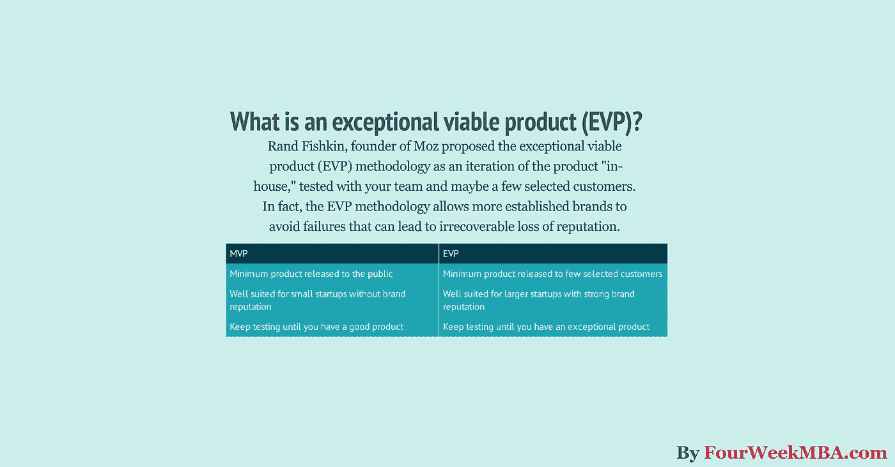

# 最低可行产品是什么？为什么要使用特别可行的产品呢

> 原文：<https://medium.com/hackernoon/what-is-the-minimum-viable-product-why-use-the-exceptional-viable-product-instead-346769e4dd49>

正如兰德·菲什金指出的那样:

> *我认为，偏向于执行副总裁，即“特别可行的产品”，是你首次公开发布的正确选择。*

Fishkin 建议创建一个 MVP，但在特殊情况下才发布。在那种情况下，你必须向公众发布。因此，卓越可行产品(EVP)方法需要产品“*”的内部迭代，“T5”与您的团队和一些选定的客户一起测试。*

只有当你确信产品是特别的，你才能向更广泛的受众推出。EVP 方法让更多的知名品牌避免失败，因为失败会导致不可挽回的声誉损失。

# 最低可行产品是什么？

相反，MVP“是一个新产品的版本，它允许一个团队以最少的努力收集关于客户的最大量的经验证的知识。”

这是一个通过[精益启动运动](https://fourweekmba.com/what-is-google-talk-to-books/)而成熟的概念，该运动产生了精益启动方法。虽然 MVP 开发方法已经帮助许多初创公司开发出了优秀的产品。

在整篇文章中，我们将会看到为什么这个定义经常会产生误导，以及何时以及为什么要使用特别可行的产品(EVP )!

# 精益创业运动的起源故事

这一切都始于 2013 年《HBR》的一篇文章，文章提到了商业世界的一个新现象“[为什么精益创业改变一切](https://fourweekmba.com/lean-startup-canvas/):”

几年前，连续创业者史蒂夫·布兰克(Steve Blank)已经注意到了商业世界中的一种新模式，他称之为[客户发展宣言](https://steveblank.com/2012/03/29/nail-the-customer-development-manifesto/)，它遵循 17 条原则。

这份宣言的出发点是对创业公司的定义，它遵循以下原则:

> ***创业公司是一种临时性组织，旨在寻找可重复、可扩展的商业模式***

我认为这个定义中有趣的部分是“ ***搜索*** ”部分。事实上，过去许多公司都是从一个预先包装好的商业模式开始的，他们可以将这种模式应用到他们的业务中以扩大规模。

在现实世界中，创业公司需要寻找商业模式。寻找商业模式的迭代过程与人类寻找意义的迭代过程一样艰难。

事实上，只有当一家初创公司找到了合适的商业模式，它才能释放长期价值。

[客户发展宣言](https://steveblank.com/2012/03/29/nail-the-customer-development-manifesto/)围绕 17 项原则展开:

1.  ***你的楼里面没有事实，所以拿到外面***
2.  ***将客户开发与敏捷开发结合起来***
3.  ***失败是寻找商业模式的组成部分***
4.  如果你害怕失败，你注定会失败
5.  ***迭代和支点由洞察力驱动***
6.  ***用实验验证你的假设***
7.  ***成功始于投资者和联合创始人的买入***

9.  *****不是所有的创业公司都一样*****
10.  *****创业指标与现有公司不同*****
11.  *****认同市场类型——它改变一切*****
12.  *****快速，无所畏惧的决策，循环时间，速度和节奏*****
13.  *****如果不是关于激情，你打开门的那一天就已经死了*****
14.  *****创业公司的头衔和功能与一家公司的*** 大相径庭**
15.  *****一边寻找一边保存现金。找到后，花费*****
16.  *****交流分享学习*****
17.  *****初创公司需要适应混乱和不确定性*****

**从那时起，该宣言成为了精益创业运动的起点:**

**这也带来了精益创业方法。**

# **简而言之，精益创业方法**

**简而言之，精益创业方法旨在为产品开发创建一个科学的、可重复的过程，允许创业公司快速生产和交付产品。换句话说，精益创业围绕三个阶段展开:**

**这个构建>测量>学习的过程需要一遍又一遍地重复，从而形成一个反馈循环。主要目的是最初提出一个最小可行产品(MVP)。事实上，这是精益创业模式的一个重要方面。**

# **什么是真正的 MVP？**

**正如 Eric Ries 指出的:**

> ***最小可行产品是一个新产品的版本，它允许一个团队以最少的努力收集关于客户的最大数量的有效知识。***

# **什么不是 MVP？**

**正如 [Ash Maurya](https://blog.leanstack.com/@ashmaurya?source=post_header_lockup) 所指出的，MVP 的定义被简化为“*你能构建的最小的东西，它能让你围绕构建/测量/学习循环***

**这种简化带来的缺陷和错误也会导致巨大的失败。事实上，更具体地说，Ash Maurya 将 MVP 定义为“你所能构建的交付客户价值的最小的东西(并且作为一种奖励，它可以收回一些价值)。”**

**这就是 Rand Fishkin 给出的非常可行的产品定义派上用场的地方，在某种程度上，它与 Ash Maurya 给出的更严格的 MVP 定义相联系。**

# **什么时候 MVP 才有意义？**

**如果你刚刚起步，你没有一个成熟的品牌，你的影响力有限，MVP 可能是一条路要走。这是因为失败的风险和品牌成本非常非常有限。**

**因此，从迭代中获取的值很高。如果你有一个成熟的品牌和广泛的影响力，这一切都会改变。**

# **为什么以及何时使用卓越可行的产品方法？**

**正如兰德·菲什金所指出的:**

> ***我的建议是，我们应该接受这样的现实:MVP 在某些情况下是理想的，但在其他情况下是有害的，各种规模的组织都应该考虑他们的市场、他们的竞争和他们的覆盖范围，然后再决定推出什么是“可行的”。我相信偏向于 EVP,“特别可行的产品”对于你的首次公开发布通常是正确的选择。***

**[兰德·菲什金](https://work.qz.com/1277369/the-lean-startup-methodology-will-kill-your-reputation-if-youre-not-careful/)还补充道:**

> **根据你的品牌的规模和影响范围，以及你将通过发布影响的客户和潜在客户，我建议你考虑一下，通过大量的测试、学习和迭代，向知道他们是测试版的更小的受众私下发布 MVP 是否是最好的途径。**

**换句话说，他考虑了两个主要变量。一方面，你得到了关注、顾客和福音。**

**另一方面，你有产品质量。关注度、客户基础和宣传能力越大，你就越需要在产品发布前拥有一个可靠的产品。**

**在 Rand Fishkin 看来，EVP 必须具备两个最基本的特征:**

*   **有体面的曝光率**
*   **并且真正令人印象深刻，至少在一个客户正在寻找的必备功能上**

**当他在 Moz 试图开发一个新工具来识别垃圾链接时，他学到了这个教训。正如[兰德·菲什金讲述的](https://www.linkedin.com/pulse/can-we-finally-stop-launching-minimum-viable-products-rand-fishkin/):**

> ***我们的研究已经揭示了顾客想要什么。他们想要一个包含所有 Google 抓取和索引的网站的网络索引，这样它就足够全面，可以发现所有潜在的危险链接。他们想要一个分数来明确地表明一个网站是否受到了谷歌的处罚。他们希望有一种简单的方法来知道哪些垃圾网站链接到他们(或网络上的任何其他网站)，这样他们就可以轻松地获取该列表，或者避免来自该列表的链接，或者通过否认文件将其导出并上传到谷歌搜索控制台，以防止谷歌惩罚他们。***
> 
> ***那将是一个* ***例外的*** *产品。***
> 
> ***但是我们没有足够的精力和带宽来打造卓越的产品，所以我们推出了一个 MVP，希望能够学习和迭代。我们认为有助于我们的客户和社区的东西总比没有好。***
> 
> **我认为这是我职业生涯中多次推出 MVP 的最大教训。有时候，有总比没有好。令人惊讶的是，事实往往并非如此。**

# **关键要点**

**精益创业运动和精益创业方法论为创业生态系统做出了重要贡献。精益创业方法的核心部分是 MVP。**

**因此，这是一种构建产品的科学方法，它允许初创企业创建一个反馈回路，以获得有价值的数据并拥有一个成品。**

**MVP 的定义经常被误解，这导致了许多失败。这就是为什么 Ash Maurya 喜欢 MVP 的严格定义，即建立“你能建立的交付客户价值的最小的东西(并作为奖金收回部分价值)。”**

**Moz.com 创始人兰德·菲什金也帮助我们以 EVP 为基础，用一种新的方式来定义一个可行的产品。**

**简而言之，他指出，虽然对于小型创业公司来说，建立 MVP 的风险较低。对于一个使用 MVP 方法的知名品牌来说，可能风险太大。**

**事实上，这往往会导致“有总比没有好”的综合症。兰德·菲什金以惨痛的代价吸取了教训。你可以通过采用 EVP 方法进行产品开发来避免这种失败。**

***原载于 2018 年 6 月 21 日*[*【fourweekmba.com】*](https://fourweekmba.com/minimum-viable-product-vs-exceptional-viable-product/)*。***