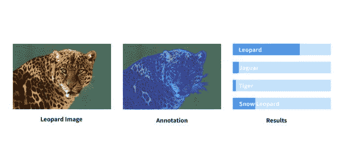
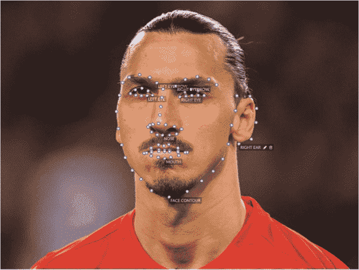

# 到底什么是训练数据？

> 原文：<https://medium.com/hackernoon/what-is-training-data-really-adf0b97a116c>

**这是** [**训练数据**](https://blog.playment.io/what-is-training-data/) **的简单定义。**

> 与人类相比，机器在处理和存储知识方面要快得多。但是如何利用它们的速度来创造智能机器呢？这个问题的答案是——让他们以相关数据为食。这也被称为 ***训练数据*** 。

机器学习模型与人类儿童没有太大区别。当一个孩子观察一个新的物体，比如说一只狗，并从它的环境中接收到持续的反馈，这个孩子就能够学习这个新的知识。

当机器看到足够多的相关数据时，它们也可以学习。利用这一点，你可以对算法进行建模，以发现关系、检测模式、理解复杂问题并做出决策。

最终，训练数据的质量、种类和数量决定了机器学习模型的成功。

训练数据的形式和内容通常被称为标记的或人工标记的数据或基础事实数据集，其被设计用于训练具有最终应用前景的特定 ML 模型。这里，从几个标记图像的例子来训练各种类型的计算机视觉模型。

1.  用于自动驾驶的车道检测

2.面部特征识别

3.像素级场景理解

# 为什么培训数据很重要？

训练数据只不过是您训练模型所需的丰富或标记的数据。您可能只需要收集更多的数据来提高模型的准确性。但是，使用你的数据的机会非常低，因为当你建立一个伟大的模型时，你需要大规模的训练数据。

公开可用的数据集是无组织的，语义上很难自动分类到非常专业的类中(晚上下雨？，穿足球服的球员？、图像的俯视图？)唯一的办法就是全部过一遍，手动选择。

# 如何收集训练数据？

而且，我们可以成为您旅途中的好伙伴，毕竟我们每天为一些世界上最具创新性的公司注释数百万张图片。无论是包围盒、点、语义分割还是任何种类的形状，我们都可以帮助您[收集高精度、高召回值的高质量训练数据](https://blog.playment.io/training-data-for-computer-vision/)。

你想让我们标记什么样的数据？这是我们做的一些用例，

[图像注释](https://playment.io/image-annotation)用于自动驾驶汽车、无人机、农业、卫星图像、视频监控和体育分析。

我们还支持所有图像注释类型，

1.  [2D 包围盒](https://playment.io/bounding-box-annotation-tool)
2.  [多边形分割](https://playment.io/polygonal-segmentation-tool)
3.  [3D 盒子/长方体](https://playment.io/3d-cuboids-annotation-tool)
4.  [线条标注](https://playment.io/line-annotation-tool)
5.  [地标/点标注](https://playment.io/landmark-annotation-tool)
6.  [语义分割](https://playment.io/semantic-segmentation-tool/)
7.  3D 点云注释。(即将推出，2018 年 4 月)

# 培训数据常见问题

# 什么是训练数据？

训练数据被标记为用于训练机器学习算法和提高准确性的数据。

# 什么是测试集？

每一个机器学习模型都需要在现实世界中进行测试，以衡量其预测的稳健程度。这是它从未见过的数据。就像学生在考试中遇到新问题一样，模特也需要接受类似的挑战，以评估她们的表现。

# 什么是验证数据？

在特定数据集上训练模型时，我们需要确保它不会过度适应该数据分布。因此，我们输入到模型中的带注释的数据被分成训练和验证数据。这确保了机器学习模型的学习在数据集上是通用的。

# 您应该如何将数据集分成测试集和训练集？

每个数据集的内容都是独一无二的。有了相当多的领域知识，人们应该决定如何将带注释的数据集分成训练和测试对。分割比例通常在 80:30*(或) ***75:25*** 左右，这取决于您希望测试模型性能的严格程度。*

# *训练数据多少才够？*

*每个领域都有不同的算法和不同种类的数据。但是，机器学习社区的普遍共识是[数据越多，你创建的健壮模型越好](https://blog.playment.io/training-data-machine-learning/)。*

# *如何获得免费的训练数据？*

*网上有很多领域可以找到训练数据集。许多研究小组还与社区的其他人分享他们收集的[标记的图像数据集](https://blog.playment.io/self-driving-car-datasets-semantic-segmentation/),以促进特定方向的机器学习研究。*

# *训练数据和大数据有什么区别？*

*随着技术的广泛采用，现在收集大量数据变得相对容易。数据在数量、种类和准确性方面的巨大变化被社区称为 ***大数据*** 。一旦您注释并丰富了这些数据，就可以将其用作算法的训练数据。*

# *机器学习中训练数据和测试数据的区别*

*训练数据，正如我们上面提到的，是用来教授 AI 模型(或)机器学习算法的标记数据。然而，[测试数据集](https://machinelearningmastery.com/difference-test-validation-datasets/)是用于提供最终模型拟合训练数据集的无偏评估的数据样本。*

* [## 训练数据-黑客正午

### 阅读黑客午间关于训练数据的写作。黑客如何开始他们的下午？

hackernoon.com](https://hackernoon.com/tagged/training-data)*