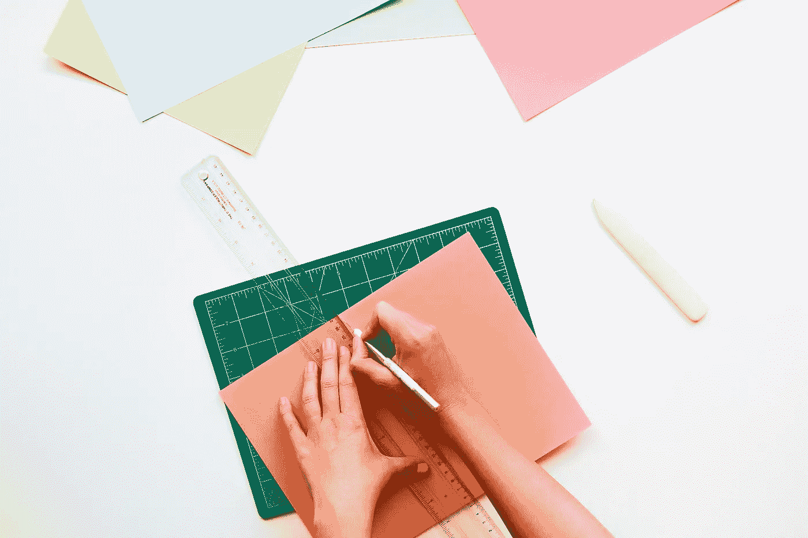
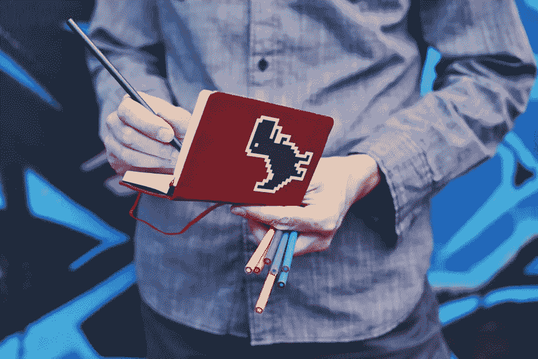
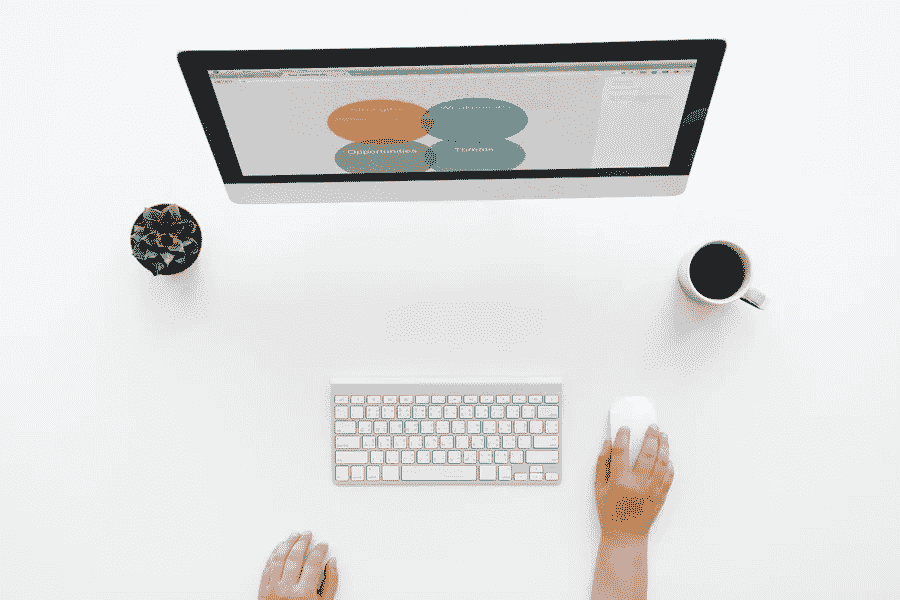

# 什么是用户界面和 UX 设计？

> 原文：<https://medium.com/hackernoon/what-is-ui-ux-design-1f01e9dbbf02>

设计是一个广泛的学科，并不局限于平面设计。当有人说“我是一名设计师”时，他们每天实际上在做什么并不能立即清楚。有许多责任支柱共同支撑着设计。

设计相关的角色存在于一系列领域，即平面设计、纺织品设计、室内设计、时装设计、陶瓷设计、印刷设计等等。随着最近专注于创建屏幕界面的科技公司的涌入，许多新的设计角色出现了。

像 UX 开发人员或用户界面设计师这样的职位已经成为设计角色的未来。它的含义甚至对于来自其他行业的设计师来说也是陌生的。

# 分离 UI UX

UX 设计是指用户体验设计，而 UI 设计代表用户界面设计。这两者对于一个 IT 产品来说都是至关重要的，需要紧密合作。尽管这些角色是彼此不可或缺的一部分，但它们本身却大不相同，涉及不同的流程。

# UX 是用户体验

[UX 设计](http://blog.tripin.co.in/what-is-ui-ux-design/)仍然是一个相对较新的领域，许多公司刚刚意识到，如果他们想成功吸引和留住客户，他们需要有人在他们的工资单上。

部分困惑可能在于这个名字:UX 设计。对许多人来说，“设计”这个词与创造力、色彩和图形联系在一起，而实际上它的真正定义在于功能，以及为用户提供无缝体验的产品制造过程。

UX 设计师的工作一开始可能会显得很神秘("*等等，你不做图形？*))而令人费解。(“为什么新来的设计师要面试人？”)

知道谁是目标客户，以及如何让他们对你的产品有最大的收获或“愉快”的体验，是 UX 设计团队的责任。因此，“功能性”、“可用性”和“用户适应性”在产品中的优先级很高。

UX 的设计师通常专注于数字产品的开发，但理论和过程可以应用于任何事情:

## 战略和背景:

*   竞争对手分析
*   客户分析
*   产品结构/战略
*   内容开发

## 线框和原型制作:

*   线框化
*   样机研究
*   测试/迭代
*   发展规划

## 执行和分析

*   与 UI UX 设计师协调
*   与[开发人员的协调](http://blog.tripin.co.in/app-development-cost/)
*   跟踪目标和整合
*   分析和迭代

所以，一部分是营销人员，一部分是设计师，一部分是项目经理；UX 的角色是复杂的，具有挑战性和多面性的。你可以看到，与分析或测试相关的产品迭代确实被提到了两次。但实际上，你会把它放在列表中的每一项之间。最终目标是通过一个测试和完善的过程将业务目标和用户需求联系起来，以满足双方的需求。

# UI 是用户界面

> 用户界面就像一个笑话。如果非要解释的话，也没那么好。

我们都知道飞机可以从驾驶舱里驾驶。驾驶它的 UX 就在那里，但是控件的排列方式并不直观——它有一个复杂的用户界面。

创建一个优秀的 UI 是一个挑战，尤其是因为它必须是直观的。

当在一项研究中被问及人们喜欢三星手机还是苹果手机时，大多数人都表示喜欢苹果。尽管这两个品牌都有相同的手机产品体验，但人们还是更喜欢其中一个，为什么呢？

对于为什么他们更喜欢苹果手机的问题，他们的回答是一致和直接的:“*我发现苹果手机更直观。*

面试官的回答:“*有意思——你能给我一些更直观的具体例子吗？*

随着这个问题，他们的喜悦变成了震惊和恐惧，仿佛在说“*当然，苹果更直观——你怎么敢质疑！*”

从这一点来看，他们会努力想出某种答案，从"*它就是*"到"*它就是工作*"到"*它更简单*"到"*苹果应用程序有更一致的外观和感觉。*

苹果的用户界面嵌入 UX 非常好，甚至感觉不到它就在那里。UI 越无缝，产品的感觉就越直观。

UI 设计师的工作包括以下内容:

## 外观和感觉:

*   客户分析
*   设计研究
*   品牌和图形开发
*   用户指南/故事情节

## 响应性和交互性:

*   用户界面原型
*   交互性和动画
*   适应所有设备屏幕尺寸
*   与开发人员一起实施

用户界面设计师让技术变得简单直观，便于人们使用。用户界面设计师在用户与产品直接交互的领域工作。

> 一些看起来很棒但很难使用的东西是伟大的用户界面和可怜的 UX 的典范。而一些非常有用但看起来很糟糕的东西是伟大的 UX 和糟糕的用户界面的典型。

仔细想想，从用户的角度来看，上面外行人的理解并不完全正确。如果 UI 或 UX 中的任何一个很差，用户会感觉是劣质产品。这意味着，用户界面和 UX 需要的不仅仅是各自的伟大。只有当它们无缝融合在一起时，这两者中的任何一个，甚至产品，才会变得伟大。

给我们发电子邮件或简单地访问 tripin.co.in 为您的用户界面和 UX 的要求。