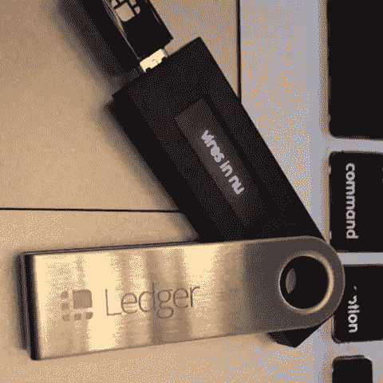
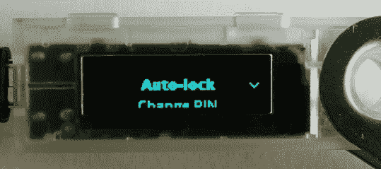
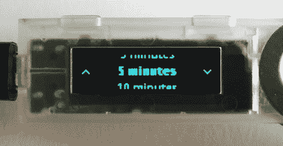

# 莱杰纳米公司的“数字权限”信息

> 原文：<https://medium.com/hackernoon/what-is-vires-in-numeris-ledger-nano-s-e6173fd12b73>

今天，在使用账本 nano s 的时候——在我离开账本 Nano S 几分钟后，我震惊地看到了这条可怕的消息，当时我正在确认一笔交易。消息水平滚动着，上面写着“ ***权限在数字***

那是我的反应！！！！

> 那是因为我把“病毒”这个词解释成了“病毒”，开始在脑子里编疯狂的故事。然而，没什么可担心的

这句话是拉丁文短语，意思是“ ***数字中的力量*** ”，也是比特币的口号。当您的设备处于 ***自动锁定模式*** 时，会显示此消息。

按下两个按钮退出待机模式。

如果您不想再看到此消息，您可以按照以下步骤关闭自动锁定模式

该功能仅在运行 1.3.1 固件和更新固件的 Nano S 上可用。

“Vires in Numeris” message scrolling on Ledger Nano S

如果自动锁定功能被激活，您的 Nano S 将在您可以选择的延迟时间(1、3、5 或 10 分钟)后进入待机模式。然后，每次您的 Nano S 在选定的延迟时间内连接且未使用时，它将运行待机模式。当您想再次使用您的设备时，您必须同时按下这两个按钮并重新输入您的 PIN 码。

1.  打开 Nano S 的“设置”
2.  选择“安全”
3.  选择“自动锁定”

滚动选择您喜欢的延迟，并按下两个按钮进行确认，如果您不想设置此模式，请选择关闭

如果这篇文章让你感到宽慰，请鼓掌并分享。

*关注我的*[*medium*](/@vvkr)*和*[*Twitter*](http://twitter.com/confusedcoin)*了解更多关于加密货币、区块链和网络/移动产品 UI/UX 的资讯文章*

> 披露:本文基于[Ledger Nano FAQ](https://ledger.zendesk.com/hc/en-us/articles/115005165589--Vires-in-numeris-message)和一些 reddit 帖子上提供的信息。对我有用——它仅用于信息和教育目的。我不对你的资金的任何影响或损失负责。