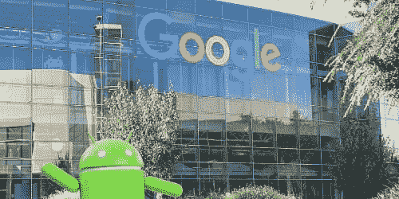

# 在谷歌获得代码审查认证需要什么

> 原文：<https://medium.com/hackernoon/what-it-takes-to-get-certified-to-review-code-at-google-b3ee12314ffe>

许多 PullRequest 代码评审员都有在大型科技公司工作的经历，比如脸书、亚马逊或网飞。下面的问题&与我们的一位评审员一起描述了他们在谷歌获得“代码可读性”评审证书的途径

## 谷歌的代码审查是如何工作的？

为了在 Google 将 JavaScript 推向生产，你需要一个具有 JS 可读性的代码审查员来审查和批准代码。可读性是一种内部认证，表明你理解谷歌的编码风格和特定语言的最佳实践。每一个 CL[变更清单]都必须由该语言可读性强的工程师编写或审核。句号。

我们的团队没有具有可读性的评审员，所以我们总是需要让其他团队代表我们评审代码。作为一个硬性要求，这阻碍了我们推进变更，并损害了整体速度。

为了解决这个瓶颈，我们的技术领导和我开始了获得 JS 可读性的过程，这就像经历一种“代码审查代码审查”

## 什么是“代码评审”

为了申请 JS 可读性，工程师们将 CLs 提交给一个可读性审查小组，他们仔细检查代码。只有在你已经证明你理解了谷歌的风格指南和最佳实践之后，一个指定的审查者才能对代码进行评论和批准。

## 获得 Google code reviewer 认证是什么感觉？

我提交了一个有角度的组件来制作一个内部工具的日历。它回来的时候到处都是红墨水。每一件小事，从常量上面需要多少空格，到在函数声明中去掉多余的空格。在我经历之后，通往可读性的道路很快就改变了。现在已经不是单个 CL 而是几个不同 CL 的评论了。所以现在，当你经历这个过程，做更多的质量检查时，你就完成了 100%。虽然，如果你做了一个糟糕的 CL 回顾，你实际上可以减少你的完成百分比。

## 评审者指出的细节与常规的代码评审有什么不同？

与传统的代码审查不同，可读性过程是一次被指派的可读性审查者没有保留任何东西的过程。每一件可能被指出的小事，都会被指出来。但最终，经历可读性过程使我成为一名更好的程序员和代码评审员。

当我得到正式批准在谷歌审查和批准任何 JavaScript 时，对每个人来说都是值得骄傲的一天。我收到了团队中每个人的祝贺邮件，因为他们知道通往 JS 可读性的道路是多么漫长和具有挑战性。

## 在 Google 评审完代码后在 PullRequest 做代码评审是什么感觉？

对谷歌合适的不一定对每个团队都合适。在我通往 JS 可读性的道路上，我学到了很多关于代码审查过程以及为什么可读代码如此重要的知识。当我为其他团队评审代码时，我会牢记这些经验教训的精神，并尽可能地关注积极和建设性。

[*今天就注册 PullRequest*](https://www.pullrequest.com/?utm_source=hackernoon.com&utm_medium=referral) *，获得专业评审人员的代码评审，帮助您提高代码质量。*

*原载于 2018 年 11 月 7 日*[*www.pullrequest.com*](https://www.pullrequest.com/blog/google-code-review-readability-certification/?utm_source=hackernoon.com&utm_medium=referral&utm_campaign=codereviewcert)*。*