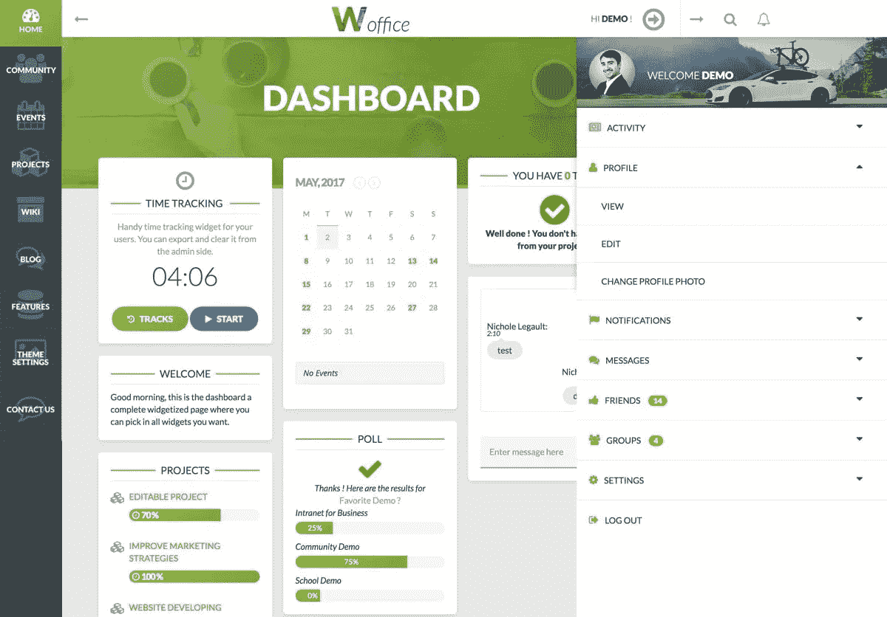

# 如何发展一个 7K+客户的主题

> 原文：<https://medium.com/hackernoon/what-it-takes-to-grow-a-7k-customers-wordpress-theme-cc94030fba3d>

在这篇文章中，我将尽可能地与你分享我们是如何将 Woffice.io 作为领先的内联网/外联网 WordPress 主题的。

对于任何想知道 WordPress 如何作为内部网解决方案的人来说，答案是:简单、容易、流畅和可靠。事实上，您可以在不到 10 分钟的时间内设置好它，让您的组织开始运转，无论其规模如何！它主要给出了自我托管的好处(虽然我们也可以提供托管)，因此**数据属于你！** [欲了解更多详情，请查看本文。](https://alka-web.com/blog/how-to-easily-build-an-intranet-with-wordpress/)

Woffice dashboard

# 找到你的利基市场

WordPress 主题开发是一个疯狂的、饱和的和淹没的市场，这就是为什么你必须在开始任何工作之前找到你的利基。

这项研究工作是关于追踪那些不太拥挤的类别，寻找下一个大“东西”，调查你现有的客户群，并从中得出结论。

我并不是说这很简单，但它应该可以帮助你摆脱困境。底线？不要采取任何鲁莽的行动，先想一想。

一旦你有了想法，找到你的竞争者，尝试他们的软件，并写下什么有效，什么无效。然后，您将能够开发您的关键功能，并建立您的 USP。

对于 Woffice 来说，它可以归结为市场上第一个提供可定制仪表板的内部网，包括小部件、内置项目、成员地图、目录等等..你可以在这里找到完整的列表。

# 找到合适的价格

你已经辛苦工作了 6 个月(也许更短，也许更长，没关系)，现在你必须为你的产品拿出许可费。

它主要是关于你的竞争对手的基准，衡量你的独特功能值多少钱，以及你的客户愿意支付多少钱。

你可以尝试不同的价格，没多大关系。但你将不得不找到它，并在某个时候坚持下去，尽管你仍将依赖于市场。

想要获得更多灵感和见解，我们推荐这个[链接](https://help.market.envato.com/hc/en-us/articles/204651020-Selecting-a-price-on-an-Author-Driven-Pricing-category)。

# 与模仿者作斗争

像往常一样，你会发现狡猾的人捏造和抄袭你的产品。或者只是购买一个许可证，然后通过他们的网站转售。

也就是说，我们为提供我们的自动更新程序和许可证验证程序来打击这些仿冒品而自豪。

这里没有任何基本规则，你只需要不断地寻找，找到一个就报告，然后继续前进。 [Tweetdeck](https://tweetdeck.twitter.com/) 是找到他们的一个好方法，你可以在一个栏目中监控你的模板名称提及率。

# 倾听客户的心声

首先，你必须保证自己修补不同的错误，升级你的软件所依赖的不同部分。对于任何软件来说，修复一个 bug 通常等同于引入新的 bug。这给了你足够的时间。

只是给你一个想法，你可以在这里找到我们办公室[的变更日志](http://hub.alka-web.com/woffice/changelog)。

但这还不是全部，你还希望你的现有客户喜欢你的软件并谈论它。这就是为什么你必须倾听他们，找出他们在寻找什么。这基本上意味着在一次性的支持对话中询问，但也要创建更多的量化调查，以获得有意义和有代表性的结果。

在这个问题上，作为一个经验法则，我们建议你重视客户的宝贵时间和反馈。我们一直在用[送料器](https://feedier.com/?utm_medium=article&utm_source=indie-hackers&utm_campaign=indie-hackers-woffice-article-2018-03-24&utm_content=what-it-takes-to-build-a-7k-customers-wordpress-theme)做[办公室](https://woffice.io/?utm_medium=article&utm_source=indie-hackers&utm_campaign=indie-hackers-woffice-article-2018-03-24&utm_content=what-it-takes-to-build-a-7k-customers-wordpress-theme)，结果超级酷！你可以在我们的[登陆](https://woffice.io/?utm_medium=article&utm_source=indie-hackers&utm_campaign=indie-hackers-woffice-article-2018-03-24&utm_content=what-it-takes-to-build-a-7k-customers-wordpress-theme) btw 上找到一个不错的小工具。🚀

> *值得一提的是，顺便提一下，提供一流的、可靠的支持也是一个需求。如果没有专注于客户障碍的质量和时间，你将得不到任何* ***五星评价。***

# 建立关系和伙伴关系

任何业务的基础之一是他们能够与可信任的合作伙伴建立关系。在我们的例子中，这一切都归结于寻找突出的和可靠的插件，我们可以与他们一起工作，并建立一个定制的集成。但我们也努力与推荐我们的主题以换取佣金的机构和当地行为者建立伙伴关系。您可以在[wooffice . io](https://woffice.io/?utm_medium=article&utm_source=indie-hackers&utm_campaign=indie-hackers-woffice-article-2018-03-24&utm_content=what-it-takes-to-build-a-7k-customers-wordpress-theme)上了解我们计划的更多信息

# 传播世界

一旦你对你的软件有了信心，一切都归结于吸引客户。作为一个授权软件，我们总是在寻找新的客户，如果我们想继续下去，我们需要这些客户每天都来。这与一家试图加强客户关系并让他升级到下一级套餐的代理公司完全不同。

所以我们说的是日常广告，博客，SEO 研究和打磨，社区管理等等。

也就是说，由于领先的 WordPress 市场之一 Themeforest 给了我们惊人的流量和客户数量，我们有*的奢侈*在开始时没有做太多。

不要误会我的意思，虽然，我们仍然必须沟通和缓冲我们的着陆。

# 结论

最后，我们将简单地记住，达到这样的许可证销售数量并不容易，不要误解我的意思，但只要你有这个想法，并坚定不移地让自己进去，这是完全可行的。

毫无疑问，我们并没有断言 WordPress 主题就是未来..但它只是帮助我们收集了一些资金，我们现在能够启动我们的下一个项目。

> 谈到这一点，我们刚刚发布了我们全新的 SaaS 产品，我们正在寻找急切的第一个测试者。查看 [**Feedier**](https://feedier.com/?utm_medium=article&utm_source=indie-hackers&utm_campaign=indie-hackers-woffice-article-2018-03-24&utm_content=what-it-takes-to-build-a-7k-customers-wordpress-theme) **吧，现在就开始收集有价值且可行的客户反馈。**