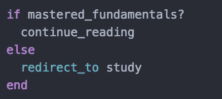
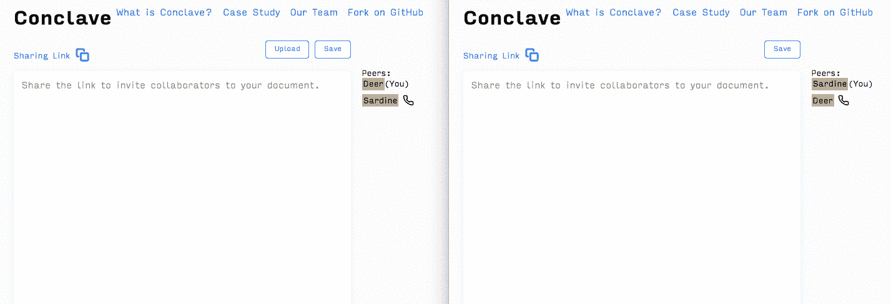
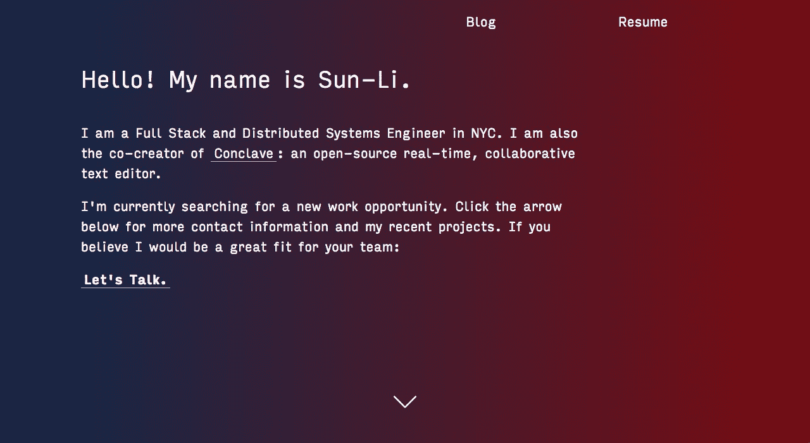
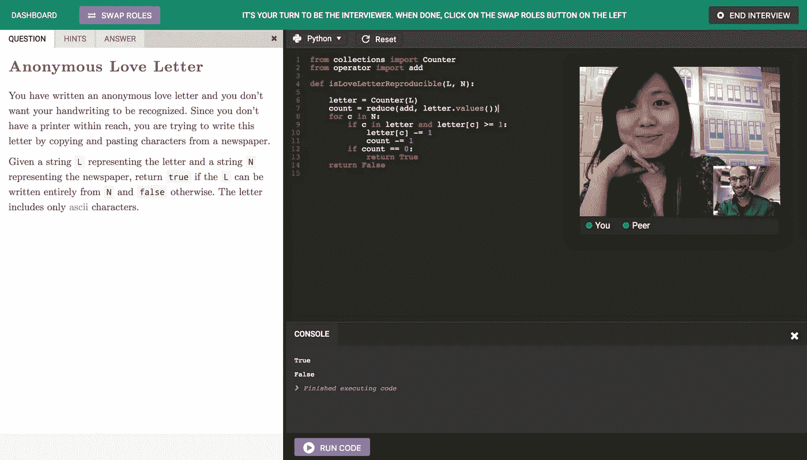

# 如何获得我梦想中的软件工程工作

> 原文：<https://medium.com/hackernoon/what-it-took-to-land-my-dream-software-engineering-job-17c01240266b>

He may not be a software engineer, but he perfectly captures my excitement

甚至在我 2018 年 1 月开始找工作之前，我就知道我想在[数字海洋](https://www.digitalocean.com/)工作。文化、学习机会和开发我所相信的产品的机会。这是我下一个角色想要的一切。

但我知道希望渺茫。

DigitalOcean 的工程质量和可扩展性非常出色。

作为一名没有计算机科学学位的软件工程师，从理论上讲，我不是最佳候选人。此外，我 6 个月前才搬到纽约市，我的关系网几乎是空白的。

我需要证明我可以在不依赖任何幕后操纵的情况下超越拥有高学历的工程师。

我有适合自己的工作。

## 快进 8 周

现在是 2018 年 3 月，我已经接受了 DigitalOcean 的邀请，在他们的纽约办公室担任软件工程师 II。

Credit: giphy.com

在找工作的过程中，我也取得了相当大的成功。

在我直接申请的 74 家公司中，我有:

*   20 个手机屏幕。
*   15 个技术屏幕。
*   8 次现场访谈(更多已安排)。
*   7 个报价。

直接申请的回复率约为 27%,约 10%的申请变成了邀请。

## 发生了什么事？

好问题！

这篇文章将回顾这 8 周里发生了什么，以及我是如何得到我梦想中的工作的。

这些都不会是典型的“不要放弃！”和“保持动力！”我经常读到的一些建议。虽然这些习惯用法很好，但并不是特别有用。

我将概述我推销自己、准备面试以及在市场上与其他工程师竞争的详细步骤。

我希望读这篇文章的人能收集到一些有用的见解。尤其是非传统背景的。

# 警告:没有捷径

如果你在搜索“*如何在 X 个月内找到工作？”*，这不是。

在过去的两年里，我致力于成为一名软件工程师。这包括自由职业、短暂的网络开发实习生，以及以[启动学校](https://launchschool.com/pedagogy)形式的强化自学。

关于如何提升自己，我有一些新颖的建议，但没有什么能取代掌握基本知识——甚至没有一份花哨的简历和求职信。

我经历了惨痛的教训。

如果你因为缺乏经验和/或知识而在技术面试中遇到困难，花点时间解决这些心理差距，学习核心原则。我甚至可以建议[推出学校](https://launchschool.com/is_this_for_me)？

强大的工程基础会让你在求职者中排在第 90 位。这篇文章就是要抓住这个基础，让它变得有市场。

如果那听起来像你正在寻找的，足够的闲聊。

让我们开始吧。

# 1.构建一个糟糕的项目

Conclave in action

我不是在谈论一个 Trello 克隆或另一个 CRUD 应用程序。每个人的投资组合中都有这些。我说的是需要认真研究并展示你的技术实力的东西。

对于[尼廷](https://medium.com/u/b43c2e1b0196?source=post_page-----17c01240266b--------------------------------)、[伊莉斯](https://medium.com/u/aeffe87e7455?source=post_page-----17c01240266b--------------------------------)和我自己来说，那就是[秘密会议](http://bit.ly/conclave-site)。我们在 2017 年秋季建立了秘密会议，作为[启动学校顶点计划](https://launchschool.com/results)的一部分。

这是坏蛋。这也需要大量的工作。

我们在几周内花费了数百个小时来研究和建立秘密会议。这包括阅读白皮书、筛选开源代码和实现定制的数据结构。我们甚至不得不为分散系统设计自己的共识和冲突解决算法。

这听起来可能很多，但它是至关重要的。

如果你梦想中的公司是一家知名的科技巨头，你将与计算机专业的毕业生展开激烈的竞争。虽然我们这些非传统的人无法与他们的血统竞争，但我们可以在应用经验上击败他们。

即使你不想为四大之一工作，一个大项目也很重要。每个面试官都会问你最近的项目和最大的挑战。

展示你已经解决了有趣的问题，比如并发性和伸缩性，这会让你大放异彩。

# 2.炫耀 badass 项目

一旦我们的团队建立了秘密会议，是时候展示它了。

我们写了一个广泛的案例研究，并发布到黑客新闻和 Reddit 上。我们还写了一个压缩版本，在[媒体](http://bit.ly/conclave-post)上发表。

这不仅展示了我们用简单的术语解释复杂想法的能力，它甚至导致一些公司联系我们！

## 聚会

我总是听到有人建议你在找工作的时候应该参加聚会。

你知道什么比参加聚会更令人印象深刻吗？

一点钟讲话！

My presentation at the Javascript.NYC meetup

在我找工作的时候，我在两个当地的 JavaScript 和 Ruby 聚会上发言。这很好，有几个原因:

1.  如果录下来了，你可以把视频放到你的 LinkedIn 和网站上。这将会给那些关注你的经理留下非常深刻的印象，并使你从其他候选人中脱颖而出。
2.  在聚会上发言可以成为一个神奇的引荐者。

我知道许多工程师害怕公开演讲，会不惜一切代价避免公开演讲。但是想想好的方面。

有多少求职者可以说他们做过公开演讲？

这表明你知道你的东西，你愿意教和告诉别人！

你愿意为了 10 万美元的年薪和福利，在一群工程师同事面前谈 30 分钟吗？

# 3.增强 LinkedIn 和网站

当你申请招聘人员的公司时，他们首先会看你的 LinkedIn 资料。如果你没有，就去买一个。

我确保加强我在 LinkedIn 上的个人资料，直到它达到“全明星”级别。[“全明星”被联系的几率是其他人的 40 倍](https://www.themuse.com/advice/allstar-linkedin-users-are-40-times-more-likely-to-get-contactedheres-how-to-score-that-rating)。

[你可以自己寻找](https://www.linkedin.com/in/sjbeatteay/)，而不是描述我包括的所有东西。

我还订阅了 Premium 账户，这样我就可以给招聘人员发邮件了(稍后会详细介绍)。

## 我的头衔应该是什么？

这是另一个让你脱颖而出的领域。有点创意。

由于我在全栈和分布式系统方面的经验，我把我的头衔定为“全栈和分布式系统工程师”。

啰嗦，但很独特。

如果想不出什么特别的，那么“软件工程师”或者“Web 开发人员”是不会错的。

## 获得一个网站

我已经可以听到我所有的后端工程师同事呻吟。

“为什么我必须创建一个网站？我拿工资不是为了让事情看起来漂亮！”

如果你在找工作，你很可能一分报酬都没有。在你签署聘书之前，你是营销人员，而不是工程师。

拥有一个网站并不意味着展示你的前端才能——尽管它可以。

网站是另一种宣传你自己和叙述你故事的方式。当雇主在谷歌上搜索我的名字时，我想尽可能地控制他们看到的内容。

## 保持简单

我用 Sinatra、basic HTML/CSS/JS、Heroku 和我在 CodePen 上找到的一个有趣的背景渐变模式建立了我的网站。

注意:我正在进行一些网站维护，所以当你读到这篇文章时，我的网站可能无法运行。

对于那些不愿使用 HTML 或 CSS 的人来说，GitHub 上有大量的 Jekyll 模板。

# 4.以相反的兴趣顺序应用于公司

在我开始申请工作之前，我列出了一长串我感兴趣的公司。然后我根据偏好将这个列表分成 3 组。

这些是我的“层”。

每一层都决定了我什么时候申请以及我会为申请付出多少努力。我的兴趣越大，我等待申请的时间就越长。

## 为什么最后才申请顶级公司？

招聘是一个极其不精确的过程。有太多的因素和变量无法控制。

Credit: giphy.com

紧张、不完美的答案和简单的错误甚至可以击倒最资深的工程师。不管你在计算机方面有多优秀，只有优秀的面试官才能得到优秀的工作机会。

虽然模拟面试可以在一定程度上提高你的技能，但真实的面试是无可替代的。这就是为什么我想推迟面试我的首选公司，直到我有一些实践。

由于新手的失误，我没有收到第一个现场的报价。到我第八次到现场时，这些错误越来越少了。

# 5.创建定制的简历和求职信

这是我的[简历](http://www.sunli.co/images/sunli-resume-v37-cloud.pdf)

注意到 URL 中的“v37”了吗？这是我简历的第 37 个版本。

我之前提到过，一家公司越让我感兴趣，我就越努力去申请。

然而，不管哪一级，我为几乎所有的申请都制作了一份定制的简历和求职信。在我 8 周的搜索结束时，我已经有了 40-50 个不同版本的简历

## 为什么要付出那么多努力？

我从 AngelList、LinkedIn Easy Apply 和其他低收益策略开始找工作。我想我需要大量的申请，但我最终会得到回应。

100 个申请之后，完全沉默。

Credit: giphy.com

我后来了解到，这些求职网站往往会向公司发送垃圾邮件，以至于人力资源部门会忽略这些求职者。我个人不推荐他们。

相反，我专注于直接申请公司的职业页面，给招聘人员发电子邮件，以及制作独特的简历和求职信。

## 简历提示

关于如何写一份专业简历，有[大量](https://www.amazon.com/Complete-Software-Developers-Career-Guide-ebook/dp/B073X6GNJ1) [的](https://medium.freecodecamp.org/how-to-write-a-great-resume-for-software-engineers-75d514dd8322) [资源](https://medium.freecodecamp.org/how-to-write-a-good-resume-in-2017-b8ea9dfdd3b9)。虽然我的简历还需要改进，但以下三点对我有帮助:

*   我在顶部添加了一个“总结”部分，用 2-3 句话总结了我的兴趣和经历。这对招聘人员很有帮助，因为他们可以快速浏览，而且高度可定制。
*   我强调了我的个人项目。我根据我申请的公司来混合搭配它们。在 Heroku 上招待他们是一大优势。
*   我把我的“技能”部分归入每个职位描述。我省略了后端位置的前端技术，反之亦然。我想向我的潜在雇主展示我是这个职位的最佳人选，包括我所展示的技能和技术。

## 求职信提示

求职信很复杂，我还有很多需要学习的地方。我收到的最好的建议是创建一个[求职信模板](https://docs.google.com/document/d/1Rv9K4JHSjy0TaHUnKmD4IIVh1sUI5sIXYSRQyYN0GuM/edit?usp=sharing)。

求职信模板是一种平衡行为。我想给个性化留出足够的空间，这样每个版本都是独一无二的。但是我留的空间越大，写每封求职信的时间就越长。

定制资产需要时间和精力，但可以显著增加接收电话屏幕的机会。我的大部分申请都没有被推荐。我的简历和求职信是我的主要卖点。

我提到了他们工程博客(如果有的话)上最近的新闻文章或帖子，以此表明我已经研究过这家公司。

虽然很多人说求职信已经过时，但根据我的回复率，我只能认为招聘人员会感谢我付出的额外努力。

## 何时申请的快速说明

Credit: giphy.com

我预约了周一至周三发送申请。这是招聘和人才搜寻最受欢迎的日子。

申请新的招聘信息是让我的申请出现在招聘人员或招聘经理面前的最好方法。

[随着时间的推移，得到回复的可能性越来越小。周末是最糟糕的。](https://careers.workopolis.com/advice/the-best-and-worst-days-to-apply-for-a-job/)

此外，每个月的第一天，黑客新闻都有一个*在招聘*职位。这是寻找空缺职位的绝佳资源。也有可能有些帖子会包含发给公司内部某个人的个人电子邮件。这可以让你完全不用通过人力资源部申请。

# 6.联系工程师同事

在一个新的城市从零开始建立一个网络的想法可能会引起其他人的恐慌，但它让我兴奋。

我喜欢认识新朋友。

虽然我确信存在复杂的社交策略，但我的策略很简单。

我在我的一级列表中的公司找到了工程师，并通过 LinkedIn 发送了“联系”请求。如果他们和我上同一所大学，那就更好了。

我附上了一张纸条，说我刚到这个城市，最近完成了一个项目，想更多地参与社区活动。

又短又甜。

工程师比人们想象的更乐于和陌生人一起喝咖啡。我见到了来自 DigitalOcean、Spotify、Datadog 和其他公司的工程师。

我甚至可以在谷歌自助餐厅吃午餐。检查遗愿清单上的那个！

## “但是我讨厌网络！”

许多人不喜欢网络，因为他们觉得这是不诚实的和/或“虚假的”。

不一定非要那样。

我去这些地方不是为了寻求回报。很多会议都没有推荐，这很好。

我真诚地渴望参与当地的开发社区，并与其他工程师交流。我问了他们的背景、当前的项目以及编程之外的兴趣。

即使现在我被雇佣了，我还是会继续联系他们。每个人都有自己独特的故事，我喜欢听。

如果你在会见其他开发人员时遇到困难，请从戴尔·卡内基那里做些笔记。

找到有博客、播客或在会议上发言的工程师。伸出手，表达对他们工作的真正兴趣。请他们谈谈你感兴趣的某个话题。

你可能会对这种反应感到惊讶。

# 7.研究

Credit: giphy.com

漂亮的求职信和推荐信对我进入职场很有效。是我的技术能力让我走完了剩下的路。

因为我在大学里没有主修计算机科学，我最薄弱的领域是算法、数据结构和系统设计。

我一定要改变这一点。

## Algo/DS

为了获得算法和数据结构的基本概述，我阅读了 [*《算法和数据结构常识指南》*](https://pragprog.com/book/jwdsal/a-common-sense-guide-to-data-structures-and-algorithms) *。*

基于我的基本知识，我在 [LeetCode](https://leetcode.com/) 上解决了大约 100 个问题。我确保它们涵盖了我在技术屏幕上可能会遇到的不同主题:

*   数组/字符串
*   矩阵
*   二叉树
*   链接列表
*   追踪
*   动态规划
*   比特操作(这可能不会在面试中出现，但学习起来很有趣)

我写下了我在谷歌电子表格中完成的大多数算法问题的心理模型，你可以在这里看到。

这帮助我更好地理解所涉及的解决方案和模式。这也是现场面试前的一个有用的复习。

Credit: pramp.com

除了 LeetCode，我还做了 30 多次 Pramp 采访。如果你不熟悉 Pramp，它是一个“免费的在线点对点技术面试平台”

你可以同时练习算法问题和面试技巧。怎么推荐都不为过。

还买了一些[白板墙贴](https://www.amazon.com/Life-Party-Adhesive-Whiteboard-Calendar/dp/B01LWNFD90/ref=sr_1_1?ie=UTF8&qid=1522084651&sr=8-1&keywords=whiteboard+wall+tape)练习白板面试。它派上了用场。

## 系统设计

系统设计面试才是真正考验一个人是否掌握了根本。不要以为你可以走进去，半屁股他们。面试官可以检测 BS。

系统设计不仅有助于决定你是否会得到一份工作，还能决定这份工作有多赚钱。

认真对待。

像许多工程师一样，我没有很多设计大规模生产系统的第一手经验。为了准备，我向那些人学习。

我找到的最好的资源是[寻找系统设计面试](https://www.educative.io/collection/5668639101419520/5649050225344512)。它有许多详细的案例研究，易于理解并涵盖了常见的场景。80 美元的价格标签非常值得。

还有大量免费资源:

*   油管（国外视频网站）
*   [盖诺博客](http://blog.gainlo.co/)
*   [高可扩展性博客](http://highscalability.com/)
*   [软件工程每日播客](https://softwareengineeringdaily.com/category/podcast/)

我还从以前的 Launch School Capstone 毕业生撰写的案例研究中学到了很多东西。他们涉及的话题是面试中的常见话题:

*   [LRU 缓存](https://corvostore.github.io/)
*   [使用尝试进行单词搜索](https://prefixy.github.io/)
*   [后台作业处理器](https://workerholic.github.io/)
*   [分布式哈希表和分散式系统](https://xorro-p2p.github.io/)

最后，如果你准备好了，请阅读白皮书。我读了 DynamoDB 和 Cassandra T21 的书，以提高我对 NoSQL 数据库的理解。

白皮书可能是技术性的和冗长的，但却是向我们领域的顶尖人士学习的最佳方式之一。任何寻求后端或全栈角色的人都应该考虑他们。

# 8.做深度工作

我喜欢听其他工程师说他们在找工作的时候每天学习 8-12 个小时。我的竞争对手公开承认他们筋疲力尽地走进面试。

Credit: giphy.com

我知道，我知道。这不是他们想说的。但是给我看一个在找工作的时候学习超过 8 小时的人，我会给你看一个在时间管理方面很糟糕的人，他很可能已经精疲力尽了。

Cal Newport 在 [Deep Work](http://calnewport.com/books/deep-work/) 中指出，一个专家每天能做的最“专注的工作”是 4 小时左右。对于一般人来说，就更少了。

这并不是说一个人不能“工作”超过 4 个小时。我看到人们一直“工作”10 多个小时。他们完成的数量是有争议的。

## 什么是“专注工作”？

对我来说，我把它定义为超出我舒适水平的集中注意力和不受干扰的工作。

跟着教程走？**号**

看博文？**号**

练习你已经看过并知道如何解决的问题？都不是。

Credit: giphy.com

虽然这些很有趣，但在我有限的时间里，它们不会让我有足够的进步。

为了提高我的面试技巧而不占用我所有的空闲时间，我做了深入的工作。以下是一些例子:

*   花一个小时在纸上/白板上练习有挑战性(阅读:比你习惯的更难)的问题，或者让一个朋友测试你。Pramp 也可以。
*   花 20-30 分钟进行一次模拟系统设计面试。将您的答案与官方案例研究进行比较，并再次尝试改进您的答案。
*   不习惯使用第三方 API？花 2-3 个小时构建一个与 GitHub 交互的程序。与之斗争。试着回忆一下你所知道的关于 REST、API 和 HTTP 的一切。有什么不知道的，上 Google/StackOverflow 搜一下。记笔记，这样你就不会忘记。

有时候，我会做两个或更多这样的任务。其他日子，我专注于一个。

重要的是确保我排除了所有干扰。这让我把我的学习时间限制在 4-6 个小时，这样我就有更多的时间去申请、建立关系网和放松。

## 不要学习新技术

有些人可能会反对我这样做，但是你不应该把有限的时间花在学习新的语言或框架上。

这是磨练你已经知道的东西的时候了。

把你即将到来的面试当成一场音乐之旅。音乐家会通过学习新歌来为即将到来的演出做准备吗？

**见鬼不！**

他们花时间微调曲目，确保每个音符都完美无缺。

那是你必须做的。

一家伟大的科技公司不会在乎你懂哪种语言。他们会相信你可以学到工作中需要的任何技术。把你的时间花在磨利你的工具上。

# 9.利用工作机会

这是我求职过程中最有益的一步，也是最困难的一步。

我花了大约 5.5 周才得到第一份工作。接下来的 6 次是在接下来的 2.5 周。

怎么会？

**杠杆和时机。**

我的第一个提议打开了许多大门。这不仅让我在与其他公司的谈判中处于更有利的地位，还让整个过程加快了 10 倍。

Credit: giphy.com

我让所有其他公司知道，另一个提议正在讨论中。我问，如果他们仍然对我感兴趣，通过他们的过程精简。

下一步是给我申请过但没有收到回复的公司的招聘人员发电子邮件。我让他们知道我仍然有兴趣，但有一个长期有效的报价。如果他们认为我很适合，我就需要被放在快车道上。

这就是 LinkedIn inMail 派上用场的地方。不是每个招聘人员都检查他们的 inMail，所以我也用 [Clearbit](https://chrome.google.com/webstore/detail/clearbit-connect-supercha/pmnhcgfcafcnkbengdcanjablaabjplo?hl=en) 发送直接邮件。

从招聘人员的角度来看，我是一个理想的候选人。另一家公司已经审查了我，并确认我知道我的东西。我也通过搁置其他邀请证明了我对招聘公司的热情。

招聘人员喜欢热情的候选人。

大多数地方可能需要 3 周到几个月的时间来面试一个候选人。

有了报价在手，周转时间可能短至一周。

即使你的第一份工作来自你梦想中的公司，为了提高你的谈判地位，推迟接受也是值得的。他们可能不喜欢这样，但这不是他们能决定的。

这是你的事业，你的未来。做对**你**最有利的事。

# 最后一点:友善一点

Credit: giphy.com

面试时表现得友好和精力充沛有很多要说的。许多给我工作机会的公司把我的热情和积极作为决定性因素。

我坚信讲几个笑话，让面试官微笑，可以弥补一些不完美的答案。对于我的内向者和雄心勃勃者，我建议把你的[焦虑变成兴奋](https://www.theatlantic.com/health/archive/2016/03/can-three-words-turn-anxiety-into-success/474909/)。

感谢您阅读这篇长篇大论的文章！

我知道申请工作是一个困难的过程。我希望这些信息能帮助非传统求职者发挥他们的才能，并教会他们如何推销自己的技能。

祝所有求职者好运。如果您有任何问题或顾虑，请随时联系我们或在下面发表评论。我会尽我所能回答。

现在去开始建立一些坏蛋项目！我期待着不久能在我附近的聚会上见到他们。

如果您想在我上传新故事时得到通知，请订阅我的个人资料。