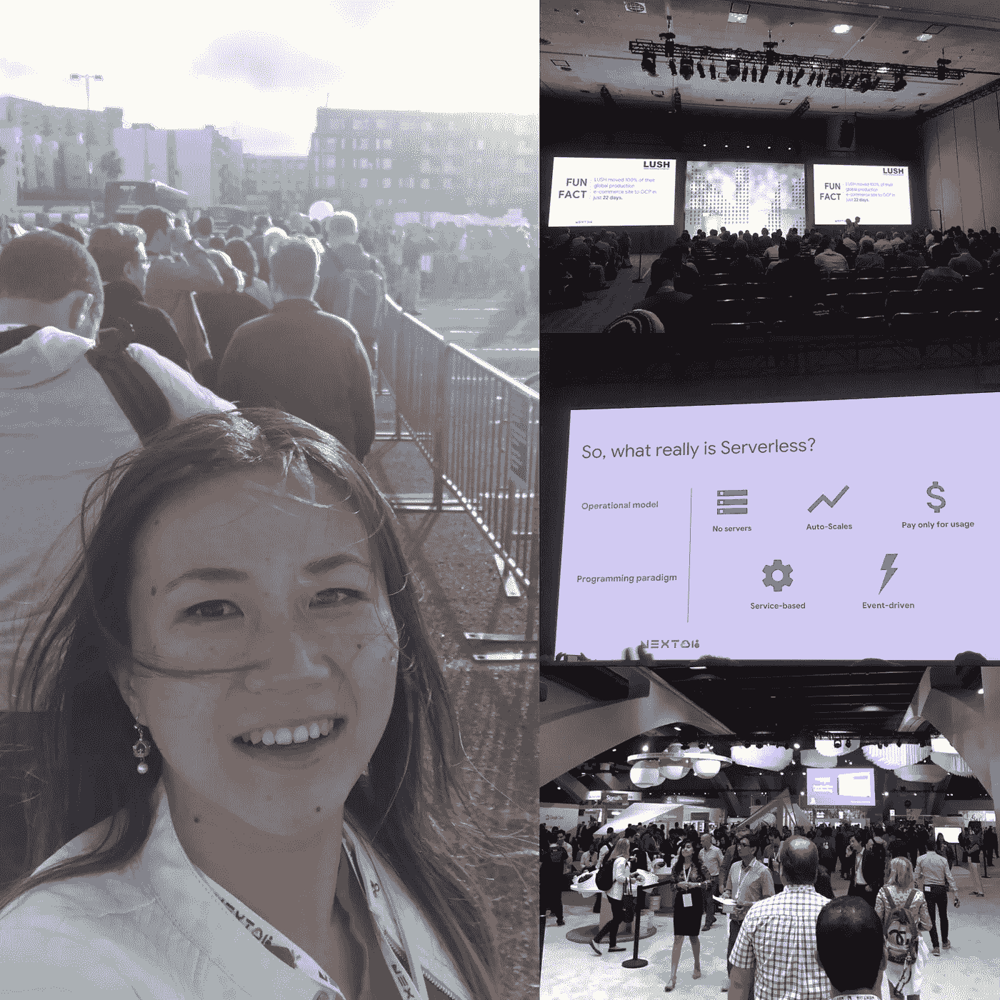
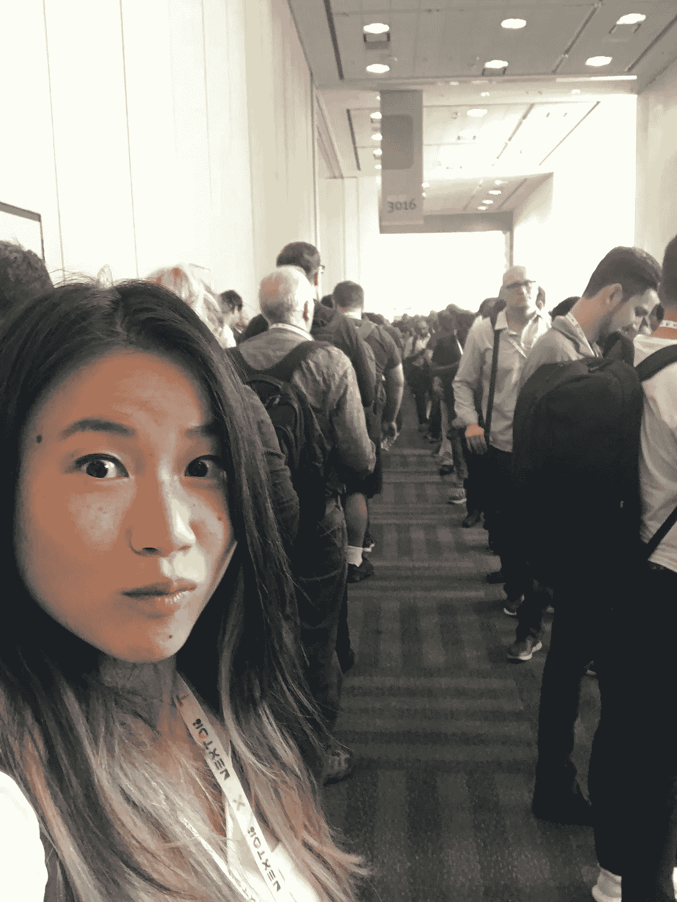
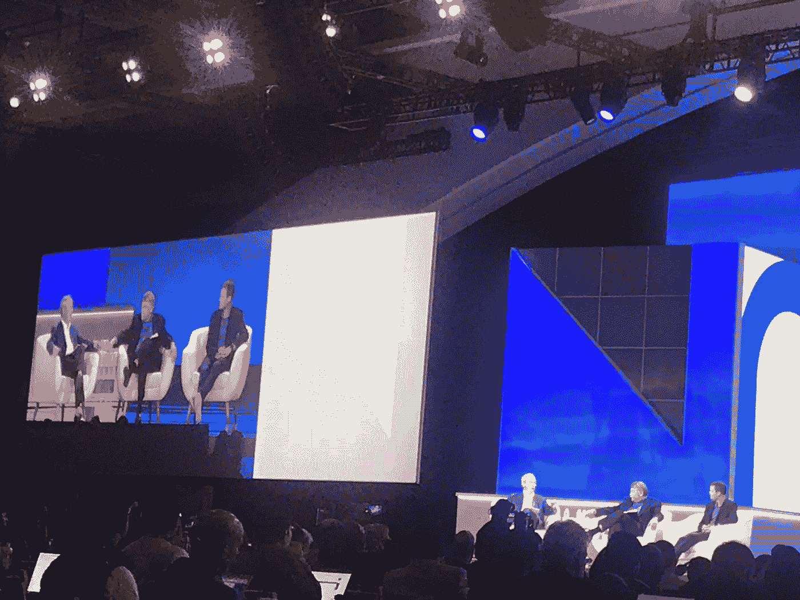
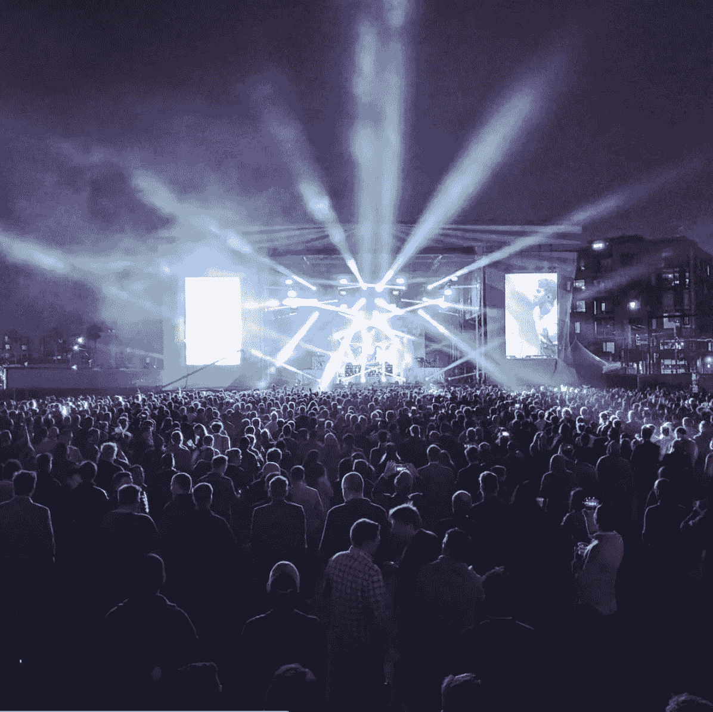

# 参加大型科技会议的好处和“幽默”

> 原文：<https://medium.com/hackernoon/what-its-like-attending-a-huge-tech-conference-44d71313364e>

“我感觉我就要去上学的第一天了。”

星期二早上，当我走进莫斯克尼中心时，我大声说道。

我和几个同事拿到了 Google Cloud Next 大会的免费入场券。这是我第一次参加如此规模的会议。他们说有超过 25，000 人出席。

我不知道会发生什么，但我现在肯定经历了很多。

## 1.出席者=过多的 XY 类人类。

一周前，我问我的男朋友，在我们的场景中被称为“云家伙”，什么样的人下一个去谷歌云。

“嗯……男人。”他说。

哦，天哪，他的回答再完美不过了。

This game is called “find the female engineers”

会议名称中有“云”,所以许多讨论都是关于基础设施和运营的，这并不令人吃惊。有工程师。然后就是对基础设施感兴趣的工程师，所谓的 DevOps 工程师。

DevOps 工程师是稀有品种。对 STEM 感兴趣是一回事，对 Linux 和 Nginx 的内部工作方式感兴趣是另一回事。

我不知道 DevOps 中确切的男女比例，但我愿意打赌它甚至低于一般的软件工程比例。

这并不是说科技行业的性别比例平衡，而是男性数量和女性数量之间的差异明显大于硅谷的日常生活。

## 2.人群比旅游陷阱还要密集。

凡事都有界限。为了食物，为了进去，为了自动扶梯，为了浴室，为了谈话，为了…等等，为了浴室？没错。出于某种原因，女洗手间仍然排着长队。

由于排队和拥挤，从一栋楼到街对面的另一栋楼需要 15 分钟。

## 3.食物是第一世界的问题。

至少会有好吃的，对吧？

不幸的是，没有。我午餐吃了泰式牛肉卷里的超级未熟透的米饭。我对米饭都不挑剔。我说那是坏米，其实就是坏米。

此外，除非你在美食广场开门时(上午 11:30)排队，否则祝你好运，买到的不是沙拉。如果你是一个像我一样易怒的人，你已经被警告了。

## 4.其他公司的工程师也同样尴尬。

一些公司很聪明，派他们的销售人员去展位工作。

事实上，这是一次很棒的经历。我一定会再去的。*(当然免费)。*

现在，让我换个话题，谈谈那些很酷的事情。

## 5.谷歌试图让你破产。

当然，销售是会议的一部分。谷歌的开发者拥护者擅长在最佳环境下展示产品。他们让你什么都想买。事实上，我工作的公司正在从 Azure 迁移到 Google Cloud。但是要小心，不要被锁在里面。如果你做了，就很难出来了。

## 6.作为一个十几岁的女孩在贾斯汀比伯演唱会上是什么感觉。

我从小到大从来没有去过名人的演唱会，所以我从来不明白为什么十几岁的女孩会在贾斯汀比伯演唱会上丢三落四。然而，与埃里克·施密特、杰夫·迪恩和埃里克·兰德共处一室终于让我明白了一点。

Eric Schmidt, Eric Lander, and Jeff Dean discussing AI in medicine

当这三位有成就的知识领袖走上演讲台时，我的心脏跳得很快，血管里充满了期待和兴奋。

兰德教授是我在麻省理工学院最喜欢的教授。他讲课的激情和热情是独一无二的。他与埃里克·施密特(Eric Schmidt)和杰夫·迪恩(Jeff Dean)讨论人工智能在医学中的作用时的激情和热情没有什么不同。

虽然我已经很多年没有接触过生物学了，但是听他的演讲让我重新爱上了这个领域。

他是世界上最有影响力的生物医学科学家，这是有充分理由的。

## 7.被现实世界中的名人追星是什么感觉。

周三晚上的活动是在美国电话电报公司公园外面的停车场举行的音乐会。

我差点没去。

周三是最糟糕的。我早上 6:30 起床去车管所，结果却在车管所度过了一段糟糕的时光。然后我赶回会场，午餐只吃了没煮熟的米饭。然后，我不得不在睡眠不足的情况下，耐着性子听完几个小时激烈的 DevOps 谈话。晚上 7 点的时候，我正准备睡觉。

然而，多亏了我的 FOMO，我才从床上爬起来去听音乐会。

几个月来，我一直痴迷于他们的*“就像这样的东西”*。我不知道他们肯定会放那首歌，但我愿意打赌。

长话短说，我很高兴我去了。

食物，第一次在会议上，是惊人的。高年级的西西在分发免费的墨西哥卷饼。

有免费的啤酒、葡萄酒和鸡尾酒。有街机游戏、摩天轮、星际飞船 2000 游乐设施，最重要的是，还有免费的泰迪熊！

哦，是的，音乐会本身也很棒。他们确实演奏了*“就像这样的东西”*，安德鲁接管了主唱，因为他们没有克里斯·马汀在那里。

我从未真正谷歌过“烟鬼”，所以我不熟悉这个名字背后的面孔。这对组合的帅气让我惊喜不已:)

[https://www.instagram.com/p/Blr3AvOAGlI/?tagged=googlenext18](https://www.instagram.com/p/Blr3AvOAGlI/?tagged=googlenext18)

是的，在任何其他连锁吸烟者的演唱会上，观众会更加拥挤。

这里的人口密度更像冰，而不是白金。但那对我来说太完美了，反正我太老了，不适合白金。

## 8.你会留下难忘的回忆。

就像生活中许多有价值的事情一样，回想起来比活在当下更令人满足。当我回想起来，我脑海中的主导思想是令人惊叹的演讲，伟大的事件，最重要的是，在一个房间里和如此聪明的人在一起，我觉得自己像个笨蛋。

我与谷歌没有任何关系。