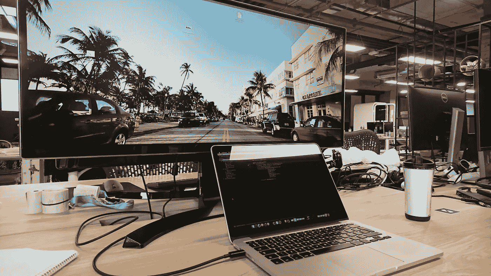
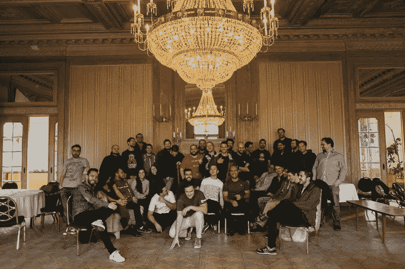
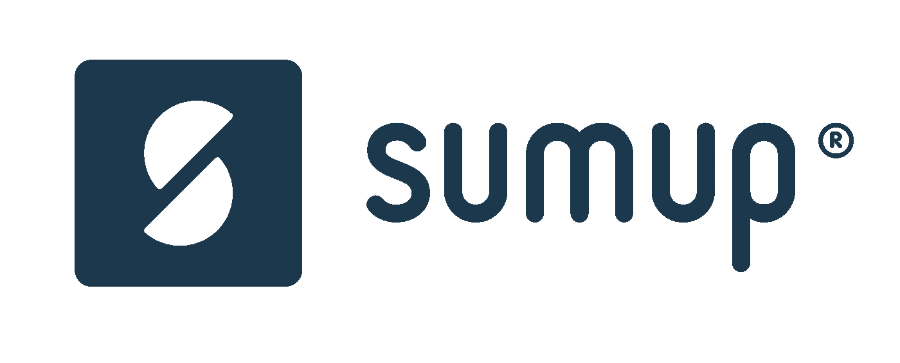

# 为欧洲发展最快的公司工作是什么感觉

> 原文：<https://medium.com/hackernoon/what-its-like-working-for-europe-s-fastest-growing-company-88ba11ad5ef0>

My humble workstation

诚然， [SumUp](https://sumup.com/) 自 2015 年以来收入增长 14，368%，被 Inc. magazine 评为 2018 年[增长最快的欧洲公司。](https://www.inc.com/inc5000eu)

有了这个成就之后，我想我应该记录下在这样一家公司工作的感觉。

## 太牛逼了。

## 工作和影响

从一开始，为 SumUp 工作就是一种享受。我于 2017 年 6 月加入了我们现在位于塞尔迪卡中心的旧索非亚办公室。我从第一天开始在这个平台上工作，10 天后看到我的第一行代码上线。这对我来说是难以置信的，因为这是我的第一份软件工程工作！

我非常感激没有给我一些毫无意义的实习项目，这些项目注定不会被公开，而是让这个人有事可做。

这是我喜欢在这家公司工作的主要原因之一——你的工作有真正的影响，你可以**看到。在我短暂的 7 个月里，我个人已经发布了将近 16k 行的 Ruby 代码，这对于一个初级开发人员来说简直是疯狂！**

我读过和听过许多恐怖的故事，讲述大企业的人如何连续几个月在隐藏在架构深处的内部系统上工作。当他们的代码经过几个月的瀑布过程后被发布到野外时，他们可能甚至无法说出它所产生的差异。

在 SumUp，我们遵循一种敏捷的方法，每周将代码发布到产品中。我们的团队按产品领域划分，每个团队开发系统的某个部分。2017 年我们一共做了 **51 个**发布！我相信这是帮助我们快速成长的原因。

即使是现在，我们也觉得这个每周一次的*“单片”发布会大大降低了我们的速度。因此，我们目前正在转向完全独立的发布时间表，每个产品团队可以在他们认为合适的任何日期和时间发布！每个团队都要对他们自己的变化负责，并修复任何出错的地方。你可以说我们正在拥抱快速失败文化。*

## *文化*

*谈到文化，这是我们公司真正兴旺发达的地方。我们有一个扁平的等级制度，每个人都受到平等对待。我的问题和不确定性会得到关注，即使它们看起来没有高级会员的问题和不确定性重要。*

*另一件事是每个人都很实际——我和我的“上级”出去玩，就像我和其他人一样。即使在发展到超过 800 人之后——我们的创始人经常访问我们的办公室，并且总是花时间与每个人打招呼和交谈。*

## *环境*

*这种疯狂的增长可能表明，但我们相当放松。没有**的外部压力**产生结果。每个人都知道他/她必须做什么，并有内在动力帮助实现我们的使命，即成为有史以来第一个全球信用卡接受品牌，同时授权给小商户。*

*就工作与生活的平衡而言，我们相当富裕。我们不加班。这要归功于我们聪明工作的方法，而不仅仅是努力工作。事实上，我们过去两个季度的座右铭是 ***【大脑战胜肌肉】*** ，鼓励我们优化工作方式，而不是简单地投入更多(时间、金钱、人力等)。)看一个问题。*

*我不知道我们是否可以被归类为初创企业，但我仍然可以感受到这种精神。事实上，SumUp 的**环境**和**精神**是最近一次内部 [NPS 调查](https://en.wikipedia.org/wiki/Net_Promoter)中最积极的结果。*

## *在乎*

*是的，我们做调查和季度回顾会议。这些(以及更多)是旨在找出我们缺少什么并消除已经出现的问题的计划。*

*你可以看出这家公司关心并重视其成员。我们可以获得市场上最好的软件工具、硬件、家具(符合人体工程学的椅子是一种福气)以及参加技术会议的预算。*

*最重要的是，每周五我们都有一个午餐学习会议和黑客时间！前者是公司赞助的午餐，配有教育视频/演示，后者是专门用于开发个人项目/提升自我的时间。*

## *家庭的*

*尽管我们是一家全球性组织，在世界各地都有办事处，但我们仍然感觉彼此很亲近。我们公司尽可能频繁地把我们联系在一起。*

*当我写这篇文章时，巴西办公室的 Gabriel 正坐在我左边的桌子旁。他来索非亚玩了一个星期，然后要去柏林。经常和来自世界另一端的人见面真是太好了！*

*除了办公室访问，我们还有其他活动将我们多元化的团队聚集在一起。*

**

*Most of our tech team and a big chandelier in the castle*

*我们的开发团队每年举办两次内部黑客马拉松。*

*与来自不同办公室、你很少遇到的人在创新项目上一起工作总是令人兴奋。*

*我们上一次的黑客马拉松特别有趣，因为它是在德国小村庄 [Beesenstedt](https://en.wikipedia.org/wiki/Beesenstedt) 的一座城堡里举办的。*

*有趣的活动不仅仅限于我们的技术团队。我们最近在保加利亚的一个度假胜地进行了一次为期两天的滑雪旅行。挤满了人，有 200 多人参加了！*

## *缺点*

*当然，不可能全是阳光和彩虹。快速增长既是一个障碍，也是一件好事，因为它最大限度地考验了你的组织。*

*作为一个快速扩张的组织，我们不可避免地会受到一些技术债务的困扰，并发现在需要推出新功能时彻底解决这些债务是一项挑战。*

*我们面临的另一个挑战是招募新人。当我们的大部分基础设施建成时，没有足够的时间和动力来彻底记录一切是如何工作的。因此，一个新手的头几个月伴随着一个陡峭的学习曲线。我自己也经历过这一点——我必须不断寻求指导，并向更高级的人提出(可能很烦人的)问题。这最初阻碍了我的动力和生产力。你需要自我驱动、自主和负责，才能在这里真正茁壮成长，但一旦你做到了，你就可以移山。*

*不管怎样，重要的是这一切都在被解决，并且最终会得到处理。*

*这些是我对在这个充满活力、快节奏的公司工作的个人想法。我觉得分享一下欧洲的工作环境和人们可能错过的东西会很好。我希望我已经表达了我对这里日常生活的真实感受。*

*如果你有兴趣为欧洲发展最快的公司工作，我们正在全面招聘。*

**

*如需更多信息，请随时与我联系。*