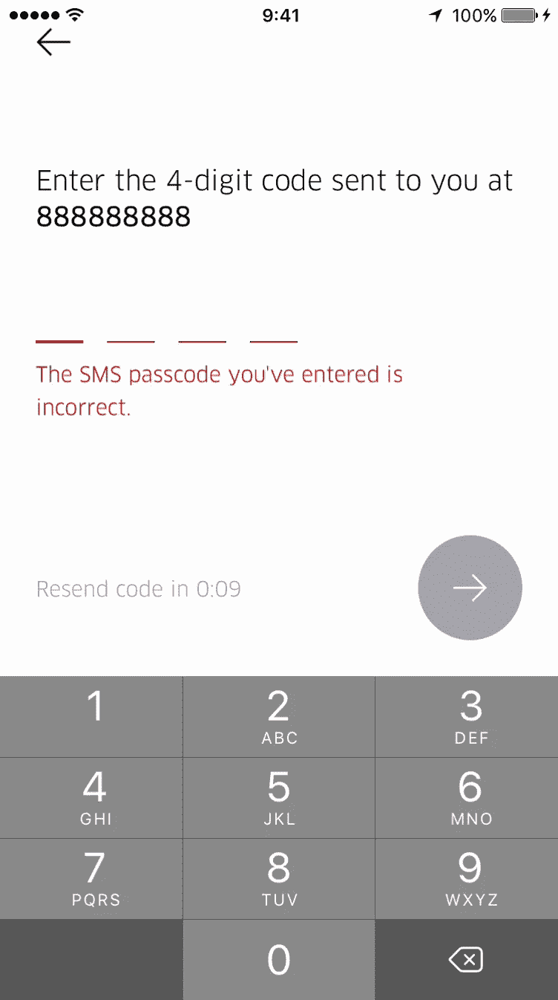
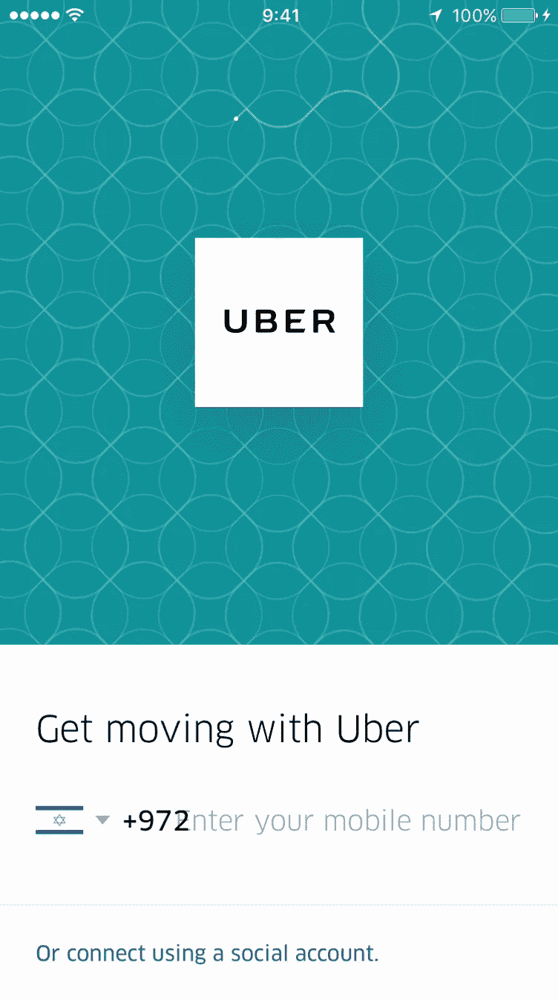
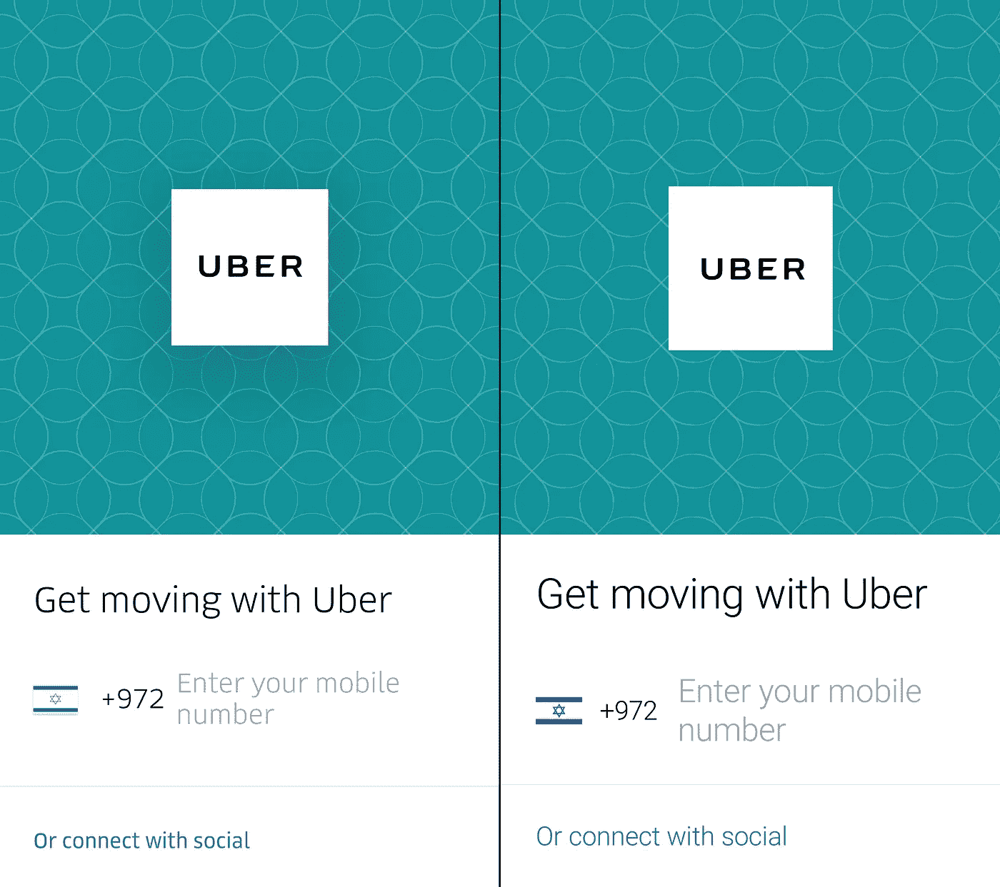

# 我从克隆优步应用中学到了什么

> 原文：<https://medium.com/hackernoon/what-ive-learned-from-cloning-the-uber-app-b0a7c743c1c1>

去年，我发起了代号为“一个学院”的活动，并询问我们的社区，作为调查的一部分，他们想学些什么。绝大多数人的反应是[如何建立一个像优步](https://codenameone.teachable.com/p/build-real-world-full-stack-mobile-apps-in-java)一样的应用。起初我想创造一些优步风格的东西，但我最终决定建立一些看起来非常接近原生应用程序的东西。在某些方面几乎是克隆。我的动机是:

*   我希望设计看起来专业，顶级供应商的设计不会出错
*   人们可以通过理解优步做出的决定学到很多东西——我知道我做到了
*   如果我建造了一些不同的东西，我可能会给自己一些现实世界中不存在的“折扣”

我用“克隆”这个词来表示相似性，但不是指 1:1 的复制。优步是一个巨大而微妙的应用程序，我只有一周的时间来编写所有相关的适用代码…我的目标是做“硬东西”，掩盖一些更深层次的细节。

# 我学到了什么？

我并不期望学到很多东西，但有几件事真的让我很惊讶。其中一件事就是在 iOS 的优步本地应用中大量使用材料设计。例如:

Uber’s native app on iOS

请注意，这看起来几乎与该应用程序的 Android 版本相同。你有固定的 Android 用户界面元素，比如浮动的动作按钮、材质设计文本输入和箭头返回按钮……
Android 版本看起来确实几乎一模一样！

从历史上看，我一直认为原生部件通过熟悉度来促进参与。事实上，我和陈过去常常为此争论不休。我推动了一个更“原生小部件感觉”的方法，而陈推动了一个适用于所有平台的单一用户界面。

看来站在了陈一边。**优步有一个与 iOS & Android 几乎相同的用户界面设计。**

这是有意义的，他们可以重用设计。在培训材料中提供一张屏幕截图来支持两种操作系统。只要应用程序看起来不错，一切都还在原位，这仍然是直观的。

在 Android 2.x 和 iOS 6.x 时代，操作系统之间的差异太大了。在安卓系统的左上角有一个后退按钮是对上帝的亵渎...
如今，即使您不使用跨平台工具，融合也具有财务意义。

# 过渡仍然是不同的

我不确定他们是不是故意这样做的，但 Android 和 iOS 原生版本的过渡彼此非常不同。安卓版虽然我没有看到“英雄转场”，但是使用了材质设计风格转场。iOS 使用封面和幻灯片过渡。

如果这是故意的，它的意思是“感觉”胜过“看”。我猜这只是他们不够关心的事情，但很难知道。

# Bug 可移植性

这是 Android 上最初的原生优步登录屏幕:

Android Login Screen

iOS 上的同一个屏幕看起来很相似，但有一个渲染错误:

Rendering Bug on the native Uber login screen

如果您没有看到它，请查看“输入您的手机号码”文本。

我肯定优步有很多问答环节。我猜这是因为大多数国家没有 3 位数的拨号代码。Android 版本(和我们的版本)很好地处理了这一点。我猜它被固定在 Android 上是因为它的全球吸引力。

对 Android 版本的修复不会渗透到 iOS 版本中。

# 一些功能在 Android 上更难

如果你运行优步的 iOS 版本，看看上面的登录屏幕，你会看到背景中的图案在旋转。这是一个很棒的特效，看起来很微妙，很愉悦。

这就是为什么我很惊讶他们没有为 Android 做…
我怀疑他们缺乏工程师来实现这个微妙的功能。

在 Android 上工作了一段时间后，他们选择避免这一点的原因就变得很明显了。Android 在矢量图形方面有问题。当您尝试生成此路径并执行旋转效果时，会出现以下错误:

" OpenGLRenderer:路径太大，无法渲染到纹理中"

我发现的唯一解决方法是在我的例子中通过在图像表面上绘图来禁用硬件渲染。

糟糕的是，很难知道哪里出了问题。渲染路径不会抛出异常，只是不显示。所以我不能动态地退回到软件渲染，我不确定路径中有什么问题？

坐标越界？坐标数？

查看负责该消息的 Android 代码也没有多大帮助。

不管怎样**令人沮丧的是，在一个完全相同的用户界面中，iOS 拥有安卓**所缺乏的功能。

# 他们不会拦截安卓系统上的短信

我最喜欢 Android 的一点是，作为一名开发人员，你可以获得低水平的控制。这是一把双刃剑，但在某些情况下，它胜过其他一切…

一个很好的例子是短信拦截支持。当你有一个短信激活过程时，Android 可以抓取收到的短信，而不需要输入。

令人惊讶的是，原生优步应用程序没有做到这一点。**他们不使用原生 Android 短信激活。**

读了一点之后，似乎优步这些年因为“太多的权限”受到了很多批评。我想他们只是关心打电话的许可…

我不确定这是否同样适用于 API 级别 Android 切换到权限提示)。不管怎样，我在我们的优步版本中添加了这个功能，它使得在 Android 上的注册过程更加流畅。

# 他们锁定了应用程序的肖像

这是我个人最讨厌的事。我喜欢能正确旋转到横向的应用程序，优步屏蔽了这一点。

我理解他们为什么那样做。支持 landscape 将意味着更多的工作，因为一些表单，如我之前提到的登录表单，将需要对 landscape 进行彻底的修改。

它说的事情很有趣:与其花人力去做这些事情。优步更注重功能性，而不是支持横向。我尊重这一点。

我认为这一点和以上所有内容清楚地表明，优步相信功能胜于形式。他们减少功能膨胀，重点关注核心功能。

# 他们变化很大

我从未注意到优步的用户界面变化有多快，直到我开始复制它。当我开始时，历史按钮是在显示屏底部的圆圈，现在它们是搜索区域的下拉菜单。

**对于优步**这样的应用来说，快速行动和试验设计决策的能力至关重要。

# 通过一些服务，您可以完成大部分工作

我没有构建任何像完整应用程序那样精细或细致的东西，但 90%的人都是谷歌的人。

我使用了原生的 Google Maps 小部件和一些 Google web 服务(方向、地点、地理编码)。我还分别使用 Twilio 和 Braintree 进行短信/计费。有了所有这些，你可以在不到一周的时间内获得优步的大部分功能！

**在现有工具的帮助下，构建一个类似优步的应用程序实际上并不困难**。

主要的问题是你能在跨平台工具中获得对像 Google Maps 这样的 API 的支持程度。

Uber on Android & my Uber clone. Not identical but getting there…

我非常尊重优步的工程师们。这是一个极其复杂的应用程序，其细微差别令人惊叹。

我认为创新来自于创造新的东西，但不是完全新的。我们在上一代产品的基础上进行改进，打造“更好”的产品。我认为通过简化建立“像优步一样”的应用程序的过程。我们会看到应用程序远远超越优步。

# **TL；博士**

以下是我学到的东西:

*   优步有一个在 iOS 和 Android 上几乎相同的用户界面设计
*   对 Android 版本的修复不会渗透到 iOS 版本中
*   令人有点沮丧的是，在一个完全相同的用户界面中，iOS 拥有 Android 所缺乏的功能
*   他们不使用原生 Android 短信激活
*   优步相信功能重于形式
*   对于像优步这样的应用程序来说，快速行动和试验设计决策的能力至关重要
*   在现有工具的帮助下，构建一个类似优步的应用其实并不难

如果你想了解这方面的更多信息，请查看我们的博客。