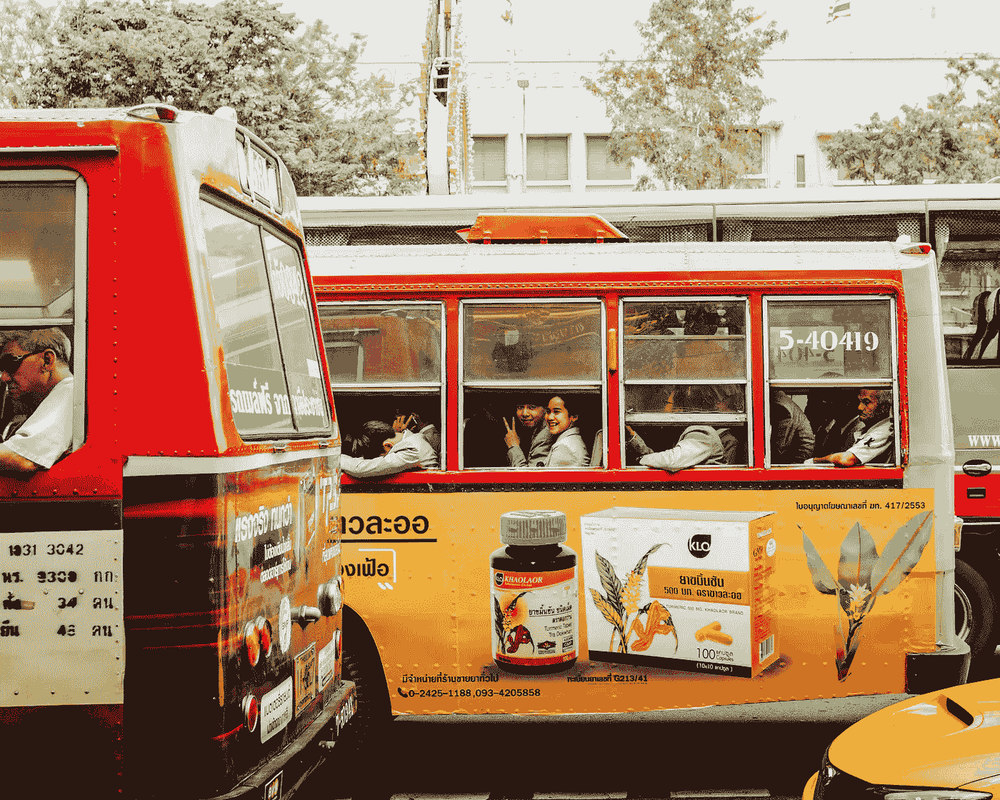
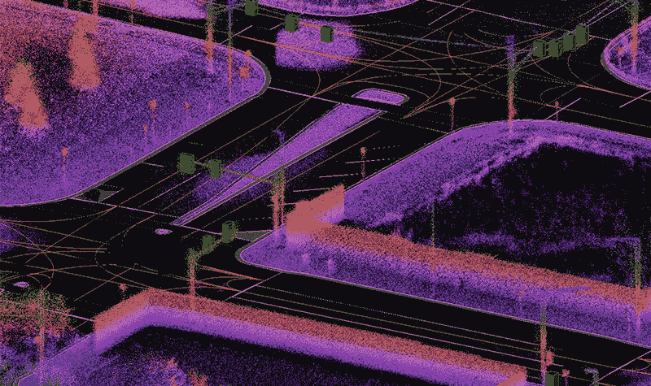
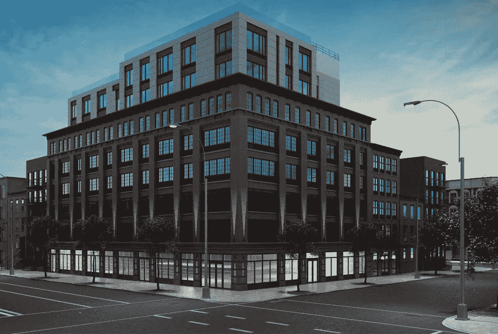
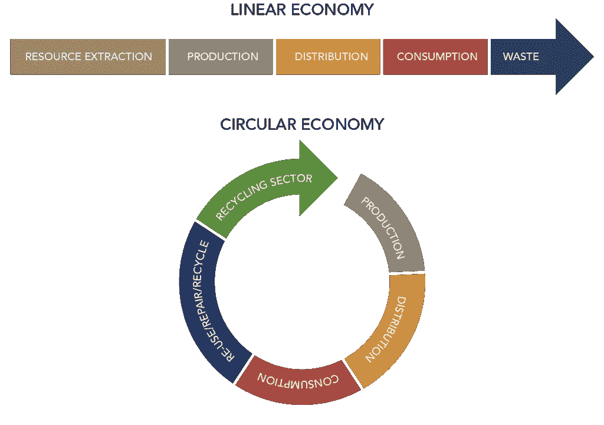

# 2018 年，是什么让一座城市变得“聪明”？

> 原文：<https://medium.com/hackernoon/what-makes-a-city-smart-in-2018-d2fdf43082de>

Photo by [Luca Bravo](https://unsplash.com/photos/xbusTJ7IUu0?utm_source=unsplash&utm_medium=referral&utm_content=creditCopyText) on [Unsplash](https://unsplash.com/search/photos/brooklyn-navy-?utm_source=unsplash&utm_medium=referral&utm_content=creditCopyText)

*您需要了解的智能城市领域的当前趋势、技术和公司*

我最近作为志愿者参加了[智慧城市大会。SCNY 在技术、政策和城市生活的交汇处运作，把市长、创业公司、大企业和我聚集在一起。作为一个刚刚开始我在可持续发展领域的旅程的人，我被让城市更加现代化、互联互通和资源高效的工作所震撼。](https://smartcitiesny.com/)

在会议上，我注意到领导者和技术专家正在关注的几个关键领域，以使 2018 年的城市更加智能: ***技术公平、开放数据和可持续发展*** 。我一直在研究致力于这些重点领域的公司和公共倡议，我想分享一些我所学到的东西。

# 智慧城市正在思考包容性和公平性

Photo by [Evan Krause](https://unsplash.com/photos/5cxIBFFpZEg?utm_source=unsplash&utm_medium=referral&utm_content=creditCopyText) on [Unsplash](https://unsplash.com/search/photos/inclusiveness?utm_source=unsplash&utm_medium=referral&utm_content=creditCopyText)

让技术对城市中的所有人都具有包容性和可获取性是讨论的一个主要话题。几乎每场研讨会、专题小组讨论会和主题演讲都讨论了技术的影响和潜力，以使城市对边缘化人群更公平(或更不公平)。

*   [**纽约市长数据分析办公室**](http://www1.nyc.gov/site/analytics/index.page) **:** MODA 对公职人员使用的自动决策系统(基本上是算法)如何对低收入或少数族裔人口进行道德考量很感兴趣。例如，市政当局使用预测性警务软件，如 [HunchLab](https://www.hunchlab.com/) ，该软件试图告知执法部门哪里可能发生犯罪。有少数民族人口的社区可能不成比例地成为这些技术的目标，政府官员需要考虑这些影响。
*   [**Dollaride**](https://www.dollaride.com)**:**随着城市交通选择的增多，我们如何才能确保低收入社区不会被落在后面？一家试图弥合这一鸿沟的公司是 Dollaride，它在城市交通沙漠中提供低成本的运输货车，这些地区虽然在城市中，但缺乏可用的公共交通选择。

# 智能城市公开共享数据

[数据](https://hackernoon.com/tagged/data)为天数。随着物联网设备和连接的增长，地方政府收集的数据量也在增长。公共交通、公用事业和许可证占据了跨越数百个数据流发布的数百万条公共记录。有很多创造性的[工作](http://mbtaviz.github.io/) [正在](http://iquantny.tumblr.com/) [完成](https://www.nytimes.com/interactive/2018/05/09/nyregion/subway-crisis-mta-decisions-signals-rules.html)这些数据:

*   [**开放数据国家**](http://www.opendatanation.com/) **:** 位于华盛顿特区的开放数据国家将机器学习应用于公开可用的数据。他们能够评估车祸和食品安全违规等风险，更好地通知城市和第三方保险公司。
*   **城市数据门户:**许多[城市通过在线门户向公众发布数据](http://us-city.census.okfn.org/)。这些数据通常包括地铁/交通性能、环境调查，甚至详细的地图数据。例如，查看[纽约开放数据](https://opendata.cityofnewyork.us/)和[花旗自行车系统数据](https://www.citibikenyc.com/system-data)，我将很快用它们来写一篇文章！

# **智能城市正在为可持续的未来而建设**

据估计，城市约占全球排放量的 70%。城市需要在全球范围内带头推动改造城市基础设施和减少排放。让城市对环境的影响更可持续的战斗在四个主要领域展开:交通、能源生产、建筑效率和废物管理。

## **运输:**

Credit: carmera.com

城市中的公共和私营实体都知道，城市交通正在经历一场革命。自动驾驶汽车(AVs)和电动汽车(ev)就在我们的家门口，而拼车已经彻底改变了城市居民对交通的看法。

智能城市正在为新的交通未来做准备，在基础设施中构建对高效的下一代交通的支持。城市正在与公司合作，支持能够与 AVs 无线通信的[车辆到基础设施](https://www.its.dot.gov/v2i/index.htm) (V2I)系统，以使运营更加安全和高效。

*   [**卡梅拉**](https://www.carmera.com/) :卡梅拉为 AVs 提供城市街道的实时高清地图，增加了车载摄像头和传感器。AVs 可以使用这些地图来查看他们的车载摄像头无法看到的内容，并更好地导航城市。
*   [**Numina**](http://www.numina.co/) :同样，Numina 为城市规划者提供了一个简单的基础设施解决方案，以收集各种交通模式如何穿越交叉口的数据。数据驱动的城市规划可以让步行或骑自行车浏览城市变得更容易。

## **发电**:

美国能源部估计，发电所消耗的能量有 62%在电网的某个地方损失了。现有电网的许多组件，如发电机和输电线，都会造成这些损耗。智能城市正在创造更好的电网，整合分布式能源资源，如太阳能电网和风力发电场，并消除浪费的能源。

*   [**作品一**](https://www.opusonesolutions.com/) **:** 随着可再生能源在经济上变得可行，太阳能和风力发电场将需要与现有电网整合。Opus One 开发的 GridOS 提供了一个电网管理平台，用于规划和监控可再生能源资产如何与公用事业基础设施整合。
*   [**3d fs**](https://3dfs.com/)**:**3d fs 正在做软件定义电(SDE)。该公司正在使用软件(几乎)瞬时调节电力，以适应电力系统的瞬时负载，如数据中心。这个想法是，优化电力输送到电力负载可以大大减少电路中的热量和振动形式的浪费。

## 建筑效率:

Credit: [Fentrend](http://fentrend.com/portfolio-item/the-brooklyn-grand/)

纽约市估计其 58%的排放是由住宅和商业建筑造成的。加热、通风和冷却(HVAC)系统消耗大量能量。老化的建筑通常具有低效的暖通空调系统和较差的隔热性能，这增加了这些建筑的能源需求。提高建筑的资源效率，或者用更现代的建筑取代旧建筑，是至关重要的。

*   [**Sapient Industries**](https://www.sapient.industries/)**:**Sapient 正在开发一个自主建筑管理系统，该系统可以识别建筑中能源的使用方式和位置。然后，通过智能插座，他们希望自动关闭不用的电器或设备。
*   [**Fentrend**](http://fentrend.com/) :老旧的门窗导致建筑保温性差，造成采暖制冷需求。Fentrend 正在建筑和供应商之间创建一个市场，让建筑更容易、更便宜地购买现代门窗。

## **废物管理**:

Linear vs circular economy, Credit: [Northeast Recycling Council](https://nerc.org/news-and-updates/blog/nerc-blog/2015/05/12/materials-management-and-the-circular-economy)

目前，大多数城市是线性经济:原材料用于制造产品，产品被消费，废物被丢弃。智能城市正在思考和实施循环经济，其中相当一部分材料被重新利用或回收到经济中。

*   **阿姆斯特丹市:**阿姆斯特丹在向循环经济转型方面处于世界领先地位。这座城市已经在回收九种废物流，包括电池和食用油(除了我们美国人熟悉的纸张、塑料和玻璃)。阿姆斯特丹还设计了一个长期的路线图，通过关注建筑和高价值材料的循环利用来变得“更加循环”。
*   [**工业/有机**](https://industrialorganic.com/) **:** 工业/有机是一家[初创公司](https://hackernoon.com/tagged/startup)试图从有机废物中回收水、能源和养分。他们目前在新泽西州纽瓦克经营一家工厂，利用生物和机械工艺将食物垃圾转化为清洁产品。

有许多令人兴奋的工作正在进行，以使城市更加包容、数据驱动和可持续。这里提到的大多数公司都来自纽约地区(我目前所在的地方)，所以请在评论中或通过 [Twitter](https://twitter.com/Pranav_Badami) 分享其他相关公司或计划。

如果您觉得本概述有趣或有帮助，请👏下面的文章和跟随我(

