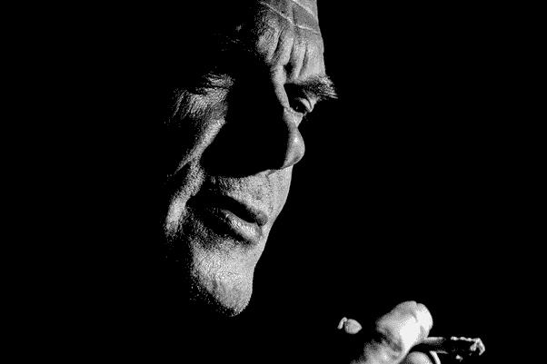

# 是什么造就了一个好的 ICO(首发币)？

> 原文：<https://medium.com/hackernoon/what-makes-a-good-ico-initial-coin-offering-370a2cfad11>

> 这个答案最初发布在 Quora 上。[可以在这里查看答案](https://www.quora.com/What-makes-a-good-ICO/answer/Brian-Schuster-5#bWKsB)。更多来自 [Quora](https://medium.com/u/3853f85f7d5e?source=post_page-----370a2cfad11--------------------------------) 的趋势科技答案，请访问【HackerNoon.com/quora】的。

我认为没有办法知道一个 ICO 是否真的“好”。

前一段时间，我回答了[我认为什么是好的 ICO 投资，但那篇文章的标题应该是“我如何避免坏的 ICO”。](http://hivergent.com/makes-ico-good-investment-thoughts-first-ico-investment/)

发现没有机会的坏 ICO 比发现相反的 ICO 容易得多。对我来说，一些负面特征包括:

*   筹集资金的团队尚未在其平台上投入大量工作
*   代币只是为了筹集资金
*   不愿透露姓名或有诈骗史的团队成员
*   可怕的秘密经济学
*   撒谎(这包括剽窃、假冒 ICO 顾问、窃取内容等)

这些指标中的每一个都旨在取消一个项目的资格，并使人们很容易忽略大多数 ICO。但这些都不会帮你选出“赢家”。

这是由于对创新历史的深刻认识:真正伟大的产品往往隐藏在看似愚蠢的想法背后。我们没有足够的创造力去想象未来，因此经常忽视伟大的想法。举几个最近例子:

*   优步(为什么你会搭一个陌生人的车？)
*   AirBNB(然后睡他们家！？！)
*   Snapchat(为什么要‘拍’我的朋友？脸书怎么了？)
*   Twitch(谁来付钱让我玩口袋妖怪？游戏玩家宁愿自己玩。)

创建这些组织的每个人都可以用他们现在拥有的财富创办一所大学。所有这些想法都太愚蠢了，以大多数人的标准来看都行不通。

加密货币也不例外。**就在你眼皮底下可能有突破性的想法，但你却无法识别。没有多少人能不经历信仰的巨大飞跃。**

所以，我采取了不同的投资方法:我尽可能地取消资格([“别傻了”](https://a16z.com/2015/09/12/a16z-podcast-the-best-way-to-be-smart-is-to-not-be-stupid/))，然后跟着感觉走([纳西姆·塔勒布风格](https://twitter.com/nntaleb))。我无法确定一个项目是否真的是一个好主意。但是如果我失败了，我宁愿失败在我相信的事情上，而不是失败在那些本该导致成功的标准上。

*Brian Schuster 是区块链行业的开发人员和作家。自 2017 年 1 月以来，他的内容被观看了超过 500 万次。你可以在他的 pateron 页面* *上查看更多* [*他的内容，他在这里*](https://www.patreon.com/hivergent) [*制作内容，帮助他的观众在这个新兴行业中找到自己的位置。*](https://www.patreon.com/hivergent)