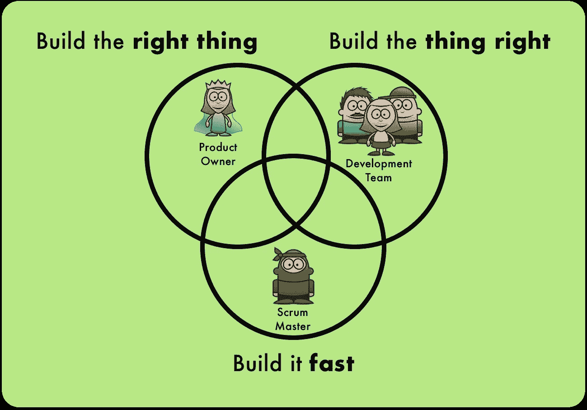

# 怎样才能成为一名优秀的 Scrum 大师？

> 原文：<https://medium.com/hackernoon/what-makes-a-good-scrum-master-fba685120534>

你应该成为 Scrum 大师吗？谁会是这个敏捷角色的合适人选？Scrum 大师*到底在做什么？*

# 基础知识:什么是 Scrum 大师？什么不是？

The most misunderstood role in Scrum is the Scrum Master

Scrum Master 是 [Scrum 项目管理框架](https://www.scrum.org)中三个角色之一的名字。这是最容易被误解的角色，因为它在传统的项目管理方法中没有对应的角色。Scrum 中的另外两个角色(产品负责人和开发团队)承担了传统上由项目经理执行的大部分任务，而 Scrum Master 则被赋予了全新的职责。

## Scrum 大师不是什么

让我们从打破一些常见的神话开始。Scrum 大师不是这样的人:

*   Scrum Master 不是项目经理
*   Scrum Master 不是老板
*   Scrum Master 不负责与利益相关者交流
*   Scrum Master 不是项目失败时的负责人
*   Scrum Master 不是召集所有人参加 Scrum 会议的人

嗯，如果她不是以上任何一种，那么 Scrum 大师会做什么呢？

A Scrum Master is neither a project manager, nor the boss or the person organizing meetings. But was is he?

## Scrum 主管的职责

想想在一个项目中，你需要什么来构建一个伟大的产品？首先，你需要制造正确的东西——一种有市场、顾客愿意购买的产品。这是 Scrum 中产品所有者角色的职责。然后，你需要把事情做好——一个有效的、高质量的、可以在未来改进的产品。这项任务落在了开发团队的肩上。但是你也需要快速建立这个东西——你不想错过市场机会或者在发布前就没钱了。这最终是 Scrum Master 的职责。

“快”这个词可能并不能完美地描述好的产品开发需要做什么。把它想成这样:

*   建立良好的工作流程
*   以可持续的速度工作(随着时间的推移，功能开发不会变慢)
*   保持每个人的积极性和参与度
*   尽早交付和获取价值
*   不要浪费时间建造错误的东西或错误的东西
*   保护团队，让他们能够完成工作
*   消除障碍，这样团队才能高效工作

有了这个好的产品开发实践的定义，你已经对一个好的 Scrum 大师必须做什么有所了解了…

Do you begin to see what a Scrum Master might do?

# 行动:一个 Scrum 大师做什么？

总结一下:

> 一个 Scrum 大师需要做一切保持团队高效的事情。

这包括帮助他们发现阻碍他们工作的问题，并帮助他们一次解决一个问题。它还包括帮助他们作为一个团队一起工作，省略技术债务，经常交付价值等等。

## Scrum 大师的典型任务

这里有几个 Scrum 大师的例子:

*   观察团队并**发现问题**(流程、个人、组织……)。
    *例子:一个团队成员独自完成任务，不与团队合作。这可能会导致诸如知识孤岛、难以维护产品、相互指责(没有共同责任)、未完成的工作、遗漏的集成或团队动力下降等问题。一个 Scrum 大师需要把这个问题放在桌面上，找出潜在的原因，然后和整个团队一起努力解决这个问题。*

*   定期召开会议**寻找紧迫问题的根源**并帮助团队提出可行的解决方案。
    *例子:在每两周一次的回顾中，Scrum Master 使用既定的方法来挖掘和识别阻碍团队工作的重要问题。他指导团队提出解决方案，并看到团队在接下来的两周内实施这些解决方案。*

*   **培训**产品负责人和开发团队的角色。
    *示例:产品负责人错误地试图在没有开发团队的情况下评估工作，然后将这些评估推给工程师。这是一种不好的做法！一个好的 Scrum 大师会让所有人都明白，产品负责人的角色是说“需要做什么”,开发团队的角色是说“如何”做以及“需要多长时间”。*

当然，这只是几个例子，但是现在你应该知道 Scrum 大师在做什么了。你也应该开始明白，Scrum 大师不仅仅是安排会议或端咖啡的人。

## Scrum 提供的特殊工具

尽管 Scrum 框架中的几乎所有东西都有助于 Scrum 大师完成他的工作，但是有一些东西对他特别有帮助。

**回顾**

Looking at how you do in the retrospective

该会议在每次冲刺后(即两周后)进行。它的唯一目的是持续过程改进**([改善](https://en.wikipedia.org/wiki/Kaizen))。重点是工作流程和协作，而不是产品。在这里，团队挖掘出哪些进展顺利，哪些进展不顺利；它会提出可行的解决方案和改进措施，并可以立即实施。把回顾想成是“学到的教训”，但要及时真正学习和改变一些东西！Scrum Master 主持这个会议，并帮助团队保持专注和不断改进。**

****障碍积压****

**Collect impediments in an impediment backlog**

**团队或 Scrum 主管可以在一个简单的列表中收集障碍(所谓的“障碍”)，这个列表被称为“障碍待办事项”。这有助于跟踪工作过程中的问题，并优先处理最紧迫的障碍。**

****追溯行动项目****

**It’s not enough to talk — you have to take action to solve problems**

**任何回顾会议的结果都是一些非常具体和可操作的任务，这些任务将被实施以改进过程。Scrum Master 确保每次回顾会产生大约 1-5 个在下一次冲刺中要做的改进。保持行动项目的数量少——一次处理太多的障碍会导致瘫痪，根本没有改善！**

****冲刺****

**Watch the team during their day-to-day work to find improvements opportunities**

**冲刺阶段是团队致力于产品的时候。它占用了项目 90%的时间。一个 Scrum 大师需要观察团队，并一直与他们交流，以发现并消除障碍。**

****每日混战****

**The daily stand-up meeting is a great opportunity to pick up impediments**

**这个简短的每日会议是为了让开发团队进行协调。对于任何 Scrum 大师来说，这都是一个绝佳的机会，可以找出需要解决的问题。关于如何开好每日 Scrum 会议的实用技巧，你可以上我的 Udemy 视频课程[避免每日 Scrum 会议的 19 个陷阱](https://www.udemy.com/the-daily-scrum-common-pitfalls-and-how-to-avoid-them/?couponCode=DAILY_MEDIUM_1809)(目前你可以享受 90%的折扣！).**

****冲刺壁****

**Watching the Sprint wall can give you clues towards looming impediments**

**团队在 sprint 期间需要做的所有工作都在 Sprint Backlog 中——最常见的形式是墙上的索引卡。观察这面墙和卡片如何移动(或不移动)可以给 Scrum Master 提示可能的障碍。**

****完成的定义****

**Everyone should have the same definition of when something is “done”**

**团队工作过程中的很多问题都是通过完善 Done 的定义来解决的。例如，如果特性开发很慢，团队发现这是由糟糕的代码质量引起的，一个可能的解决方案是在标记“完成”之前，期望对每个特性进行代码审查、自动化测试和重构。**

**当然，一个 Scrum 大师可以做的比我列出的多得多(例如，教产品负责人区分特性优先级的方法，帮助团队创建团队宣言，或者帮助向利益相关者阐明评审的重要性)。**

# **普罗维登斯:怎样才能成为优秀的 Scrum 大师？**

**到现在为止，你应该对 Scrum Master 的存在以及她的任务有了很好的理解。但是，哪些行业可以成为优秀的 Scrum 大师呢？这个角色适合你吗？你会让你的团队或公司中的谁来担当 Scrum Master 的角色？**

**以下是对一个优秀的 Scrum 大师有益的 8 件事:**

1.  **经验丰富！(过去做过 Scrum 项目)**
2.  **安于不方便，讨厌和皮塔饼**
3.  **观察和倾听的能力**
4.  **没有上级**
5.  **服务型领导**
6.  **神入**
7.  **爱说话的**
8.  **不怕(上级或被解雇)**

**A good Scrum Master is fearless and ready to sacrifice himself**

**虽然这些绝不是扮演 Scrum 大师角色的先决条件，但是这些职业都会让 Scrum 大师受益匪浅。**

**我希望我能让你更好地理解“Scrum Master”这个经常被误解的角色到底是什么。也许我甚至可以说服你自己成为一名 Scrum 大师。**

# **关于我**

**我是 Matthias Orgler，一名 Scrum 教师和敏捷教练。在硅谷工作了一段时间后，在过去的 10 年里，我为许多大大小小的公司提供了敏捷方法方面的建议和指导。今天，我作为一名音乐家在欧洲举办音乐会，享受家庭生活。作为一名 Scrum 教师和敏捷教练，我仍然向选定的客户提供我的知识——如果你对我的帮助感兴趣，[请随时联系我](https://www.linkedin.com/in/orgler/)。**