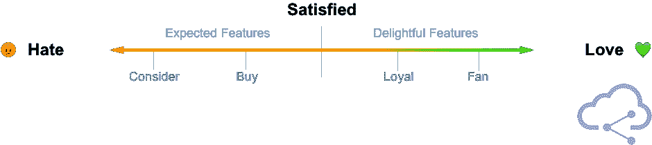
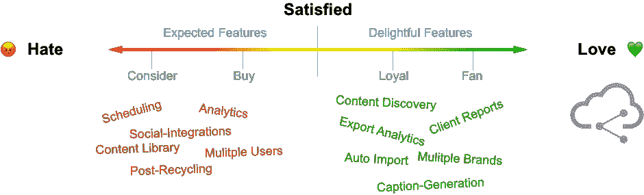

# 什么是伟大的产品？

> 原文：<https://medium.com/hackernoon/what-makes-a-great-product-5c12291ce65b>

一个快乐的顾客带来的满足感远远超过你从一个产品中获得的金钱收益。但是，你如何让你的顾客开心呢？

简单—伟大的产品和卓越的支持。嗯……一个伟大的产品需要什么？

你想要一种顾客会依赖的产品；不是以上瘾的方式，而是以形成习惯的方式。如果你的产品能成为他们日常生活的一部分，他们会开始怀疑没有它他们是怎么活下来的。

一旦你到了那个时刻，你不仅拥有了一个长期客户，还拥有了一个大使——一个会和朋友、同事、家人分享你的产品的人。

Product-Feature Landscape

直到你拥有了所有或大部分预期的功能，潜在的客户才会购买。在你拥有预期的特性之前，你不能开始研究令人愉快的特性。

因此，最起码，你需要预期的特性或一个 MVP。但是，即使客户购买的只是最基本的功能，你也不可避免地会有客户流失和很少的口碑增长。

开始添加那些意想不到的、令人愉快的功能来把顾客变成粉丝是至关重要的。

这些是真正让你的客户生活更轻松的特性——如果他们离开你的产品去买另一个，他们会错过这些特性。

考虑到这一点，我将我们现有的功能放在桶中，以更好地了解我们的产品可以改进的地方。

[Cloud Campaign](https://cloudcampaign.io)’s Product-Feature Landscape

将您现有的功能放入桶中，不仅可以帮助您了解您的产品可能缺少的地方，还可以帮助您了解对不同目标受众的价值主张，以便您可以更有效地营销它。