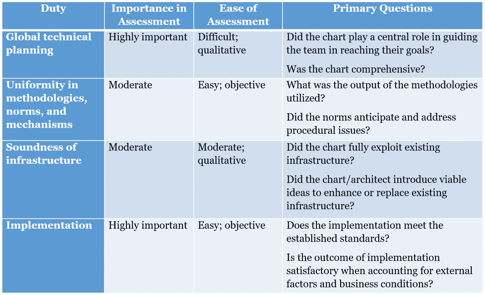

# 是什么造就了顶尖的互联网架构师？

> 原文：<https://medium.com/hackernoon/what-makes-a-top-notch-internet-architect-1d319cdffc77>

为什么每个计算机工程师都是未来的建筑师？

技术架构遭遇了一个特殊的悖论——尽管是许多讨论的主题，它的真实范围仍然是许多困惑的来源。也许这是一个时代的标志，在当前的技术发展阶段，几乎每个人都需要架构能力，因此导致了过多的架构图和同等数量的关于薄弱设计和复杂结构的批评。

【】阿里巴巴国际技术部高级工程师曹阐述了作为阿里巴巴的一名架构师意味着什么，以及这一职位所伴随的价值观。

# **两类建筑师**

任何在技术行业工作了五年以上的人都会熟悉在小型 R&D 团队或项目中承担非特定的架构责任。这种情况需要项目的关键设计和实现，产品基础设施的维护，以及可行的新思想和框架的引入。成功履行这些职责为员工在团队成员中赢得了良好的声誉，并使他们在高层管理人员眼中与众不同。

这就是所谓的“兼职架构师”，这是大多数开发人员或项目经理在他们自己的角色中承担的一部分时间的责任，在监督小单元时实现自己创建的架构。

另一方面，一个“全职架构师”可以被期望应对更大规模和影响的挑战，跨越所有的业务系统。这种类型的架构师很少直接负责具体的项目。相反，他们与更大的团队和更广泛的领域一起工作，获得对所有项目的深入理解。

尽管公司内部对技术架构师或架构师团队的有效性几乎没有任何共识，但阿里巴巴继续根据不同团队的要求和每个项目的规格，遵循中间路线。

# **全职架构师的职责**

在调查这种角色的性质的任何尝试中，我们必须首先限制和定义责任。这方面的一个很好的例子是微软的多种分类——企业架构师(EA)、基础架构架构师(IA)、特定于技术的架构师(TSA)和解决方案架构师(SA)——基于公司内的不同学科和部门。

除了 EAs，阿里巴巴在不同的运营时期使用了所有类型的架构师。大多数兼职架构师通常专注于产品系统架构，属于 sa 的范畴，而 ia 和 TSA 则是更多的全职架构师，他们设想问题域及其相应的系统架构。

鉴于这一角色的性质，全职架构师需要承担相应的责任:

## **职责 1。全球技术规划**

架构师的首要职责是展示技术规划的熟练程度。这里最重要的输出是架构本身，换句话说，就是蓝图，或者阿里巴巴所谓的“图表”。对架构师来说，这里的主要考验不仅在于确定哪些元素出现在图表中并解释原因，还在于确定哪些元素没有出现在图表中。对于一个统一指导整个团队工作的图表来说，它必须去粗取精，尽可能保持清晰和具体。

这方面的另一个方面是纳入一个既包容又体贴的整体视角。包容性的技术规划使图表能够作为不同子图表的组合，并在所有领域提供明确的指导；一个体贴的图表不仅关注团队的短期和长期利益，也关注公司的长期和短期利益，确保在更大的组织内单位的可持续增长和和谐发展。

除了敏锐的眼光之外，架构师还必须拥有沟通技巧，向各种涉众(包括那些可能不是相关技术领域专家的人)深入地传达采用模式选择方法的基本原理。

## **职责二。方法、规范和机制的统一**

不管质量如何，一个蓝图仍然需要架构师用方法、规范和机制来补充它，以便成功地实现它。尽管相当繁琐和复杂，但是以这种材料的形式提供支持可以确保整个团队有效地按照蓝图行动。规范指导有序的进展，为此，图表必须分解为纵向和横向维度，并且在功能上足够内聚，以关联权力和责任。

## **职责三** **:基础设施完善**

蓝图定义了团队行动，规范指导了过程，基础设施充当了武器库。基础设施的健全决定了队伍是配备步枪，还是配备坦克。由于这通常是根据具体情况决定的责任，特别是在有物理架构团队的情况下，核心架构师应该为蓝图的整体成功承担一部分责任。

## **职责四:实施**

最终，任何无法实施的计划都等同于空谈。由于绝大多数架构职责都是硬实力的渠道，运用软实力的需求使得实现对于大多数全职架构师来说是一个挑战。响应外部因素和组织结构中的各方是实现的关键组成部分，在这个阶段脱离过程的全职架构师冒着他们的计划被打上不切实际的标签的风险，或者更糟，不切实际。

# **全职建筑师的权利**

虽然他们在公司和公司流程中的角色可能是非传统的，但架构师不应该在一个没有权利的框架中工作，尤其是在处理影响力的时候。有些人可能认为，只有拥有动员和协调能力的组织领导者才符合这种要求。其他人认为，由于架构师存在于组织的外围，他们很少对技术团队及其产出负责。

如今，大多数领导者的职责与 EAs 相似——尤其是在绘制各种业务系统和组件，以及规划它们的发展方面。然而，由于时间和精力的稀缺，这种职责侧重于长期的组织政策，而不是利基项目，表明了公司领导人和埃及艾滋病协会之间的影响力水平的明显差异。

# **全职建筑师考核**

公司可能很难在复杂的角色和责任的背景下评估架构师的表现，并且当涉及到确定个人目标时，架构师可能会发现自己没有方向。

团队、职业权利和外部环境是高度可变的，因此作为成功的指标是不可靠的。一个真正以结果为导向的评估可能会以主观的方式包含这些因素，但是会把最大的重点放在实施和建筑师参与完成图表上。

# **关于实施的一些想法**

考虑到当前的场景，建立一种“架构语言”应该是一致的沟通和协作的首要任务。该语言的基础不在于新的语法，而在于为生产团队清晰地定义业务架构，为运营团队定义应用和部署架构。

这应该为建立一个“身份机构”铺平道路，通过建设技术能力、知识转移的便利性和专门的工作人员系统逐步形成。

架构师可能还会发现，在与团队成员打交道时，采取面向客户的态度可以更好地参与实现过程。毕竟，建筑师促进平台、服务和机会的提供，目的是赋予每个 R&D 成员实现其目标的能力。

建筑从无到有，抽象将外部转化为内部，设计将粗糙的东西转化为精致的产品。

# 阿里巴巴科技

关于阿里巴巴最新技术的第一手、详细、深入的信息。**关注我们**:【www.facebook.com/AlibabaTechnology 