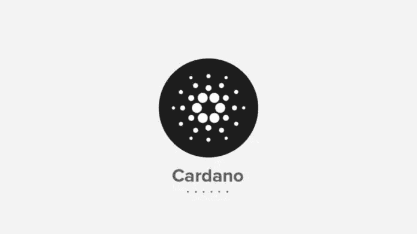

# 从长远来看，是什么让卡达诺比以太坊更有价值？

> 原文：<https://medium.com/hackernoon/what-makes-cardano-more-valuable-than-ethereum-in-the-long-term-43031e01a41f>

> 这个答案最初发布在 Quora 上。[可以在这里查看答案](https://www.quora.com/What-makes-Cardano-more-valuable-than-Ethereum-in-the-long-term/answer/Brian-Schuster-5)。更多来自 [Quora](https://medium.com/u/3853f85f7d5e?source=post_page-----43031e01a41f--------------------------------) 的趋势科技答案，请访问【HackerNoon.com/quora】的。

这是一个非常年轻的项目，由以太坊的联合创始人查尔斯·霍金森发起。这个项目最大的好处是一个健康的后知之明:以太坊在 2015 年推出，这意味着查尔斯和他的团队有两年的“真实世界”数据来创建他们的新项目。他们能够设计一些东西，理论上，可以解决以太坊今天正在处理的许多问题(主要围绕缩放)。

此外，以太坊已经推出并投入使用，这意味着它限制了它在不破坏许多功能应用的情况下实际改变自身的数量。如果以太坊的某些东西最终不可行，那么卡尔达诺将有显著的优势。

此外，Cardano 声称采用科学的、同行评审的方法来创建项目，这在他们设计白皮书的方式中是不言而喻的。

我认为这种科学的严谨既是积极的，也是消极的。一方面，你有一个非常谨慎的方法来创建区块链，这对我们希望依赖的任何系统都是必要的。另一方面，团队并不关心社区甚至开发人员的可访问性。我发现理解 Cardano 提供的东西可能相当具有挑战性，即使在花了一些时间阅读他们的研究之后。

**另一个不利于 Cardano 的不利因素是，以太坊目前是区块链平台的市场领导者。他们拥有最大的开发平台和最大的用户群。**即使 Cardano 在技术上更好，以太坊开发者的转换成本高，网络效应强，这给了他们很大的动力去固定以太坊，而不是移动平台。可能会有一场震动导致以太坊失去它的头把交椅，但这是每个竞争者都将面临的巨大障碍，包括卡尔达诺。

我关注的一个人 Cryptocandor 有几个视频更详细地介绍了 Cardano。如果你对这个项目感兴趣，我建议你看看:

*最初发表于*[*【www.quora.com】*](https://www.quora.com/What-makes-Cardano-more-valuable-than-Ethereum-in-the-long-term/answer/Brian-Schuster-5)*。*