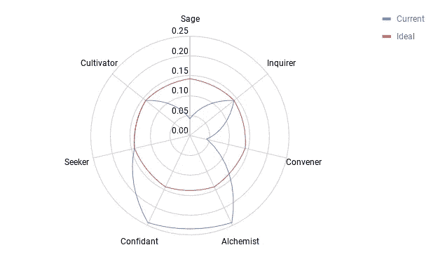

# 是什么让移情在技术中如此强大？

> 原文：<https://medium.com/hackernoon/what-makes-empathy-so-powerful-in-technology-fa463e990753>

credit: [https://unsplash.com/photos/FHl79chXS6s](https://unsplash.com/photos/FHl79chXS6s)

最近，我一直在探索如何将同理心灌输到技术中，以及为什么同理心是技术中缺失和存在的强大部分。

有些论点表明，技术缺乏同理心，反之亦然，它创造了大量的同理心。

[这篇发表在《纽约客》上的文章](https://www.newyorker.com/business/currency/silicon-valley-has-an-empathy-vacuum)探讨了在某些情况下，技术应用中如何存在移情真空。

[这篇发表在《观察家报》上的文章探讨了科技是如何缺乏或者包含同理心的。](https://observer.com/2016/12/solving-for-empathy-in-tech/)

我一直在读的一本书叫做[，作者是 Sub Rosa 创始人迈克尔·文图拉](https://www.amazon.ca/Applied-Empathy-New-Language-Leadership/dp/1501182854/ref=sr_1_1?ie=UTF8&qid=1535720109&sr=8-1&keywords=applied+empathy)。

在这本书里，探索了一些应用的用例，并开发了应用共情的框架。

解决以下问题:

> 是什么让移情在技术中如此强大？

我将探讨迈克尔·文图拉的书中概述的 7 种移情原型如何围绕技术领域的轮廓类型发展，以及每种类型如何产生不同的力量。

描述的 7 个移情原型是:

1.  圣人——此时此地
2.  询问者——审问假设真理
3.  召集人——预见他人的需求
4.  炼金术士——不惜一切代价测试和学习
5.  知己——培养观察和吸收的能力
6.  探索者——自信无畏
7.  耕耘者——有目的地培育，有意地成长

在这本书里，对每一个原型都进行了详细的描述，并开发了一个定位矩阵，让你发现这些原型中有多少是你自己。

[这篇在线文章也提供了更详细的信息。](https://www.the-numinous.com/2018/05/22/applied-empathy-what-type-of-empath-are-you/)

为应用于技术产品建立了一个单独的框架——我一直在探索这些原型中的每一个如何定义用户的旅程，以及每一个如何与其他原型结合起来应用，以满足每种类型的原型的需求。

## 圣人——此时此地

在这种原型中，用户想要一种脱离的方式，专注于此时此地。对于大多数技术产品来说，我们试图吸引人们进入其中，而不是与他们周围的世界互动。

我认为这是一个探索更多无缝集成技术的机会，如 nest 或 august 门锁 Golden Krishna 的一本名为[最佳界面是无界面](https://www.amazon.ca/Best-Interface-No-brilliant-technology/dp/0133890333/ref=sr_1_1?s=books&ie=UTF8&qid=1535720663&sr=1-1&keywords=the+best+interface+is+no+interface)的书探讨了这一点。

这个为什么厉害？我的假设:活在当下和消除噪音是我们互动和度过一天的关键部分，像 [Flipd](https://www.flipdapp.co/) 和 [Forest](https://www.forestapp.cc/en/) 这样的应用程序正在迈出伟大的第一步，以清除我们手机上的干扰，让我们在现实世界中更真实。

## 询问者——审问假设真理

对于今天的技术来说，这通常是通过应用内聊天或帮助部分来解决的——或者这如何能发展成一种自我发现的方法——为什么每个产品不应该有自己的内部搜索功能，达到与谷歌或必应相同的程度？在问答中。

例如，在使用一个帮助我管理财务的应用程序时，我想问这样一个问题:

> 为什么我没有存下我想要的那么多钱？并查看对我/信息的适用回复，以帮助我到达目的地

这个为什么厉害？我的假设是:有能力以一种真实的方式与用户建立联系——有这种联系来问问题和有洞察力为技术和用户创造力量。

## 召集人——预见他人的需求

相当多的实验和技术公司来做这件事——基于你以前的历史自动选择和建议——来预测在某些用例中可能意味着易用性。来自纽约的教授莫兰·瑟夫(Moran Cerf)将这一点提升到了另一个高度来预测我们的选择:

这个为什么厉害？我的假设是:鉴于技术可以为我们卸载决策，这是非常强大的，然而我们对欲望的真实预期是规律性和对现在的深刻理解的结合。

## 炼金术士——不惜一切代价测试和学习

如今，几乎每家科技公司背后的核心思想都是迭代和反馈过程，以改善他们的产品——但我问自己，为什么不把重点放在让用户更好地理解产品使用中的迭代和扩展上？

> 例如，一个让你在线点餐的手机应用程序——应用程序中不能有明确的实验来帮助维持你的饮食目标吗？

这个为什么厉害？我的假设是:为了学习，我们需要实验并发现什么对我们个人有用，如果技术可以帮助指导我们通过实验过程，力量是可以被给予的！

## 知己——培养观察和吸收的能力

大多数技术产品的核心是这样的——它们让我们将我们的信息、对话、需求和愿望记录到一个应用程序中，使我们能够做某些事情。

我问自己的一个问题是，我们如何反过来成为这些信息的主要受益者。

这个为什么厉害？我的假设:就像日记技术可以帮助我们以无限的方式跟踪和记录信息一样，从这些信息中发现洞察力是真正赋予用户权力的一种方式。

## 探索者——自信无畏

这一原型以及最后一个原型更加抽象，因为自信和无畏地寻求新信息是技术公司正在建设的一部分，然而大多数时候，重点是将信息内在化，并寻求业务而不是个人特性中的用户。

作为一名探索者，我发现自己被技术对自己的行为或与他人的对话做出的错误假设拒之门外——作为人类，我们会犯错误，技术并不总是表达错误的好方式——电子邮件、短信、电话、网站、应用程序、设备等。往往会被误解，只有当我们发送手写的信件或亲自会见某人时，我们真正的探索才会被发现。

这个为什么厉害？我的假设是:每天我们都在寻找新的信息，无论是在 instagram 上还是通过赞拍摄的自拍照的反馈，我发现的力量在于寻找信息和立即获得有价值的反馈之间的反馈回路。

## 耕耘者——有目的地培育，有意地成长

这是市场上许多产品的理想目标——一个工具，一个应用程序，一个设备，一粒药丸，一本书……所有这些都将改变你的生活，让你以你以前从未发现过的方式成长。

但是我想知道，对于每一种类型的产品，需要什么样的反馈回路来实现更有意识和自然的体验，让用户适应他们在生活中的位置，并做出相应的调整。

这个为什么厉害？我的假设:在技术领域，如果我以前不能这样做，我可以通过使用一个小工具或小部件来增长的想法变得令人兴奋——这个钩子很强大。

## 所有类型的组合

我对当前软件和硬件产品类型组合的看法——我发现倾向于知己和炼金术士原型——从我们将秘密交给计算机并允许计算机进行实验的角度来看，这很有趣，但缺乏对价值的预期和呈现。

Figure 1: Archetype Positioning for Tech Products

总而言之，每个原型在应用于技术时都有不同的意义和目的——我们如何应用和平衡每个原型可以极大地改变我们使用、获取价值和开发产品的方式。

我希望迈克尔·文图拉描述的这 7 个原型对你有所帮助，如果你选择阅读《应用共情》这本书，我希望它比我上面提到的最初几个要点更有价值。

如果你喜欢这篇文章，请鼓掌，谢谢👍