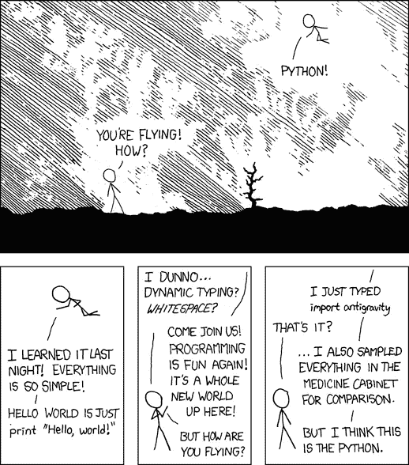

# 是什么让 Python 变得很酷。

> 原文：<https://medium.com/hackernoon/what-makes-the-python-cool-426e4c576685>

正如题目所说，我们将深入了解由 [Python](https://hackernoon.com/tagged/python) 提供的一些很酷的特性。


[Python](https://hackernoon.com/tagged/python) 有很多功能(或者说技巧),这使得该语言不同于其他语言，例如

1.**蟒蛇之禅**

```
>> import thisBeautiful is better than ugly.Explicit is better than implicit.Simple is better than complex.Complex is better than complicated.Flat is better than nested.Sparse is better than dense.Readability counts.Special cases aren't special enough to break the rules.Although practicality beats purity.Errors should never pass silently.Unless explicitly silenced.In the face of ambiguity, refuse the temptation to guess.There should be one-- and preferably only one --obvious way to dAlthough that way may not be obvious at first unless you're DutcNow is better than never.Although never is often better than *right* now.If the implementation is hard to explain, it's a bad idea.If the implementation is easy to explain, it may be a good idea.Namespaces are one honking great idea -- let's do more of those!
```

如果你在终端上输入这个命令，你会得到“Tim Peters 的 Python 之禅”，这将帮助你提高 Python 代码[的可读性、可用性和可维护性。](https://hackernoon.com/tagged/code)

查看此视频了解更多细节

2. **XKCD 漫画**

```
>> import antigravity
```

如果你在终端上输入这个命令，你会在你的浏览器中看到一个很酷的漫画，就像这样



3.**一行中两个变量的交换**

Python 提供了一个很酷的功能，可以在一行中交换两个变量，使用一种叫做元组解包的东西，这将使你的代码更短更易读

```
>> a = 10>> b = 20>> print(f"Before swapping value of a = {a} and b = {b}")Before swapping value of a = 10 and b = 20>> a, b = b, a>> print(f"After swapping value of a = {a} and b = {b}")After swapping value of a = 20 and b = 10
```

如果你想深入了解这个元组解包，我建议你去看看 trey hunner 的博客

[](http://treyhunner.com/2018/03/tuple-unpacking-improves-python-code-readability/) [## 多重赋值和元组解包提高了 Python 代码可读性——Trey Hunner

### 多重赋值和元组解包提高 Python 代码可读性 2018 年 3 月 7 日下午 4:30 |评论我是否…

treyhunner.com](http://treyhunner.com/2018/03/tuple-unpacking-improves-python-code-readability/) 

4.**使用一行代码创建一个 web 服务器**

```
>> python -m http.server 8000
```

要创建一个简单的文件共享应用程序，请转到您想要共享的文件夹并键入上述命令，然后转到您的浏览器并键入`127.0.0.1:8000`以在您的浏览器中打开该文件夹，如果您在同一个[网络](https://hackernoon.com/tagged/network)中，您也可以从其他设备使用该程序。

这里有一个链接可以了解更多

5.**所有数据结构在一个地方:集合**

```
>> from collections import Counter>> myList = [1,1,2,3,4,5,3,2,3,4,2,1,2,3]>> print(Counter(myList))Counter({2: 4, 3: 4, 1: 3, 4: 2, 5: 1})
```

这个模块有数据结构，可以帮助你不用写太多代码就能解决各种现实生活中的问题。

 [## 8.3.集合-容器数据类型- Python 3.7.0 文档

### 属性返回一个新的，其中包含当前实例中除第一个以外的所有地图。这对…很有用

docs.python.org](https://docs.python.org/3/library/collections.html) 

6.**python 的瑰宝:Itertools**

Itertools 是 Python 3 中最重要的标准库之一，它内置了很多特性。Itertools 提供了创建快速、节省内存且美观的代码的功能。

在 Itertools 模块中你会发现很多有用的函数，让我们来看看其中一个流行的

```
>> import itertools>> itertools.permutations('ab')[('a', 'b'), ('b', 'a')]
```

要了解更多关于 Itertools 的信息，请点击此链接

[](https://realpython.com/python-itertools/) [## Python 3 中的 Itertools，举例来说——真正的 Python

### 它被称为“宝石”和“有史以来最酷的东西”，如果你没有听说过它，那么你是…

realpython.com](https://realpython.com/python-itertools/) 

7.**索引循环:枚举**

这是一个很酷的特性，它提供了索引，而不必为索引定义任何计数器

```
>> mylist = [1,13,16,15,80]>> for i, value in enumerate(mylist):print( i, ': ', value)0 : 11 : 132 : 163 : 154 : 80
```

8.**倒榜**

在任何编程语言中，逆向总是一项单调乏味的任务，但是 Python 内置的 reversed()函数允许您在一行中创建列表的逆向

```
>> lst = [1, 2, 3, 4, 5]>> list(reversed(lst))[5, 4, 3, 2, 1]
```

欲了解更多详情，请点击此链接

[](https://dbader.org/blog/python-reverse-list) [## 如何在 Python-dbader.org 中反转列表

### 这是一个循序渐进的教程，介绍了反转 Python 列表或数组的三种主要方法:就地反转、列表切片和…

dbader.org](https://dbader.org/blog/python-reverse-list) 

9.**使用 Zip 添加两个列表**

假设你有两个列表，你想添加那个列表的元素，那么 python 有一个 Zip 函数，它会派上用场，不用嵌套循环就能给你结果

```
>> a = [1,2,3]>> b = [4,5,6]>> for i,j in zip(a,b):>>     print("Sum of a and b is", i+j)Sum of a and b is 5Sum of a and b is 7Sum of a and b is 9
```

Zip 操作在数据科学中很流行，因为它是矩阵乘法，Zip 可以用来做行和列的乘法。

10.列表/集合/字典理解

理解提供了在一行中定义任何复杂代码的最简单方法

> *假设您想要对 1–20 的偶数求平方*

如果你使用普通的 if-else，那么代码将会是这样的

```
>> square_list = []>> for number in range(1,20):>>    if number % 2 == 0:>>        square_list.append(number*number)>> print(square_list)[4, 16, 36, 64, 100, 144, 196, 256, 324]
```

如果使用列表理解，你只需要输入较少的代码

```
>> square_list = [number*number for number in range(1,20) if number%2==0]>> print(square_list)[4, 16, 36, 64, 100, 144, 196, 256, 324]
```

以同样的方式，可以使用字典理解和集合理解

```
>> my_dict = {i: i * i for i in range(10)}>> my_set =  {i * 10 for i in range(10)}>> print(my_dict){0: 0, 1: 1, 2: 4, 3: 9, 4: 16, 5: 25, 6: 36, 7: 49, 8: 64, 9: 81}>> print(my_set){0, 70, 40, 10, 80, 50, 20, 90, 60, 30}
```

11.**现代词典**

Python 字典非常强大，如果你深入了解 python，那么一切都围绕着对象和字典。

如果你想了解更多关于字典的知识，那么看看这个视频，你会学到字典的很多重要功能

12.**漂亮的印刷字体**

这是以漂亮的方式打印列表和字典的最简单的方法

```
>> import pprint>> pp = pprint.PrettyPrinter(indent=4)>> pp.pprint(my_dict)
```

这在处理大型字典时很方便，或者如果您正在处理 JSON 文件，那么您可以使用 pprint 来打印 JSON 文件。

13.**使用交互式“_”运算符。**

```
>>> 2 + 24>>> _4>>> print(_)4
```

“_”引用最后执行的表达式的输出。

> ***在这个 Python 的顶层还提供了很多外部库，这些库比任何编程语言都有更好的特性，我在下面命名了几个顶层库***

1.  Numpy
2.  熊猫
3.  sci kit-学习
4.  Scrapy
5.  美味的汤
6.  OpenCV
7.  要求
8.  Matplotlib
9.  Pygame
10.  SQLAlchemy
11.  SciPy
12.  扭曲的 Python

在经历了所有的酷功能后，你的感觉就像


这就是我对 Python 的看法，如果你有任何疑问或者想补充什么，请在下面评论。