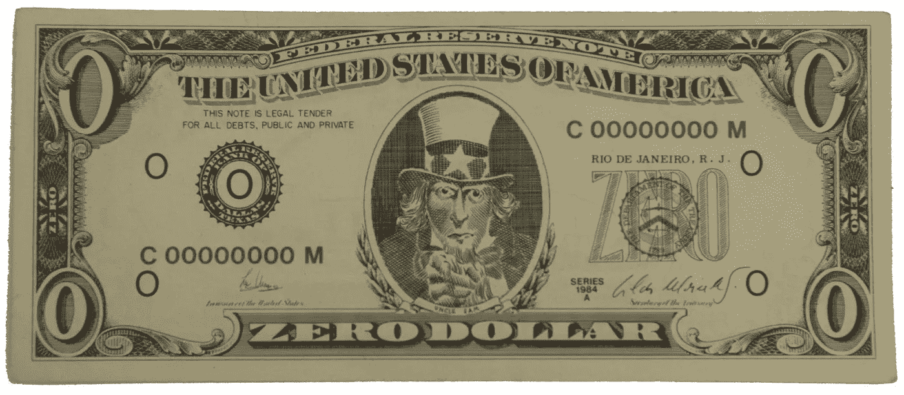
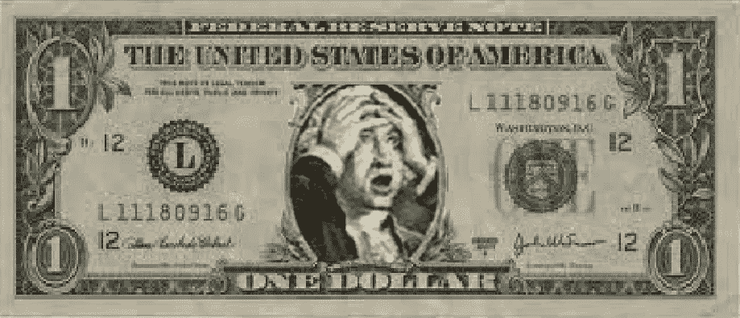
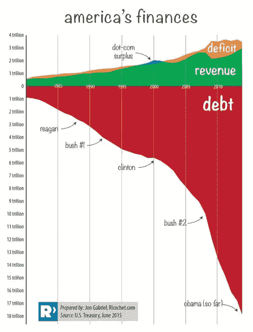

# 钱是什么，有什么不好？

> 原文：<https://medium.com/hackernoon/what-money-is-and-whats-wrong-with-it-8bca0e20a333>

[Source](https://www.artspace.com/cildo_meireles/zero_dollar)

## 质疑假设

> 金钱已经成为我们戴在鼻子上的一个环，让我们被控制它的人牵着鼻子走
> 
> —马克·金内

金钱是人类社会的核心技术之一。它是我们相互交易的手段。在许多(如果不是大多数的话)现代社会中，金钱已经成为组织许多人际关系的核心要素。

问钱是什么似乎是一个微不足道的问题，几乎不值得一问。毕竟，我们在日常生活中经常使用它，但在大多数情况下，我们并不关注它——除了偶尔担心我们是否有足够的时间。我们毋庸置疑的假设是，它是经济系统的中性润滑剂，绝不会影响该系统的工作方式。我们也倾向于假设今天的货币以它一贯的方式运转。

事实上，这些以及其他大多数关于金钱的常见假设都是错误的。从历史的角度来看，今天覆盖各个国家和地区的单一货币体系是非常特殊的。虽然各个历史阶段的帝国都有覆盖大片地区的货币，但基于本地的货币体系——有时与帝国货币一起使用，通常是单独使用，而且没有帝国货币——更为常见。

第一枚美元于 1792 年铸造，最初美国的早期成员国都发行了自己的版本([多](https://en.wikipedia.org/wiki/Early_American_currency))。在引入之前，美国至少有 7000 种不同的货币在流通(Dawson，2009)。北美的第一批人通过易货和各种货币在部落间进行交易。

有史以来使用的许多货币都不是纸币和硬币的形式。交换系统包括珠子、贝壳、牛、可可豆、谷物、羊毛、贵金属和许多其他材料和资源。即使在今天，绝大多数“货币”——通常超过 90%——不是由纸币和硬币组成的，而是从未离开过银行计算机数据库的数字化列。

大多数人相信或曾经相信——随着一种新的意识通过社交媒体迅速传播——今天所有的钱都是政府创造的。事实并非如此。虽然政府宣布欧元、英镑、日元或美元等货币为“法定货币”，但它们通过国家造币和印刷机构发行的纸币和硬币只占每年流通货币的很小一部分。超过 90%的货币是由银行*以债务*的形式创造的，几乎是无中生有。

每当一笔贷款被批准，一家银行将其记入账簿，全球经济中的货币量就会增加一点。这些钱完全基于对特定货币体系的集体信任。这种货币被称为法定货币，因为它们被宣布为法定货币，没有任何实物商品的支持。这种法定货币的价值来源于供求关系，而不是制造货币的材料的价值。

上面是一个简短的视频(2:30 分钟)解释了[法定货币系统](https://www.youtube.com/watch?v=U8Yn5jT8Hyc)的基本知识，下面是一个简短的视频向你介绍了[钱从哪里来？](https://www.youtube.com/watch?v=l7L3ZtCSKKs)’(7:30 分钟)，新经济学基金会的一份内容丰富的[出版物](http://s.bsd.net/nefoundation/default/page/file/b847162e8c996d5e26_fam6bqdx4.pdf)。

如果你想深入了解这一点，可以看看纪录片(80 分钟)‘货币修复’，其中包括对世界上一些在重新设计和改革我们的货币体系领域最重要的先驱的采访。它提供了我们当前货币体系的历史和分析，以及这一体系的设计缺陷，这些缺陷是当今人类面临的许多危机的基础。纪录片的最后三分之一解释了替代性地方和区域货币如何能够加强区域经济，以及它们在重新设计我们的货币体系时可以提供什么。

由于发行货币进入流通的银行承兑债务必须连同利息一起偿还，当贷款被偿还且最初创造的货币被取消时，产生的累积利息仍留在系统中，并产生“债务要求”(必须发放新贷款以确保有足够的货币供应来偿还现有贷款)，这反过来产生了一个功能失调的系统，该系统需要保持增长以避免崩溃。

> “经济增长的必要性导致了过剩的经济产出以及随之而来的物质资源的耗竭、环境的破坏、收入和财富分配的日益不平等以及困扰现代文明的许多其他问题。”
> 
> — [小托马斯·格列柯，2015 年](http://beyondmoney.net/tag/growth-imperative/)

[Source](https://www.armstrongeconomics.com/uncategorized/coming-emerging-market-debt-meltdown/)

[Source](https://beyondmoney.files.wordpress.com/2015/10/usdebtdeficits.jpg)

处于我们货币和金融体系设计核心的债务和增长需要一个为了消费而积极推动消费的营销行业，以避免这种结构性依赖经济增长的体系的崩溃。

因此，人们开始明白，金钱比我们通常想象的要令人惊讶和复杂得多。关于货币和银行贷款的一个最大的误解是，它们总是与支付利息联系在一起。事实上，直到最近，所有伟大的一神教都将收取利息，高利贷，视为不可饶恕的大罪。虽然基督教和犹太教现在接受收取利息，但伊斯兰银行机构至今仍在无息状态下运作(Lietaer，2001)。

许多历史上使用的自然商品形式的“货币”——谷物、可可豆、羊毛等等——实际上随着时间的推移而贬值。一些货币系统已经采用了这种特征——称为[滞期费](https://en.wikipedia.org/wiki/Demurrage_(currency))——在每个月或每年的月底对每张纸币或硬币收费，导致其随着时间的推移逐渐贬值。这鼓励消费而不是囤积，几个辉煌的历史时期——包括 12 和 13 世纪的早期欧洲文艺复兴，当时欧洲大多数伟大的哥特式教堂都被建造起来——与基于*滞期费* (Boyle，2003) *的货币体系的存在相吻合，并且似乎在某种程度上与之相关。许多最近的共同体货币倡议，例如英国的斯特劳德英镑，已经重新引入滞期费作为设计特色。*

[Community Currency Knowledge Gateway](http://community-currency.info/en/)提供各种当地和地区货币的最新信息。[滞期费](http://community-currency.info/en/glossary/demurrage/)已经被证明是许多地区货币的一个有用的货币设计特征。使用戳记方法，德国的'[基姆高尔](http://community-currency.info/en/currencies/chiemgauer/)'、法国的'[弗赖科恩](http://freico.in/)'和'[阿贝耶](http://community-currency.info/en/currencies/abeille/)'以及奥地利的'[瓦尔德维特勒](http://www.waldviertler-regional.at/)'等地区性货币表明，如果适用滞期费，货币在当地经济中的流通速度会更快。

但是，在我们更深入地了解各种当地和地区货币[示例](https://gaiaeducation.org/elearning/design-for-sustainability/economic-design/)以及不同的系统如何服务于不同的目的和规模之前，让我们更仔细地了解一下当前系统设计在激励和结构性规定方面使用货币的影响。这些都是需要理解的要点，因为这里的设计变化将作用于至关重要的杠杆作用点，这些杠杆作用点可以推动系统性的变化和转变，使地球上再生人类的过渡成为可能。

…

**注:**这是盖亚教育可持续发展设计在线课程 [**经济设计维度**](https://gaiaeducation.org/elearning/design-for-sustainability/economic-design/) 的(编辑)节选。这个维度的第一个版本是我的朋友乔纳森·道森在 2008 年写的，他现在是舒马赫学院转型经济学的负责人。在 2015-2016 年，我大幅修改了 [**可持续发展设计**](https://gaiaeducation.org/elearning/design-for-sustainability/) 课程，并用更多最新信息和我为我的书 [**设计再生文化**](https://www.triarchypress.net/reviews-designing-regenerative-cultures.html) 所做的研究重写了这个维度。这个特别的部分在前四段仍然有一些乔纳森的作品，可以认为是我们两个人共同创作的。

[**经济设计尺寸**](https://gaiaeducation.org/elearning/design-for-sustainability/economic-design/) **下期**于 2018 年 3 月 19 日**开始，在线运行 8 周。您可以在一年中的任何时候参加可持续发展设计课程。**

奖金轨道；-) …这是我最喜欢的货币流通方式之一:享受胡安百元(10 分钟)