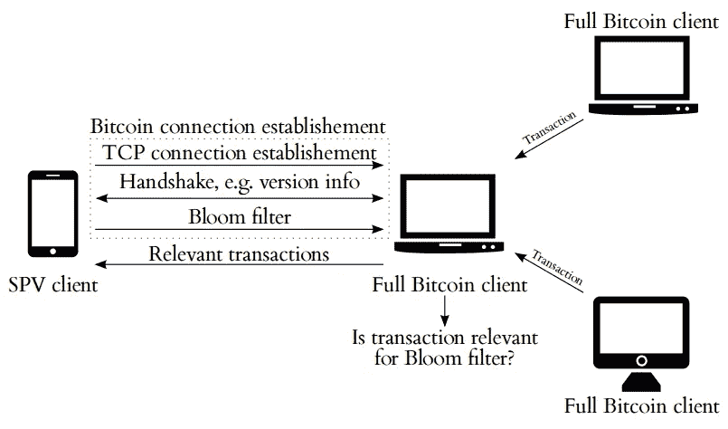

# 大多数人对比特币(和区块链)的遗忘

> 原文：<https://medium.com/hackernoon/what-most-people-forget-about-bitcoin-and-blockchain-87eacaba3453>

当我与朋友和同事讨论[比特币](https://hackernoon.com/tagged/bitcoin)、[区块链](https://hackernoon.com/tagged/blockchain)和分布式账本技术时，我总是试图提及并解释以下说法:

*不信任，求证。*

这是一个非常有力的陈述，间接描述了比特币以及区块链的最大优势之一。

比特币的出现是为了替代我们现有的、灾难性失败的银行系统。我们当前的银行体系是建立在信任的基础上的，就像中本聪在 2009 年写的:

*“传统货币的根本问题是它运转所需的所有信任。必须相信央行不会让货币贬值，但法定货币的历史充满了对这种信任的违背。必须信任银行持有我们的钱，并以电子方式转移，但他们在信贷泡沫的浪潮中贷出这些钱，储备几乎没有一部分。我们必须相信他们会保护我们的隐私，相信他们不会让身份窃贼盗取我们的账户。他们巨大的管理费用使得小额支付成为不可能。*

有了比特币(和区块链)，我们现在有了一种技术，这种技术仍处于发展的早期阶段，但已经提供了一种可靠的解决方案，自 2009 年以来，这种解决方案已被证明是一种替代方案。

钱包是底层技术的接口，到目前为止还没有为大规模采用做好准备。评估钱包有三个基本方面:

*   *信任* —我可以自己验证交易吗？我必须信任第三方吗？
*   *隐私* —匿名购买/出售/交易可能吗？
*   *安全性* —我的密钥安全吗？它是如何储存的？

在考察比特币基地时:

*   *信任* —您不能自己验证交易
*   *隐私* —你需要注册
*   安全——你没有钥匙(或者你根本没有钥匙)

比特币基地是比特币的反例。

然而，[比特币核心](https://github.com/bitcoin/bitcoin)(最流行的全节点实现)也并不完美:

*   *信任* —它是一个完全节点，能够完全验证
*   *隐私* —无需注册，可以创建多个地址
*   *安全性* —它没有安全存储(如硬件钱包)

在深入了解区别和权衡之前，先解释一下**完全** **节点**和**SPV**(简化支付验证)的概念，这是在不使用交换时可供选择的两个选项:

一个 **SPV** 是一个不验证一切的比特币实现。SPV 客户端向提供 SPV 服务的完整节点提交布隆过滤器(仅请求匹配事务和 merkle 块的过滤器)。每次发送块报头时，完整节点将对照所提供的布隆过滤器检查块中是否有可能感兴趣或可能不感兴趣的事务。如果为正，则将包括已识别的事务，以及计算 merkle 根所需的所有其他事务。对于收到的每个块标题，SPV 客户端将检查它是否包含满足难度要求的工作证明解决方案，以及它是否链接到前一个块。

完全验证比特币所有规则的节点称为**完全节点**。全节点最流行的实现是[比特币核心](https://en.bitcoin.it/wiki/Bitcoin_Core)。完整节点下载每一个区块和交易，并根据比特币的共识规则进行检查。

[https://bitseed.org/mobile-bitcoin-wallets/](https://bitseed.org/mobile-bitcoin-wallets/)

有必要运行一个完整的节点，而不仅仅是一个 SPV。否则，矿工可以改变共识规则和/或您信任的完整节点可以简单地进行对抗性调整。

费用估算不应该由别人来做，而应该由你自己来做。但是，SPV 没有 mempool / UTXO 集，这是在不依赖集中服务的情况下进行适当的费用估算所必需的。

尽管如此，大多数人都在使用像比特币基地和特雷佐这样的集中式验证(交易被发送到他们的服务中，但是也存在其他的 Electrum)，因为它有很好的可用性和易用性。对于普通人来说，下载整个区块链并在电脑、服务器甚至智能手机上设置一个完整的节点是不切实际的。既没有高达 200 GB 移动数据带宽的移动运营商合同，也没有具有这种内部存储容量的智能手机。由于块大小限制为 1 MB，比特币的区块链每年扩展约 50 GB。如果块的大小更大，那么对于普通人来说，运行和维护一个完整的节点将变得更加困难，因为这在经济上是不可行的。这意味着:更少的完整节点，更少的分散节点。

集中验证很方便，但正如中本聪间接指出的那样:这也是过去失败的根源。

但是，要使比特币不可信，需要全节点。没有中央机构(像银行或 PayPal)，只有运行在你自己电脑上的软件。每个人都是自己的银行，应该自己核实。

每当功能外包给别人，信任和依赖是必要的。然而，外包的功能越少，使用就变得越复杂，这对大多数人来说是一个障碍。为了有更多的采用，同时最小化对集中服务的依赖，拥有“易于使用”的东西是一个相当艰难的平衡行为。因此，仍有很大的改进空间。已经有多个 BIP(比特币改进提案)，可以并且很可能会为未来的钱包铺平道路:例如 [BIP158](https://github.com/bitcoin/bips/blob/master/bip-0158.mediawiki) 、 [BIP174](https://github.com/bitcoin/bips/blob/master/bip-0174.mediawiki) 。开发一个(几乎)不可信的、具有良好用户体验的硬件钱包是我期待的另一件事。

比特币(和区块链)就是能够在一个充满敌意的环境中以一种不信任的方式运行。它提供了一个很好的机会来验证一切，所以你可以知道系统中正在发生的一切。因此，我们不应该忘记这个强大的固有特性。

旁注:目前，设置和运行比特币全节点并不麻烦，也很实惠——甚至可以在 Raspberry Pi 上实现。看看这个伟大的[教程](https://github.com/Stadicus/guides/blob/master/raspibolt/README.md)。

参考资料:

感谢 Jonas Schnelli 和更多的好想法和工作！

[https://bit coin . jonasschnelli . ch/BOB _ jonasschnelli _ csatfow . pdf](https://bitcoin.jonasschnelli.ch/BOB_jonasschnelli_csatfow.pdf)

[http://P2P foundation . ning . com/forum/topics/比特币-开源](http://p2pfoundation.ning.com/forum/topics/bitcoin-open-source)

[https://en.bitcoin.it/wiki/Full_node](https://en.bitcoin.it/wiki/Full_node)

[https://bitcoin.org/en/glossary/bloom-filter](https://bitcoin.org/en/glossary/bloom-filter)

 [## 理解 SPV，修剪和它的缺点

### 首先，很抱歉没有问一个客观的问题，这是因为我不能恢复这个问题，我没有找到…

bitcoin.stackexchange.com](https://bitcoin.stackexchange.com/questions/57434/understanding-spv-pruning-and-its-downsides-as-well) 

[https://upscri.be/hackernoon/](https://upscri.be/hackernoon/)