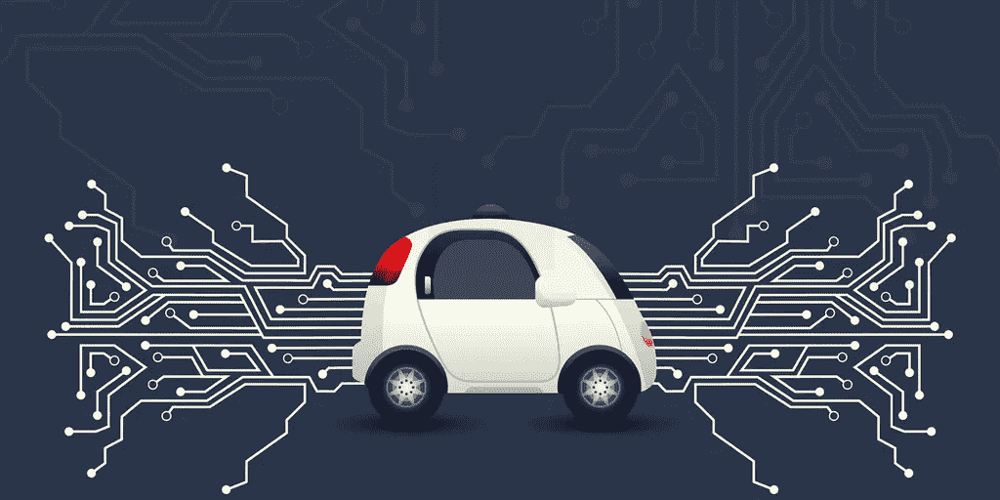

# 自动驾驶汽车行业现在会怎样？

> 原文：<https://medium.com/hackernoon/what-now-for-the-autonomous-car-industry-2d0096d33462>

优步的自动驾驶汽车在美国亚利桑那州与行人伊莱恩·赫尔茨贝格发生致命碰撞后，自动驾驶汽车行业遭遇了迄今为止最大的挫折。这一事件成为全球头条新闻，也是此类事故中的首例，引发了人们对自动驾驶汽车技术的进一步质疑和担忧。

**那么，汽车行业对此作何反应，自动驾驶汽车的未来又会如何呢？**

[纽约时报](https://www.nytimes.com/2018/03/23/technology/uber-self-driving-cars-arizona.html?hp&action=click&pgtype=Homepage&clickSource=story-heading&module=first-column-region&region=top-news&WT.nav=top-news)的一项调查发现，在致命碰撞发生的几个月前，优步的自动驾驶汽车表现不如预期。通过《纽约时报》获得的消息来源和文件，他们能够报告说，截至今年 3 月，优步发现很难在亚利桑那州实现每次干预 13 英里的目标(由车上的安全驾驶员实施)。考虑到背景，Waymo 的自动驾驶汽车测试报告称，在加州，他们的司机平均每行驶 5600 英里就必须干预一次。

事件发生后，优步立即停止了他们在美国的测试，但现在他们被禁止在亚利桑那州进行任何无人驾驶汽车测试。虽然这可能不是优步自动驾驶汽车冒险的结束，但我们看到它们再次上路测试可能还需要一段时间。

**但是无人驾驶行业的其他公司呢？**

在这起事件发生后，丰田是自动驾驶汽车行业中也决定停止测试的最大品牌。他们主要担心的是车手的精神状态，据他们的发言人 Rick Bourgoise 说，他们“确实计划在适当的时候恢复测试。”然而，包括同样在亚利桑那州测试的 Waymo 在内的所有其他大公司都继续进行路测。

Waymo 的首席执行官 John Krafcik 甚至表示，他们的无人驾驶汽车可能能够避免这场致命的事故。他说:“我想真正尊重伊莱恩，那个失去生命的女人和她的家人，(但是)在行人或骑自行车的行人的情况下，我们有很大的信心，我们的技术将是强大的，能够处理这样的情况。”

他和业内其他人对不停止任何测试的信心无疑表明了这项技术的进展。Waymo 独自完成了超过 500 万英里的自驾里程，没有发生任何重大事故，因此不难理解他们为什么会对继续前行感到放心。尤其是在优步事件后，公众对无人驾驶汽车的反弹没有一些人预期的那么大。

美国有些州，如佛罗里达州，仍在邀请公司前来测试他们的无人驾驶技术。中国还刚刚批准在线搜索引擎公司百度开始在北京行人稀少的郊区测试自动驾驶卡车。

那么，该行业的下一步是什么？

考虑到大部分自动驾驶汽车公司在亚利桑那州事件后继续进行测试，该行业似乎不会有任何进展。似乎优步的自动驾驶技术并不能很好地代表他们的竞争对手，他们中的大多数人已经在游戏中呆了很长时间，他们都只能代表他们自己的技术声称发生了一些小事故。

随着该行业继续发展，它将从过去的错误中吸取教训。新的创新将会出现，带来只会提高自动驾驶汽车安全性的技术。自动驾驶汽车在路上变得越安全，人们就会越关注它们的安全性，以及采取什么措施来保护他们的联网汽车免受恶意攻击。

[Cube Intelligence](https://cubeint.io/?utm_source=Hackernoon&utm_medium=article&utm_campaign=articles_Hackerneoon) 是一家公司考虑这么做的例子。Cube 正在开发一个基于区块链的安全平台，该平台将确保自动驾驶汽车能够保护它们的功能和通信数据，而没有黑客攻击的风险。他们计划继续开发使用人工智能的平台，以确保安全系统总是在学习，并领先于那些试图恶意渗透车辆的人。

因此，这个相对较新、似乎不可阻挡的行业的优先事项是显而易见的。确保车内和周围人员的安全，并确保车辆数据和控制的安全。

来源:

[https://www . nytimes . com/2018/03/23/technology/Uber-自驾-汽车-亚利桑那. html](https://www.nytimes.com/2018/03/23/technology/uber-self-driving-cars-arizona.html)

[http://www . ubergizmo . com/2018/03/Baidu-allowed-test-self-driving-cars-in-China/](http://www.ubergizmo.com/2018/03/baidu-allowed-to-test-self-driving-cars-in-china/)

[https://www . recode . net/2018/3/20/17144394/Uber-自驾-自主-事故-撞车-亚利桑那-坦佩](https://www.recode.net/2018/3/20/17144394/uber-self-driving-autonomous-accident-crash-arizona-tempe)

[https://www . USA today . com/story/tech/2018/03/25/waymo-CEO-kraf cik-has-lot-confident-his-tech-have-absolute-Uber-accident/456819002/](https://www.usatoday.com/story/tech/2018/03/25/waymo-ceo-krafcik-has-lot-confident-his-tech-would-have-avoided-deadly-uber-accident/456819002/)