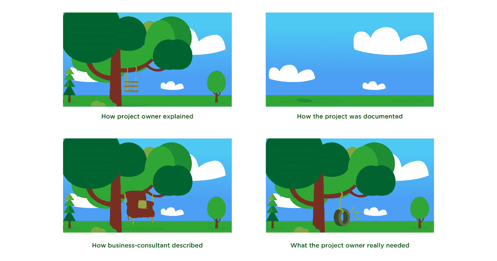

# 是什么阻碍了区块链在实际领域的应用？

> 原文：<https://medium.com/hackernoon/what-prevents-blockchain-from-being-applied-to-the-real-sector-c1d9940bbd7b>

我们生活在一个数字时代。年复一年，它变得越来越数字化。毫无疑问，随着区块链技术的出现，这一进程将会加快。基本上，这种说法是正确的，但这个想法太笼统了。区块链确实向我们展示了我们可以存储和转移价值，而不必信任第三方。但是…

这导致了这样的误解，以至于以后我们可以通过这种区块链出售我们的公寓、汽车等，在这种情况下，信任的参数将趋于零，就像比特币一样。 ***那不可能。***

我们先来考虑一下为什么。然后切换到文章的主题——是什么仍然阻止了区块链的大规模应用？

**首先要做的事情——打破幻想**

我们需要把事情放在一起。比特币区块链是一个没有许可的区块链。意味着每个人都可以加入网络，参与交易验证，验证数据库的正确性等等。与共识机制(允许参与者在不依赖对方的情况下达成协议)一起，区块链允许存在一个完全不信任的独立环境。

问题是，比特币区块链只存在于它自己的数字网络中。它不会拦截任何外部网络。这是区块链能够真正消除信任的地方。

*但你永远无法从区块链处理任何外部数据(产权、身份证件、收据等)的系统中消除信任，因为你将需要所谓的神谕，你至少部分信任的神谕将为你提供信息。*

# 那是什么意思？

这意味着你应该彻底理解，当我们谈论被广泛应用于实体部门的区块链时，它不是比特币，不可信的情况。这种情况下，当区块链减少信任只有部分，在此基础上，连同其他技术提供了一个简单和安全的帐户管理，高弹性，不可否认的所有行动的用户和透明的内部进程。

但在这一切成真之前。在我们拥有某种可以存储我们的电子护照和驾照的国家区块链，或者让我们可以自动领取我们应得的工资的区块链公司之前，有一些挑战需要解决。

# 身份

我们谈论的是一个区块链，它在广泛的层面上提供用户之间的交互——例如，政府层面。这样，我们需要找到一种方法来将用户的行为与他们的实际身份关联起来。

在一个组织的范围内，这不是一个大问题。然而，在国家一级或当我们与大公司的财团打交道时，事情变得复杂得多。因为我们需要合法地表现真实的人和他们的数字身份之间的相互关系，这样，就有可能把他们在数字环境中的行为归于他们。

爱沙尼亚今天在这一领域相当先进。两年多来，政府一直在积极实施电子护照，并允许公民在他们的帮助下参加投票。

# 数字化:都在一个地方

很明显，在我们有可能标准化某些数据的数字化过程并将其记录在区块链上之前，事情不会起作用。今天，我们已经将许多数据数字化，但问题是这些数据都位于不同的数据库中。因此，如果你需要查询，比如说，客户的信息位于外部数据库中，你可能会通过电话解决这个问题，这很难被称为数字程序。

这样，我们需要有合法的方法，允许对外部数据库进行自动查询，返回数字签名的数据。也就是说，会有大量的神谕来验证这些数据的正确性。你拥有的神谕越多，他们相互勾结的机会就越少，因此数据就越可信。

## 但是，记住

一个正确构建的区块链协议只能假设已经存在于其中的数据的真实性，而不能控制已经记录在其中的信息。因此，如果违规者设法在区块链上记录虚假数据，它将被视为可信的数据。

*比特币区块链可以保证真实性，因为它与外部数据库没有任何交互。所有的数据(BTC 硬币)都是在预定的(由协议)条件下在网络内产生的，并且只存在于同一网络中。*

*也就是说，它没有弱点。*

每当您有必要在区块链上发布外部数据时，信任问题就会出现。这是一个薄弱环节，至今仍没有任何行之有效的方法。

# 共同决策

例如，比特币是一个很好的例子，说明了分散化的环境如何让参与者在考虑协议更新时达成一致。每个人都可以提出自己的建议。如果大多数人都同意，就可以升级。这是一种经过验证的方法，比特币已经发展了近十年。因为社区有一个共同的动机——增加容量、交易确认时间、安全性等等。

谈到商业，每个人都有自己的利益，主要是商业和政治利益。万一出现僵局，我们通常会诉诸法庭。但这不是区块链的工作方式。

比如说，在为大公司的大型财团建立基于区块链的平台的阶段，他们需要定义在最琐碎甚至最终关键的情况下他们将执行共同决策的方式；他们将如何投票支持决策，他们的投票权重是多少(对所有人都一样或根据特定的资历)。

更不用说每个人对每种情况都有自己的看法，这经常让我们用不同的名字来称呼一个物体。

因此，区块链在商业上的实际应用很少。没有任何 100%确定的方法来说明它应该是怎样的。尽管如此，许多公司仍在努力前进，因为他们知道区块链基本上是未来所在。

# **具有法律约束力的数字环境**

最终，我们需要一个统一的法律框架。一些监管机构已经打破僵局，开始着手更新法律，以跟踪加密货币在全球经济中的成交量。但是，这只是故事的一部分。

重要的是，更新的方法将考虑分散环境的存在及其所有特性，包括分散责任和共同决策的方面。时至今日，大多数区块链的项目目前都不在法律环境之内。

# 结论

我们已经充分讨论了区块链电器的关键前提。让我们再回顾一下:所有业务流程的数字化、网络空间的统一身份标准、共同决策的一致方法，以及最终提供允许上述所有内容的法律基础。

解决了所有这些问题，我们将拥有一个庞大、强大、重要的是灵活的基础设施，这将使我们在社会中开展业务和互动达到一个全新的水平。