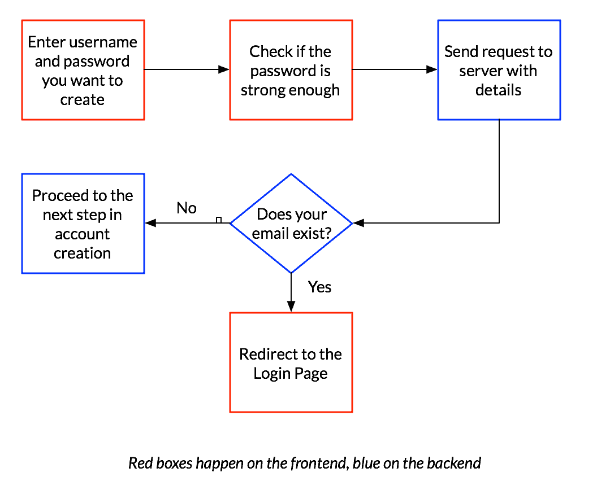
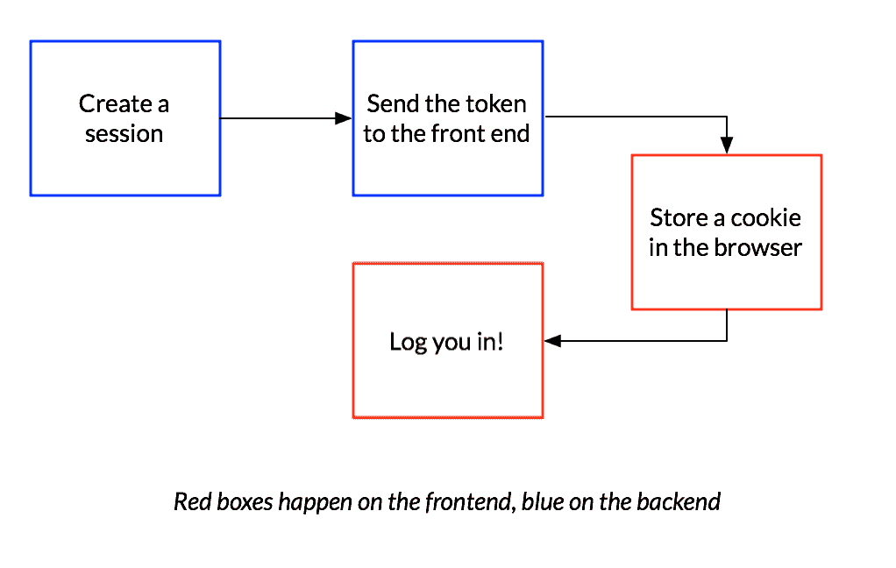

# 当你在一个网站上创建一个账户时，会发生什么？

> 原文：<https://medium.com/hackernoon/what-really-happens-when-you-create-an-account-on-a-website-1393ecef76de>

## *编码语言的简单介绍。*

Photo by [Stanley Dai](https://unsplash.com/photos/73OZYNjVoNI?utm_source=unsplash&utm_medium=referral&utm_content=creditCopyText)

不要把编码当成一种技能，而是一种语言。本系列将解释一些与编码相关的关键词，同时帮助您更好地了解在您与网站和应用程序交互时幕后发生的事情。

> 这个系列的目标不是教你如何编码，而是教你编码的*语言*。

我的信念是，每个人都应该能够理解和说这种语言，即使他们最终不会编码。无论你是在产品、销售、市场、运营还是客户支持部门工作，这篇文章都是为那些想要学习更多的人准备的。

不熟悉的技术术语是新手阅读技术文章时常见的障碍。大的技术词汇，像法律术语，如果你不知道它们，可能是令人生畏的。**术语表中定义的任何令人生畏的术语后面都会有一个星号(*)。**

每个人都曾采取过的最重要的行动之一，就是用你的电子邮件和密码创建一个账户。今天，我想带你看看典型的电子邮件和密码注册的幕后到底发生了什么。让我们一起探索吧！

# 要创建帐户:

有一系列涉及前端*与后端*交互的动作。

**第一步:** **检查你是否已经存在**

当您在输入电子邮件和密码后单击注册按钮时，您输入的信息首先会作为请求发送到 server*以验证您的帐户是否存在。如果是这样，那么你会被重定向到登录，而不是注册。

**第二步:** **安全存储您的账户信息**

如果服务器*确认您不在系统中，它就准备好创建一个新帐户了！在一个更高的层次上，系统需要做的是在数据库中存储*你的电子邮件和密码将让你进入你的帐户。

然而，有一个大问题——出于安全原因，密码不能以你输入的方式存储在系统中——如果有人获得了密码，他们可以冒充你。它们在被存储之前必须被修改。你可能输入了一个密码，比如“drgkjlDKHKJ123”，但是它在数据库中的存储方式会完全不同。还记得 [Equifax 数据泄露事件](http://money.cnn.com/2017/09/07/pf/victim-equifax-hack-how-to-find-out/index.html)吗？发生这种情况是因为敏感信息没有被安全地存储。

修改过程如下所示:

首先，会生成一个名为 *salt* 的东西，它只是一个随机字符串，通常会混合到您的密码中以增加安全性。然后，整个字符串被取出并通过一个算法。这个过程叫做**哈希**，算法叫做**哈希算法**。假设你和你的朋友都有相同的密码。在哈希过程之前添加盐将确保哈希密码完全不同。哈希密码、salt 和您的电子邮件将安全地存储在数据库*中。

有一点需要注意的是，你的密码一旦被哈希化，就是一个不可逆的过程，所以你无法恢复到原来的形式。如果你曾经在一个网站上经历过“忘记我的密码”的情况，并且你实际上在一封电子邮件中获得了你的原始密码，你现在知道它被不安全地存储了，因为散列是一个不可逆的过程。

**第三步:创建会话和 cookie**

现在，服务器已经准备好向前端发送信号，表明您已经准备好登录了。但首先，它必须再走一步。后端必须创建一个会话，然后发送一个令牌(一条可以用来代替用户名或密码的信息，告诉系统实际上是你)。然后，令牌被存储在浏览器上一个叫做 cookie 的东西中。每当您访问该网站上的任何页面并登录时，该信息将用于验证您的身份。是不是很酷？会话也有到期时间。因此，举例来说，如果我第一次访问 Groupon，就会创建一个持续 30 天的会话。在这 30 天内， *Groupon* 会记住我的信息，之后这些信息会被删除，我必须重新登录。

这里需要注意的是，cookies 和会话是独立于登录过程创建的。例如，如果您访问一个杂货网站，并在未登录的情况下将物品添加到您的购物篮中，或者如果您离开网站并在一定时间后返回，您仍然可以在那里看到它们。

这里需要注意的是，这是理想情况下应该发生的事情，但有时网站并没有遵循这一点，这时你的信息就有被泄露的风险。

## **用于登录:**

现在，让我们来研究一下登录系统的操作。

您输入您的电子邮件和密码，但是这次服务器必须验证该电子邮件是否存在。如果没有，那么您将被重定向到创建一个帐户，如上所述。如果是，您在此时输入的密码将经过上述修改步骤，然后与我们存储在数据库*中的内容进行比较。如果相同，则您通过了身份验证。如果没有，您将再次回到登录页面，并被提示“忘记密码了？”链接，此外还有相同的登录表单。

## **用于记忆登录:**

如果您查看大多数 web 表单*，您会看到一个“记住我在此网站上的密码”复选框。如果您选中该选项，下次登录时就不需要您输入任何信息。

事情是这样的:还记得你的浏览器现在存储了一个 cookie*吗？下次您访问该网站时，服务器实际上会在浏览器上请求该 cookie*，以便识别您的身份并让您进入。

# 使用的术语表:

1.  **前端:**

让我们以*谷歌*——*谷歌*主页的前端就是你看到的和与之互动的东西。当你在*谷歌*中输入一个搜索，这一切都发生在前端。在任何应用或网站中，前端通常连接到后端*。

***示例用法:***

对于一个需要与用户进行非常复杂的交互的网站来说，“前端很难构建。”

“当我在 ipad 上打开这个网站时，它的前端没有反应——当我滚动时，它到处乱跳。”

## **2。后端:**

后端在幕后工作，在您使用应用程序时让正确的事情发生。前端*与后端通信，在用户和界面之间创建有意义的交互。如果你在*谷歌*(前端)输入一个没有后端的搜索，实际的网站不会做任何有意义的事情。后端是搜索结果的来源。

把它想象成前端接收你想要做的意图，然后请求后面的系统给出适用的信息，这就是后端。

***例句用法:***

“我想要一个可以分析你在脸书墙上所有帖子的应用程序。您认为构建这个后端需要多长时间？”

“该网站不处理我的付款请求。似乎有一个后端问题”。

## **3。形式:**

表单是你在网络或应用程序上输入信息的任何地方。例如，当您买东西时，可以在表单中输入您的运输信息；当您创建帐户时，可以在表单中输入您的用户名和电子邮件。表单验证，顾名思义，就是检查自己输入的内容是否正确的过程。

***例句用法:***

“web 表单坏了。当我单击提交按钮时，没有任何反应。

“我一定是输入了错误的密码。我一直收到一个表单验证错误。”

## **4。客户:**

在现实生活中，客户是为某些服务付费的人。从技术上讲，当我们说客户端时，它是您用来发出请求以便连接到服务器*的设备。所以，如果你在电脑上，从浏览器输入一个网址，浏览器就是客户端——它发出信息请求。

***例句用法:***

“智能手机把网络客户端带到了每个人的口袋里——这也是它们成为游戏规则改变者的原因之一。”

“最好的电子邮件客户端是什么？”—这意味着你用什么来发送电子邮件。(mac 的邮件应用或 outlook 等)。

## **5。服务器:**

服务器是机器上的一种软件，可以响应请求。尽管这个词听起来很吓人，但这就是它的全部作用。因此，例如，当你在浏览器上键入【Google.com】T2 时，浏览器知道向*谷歌* s 服务器发出请求，而*谷歌* s 服务器知道如何响应这样的请求，也就是给你*谷歌*主页。

这里要注意一件事:由于服务器是知道如何响应请求的软件，任何计算机都可以是服务器或客户机，甚至两者都是。您可以编写代码，以便在您的计算机上运行一个本地服务器，同时安装一个发出请求的浏览器，该浏览器充当客户端。那不是很有趣吗？

*你能提出什么要求？它可以是任何东西，从当你键入 Google.com 时请求主页到当你搜索某个东西时请求信息。所以，当我输入*Google.com*时，我希望*谷歌*的主页会出现。当我在*谷歌*中输入一些信息时，我请求显示搜索结果。这些是向谷歌*服务器发出的不同类型的请求。请求之后是响应，所以你通常会看到这些词互相使用。

***例句用法:***

“你能想象亚马逊的服务器在网络星期一收到多少请求吗？"

"服务器关闭了。"—当网站没有给你想要的东西时，你最常听到的一句话:)

"服务器无法处理流量。"—通常是因为很多人都在提要求。

## 6。数据库:

数据库是网站或应用程序存储您的信息的地方，以便以后检索。例如，当你回到一个网站，输入你的用户名和密码等信息时，这些信息必须存储在某个地方，因为你希望用户再次输入。这个存储就是数据库——它是以结构化方式存储的数据集合，可以在以后检索。

有许多类型的数据库——有些您可能听说过，如 SQL、Postgres 和 Mongo。

***示例用法:***

"图书管理员查看了数据库，告诉我这本书可以借阅."

## **7。饼干:**

大多数网站会在你的浏览器上存储一些名为 cookies 的信息，让服务器知道你是谁。如果没有 cookies，当你访问一个网站时就没有办法识别你的身份，这也被称为无状态交易。

你可以试试——进入你的浏览器设置，清除 cookies。然后，访问一个你经常访问的网站，他们会要求你登录。

***例句用法:***

"我需要清除缓存中的 cookies . "

"你能试着清除你的饼干然后刷新吗？"—有时，当你在页面上看到错误时，你可能会收到工程师的请求。

## **8。会话:**

当您第一次访问网站并创建帐户时，会创建一个会话。一个会话仅仅是一个给定的网站识别你的持续时间，它根据网站的不同而不同。因此，举例来说，当你在网上向购物车中添加东西并离开网站时，即使你没有创建帐户，当你回来时，你仍然会在你的网上购物篮中找到它。虽然它不会永远在那里。如果你两个月后再来，你可能会发现它是空的，因为会话已经过期。当一个会话被创建时，它会获得一个 ID，并被发送到您的浏览器，浏览器会将其存储为一个 cookie 来识别您的身份。

***例句用法:***

“我很高兴*insta cart*保留了我的会话，并且我的购物车中仍然有所有商品。”

> 希望你喜欢这篇文章，它能帮助你更好地理解这些条款。你需要熟悉这门语言的原因是因为软件正越来越多地影响着我们生活的方方面面，这些术语将变得越来越普遍。如果你从事技术工作，精通这门语言就更加重要了——它不仅有助于你与工程师的交流，还有助于你更深入地了解正在发生的事情。

在下一篇文章中，我们将引入一些新术语，甚至会重复使用其中的一些。请评论并让我知道你希望我在未来报道什么话题。并且一如既往，请喜欢并分享文章！

*感谢布鲁克、* [*格雷厄姆*](https://twitter.com/grhmc) *和* [*埃里克*](https://twitter.com/erikhazzard) *在出版前阅读草稿！*