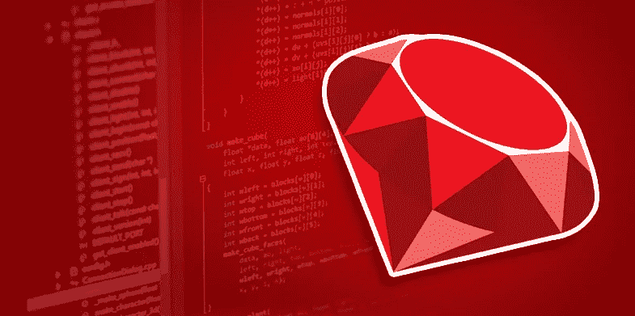

# 露比教我的

> 原文：<https://medium.com/hackernoon/what-ruby-taught-me-3432793b985b>

我已经研究 Ruby 几个月了。上个月，我开始从事 Ruby on Rails 项目。对于一个前 C#程序员来说，这是一个巨大的转变。

## 编写测试。那就多写点！重复一遍。

Rubyists 喜欢测试。如果您想构建**一致且可信的应用程序**，请测试它们。在过去的几周里，在开始写类之前，我一直在写测试。有令人敬畏的宝石，如 [RSpec](https://github.com/rspec/rspec) 、[水豚](https://github.com/teamcapybara/capybara)和 [FactoryBot](https://github.com/thoughtbot/factory_bot) 可以让这项工作变得更容易。

## 让它工作，然后让它漂亮。

这个很危险！当我使用其他语言时，我太担心架构、对象关系和面向对象编程给你的所有超能力。上个月和 Ruby 一起工作，我发现我必须写一个有用的类，花更多的时间写真正重要的东西。然后我可以考虑其他事情，如果它仍然有意义的话。

## Ruby 社区太牛了！

如果你在 Ruby 上遇到困难或者需要帮助，请确保整个社区已经准备好战斗。学习小组、聚会、会谈、座谈会、论坛等等。你可以在这里找到一个。

## 感觉就像普通英语。

Ruby 代码感觉像英语。你几乎看不出这是机器语言。

这段代码解释了它自己。它读起来像英语。这都是关于代码可读性的。《干净的代码》( Clean Code)一书中有几章是关于它的，这是程序员提高硬技能的必读之作。

> “任何傻瓜都能写出计算机能理解的代码。优秀的程序员会写出人类能理解的代码。”—马丁·福勒

作为一名软件开发人员，学习一门一直在教我的编程语言是一种奇妙的经历🚀

> 感谢您的阅读！别忘了在[中](/@vnbrs)、 [Instagram](http://instagram.com/vnbrs/) 和 [LinkedIn](http://linkedin.com/in/vinicius-brasil/) 上关注我。