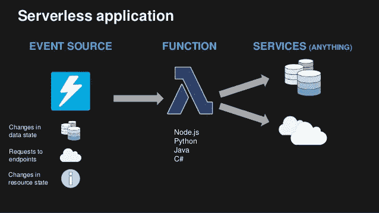

# 风投应该在 FaaS 的初创公司中寻找什么

> 原文：<https://medium.com/hackernoon/what-should-vcs-look-for-in-faas-startups-d20b2dbecc07>

*与由 Greylock、Lightspeed、Khosla 和 IVP 投资的独角兽企业云数据管理初创公司 Rubrik 的创始工程师普拉纳瓦·阿杜里* *合著。以下想法总结了我们对不断增长的无服务器空间的研究，以及我们给风投联系人的建议汇总。它们并不代表 Rubrik。*

首先，我们想澄清几个术语。

无服务器:一种通用的计算模式，其中服务提供商( **SP** )(即 AWS、GCP、Azure 等..)向客户提供托管资源。

[serverless.com](https://serverless.com/learn)/无服务器框架:一个跨服务提供商以一致的方式部署应用程序的框架。这是一个框架；它不是无服务器计算模型的官方代表。

FaaS:一种无服务器计算形式，允许在托管资源上执行沙盒无状态功能。SP 包括 AWS Lambda、Iron.io、GCP 云函数、Azure 函数等。

在深入观察我们观察到的细微差别之前，这里是我们对该领域的一般看法:

(1)为 FaaS 竞争一个新的 SP(即走 PubNub 路线)是没有钱的。FaaS 的本质是它需要一个完整的资源生态系统(如 MQs、DBs、S3 桶等)。)到场。任何新的服务提供商都需要迎头赶上。

(2)虽然 FaaS 可能会激起开发者的好奇心，但这通常不是解决问题的正确方法；鉴于 FaaS 的事件驱动性质，我们预计最相关的工作负载将是流处理。

使用通用 VC 框架来分析透视图，让我们更详细地分析无服务器空间:

**作为一家新的 FaaS 服务提供商，盈利是一件棘手的事情**

根据我们之前提出的 FaaS SP 无利可图的观点，让我们考虑一下 SP 可能采取的路线:(1)他们可以选择在自己的数据中心上部署 FaaS 产品，或者(2)选择在现有的 IaaS 提供商上部署 FaaS 产品(减少构建 DC 的需求)。选项 1 需要大量的前期投资。选项 2 的货币化策略有一个根本性的缺陷，因为他们的一部分利润会直接流向 IaaS 提供商。

> 服务提供商要么需要一个新颖的定价方案，要么迎合一个利基市场(例如，像 Iron.io 这样标榜自己是高性能和灵活的，或者以实时和物联网为目标的 PubNub ),以区别于现有的服务提供商并获得关注。

**FaaS 启用&管理**

让我们转而看看 FaaS 支持。以 serverless.com 为例；就开发受欢迎程度而言，他们是明显的领导者(在大多数供应商上，他们拥有任何 GitHub 框架中最优秀的 FaaS 入门者)。与 ORM 类似，它们为所有主要的提供者提供集成，就像 ORM 通常与几个不同的数据库接口一样。然而，即使它的框架使编写应用程序变得更容易，我也不相信仅仅依赖它的统一 API 和开源框架是一个可持续的盈利策略。

让我们考虑 FaaS 监控。假设您已经构建了一个应用程序，并将其部署到一个服务提供商。你如何监控它？你如何捕捉错误？像 iopipe.com 这样的产品已经出现来解决这个问题。在这里，货币化战略是明确的；建立一个监控工具，使其易于集成并为监控它而收费；这里的战斗策略已经被一次又一次地证明了(APM 市场)。

# 无服务器有哪些机会？

## 促进传统建筑与 FaaS 的融合

类似于一些公司如何利用从虚拟机到容器的迁移(想想 Docker、Mesos 和新来者 Heptio)，我们看到一些公司可能是开源的，但提供从容器到 FaaS 部署迁移的培训或服务。然而，一个清晰的盈利战略还没有形成。然而，我们看到了一个机会，即工具将允许公司将其 FaaS 工作负载与其传统的[IPC]aaS 或内部部署相集成。serverless.com 最近发布的[活动网关](https://serverless.com/event-gateway/enterprise)是这方面的首次尝试。

## 安全性和合规性

考虑到攻击可能来自多个入口点，FaaS 部署的攻击面相当大。要真正保护 FaaS 部署，需要了解整个功能拓扑。

考虑一下 [Vandium](http://vandium.io) :它包装你的函数并检查你的函数的输入来检测和拒绝常见的攻击类型。然而，我们更多地将 Vandium 视为一个库，而不是一个产品。首先，当它执行函数级检查时，它不知道对于检测异常行为至关重要的 FaaS 拓扑。要了解 FaaS 拓扑，产品必须与 FaaS SP 集成。

我们认为有必要提供一种适当的安全产品，将 APM、NPM 和 SP 感知的各个方面结合起来，提供一种全面的监控解决方案，实现一流的安全性。公司需要审计触发器和监控函数被调用频率的方法。此外，出于合规性考虑，公司需要一种方法来证明他们的 Lambdas 符合 GDPR HIPAA 标准。

## 搭配 5G

最近，我与一位来自高通的产品高管进行了一次有趣的晚餐交谈，他提到 5G 将在不到 5 年的时间内成为主流。5G 的承诺之一是为各种低功率设备提供连接。随着连接设备数量的急剧增加，处理这些设备发出的信息的需求也将增加。

在面向流的处理中使用 FaaS 是最自然的方式之一。5G 浪潮的两个最大赢家将是为 FaaS 提供基于使用的监控和安全的公司，以及找到扩展边缘和核心计算方法的公司。后者的主要原因是，当前处理流媒体数据的技术，如 [Apache Kafka](https://kafka.apache.org/) ，当工作负载随着 5G 变成 100 倍时，将会在数据源呈指数级增长的情况下崩溃。

> 作为一个有趣的实验，以卡夫卡为例，向它输入一百万个话题，看看它是如何退化的。

# 结论

与任何投资一样，关键问题是时机。随着 FaaS 作为一种计算范式的不断成熟，我们将看到支持其扩展和成熟的技术的演变。上面列出的例子强调了在部署 FaaS、安全性和合规性以及处理流数据的能力方面的创新，这些例子将构成第一阶段的最大机会

如果我们能够成功实施成熟的 FaaS 邮报第一阶段，我们将能够利用无数的计算平台，包括传统的客户端-服务器、容器和现在的 Phase 能够真正根据任何组织的开发要求定制的环境。