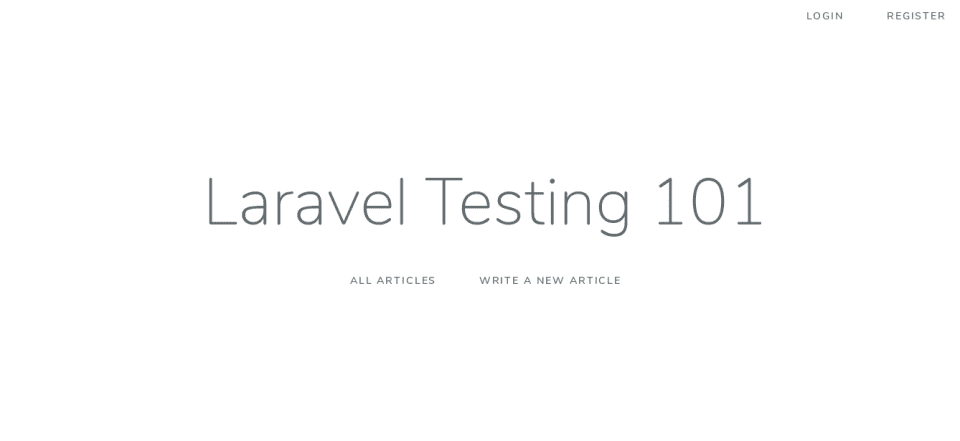
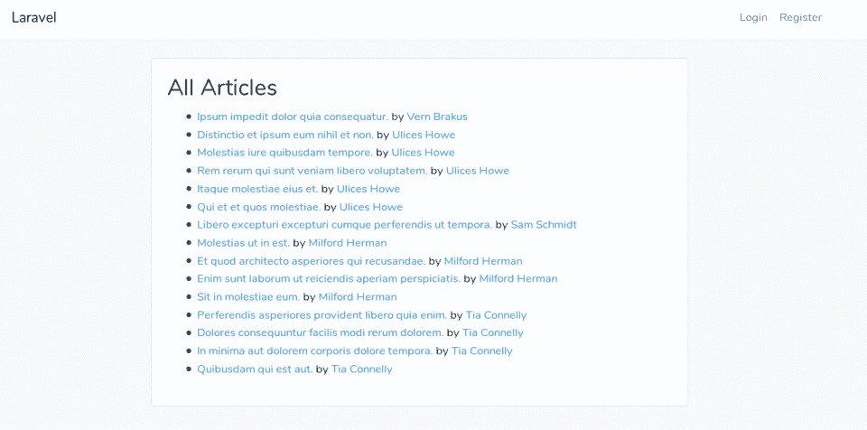
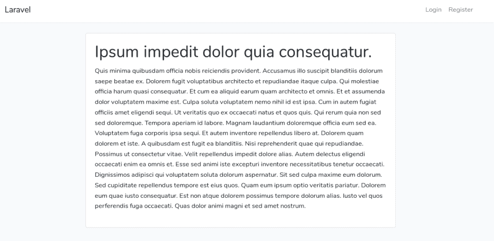
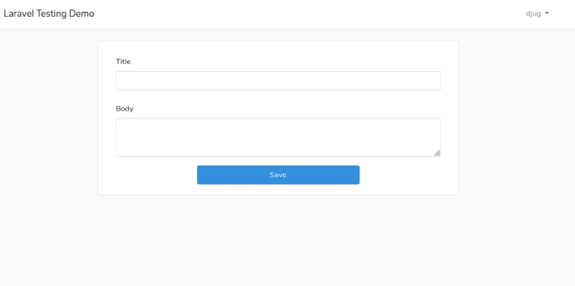
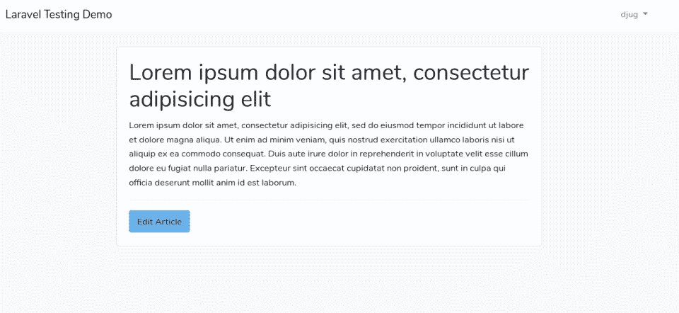
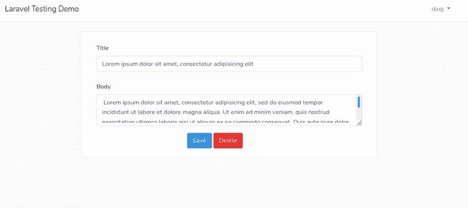
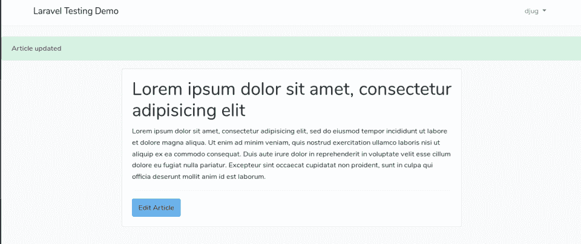
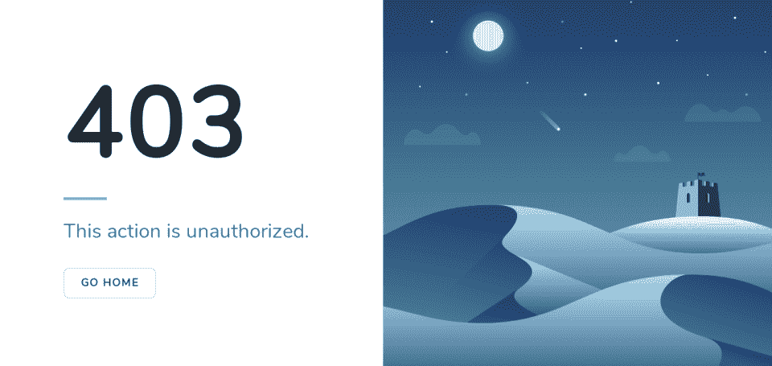
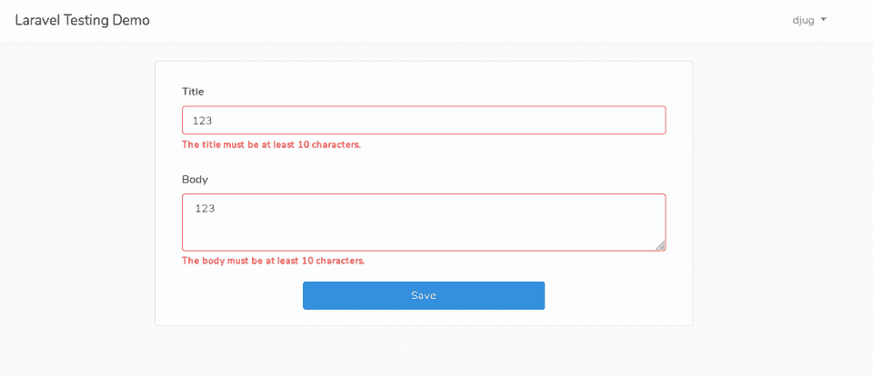

# 我们应该在一个[laravel] CRUD 应用程序中测试什么？

> 原文：<https://medium.com/hackernoon/what-should-we-be-testing-in-a-laravel-crud-application-85bf17106813>

这是我即将出版的电子书[的摘录。如果您还没有阅读前一章(此处免费提供:](https://laraveltesting101.com/)[向您的 Laravel CRUD 应用程序添加测试:从哪里开始？](https://youghourta.com/2018/11/27/laravel-testing-101-where-to-start/))，请先这样做再看这个。

既然您已经理解了您应该从不同的角度来看待测试，并且我们应该主要测试控制器，那么您可能会开始问，“……但是我到底应该测试什么？”

在这一章，我们将回答这个问题，并描述我们将在电子书的其余部分测试什么。

但是首先，让我们获得本书所基于的演示应用程序。

克隆以下回购

`[https://github.com/djug/laraveltesting101](https://github.com/djug/laraveltesting101)`

并在遵循了`readme`文件中的所有步骤之后运行应用程序。

启动服务器/应用程序后，您应该会看到这个首页:

到目前为止，您可以在应用程序中执行以下操作:

*   点击“登录”或“注册”查看登录和注册页面。
*   点击“所有文章”,你会看到/articles，其中包含了由种子生成的所有文章。

*   点击“写一篇新文章”(`/new-article`)，你会被重定向到注册页面(因为添加一篇新文章需要注册)。
*   在“/文章”页面，您可以点击文章名称(例如`/articles/15`)或用户名(`/users/5`)来查看文章或其作者简介。

注册后，你将能够查看`/new-article`路线(当我们之前尝试不登录时，它被重定向到注册页面)

保存您的文章后，您可以查看它，因为这是您自己的文章，您会在页面末尾看到“编辑文章”按钮(您不会在您不拥有的文章上看到它)。

当点击这个按钮时，你得到文章的编辑表单，在这里你可以编辑和保存文章或者删除它。

当更新文章时，你会再次被重定向到该文章，并显示一条成功消息。

但是如果你删除它，你会被重定向到“所有文章”页面，并显示一条不同的成功消息。

如果你访问的文章不是你自己创建的，你不会看到“编辑”按钮，但是如果你试图通过 URL 直接访问一篇不属于你的文章的编辑页面(例如:`articles/16/edit`)，你会得到一个 403 页面。

让我们回到“写一篇新文章”页面，尝试添加一篇短标题和/或短正文(少于 10 个字符)的新文章。

您将得到一条错误消息。而剪辑的时候也会发生同样的事情。

因此，即使应用程序很小，我们也需要测试许多东西来确保应用程序按预期工作。

这是清单:

1.  客人可以访问并获得注册页面
2.  客人可以访问并获得登录页面
3.  客人在访问/文章时可以看到所有文章
4.  客人可以看到用户简档
5.  客人不能写新文章，而是被重定向到注册页面
6.  用户(即注册用户)可以写文章
7.  用户可以访问她自己文章的编辑页面
8.  用户可以保存对自己文章的修改，并在编辑成功消息后重定向到文章页面
9.  用户可以删除自己的文章，并通过成功消息重定向到所有文章页面
10.  用户不应该在她不拥有的文章上看到编辑按钮
11.  用户不能编辑她不拥有的文章
12.  用户不能删除她不拥有的文章
13.  创建文章时，文章不能有短标题或正文
14.  更新文章时，文章不能有短标题或正文

因此，如果我们设法自动化测试上面的列表，我们就可以确信，每次我们添加一个新的特性或者改变一个代码，应用程序都会像预期的那样工作。

在下一章，我们将开始编写与客人用户相关的功能测试。

如果你想继续下去，并得到关于这本书的任何进展的通知(例如新的免费章节)，请在这里注册:[https://laraveltesting101.com/](https://laraveltesting101.com/)