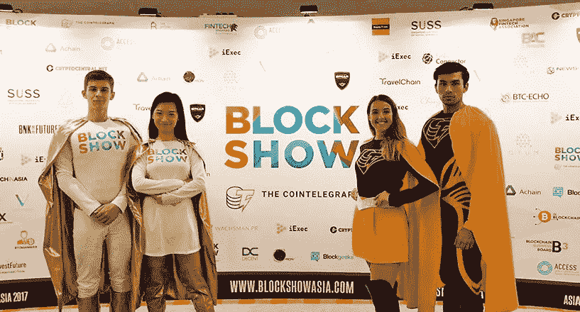
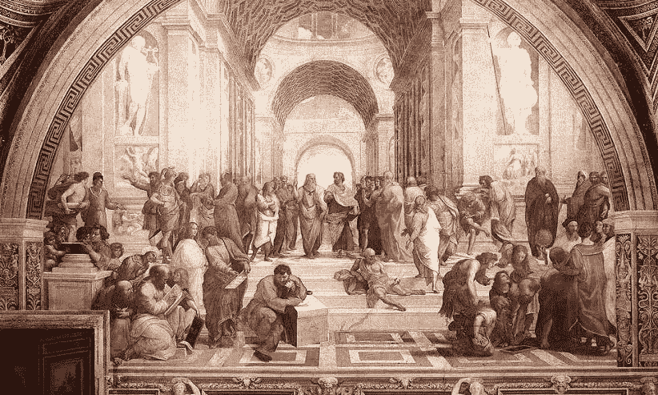
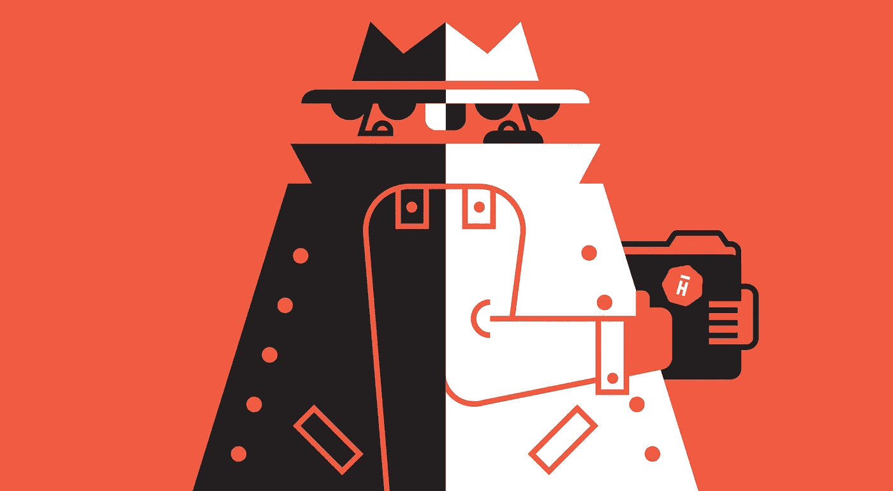

# 2019 年，你们的 ICO 营销计划应该是什么样的？— 2019 年更新

> 原文：<https://medium.com/hackernoon/what-should-your-ico-marketing-plan-look-like-in-2018-315135fe9851>

**UPD 2019:** 以下是新的 [2019 IEO 营销指南](https://hackernoon.com/ieo-marketing-guide-optimal-strategies-and-the-true-cost-to-launch-an-ieo-in-2019-ecda12821d9c)。 **UPD: 2018 年第四季度营销版此处为**:[https://hackernoon . com/what-your-ico-marketing-plan-look-in-Q4-2018-9dd 41908 f 358](https://hackernoon.com/what-should-your-ico-marketing-plan-look-like-in-q4-2018-9dd41908f358)

ICO 时代正处于上升期，每天媒体都在报道与加密货币有关的最新消息。我们正在等待电报公司的顶级 ICO 成为加密货币史上最大的 ICO，因为它将筹集超过 50 亿美元。

> 感谢[agency.howtotoken.com](http://agency.howtotoken.com/)对创建本主题的支持(第一个拥有成熟 ICO 承包商的平台)

截至 2017 年底，ICO 市场活动的平均数量接近每天 3 次。市面上有很多不成功的 ico 都没有达到他们的软上限(一些团队的坦白证明了这一点)，所以现在做一个并不像 2017 年那么容易。因此，我们最终可以忘掉“车库 ico”，对这种形式的融资变得更认真。

就 ICO 营销而言，获得成功的总预算正在上升，投资的初始成本也在上升。如果你想成功，你必须创建一个原型并获得社区和顾问的批准。

将 ICO 营销外包给顶尖机构的平均成本约为 28 万美元，不包括大约 2 万美元的法律费用

在本文中，我们将讨论今年启动 ICO 的成本。我们还将包括来自机构专家和广告网络所有者的评论。

# **1 .ICO 上市**

## **变型 1 —外包给机构**

**成本:2.5 万美元**

**预期结果:**

*   至少 10 个热门 ICO 上市
*   包括支付期权

## **变型 2 —自行**

**成本:~ 15，000 美元**(你应该包括经理的工资以便他或她发送信息)

## 顶级上市成本:

*   [**http://www.coinschedule.com/**](http://www.coinschedule.com/)——0.02 BTC
*   [**https://www.ico-list.com/**](https://www.ico-list.com/)——0.3 BTC
*   **—免费，手动筛选，最长 2 周**
*   **【Icoalert.com】**—免费****
*   ****[**https://cointelegraph.com/ico-calendar**](https://cointelegraph.com/ico-calendar)—起价 10000 美元****

## ****ICO 评级机构****

****有一些特殊类型的公司可以为投资者审计和评估你的 ICO。你将收到一份关于你的 ICO 投资吸引力的特别报告，并可能被上市。****

*   ****[**https://digrate.com/**](https://digrate.com/)—1 BTC 作报告****
*   ****[**https://icorating.com/**](https://icorating.com/)——2 万美元的报告****
*   ****https://icobench.com/**—从 0.4 BTC 开始******

## ********最佳策略********

******最好的策略是将你的 ICO 放在 Coinschedule 上，从 ICORating、Digrate 或任何其他评级服务获得评级(这将帮助你总结你的 ICO 中的漏洞)，并开始推送免费列表以放置你的 ICO。不要忘记，ICO 评级每天都会出现，也每天都会消失。他们从分析热门列表开始评分，所以你也可以通过这种方式获得额外的流量。******

********布莱恩·基恩**，首席业务发展官[ICORating.com](http://ICORating.com):******

> ****更重要的是，项目要“包装”好。所有材料(白皮书、单页纸、网站等。)应该用投资者的语言编写，以便使项目对他们更有吸引力。值得注意的是，2018 年，ICO 的投资者将变得更加专业，其中将有更多来自传统金融市场的参与者。****
> 
> ****其次，与投资者建立个性化关系极其重要:直接联系他们，在秘密活动中推介他们，组织与他们的个人会面。需要注意的是，由 ICORating 评级的项目信息会被邮寄到基金列表中，从而大大提高了它们被关注的机会。一般来说，与投资者发展良好的关系，以及与他们的协议，确保至少在 ICO 期间收集软上限。****

******雅罗斯拉夫·卢涅夫**，战略主管@ Merklion Agency:[t.me/yardy](http://t.me/yardy)****

> ****我个人喜欢 ICObench 和 ICOdrops。这些家伙知道他们在做什么，这就是为什么越来越多的人信任他们，这一事实反映在交通数字。我记得他们刚开始的时候，从一开始就和观众进行了很好的对话。****

********

# ******2。付费广告******

## ******变式 1——外包给代理******

******费用:15 万美元起**(预算+工作)****

******期待什么:******

*   ****脸书、谷歌、推特广告活动****
*   ****专业加密广告购买****

## ******变型 2 —自己动手******

******成本:每月约 3000 美元**用于广告管理+预算****

******工作平台:******

*   ****脸书、谷歌、推特广告活动****

******专业加密广告购买:******

*   ****[**https://cointraffic.io/**](https://cointraffic.io/)—最低预算:1 万美元****
*   ****https://coinad.com/**最低预算:0.01 BTC******
*   ****[**https://a-ads.com/**](https://a-ads.com/)—最低预算:任意****

****您可以在此找到更多网络:****

*   ****[https://themerkle.com/top-7-bitcoin-advertising-networks/](https://themerkle.com/top-7-bitcoin-advertising-networks/)****
*   ****[https://bitcointalk.org/index.php?topic=1108616.0](https://bitcointalk.org/index.php?topic=1108616.0)—Bitcointalk 用广告网络和诈骗警报更新线索。****

## ****最佳策略****

****从你有广告经理的渠道开始。你可以通过脸书和谷歌这样的传统广告网络获得牵引力。最终，在你的 ICO 发布前几天和销售的第一天，你将能够进入专门的加密网络。****

******雅罗斯拉夫·卢涅夫**，战略主管@ Merklion Agency:[t.me/yardy](http://t.me/yardy)****

> ****在街上找一个比特币比找一个专业的广告经理还容易。确保这个人知道他或她的手艺。我的建议是去一家中介公司，和他们一起工作。如果你能向他们推销你的想法，你可以用代币支付，至少是部分支付。但我也会雇用一名广告经理，这样他或她就可以在代币出售后的时期继续代理工作。****

# ******3。事件******

********

****这应该是你活动的主要焦点，因为这是你可以找到投资者并与他们面对面交流以获得第一笔资金的地方。你应该记住，如果你设法从大联盟投资者那里筹集到初始资本，大众资本就会到来。****

******您可以在这里找到 2018 年即将举办的活动列表**:****

*   ****https://www.coindesk.com/bitcoin-events/****
*   ****【https://www.coinschedule.com/#events ****

******也关注这些即将到来的事件:******

*   ****[https://www.blockchainweek.com/](https://www.blockchainweek.com/)****
*   ****[https://www.bitcoinsuperconference.com/](https://www.bitcoinsuperconference.com/)****
*   ****[https://dubai.keynote.ae/#](https://dubai.keynote.ae/#)****
*   ****[https://btcmiami.com/](https://btcmiami.com/)****
*   ****[http://arabcomgroup.com/DubaiCryptoexpo.com/](http://arabcomgroup.com/DubaiCryptoexpo.com/)****
*   ****[http://www.icosummitkazan.com/index.php](http://www.icosummitkazan.com/index.php)****
*   ****[https://blockchain-expo.com/europe/](https://blockchain-expo.com/europe/)****
*   ****[https://blockchain-expo.com/northamerica/](https://blockchain-expo.com/northamerica/)****

## ******变式 1——外包给代理******

****费用:2 万美元起(包括门票)****

****期待什么****

*   ****投资者关系管理。****

## ******变体 2 —自己动手******

******费用:10，000 美元起**(提前购买活动门票)****

******准备什么:******

*   ****你应该熟悉网络。****
*   ****对你筹集资金的产品和业务有一个清晰的计划。****

## ****最佳策略****

****在与他们见面之前，尽早开始网上交流。试着建立你的网上关系，给他们发送重要的信息。然后在活动前准备好你的演讲，并在去之前预约。别忘了跟进。筹款是一个持续的过程，需要时间。****

********

# ******4。公关和媒体推广******

****当你准备好所有的产品描述和网站后，你就可以开始公关推广了。下面，我们将讨论在线活动。****

## ******变式 1——外包给代理******

******成本:5 万美元起******

******期待什么:******

*   ****多达两份独特的新闻稿分发给主要网站。****
*   ****在最受欢迎的区块链媒体上发表多达 5 篇文章。****

## ******变体 2 —自己动手******

******费用:**不可预测(在顶级网站发布的费用为 1 万美元起)****

******准备什么:******

*   ****如果你没有顶级网站的关系，就很难获得折扣。****
*   ****你必须准备好产生高质量的内容并分发出去。****
*   ****尝试与 http://bitcoinprbuzz.com/这样的公司合作。他们有以诱人的价格分发新闻稿的包装。****

## ****最佳策略****

****确保你的主要客户拥有你的高质量内容(Jincor 就是一个很好的 ICO 例子，内容营销是主要渠道)。Outlets 很乐意免费发布好的分析性研究内容。为顶级出版物和新闻发布建立大约 10，000-20，000 美元的预算。但是如果你有好的内容，你可以迅速传播开来。****

******雅罗斯拉夫·卢涅夫**，战略负责人@ Merklion Agency:[t.me/yardy](http://t.me/yardy)****

> ****如果你有充足的预算，明智的策略应该是这样的:1)市场调查 2)列出你将开始推广你的项目的国家 3)在每个国家找到一个当地的公关机构(大机构与几个国家的整个地区合作)4)你的内部公关经理将协调所有的活动。如果你不能这样做，那么尝试自己创建一个内容生成系统，但是要注意，这并不容易。****

********

# ******5。专业论坛和 SMM******

## ******变式 1——外包给代理******

******费用:3 万美元起******

******期待什么:******

*   ****软磁材料****
*   ****在 Reddit 和 Bitcointalk 等论坛上工作****
*   ****赏金运动****

## ******变式 2——自己动手******

****成本:大约 5000 美元****

******准备什么:******

*   ****你可以雇佣优秀的管理人员。****
*   ****尝试在 Bitcointalk 上为您的奖金和签名活动找到经验证的经理。****

******需要记住的社区列表:******

*   ****[**Bitcointalk.com**](http://Bitcointalk.com)****
*   ******主题子主题** : [/r/ethtrader/](https://www.reddit.com/r/ethtrader/) (约 84000 名订户)、 [/r/icocrypto](https://www.reddit.com/r/icocrypto/) (约 9500 名订户)、 [/r/bancor/](https://www.reddit.com/r/Bancor/) (约 2600 名读者)等。****
*   ******Quora 讨论**:这里有很多关于[不同 ico](https://www.quora.com/topic/Initial-Coin-Offerings-ICO)，特定[加密货币](https://www.quora.com/topic/Cryptocurrencies)，以及[区块链](https://www.quora.com/topic/Ethereum-blockchain-app-platform)的讨论，你可以积极参与其中。****
*   ******LinkedIn 职业群**:任何口味都有几个群，每个群都有几千玩家。下面就举几个:[一个](https://www.linkedin.com/groups/6580131/profile)，[两个](https://www.linkedin.com/groups/4458579/profile)，[三个](https://www.linkedin.com/groups/3763996/profile)，[四个](https://www.linkedin.com/groups/5190684/profile)，[五个](https://www.linkedin.com/groups/3748522/profile)。****
*   ******脸书集团**:ICO、加密货币、区块链等问题也在脸书讨论(例如: [ICO、资金、天使、种子、投资人、初创公司](https://www.facebook.com/groups/FASIS.GROUP/?fref=ts))。****

## ****最佳策略****

****主要预算应该用于一个好的签名和奖金活动。很难从中获得好的结果，也很难管理这个过程，但是有成功的机会。****

********

# ******6。原生广告——向世界介绍你的产品******

****如果你的预算很低，或者你想向全世界展示一个伟大的产品，你真的应该考虑这个策略。****

****代理机构在公共关系中包括这一部分，所以在这里我们将描述你如何自己制作它的变体。****

## ******第一步******

****创建关于你的产品和市场的内容计划。你应该研究你想发表文章的网站，并尝试研究他们的热门文章和编辑政策。****

## ******第二步******

****为你的每篇文章为作者制定一个详细的计划(你可以自己成为一名作家)。根据这个计划，试着在文章中提出应该回答的问题，并给出作者可以找到信息的来源的链接。****

## ******第三步******

****雇佣一名优秀的区块链作家和校对 Upwork(一名优秀作家的 1000 字起价为 500 美元。不要雇佣廉价的外国作家，你最终只会浪费你的时间和金钱。****

## ******第四步******

****联系网站发布你的内容。这可能需要时间(例如，获得批准后可能需要一个月才能在 Entrepreneur.com 上发布)。在大多数情况下，你不需要专门的网站(但这很有帮助，因为加密投资者会阅读所有的网站)，你可以简单地在你的利基网站上发布。然而，很难向新手解释如何投资加密货币。****

*******Hack 1:*** *原生文章的主要优势是从谷歌获得有机流量，因此你可以开始看到更多的流量到达你的 ICO。请记住，最好早点开始，在你的 ICO 之前。*****

******Hack 2:** *尽量实现你要发布的网站的内容策略。如果它是一个新闻或每日分析网站，那么你的内容会很快被拒绝。*****

## ******外包给专业公司:******

*   ****[**Cointelegraph.com**](http://Cointelegraph.com)(这是顶级加密网站。他们做原生广告，但是价格很高，一万美元起)。****
*   ****[**Howtotoken.com**](http://Howtotoken.com)(一个加密指南网站。Project 有一个作者团队，他们接受过培训，可以创建很棒的产品手册，向加密投资者解释您的产品。编写并分发给读者的成本高达 1500 美元。更多信息请联系 team@howtotoken.com。****
*   ****[**黑客正午的每周赞助套餐**](https://weeklysponsor.paperform.co/) :-)****

## ****关于作者:****

****基里尔·希洛夫(Kirill Shilov)——geek forge . io 和 Howtotoken.com 的创始人。采访全球 10，000 名顶尖专家，他们揭示了通往技术奇点的道路上最大的问题。加入我的**# 10k QA challenge:**[geek forge 公式](https://formula.geekforge.io/)。****