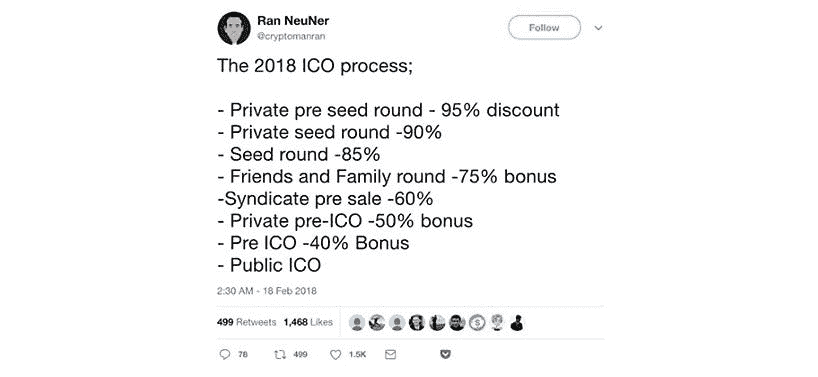

# 2018 年第四季度，你的 ICO 营销计划应该是什么样的？— 2019 年更新

> 原文：<https://medium.com/hackernoon/what-should-your-ico-marketing-plan-look-like-in-q4-2018-9dd41908f358>

**UPD 2019:这里是新的** [**2019 IEO 营销指南**](https://hackernoon.com/ieo-marketing-guide-optimal-strategies-and-the-true-cost-to-launch-an-ieo-in-2019-ecda12821d9c)

随着我们接近 2018 年底，有一件事变得越来越明显——ico 正慢慢从日常加密爱好者手中夺走。我不是在指责监管，这仍有待讨论，我指的是投资主体从散户向机构的转变。

根据各种著名的报告( [Cryptovalley](https://cryptovalley.swiss/wp-content/uploads/20180628_PwC-S-CVA-ICO-Report_EN.pdf) 、 [Icorating](https://icorating.com/report/ico-market-research-q2-2018/) 、 [Tokendata](https://mailchi.mp/tokendata/tokendata-weekly-newsletter-289971) 、[gray](https://grayscale.co/digital-asset-investment-report/))，人们可以看到，目前的趋势是大约 60%的机构投资者和 40%的散户，每个季度市场都进一步向机构转移。随着近 84%的资金通过私人和预售筹集，ICO 营销游戏正在发生变化也就不足为奇了。那么，这对于试图在当今市场推出的普通 ICO 来说意味着什么呢？你可以在[这篇文章](https://hackernoon.com/what-should-your-ico-marketing-plan-look-like-in-2018-315135fe9851)中找到今年年初 ICO 营销计划的样子。

# 当前的公共关系格局

根据 Coinschedule 的[数据，平均每个 ICO 筹集约 1700 万美元(不包括 EOS+Telegram 各自的 ICO)，但自第三季度开始，这个数字似乎在平均下降。](https://www.coinschedule.com/stats.html)

以下是 2018 年 10 月完成的五个 ico。这些 ico 未能达到 1000 万美元，而市场平均水平远高于此；他们后来怎么样了？我们将看看他们的总收入，看看他们的顶级 SEO 文章获得了多少流量(反映了社区对他们的热情)，调查他们的奖金计划和 Twitter 账户(反映了他们与社区互动的能力)，并强调他们宣布的市场聚焦战略是什么。

*以下是电子表格链接:*[https://docs . Google . com/spreadsheets/d/1 rxqvcroprynkdvyxshqiu 7 es 9 jrj-zSZ-CPP 21 ddi 3k/edit？usp =共享](https://docs.google.com/spreadsheets/d/1RxQVCROPRyNKdvyXShQiu7ES9jRJ-zSZ-cPp21Ddi3k/edit?usp=sharing)

[https://docs.google.com/spreadsheets/d/1RxQVCROPRyNKdvyXShQiu7ES9jRJ-zSZ-cPp21Ddi3k/edit?usp=sharing](https://docs.google.com/spreadsheets/d/1RxQVCROPRyNKdvyXShQiu7ES9jRJ-zSZ-cPp21Ddi3k/edit?usp=sharing)

# 散户与机构投资者

从本质上讲，术语“**散户**”指的是任何个人投资者，通常是投资金额较小(相对于 10 万美元以上)的个人投资者。因此，散户投资者指的是日常投资者和帮助保持众筹理念的人。散户投资者营销依赖于以下策略，因为它们与个人投资者的协同效应最佳:

*   **奖金项目**(鼓励社区参与/审查)
*   **口碑宣传**(人们只有支持它才会传播它)
*   **草根风格运动**(病毒式社交媒体、文章、事件等。)
*   **Telegram/Bitcointalk 论坛**建立可信度(机构群体审查)

另一端是机构投资者，他们基本上是投资大量资金的机构/公司。这类投资者在 IPO 中比较常见(风险投资家、天使投资人等。)，但他们正在迅速进入 ICO 世界。如果 ico 想要瞄准机构投资者，他们需要较少依赖社区参与而更多依靠吸引大笔资金的策略，例如:

*   **联系基金经理**
*   **在特定评级网站上列出他们的 ICO**以吸引售前/私下销售的注意力
*   以折扣价为少数投资者举办预售/私人销售

[有人认为](https://hackernoon.com/icos-the-community-does-the-marketing-large-investors-grab-the-tokens-2551bba51e1f)机构投资者涌入 ico 正在扼杀去中心化的精神，导致 ico 获得的资金减少。从关注散户(40%)到关注机构投资者(60%)的转变有没有可能是问题的根源？让我们听听实际的公司对整个过程有什么看法，也许这将阐明他们的营销策略和他们面临的问题…

# 服务价格比较

不同的 ico 有不同的需求，因此我们研究并列出了各种服务和价格层级。这些公司反映了一个不断变化的 ICO 市场，一度触及 ICO 首次流行并有多余资金投入营销的时代，到现在，ICO 应该仔细选择他们的合作伙伴和支付多少钱。

# 精品 ICO 代理

这些有点过时，在 ICOs 的全盛时期(2017 年底至 2018 年初)很流行——它们收取大量的钱，除此之外还收取额外的“成功”费，并提供一揽子解决方案，这种解决方案可能在 ICOs 大肆宣传和对服务的需求很高的时候工作得很好，但它们可能不再服务于不断变化的市场。虽然这些公司是一站式商店，但 ico 需要权衡使用它们的成本与收益。一些 ICO 市场的人认为这些[价格太高了](https://cerealentrepreneur.academy/%E2%80%8Bcomplete-guide-to-pricing-digital-marketing-services-for-your-agency/)。

1.  [ICObox](https://icobox.io/#services) —基础套装**40 BTC(～25 万美元)**
2.  [优先代币](http://ptoken.io/)——从**开始的营销包【95，000 美元+**
3.  [X10](http://x10.agency/fullpackage)—**起的标准包装，82000 美元**

***平均价格:～10 万美元***

# 独立公关公司

营销是关键，在寻找有经验的营销人员时，公关公司似乎是最明显的答案，但它们是最佳选择吗？这些公司通常管理你的社区营销、付费广告、搜索引擎优化、公关营销和社交媒体。

1.  [棕榈滩营销](https://palmbeach.io/)——**BTC 1 日至 9 日(6000 美元——57000 美元)**
2.  [Infinite Blocktech](https://infiniteblocktech.com/token-marketing-services) —在**60，000 美元到 90，000 美元之间**大多数服务，顶层 200，000 美元
3.  [众筹](https://crowdcreate.us/packages/)——根据客户需求(客户想要多少种服务)从**5000 美元到 175000 美元**不等
4.  [供进一步阅读的 21 家顶级公关公司名单](https://hackernoon.com/the-top-21-icomarketing-agencies-pr-firms-ab3d41e279c9)

只有你能决定为你的 ICO 支付更多是否值得，因为有很多更低成本的选择提供同样的服务。

***平均价格:～5 万美元***

# 透明的全方位服务 ICO 机构

对于那些寻求易于理解的定价表(通常低于上述类别)和与更小/更亲密的提供商合作的魅力的人来说，这个列表是为你准备的。这些类型的公司更多地迎合低收入的 ico，鉴于平均收入正在下降，这使得这些公司对越来越多的 ico 更具吸引力。这些公司专注于特定的任务，而不是“一站式商店”专注于完成一项任务有助于他们提供更多的个人风格。

1.  [Howtotoken Agency](http://agency.howtotoken.com/) —服务起价约为 **$450(内容创建)**，对于更复杂的服务(如智能合同开发)价格在 **$2，500 左右。Howtotoken 的宗旨是为精心策划的作品(强调内容、白皮书创作和品牌策划)提供退款保证，确保他们的客户非常满意。**
2.  众筹网——众筹网完全专注于一项任务，创造并维持一个正常运转的 ICO，它有一个清晰的定价方案，有两种选择。**统一费率——70，000 美元**，以及**随用随付——每个车载用户 4.65 美元**。
3.  [Coinlauncher](https://coinlauncher.io/ico-advertising) —首先是 ICO 列表平台，其次是以 ICO 为中心的服务提供商(社交媒体、广告、社区管理等)。优质服务的起价为**0.15 BTC(～1000 美元)**并攀升至**0.75 BTC(～5000 美元)。**

***平均价格:～2500 美元***

# 自由职业者

想为你的项目挑选人才吗？为了方便起见，这里列出了三大自由职业平台(费率取决于所选择的自由职业者)。记住，你最终会做所有你没有雇佣自由职业者的工作，而且结果也不总是有保证的:

1.  [向上工作](https://www.upwork.com/o/profiles/browse/?nbs=1&q=ico) — ~ **每小时 50-100 美元**
2.  [大师](https://www.guru.com/d/freelancers/q/ico/)—~**每小时 60 美元**
3.  **根据“演出”的不同，价格差异很大**

*****平均价格:～2000 美元*****

# **重要提示**

**如今推出一个 ICO 很昂贵，尤其是在使用高级服务的时候，而且考虑到大多数 ICO 都失败了，公司不能轻率地浪费金钱。不同的研究( [Tokentarget](https://www.tokentarget.com/how-much-should-ico-marketing-cost/) ， [Artplusmarketing](https://artplusmarketing.com/cmo-reveals-the-shocking-costs-of-marketing-an-ico-37657480e2ce) )发现，ico 平均花费 30 万美元到 50 万美元以上来发布产品，但如果这是成功的关键，那么为什么会有这么多失败呢？**

****

**ICO 的成功在于拥有优秀的产品、简洁的展示以及在社区内创造激情的能力，这些都是可以通过使用透明、价格合理的服务来完成的任务。我们已经过了为了成功而向 ICO 代理机构投入巨额资金的时代，这种伎俩不再管用了。老实说，在一天结束的时候，你必须问自己，“那时候它还能用吗？”**

## **关于作者:**

**Howtotoken.com 和 Geekforge.io 的创始人基里尔·希洛夫。采访全球 10，000 名顶尖专家，他们揭示了通往技术奇点的道路上最大的问题。加入我的**# 10k QA challenge:**[geek forge 公式](https://formula.geekforge.io/)。**