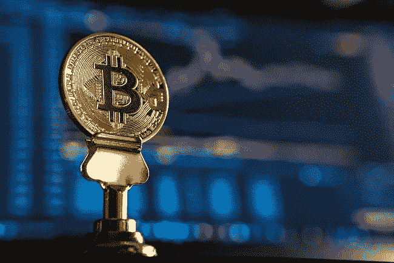
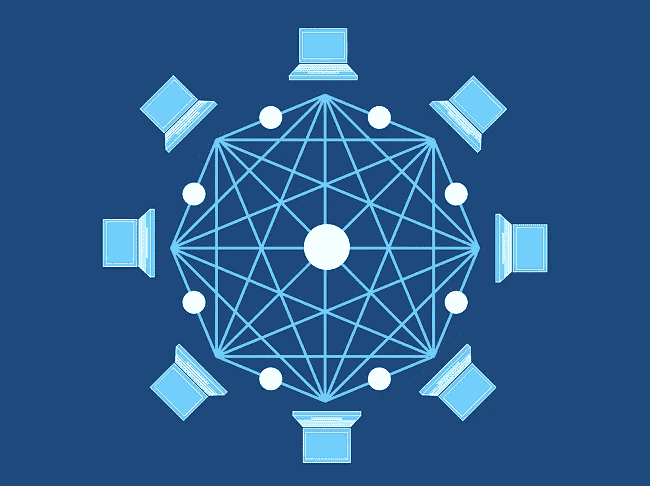
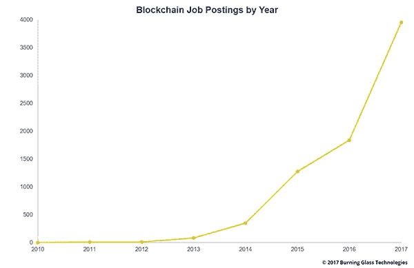
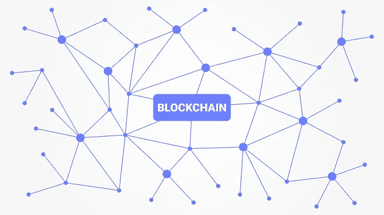

# 做一名区块链工程师需要具备哪些技能？

> 原文：<https://medium.com/hackernoon/what-skills-do-you-need-to-be-a-blockchain-engineer-c4e77e9de22b>

如果你一直在考虑将你的职业生涯转移到区块链发展，这篇文章将会很合你的胃口。

你可能知道，区块链本质上是一个加密货币交易的大账本。它跟踪所有的加密货币活动，谁拥有它的比例以及它被执行的时间。就像一本巨大的记录书！

区块链的[是分散的和公开的。任何人都可以访问它](https://www.economist.com/news/special-report/21650295-or-it-next-big-thing)，不像传统的中央银行分类账。加密货币交易被记录在“块”中，其中“块”包含时间戳和交易数据，因此被称为“区块链”。加载到区块链上的任何信息都要经过多个“节点”或计算机的一系列验证步骤(如下图所示)。他们相互交流，直到对数据的有效性达成共识，然后才被区块链接受。这就是区块链上的信息可靠和值得信赖的原因。

值得注意的是，虽然区块链是为跟踪比特币而开发的，但区块链技术有潜力用于许多不同的行业和领域。本质上，它可以用来记录任何有价值的东西！

正如《区块链革命》*的作者[唐和阿历克斯·泰普斯科特所说，“区块链是经济交易的一个不朽的数字账本，可以通过编程不仅记录金融交易，而且几乎记录所有有价值的东西。”](https://blockgeeks.com/guides/what-is-blockchain-technology/)*

# 这对你意味着什么，为什么你应该成为区块链的工程师？

许多初创公司正在以各种方式使用区块链技术，从全球支付到音乐分享，甚至跟踪钻石销售。这为区块链的工程师创造了无数的机会。

作为一名区块链工程师，你有几条路可以走。简单来说，您可以:

1.  使用区块链技术构建应用程序。
2.  专注于开发区块链技术本身以及与之交互的事物，比如开发新的区块链协议或货币。

构建去中心化的应用程序(DAPPS)是很多机会所在。这是许多区块链工程职位向开发人员开放的地方，如下图所示工作机会的急剧增加就是证明:

上图显示，在 2010 年至 2017 年间，区块链地区的就业机会数量从 0 增加到不到 4000 个。显然，这是一个快速发展的职业！

为了寻求一些专家的见解，我们采访了 [**AgriDigital**](https://www.themartec.com/employers/agridigital) 的初级开发人员 Cadel Watson、 [Michael Buchanan](https://www.linkedin.com/in/michael-buchanan-562121155/) 、 [**DigitalX**](https://www.digitalx.com/) 的区块链和技术顾问以及 [Vaibhav Namburi](https://www.linkedin.com/in/vaibhavnamburi/) 、 [**Five2One**](http://five2one.com.au/) 和 **Dveloper.io** 的创始人，询问他们对成为区块链工程师的想法。我们向他们提出了三个关键问题，以帮助你在这个复杂而新生的领域中找到方向。*来了*。

# 问题 1:成为一名区块链工程师所需的关键技能和品质是什么？

根据沃森的说法，有抱负的区块链工程师需要在学习过程中感到舒适，因为这是一个新兴的领域。他强调了“采用新的思维模式”的重要性，这种思维模式关注效率、可扩展性和分布式计算。这不仅仅是学习另一种编程范式。

沃森的另一个很好的建议是，不要只关注开发硬编程技能，还要了解区块链工程的经济方面。了解激励、供给和需求以及机会成本等概念听起来可能是老生常谈，但在区块链发展背景下理解这些概念却是至关重要的。如果你想成为一名高效的区块链工程师，你需要成为初级经济学家、软件开发员、数据专家和审计员的混合体。

Buchanan 说，成为区块链工程师是一个公平的竞争环境，任何有时间和奉献精神的人都可以成为专家。他强调了解决问题技能的重要性，以及发现和处理信息的能力，同时判断信息的准确性，这是两种最重要的技能。

布坎南说:“使用这种尖端技术最令人兴奋的事情之一是，任何有时间和奉献精神的人都可以成为专家——这真的是一个伟大的平等者。”

“但快速转向的能力是绝对必要的——区块链的技术能力、开发人员可用的工具以及这些分散网络和相关工具的文档发展如此之快，以至于需要不断保持在新开发和大规模平台变化和更新的顶部，这对于不落后至关重要。”

除此之外，南武里说，需要大量的能源来跟上区块链空间的快速变化。区块链技术的变化速度非常快，人们必须敏捷快速地适应。为了让区块链工程成为适合你的职业，你需要对不断变化的速度感到兴奋！

# 问题 2:什么样的经验可以转化为区块链工程师？

“区块链的自治使它成为一个无情的世界。一个错误或漏洞可能会造成数百万美元的损失，”Watson 说，他提到了漏洞分析和全面测试的可转移性。他认为，因为为区块链开发的代码是高度敏感和关键任务，具有嵌入式编程技能的工程师将非常适合这项挑战。

Buchanan 将数据分析、传统编程或软件开发实践以及密码学知识的重要性列为区块链世界中最可转移的技能组合。鉴于这是一个新的领域，能够浏览 Github 等开发者论坛来构建应用程序是关键。你需要所有你能得到的支持！

Namburi 说，了解面向对象编程、密码学、系统架构和测试驱动开发的基础知识将是非常有用的经验。

显然，鉴于这一职业的动态性质，没有什么灵丹妙药能让一段经历变得最有价值。但总的来说，以上任何一个领域的技能和经验的结合都是非常有价值的。

# 问题 3:区块链工程有什么资源可以培训？

沃森说，因为区块链非常新，所以没有正式的资格证书来帮助你提高技能。新概念每天都在出现，由于很容易被淹没，他说要温习区块链的工作原理和每条链的区别(以太坊、比特币等)。)将是一个明智之举。

他还认为，良好的经济学基础知识是关键。“区块链技术从根本上来说是经济工具。沃森说:“理解激励、供给和需求以及机会成本等基本概念对开发人员非常有帮助。

布坎南建议开发人员应该“花几个月的时间阅读邮件列表、社交媒体论坛和开发中心，了解软件是如何开发的，如何提出和做出更改，并学习和听取社区领袖对有价值项目方向的见解。”

然而，他也警告不要受这些社区信息偏见的影响，特别是因为许多人在某些区块链项目的成功中有既得的经济利益。

对于那些想要保持领先的人，沃森说，我们将开始看到更多“令牌经济学”领域的专家:将经济概念应用于区块链模型。

“从根本上说，他们解决的问题是设计一些机制，将人们的行为推向某些方向。目前这还是一个小领域，但已经开始起步。”

如果你热衷于在线课程，南武里建议你选择 Stephen Grider 的 UDemy 网站上的区块链发展课程，以了解以太坊领域的发展。他还建议，如果你对学习以太坊生态系统感兴趣，可以参加 [Bokky Poo Bah 在悉尼举办的以太坊](https://www.meetup.com/en-AU/BokkyPooBahs-Ethereum-Workshop/?_cookie-check=9jAIMjVyVROY04Hm)研讨会。

话虽如此，还是有很多很棒的博客和文章可以用来教育自己。我们发现的另一个很好的资源是由 Blockgeeks 提供的这个[在线课程，它会让你了解成为一名区块链工程师所需要学习的一切。但是在一天结束的时候，没有什么比弄脏你的手然后去做更好的了！](https://blockgeeks.com/guides/blockchain-developer/)

**准备好提升你的科技事业了吗？澳大利亚领先的科技公司正在寻找新的人才！点击** **查看我们的** [**最新职位列表。**](https://www.themartec.com/jobs)