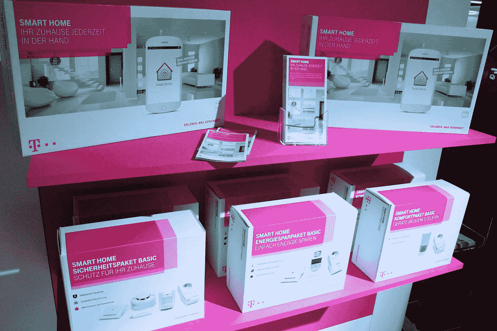

# 应该用什么智能家居物联网平台？

> 原文：<https://medium.com/hackernoon/what-smart-home-iot-platform-should-you-use-2554ea213df1>

Image from — [https://www.flickr.com/photos/75654647@N05/15010894320](https://www.flickr.com/photos/75654647@N05/15010894320)

你的洗衣机联网了吗？你的炖锅或恒温器怎么样？越来越多的家用电器和设备正在获得与各种用例的互联网连接，这允许标准电器变得更具交互性和自主性。

家庭中的物联网设备为电子爱好者提供了自动化日常操作的令人兴奋的新机会。将两个不同的设备相互连接开始变得必要，但由于有如此多的竞争标准，制造商并不像你希望的那样容易做到这一点。其他公司介入填补这些空白。在过去的几年中，多家提供商发布了专门针对物联网设备的平台，访问这些平台变得更加容易。

在本文中，我将简要描述自动化爱好者的首选，并且，由于您很可能是一个乐于修补的人，所以让您自己去试验。请在下面分享你的经历！

# IFTTT

虽然不是严格意义上的物联网平台， [IFTTT](https://ifttt.com/) 使“物”与其他“物”的连接以及基于它们的输入和输出触发事件变得尽可能容易。因此，许多其他物联网平台提供 IFTTT 集成，让他们的平台为他们做很多工作。

该平台缺乏此处列出的其他平台的视觉概述，但[有一套很好的物联网“小程序”](https://ifttt.com/collections/iot)来让你思考如何连接你的设备。

# 纤细的

允许你连接硬件和软件产品， [Stringify](https://www.stringify.com/) 有点像 IFTTT，但是 Stringify 是一个移动应用。基于应用的界面将你的手机变成一种通用遥控器。赢得几十个奖项，这对于热爱自动化的非编码人员来说是一个很好的起点。对于编码人员来说，有一个[制作人的](https://www.stringify.com/makers/)部分可以提供更高级的自动化选项。

# 夜帝

与 Stringify 类似，我们将看看 [Yeti](https://getyeti.co/) 。它使用一个方便的功能，自动找到你的网络上的兼容设备，而无需你手动添加它们。

# 多莫蒂茨

你可以安装的一个比较流行的开源选项是 [Domoticz](https://www.domoticz.com/wiki/Main_Page) ，它可以安装在各种网关和“东西”设备上。它允许您创建流、小部件、推送通知，并且是无限可配置的。然而，这个平台有点复杂，不适合胆小的人。

# 上帝

凭借 DIY 和预建网关盒的组合，加上应用程序市场、可选的云服务和移动应用程序， [Jeedom](https://www.jeedom.com/site/en/) 是由高级用户和临时用户组成的房屋的良好组合。

# OpenHAB

与 Jeedom 类似， [OpenHAB](https://www.openhab.org/) 是自托管的，但与云服务和各种开放和专有硬件集成良好。它使用熟悉的规则、触发器和动作概念，另外还加入了新的概念，如语音控制和可插拔架构，以增加对任何特定用例的支持。

# 家庭助理

另一个更加关注终端用户的开源项目是[家庭助手](https://www.home-assistant.io/)。这个平台已经覆盖了许多设备制造商。它有一个很好的软件提供商和集成服务选择，还有一些我在其他平台上没有见过的，比如 Plex、Kodi 和 push bullet。

# 卡拉奥斯

与家庭助理类似， [Calaos](https://calaos.fr/en/) 旨在实现整个家庭的自动化——而不仅仅是带传感器的设备。您可以根据一天中的时间、心情或房间来创建“场景”，场景会触发包括音乐和其他媒体在内的连接设备。Calaos 是一套软件和(触摸屏)硬件，你可以从上面的网站购买，或者自己组装支持的硬件。

# OpenNetHome

如果你的网关主机可以运行 Java，那么它就可以运行 [OpenNetHome](http://opennethome.org/) 。它的特性集比这里列出的一些其他选项稍欠精确，更侧重于硬件特性支持而不是用例。GUI 主要由列表组成，但是对于某些任务也有可选的插件。

# woundedinaction[军]战斗负伤

同样专注于开发者， [Wia](https://www.wia.io/) 将流行的电路板连接到它的云(或自托管)平台，在那里你可以构建小部件和流来显示和响应你已经连接到它们的传感器。然后，您可以将 Wia 连接到消息和通信平台，以根据来自您设备的输入数据触发警报。

# 康莱德连接

来自一家德国电子商店的[康拉德](https://www.conrad.de/)、[康拉德互联](https://conradconnect.de/en)提供了一个面向消费者的物联网平台，这是一个完美的配对——我很惊讶更多的商店没有尝试。他们将集成与喜爱的产品捆绑在一起，如飞利浦 Hue 灯、Fitbit 手环、Nest 恒温器和软件工具，如 IFTTT 和谷歌文档，你可以通过拖放界面进行连接。

# 那么，我该用什么呢？

这总是一个很难回答的问题，不是吗？！我才刚刚开始跟上家庭物联网的潮流。我有一个 RaspberryPi 坐在周围和一个家庭的人谁希望设置工作。我需要一些灵活的、适合所有人的东西，这也意味着能够添加一些更方便的云服务。衡量你家中的“用户”以及他们需要什么来为你做决定。

【dzone.com】最初发表于**。**