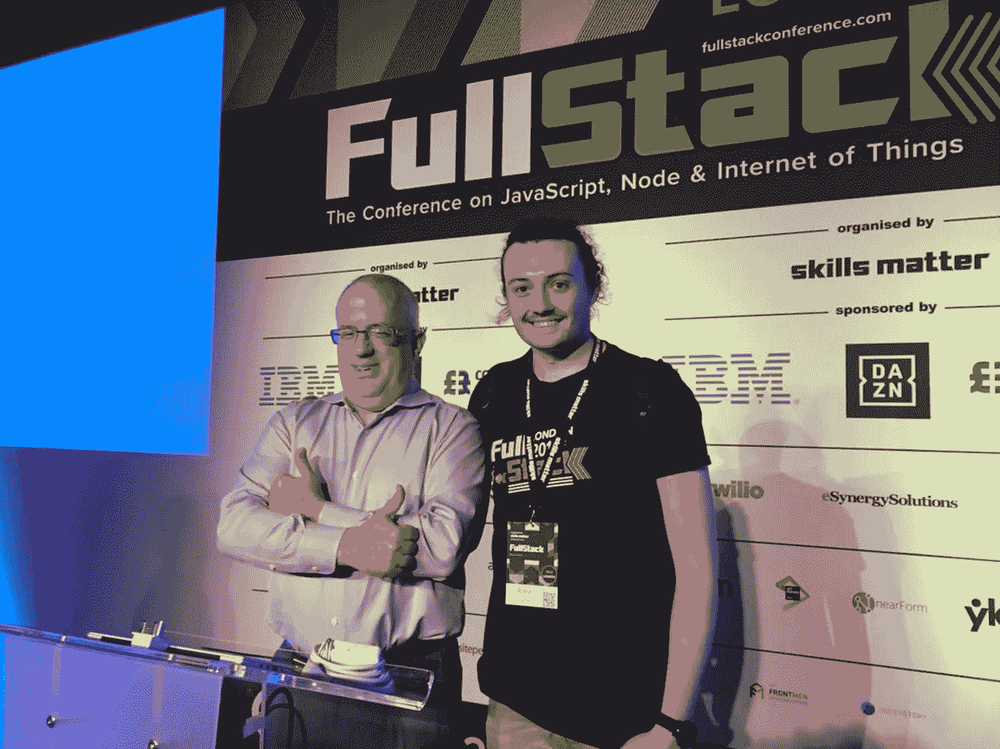
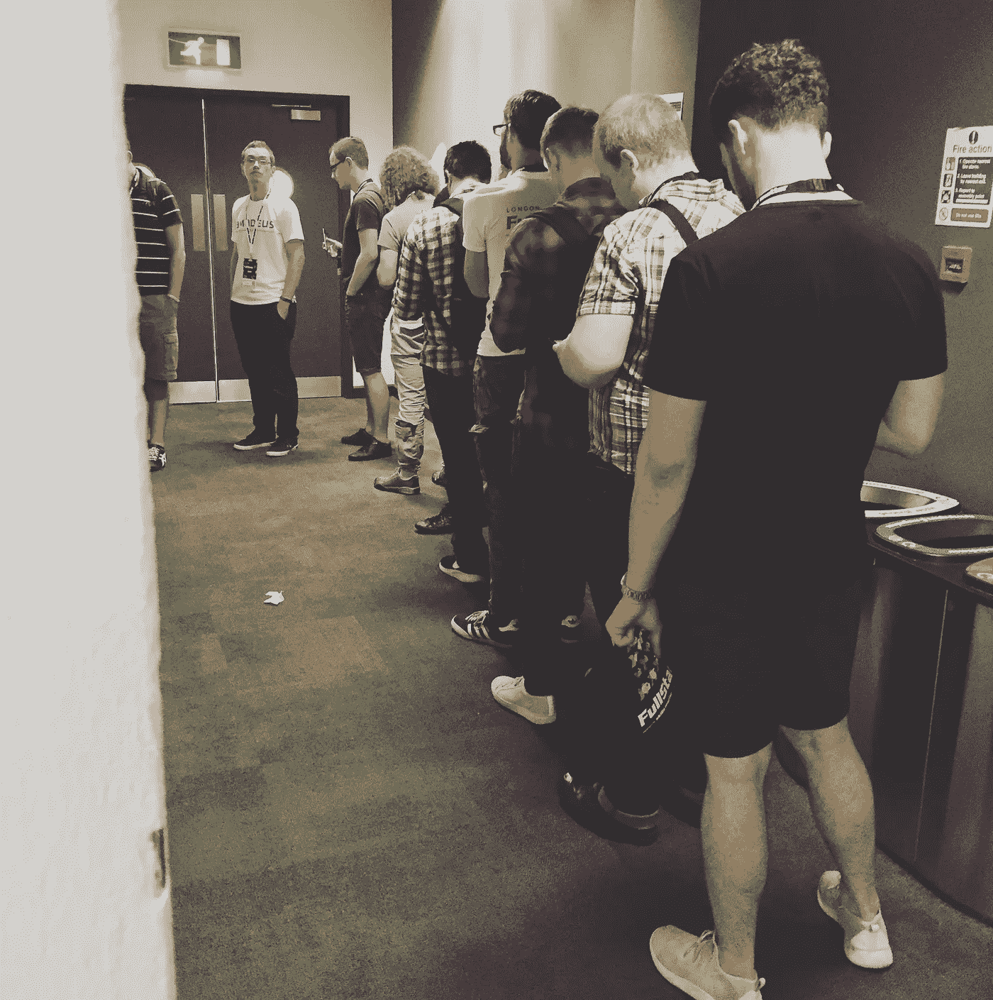
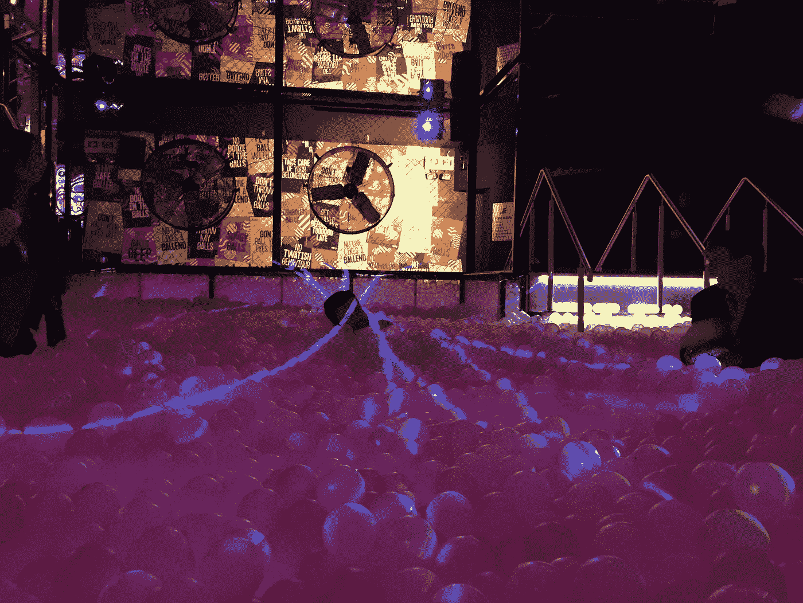

# 软件工程师想要什么:事件版

> 原文：<https://medium.com/hackernoon/what-software-engineers-want-event-edition-7d4bbf7f4bd9>

That’s me with the man, the myth, the legend — Brendan Eich

听着，我笨拙地拥抱了布兰登·艾希，我为沃纳·威格尔谈论人工智能欢呼，当道格拉斯·克洛克福特宣布 Neo 时，我和他在一起。

如果我知道一件事，那就是软件工程师会议。

但是事情是这样的——不管出于什么原因，开发者大会都是糟糕的。

非常糟糕。

也不是因为扬声器。演讲者总是很棒。糟糕的是*事件*。

我不想指名道姓，但我最近参加了一个高票会议，与会者包括软件工程领域的一些大腕——活动团队的全部注意力似乎都放在让人们与充气鲨鱼自拍上。你知道，而不是编码位。

因此，与其对着一个冷酷无情的世界挥舞拳头，我认为为开发者考虑一下 Perfect Conference 可能会更有成效。在你的下一次社交/会议/聚会/宗教聚会中，请随意窃取这些建议。

# **提供好咖啡(而且免费)**

这是显而易见的；咖啡瘾是真的，我对咖啡上瘾，请给我咖啡。不，我不想喝草药茶，我每天花八个小时在大脑里设计复杂的算法。

看，事情是这样的，伙计们——当你们用大排长龙、过高的价格或糟糕的咖啡来限制我的咖啡供应时，我不会说什么，因为我是英国人。但我默默地沸腾着愤怒，就像你用来给我倒高价拿铁的那个沸腾的水壶。我的咖啡因含量很低，可能会跳过最后一位演讲者。

那是在*你*的时候。

# **定期休息**

事情是这样的，学习有点累人。当你去找一个好的演讲者，之后，你的头脑需要在下一个之前融化。

另外，你上一次去参加会议，而你的网站/应用/应用编程接口没有立即爆炸是什么时候？这真的从没发生过。

你看，每个参加会议的人都有一份工作，不仅仅是在我们参加你的会议时按下暂停键。有邮件要回复，有 bug 要修复，有产品经理要忽略。与其有大量的小休息，为什么不每两个小时休息 30 分钟，这样我们可以完成一些工作？

# **指定编码和通话场所**

所以，这实际上是两个点合二为一。

让我向你们透露一个惊人的秘密。很大一部分开发人员，真的很难沟通。

修卡，我知道。

现在，我不介意这个——我不是社交活动的舞会国王。但是——当你参加一个开发者大会时，会有这样一种尴尬的动态，有两组人；那些试图笨拙地建立关系网的人，以及那些不想让你和他们说话的人。

这两个阵营肉眼难分伯仲。

你可能正在和一个绝对不想和他聊天的人聊天，而他旁边的人试图插入对话，但失败了。见鬼，我也是这样的人——这是一个非常容易解决的问题！

我们这么做，用一点黄色胶带把房间分成两部分。

有一个“安静”区，在那里人们可以编码，回复邮件，在那里我们通常同意礼貌地忽略对方，直到我们的下一个研讨会。然后在房间的另一边是“网络”部分，在那里你是有效的公平游戏。所有的赌注都取消了。如果你站在黄色胶带的那一边，你基本上是在说，“嘿，请过来和我谈谈，不要被我与你的尴尬互动所吓倒——我确实想和你谈谈！”。

我真诚地认为这将解决 99%的怪异互动。

因为有一半的时间，当你和一些可能正在构建 NextBigThing 的人聊天时，我实际上认为他们确实想和你说话，但是会议的尴尬让你感觉好像在打扰他们。一些明确的界限会很有帮助。

# **晚开始晚结束**

我还没有见过一个开发者对主题演讲人在上午 9 点开始感到兴奋。

事实上，我认识更多的开发者，他们因为按了暂停键而错过了主题演讲，不得不在活动结束后在 YouTube 上观看演讲。你知道，他们不需要买 1000 美元的票也能做到。

我们只需要承认这样一个事实，许多开发人员醒得很晚，甚至那些没有醒的人可能来自全国各地——甚至可能来自世界各地——这让你昏昏欲睡。

所以，让我们在上午晚些时候开始这个活动，比如 11 点，看着你的与会者奇迹般地出席他们花了大价钱请来的演讲者。

# **车间计划**

研讨会应该让你预先下载代码。

我还没有去过一个研讨会，会上互联网没有中途中断。我不知道为什么活动场所的 WiFi 如此糟糕[，史蒂夫·乔布斯不得不告诉记者停止使用该死的 WiFi](https://www.youtube.com/watch?v=h6cIeZmFdPs) ，但这是真的，这是真的发生的事情，我们需要提前做好准备。

我建议，当你说你要去一个研讨会时，你会收到一个 Github 库的链接，你可以在到达那里之前下载整个代码库。然后，演讲者可以在从头开始构建代码的同时向你讲解代码，你可以跟随而不需要安装任何依赖项，或者以与确切知道自己在键入什么的人相同的速度键入。

还有插头？为什么活动空间没有插头？！电学是软件工程的先决条件。这不是一个“有就好”的问题。没有什么比平板 MacBook 更让人难过的了。请不要毁坏我们的东西。

# **女性应该免费进入**

所以，在我被红药丸暴民钉死之前，听我说完。这是我上次去参加一个会议时拍的男厕排队的照片。

Yes, really.

是的，那是男厕所的一条线，紧挨着女厕所的一扇空门。事实证明，在技术领域没有多少女性。或者，不要给出这样一个逃避的答案，也许更接近我们可以解决的问题，与出于任何原因参加技术会议的男性相比，女性并不多。

这是一个真正的问题。

我还没见过哪个开发人员不觉得这种差异如此明显令人难以置信的尴尬。对于一个拥有一些现存最自由公司的行业来说，这是一个奇怪的污点。正是因为这个原因，[谷歌面临罢工](https://www.theguardian.com/technology/2018/nov/01/google-walkout-global-protests-employees-sexual-harassment-scandals)是有原因的。

会议很好地确保了演讲者阵容大约是 50/50，但当涉及到与会者时呢？我们有如此多的家伙以致于我们堵塞了小便池。

所以如果这是个问题，让我们来解决它！也许是针对女性开发人员的营销活动，以及一定数量的女性免费门票。我们给学生折扣，因为我们想鼓励他们参加，反过来，有助于改善行业的未来。为什么不是人类的整个性别？

# **网络用代币**

抱怨够多了——让我们来谈谈一件大事，以获得一些想法。

几周前，我参加了一家科技招聘公司举办的社交活动，在门口他们给了你两张饮料券。

这似乎很吝啬，但不管怎样，我挣钱是为了买东西。于是，我试着*用真金白银请*喝一杯。

剧情转折——你不能。您只能****用酒水代币支付酒水。

因此，我们决定和一些银行家聊聊为什么 C#是一种糟糕的语言，同时我们吹口哨喝下我们的饮料，这时另一名代表走过来，递给小组中的每个人两个饮料代币。

游戏开始了，华生。

事实证明，在这个活动中，如果你在社交，你会得到更多的饮料代币作为一种积极的强化技术，就像《生活大爆炸》那集的饮酒版。

你知道吗？成功了！我不认为在那个房间里有任何一组人是我们没谈过的。因此，这个故事的寓意是，如果你无论如何都要在下一次开发者大会上为一个开放的酒吧付费，为什么不确保你的钱花得值呢？

此外，还有免费的比萨饼。那是一个相当疯狂的夜晚。

And a ball pit! It really had everything.

—

因此，如果有任何活动经理想要一起打造完美的会议，那么请联系我，说[我有一个想法](https://www.huckletree.com/host-your-event)。